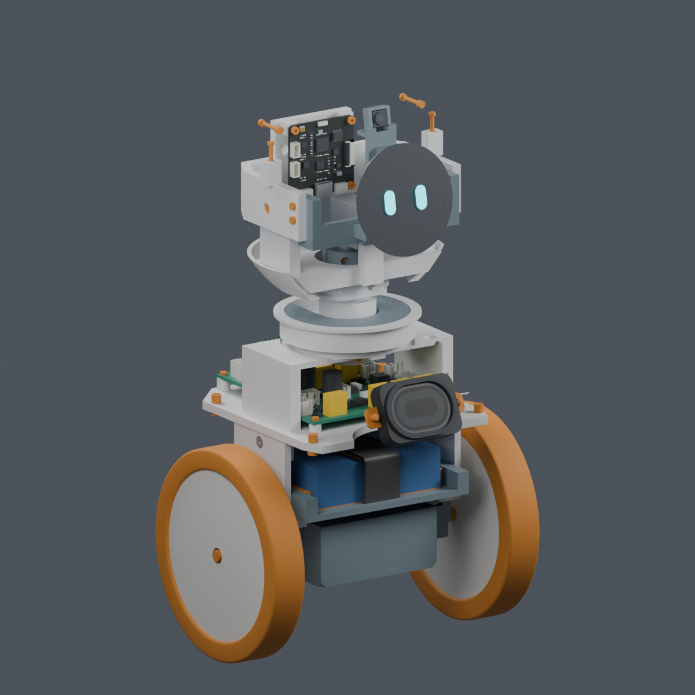

# MORI

MORI 是一个两轮主动平衡机器人原型：两只轮驱舵机、头部偏航与俯仰两只舵机、圆形屏幕、真实摄像头及板载音频。

本仓库整理机械、硬件、软件、采购和验证资料。**当前为 PROTOTYPE / UNVALIDATED，未完成实物装配、上电和主动平衡验证，未制造放行。** 首次上传以 PR 审阅，本次没有继续修改机器人设计。



## 先看这些

| 要找的资料 | 入口 |
|---|---|
| 项目资料总索引 | [PROJECT_INDEX](docs/PROJECT_INDEX.md) |
| 当前版本与未完成事项 | [CURRENT_STATUS](docs/CURRENT_STATUS.md) |
| 从哪些厂家购买哪些产品 | [采购清单](mechanical/procurement/M1.52_按厂家采购清单_2026-10-06.md) |
| 机械模型、图册与装配视频 | [机械入口](mechanical/README.md) · [网页图册源文件](mechanical/index.html) · [装配视频](mechanical/animation/MORI_assembly.mp4) |
| 四块 PCB 的原生工程与接线 | [硬件入口](hardware/v1_2/README.md) · [P5R7 接线](hardware/v1_2/wiring_P5R7/README.md) |
| 网页、固件和模拟测试 | [软件说明](README_SOFTWARE_V1_2.md) · [原有验收记录](reports/v1_2/acceptance.md) |
| 下载大文件、在本地打开图册 | [下载与归档说明](docs/GITHUB_ARCHIVE.md) |
| 历史版本和旧文件的适用范围 | [历史索引](docs/HISTORY.md) |

## 当前基线

资料整理快照：**2026-10-06**。规格为 [MORI_SPEC_V1_2.md](MORI_SPEC_V1_2.md)。

| 工作包 | 当前入口版本 | 说明 |
|---|---|---|
| 机械 | **V1.2-M1.52** | 主模型、电子细模和预览；当前 16 件机器人打印件，导出目录的 21 个 STL 还含其他试配文件 |
| 装配动画 | **V1.2-M1.52-A1** | 85.75 秒、22 步；完整带线装配和上部反力夹初装仍未闭合 |
| 硬件合同 | **V1.2-H0.5-P5R7** | 运动板／后接口板 P5R7，电源板 P5R6，IMU 板 P5R4 |
| 软件 | **1.2.0-dev.1 历史交付记录** | 原验收日期 2026-09-22；不能据此声称已适配或验证后续 P5R7 硬件 |

最新硬件合同选择 WeAct STM32F412RET6 64Pin V1.1。旧软件说明仍记载 STM32F413；本次只记录这一版本差异，没有代替软件任务迁移目标板。

## 资料的有效范围

- 机械尺寸以 [config/geometry.json](config/geometry.json) 为当前唯一来源，安装契约为 [mechanical_interfaces.json](contracts/mechanical_interfaces.json)。单位 mm，+X 向右、+Y 向前、+Z 向上。
- 硬件选型以 [components.json](contracts/components.json) 为准；电气契约、原生 KiCad 板和正式交接各保留来源与版本。
- `mechanical/studies/` 同时包含已采用方案、未采用候选和失败试验。候选目录、截图或局部 PASS 不自动等于当前主模型。
- 根目录 `params.json`、`scripts/`、`models/`、`renders/`、`exports/` 属于 A0 历史。`hardware/v1/` 和旧软件台架记录也不是当前接线或尺寸依据。
- 几何检查、ERC／DRC、主机测试与仿真均不等于实物装配、热性能、材料强度、电池安全或平衡验证。

## 本地阅读

三个 Blender 工程和一份大型网格数据采用 **Git LFS**，其余小型 CAD、视频、文档与源码使用普通 Git。克隆后先执行 `git lfs pull`，再按 [下载说明](docs/GITHUB_ARCHIVE.md)核对资产。GitHub 的 HTML 文件视图显示源代码；本地图册可这样打开：

```sh
python3 -m http.server 8000 --bind 127.0.0.1
```

浏览器打开 `http://127.0.0.1:8000/mechanical/index.html`；装配动画入口为 `/mechanical/animation/index.html`。这只启动静态资料服务，不启动控制程序。

现有软件 CI 保留为手动触发，本次归档没有运行机器人、烧录固件或部署网页。完整重建与历史对比的依赖边界见下载说明。

## 来源与许可

保留 [第三方通知](THIRD_PARTY_NOTICES.md)、[软件 V1.2 通知](software/THIRD_PARTY_V1_2.md)和 [机械来源说明](mechanical/THIRD_PARTY_NOTICES.md)。厂家文件与图片保留其原始来源和权利；公开仓库不改变第三方许可。本次没有为 MORI 自有内容另行指定开源许可证。
