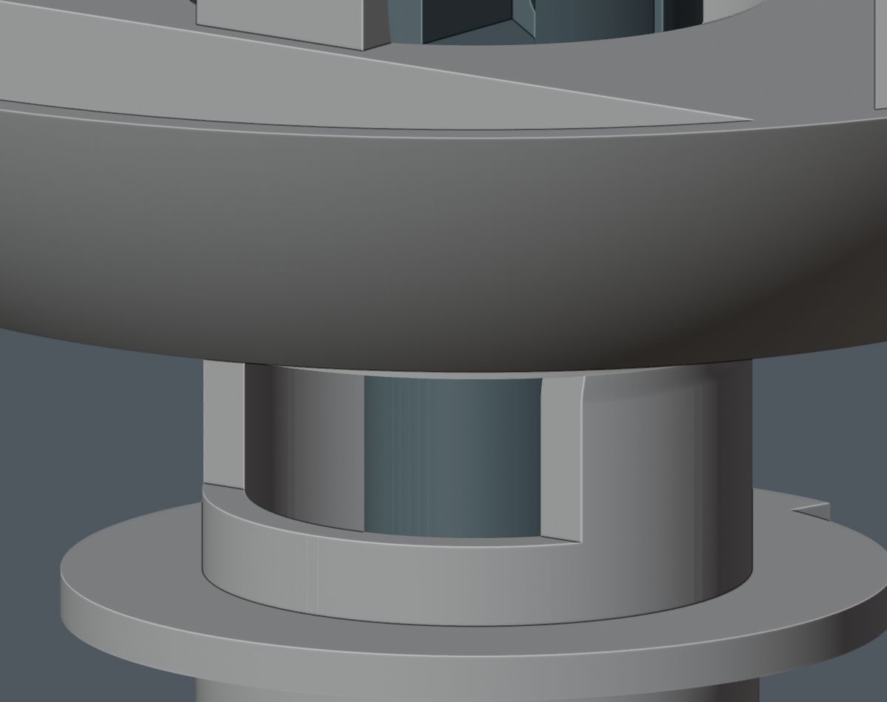
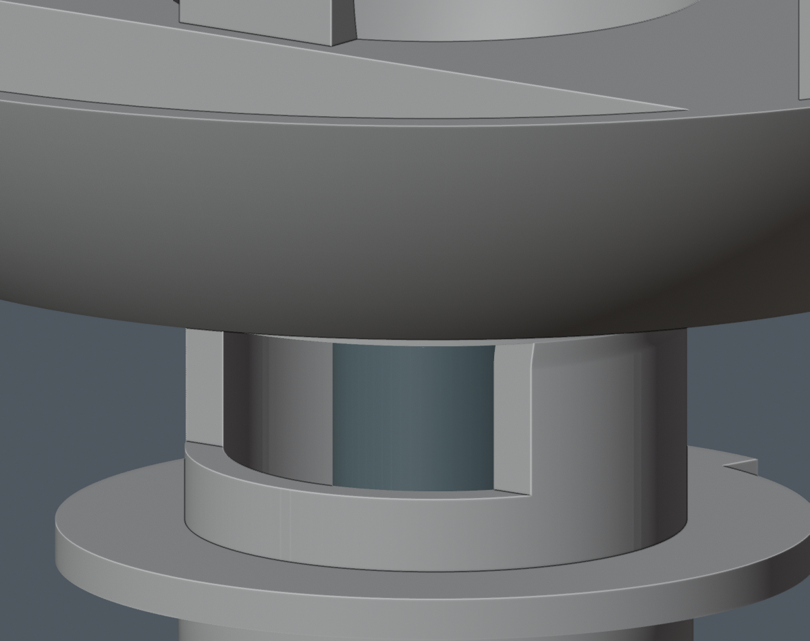

# M1.55 模型与到货前资料

当前主模型、电子细模、STL、图册和装配动画已同步用户批准的 R2 颈部装入修正。Pitch_Yoke 扩大内部孔道并开放后侧颈壁，保留轴承配合外圆、舵机座和运动范围。相对 M1.54，其余 200 件原生零件和全部硬件位姿保持，不增加打印件或紧固件。此前 C6 通道加宽和 CAM USB 朝机器人右侧的改动继续保留。

[最新模型入口](../mechanical/LATEST_MODEL.md) · [图册](../mechanical/index.html) · [装配视频](../mechanical/animation/index.html) · [当前状态](CURRENT_STATUS.md)





第二张图中的反力夹位移仅用于展示装入，主模型安装位置不变。

## 已执行检查的范围

既有完整八阶段模型流水线和保存后回读记录按本次资产哈希核对。当前几何报告为 27 PASS、0 FAIL、10 NOT_TESTED、12 BLOCKED。R2 与批准网格的实体差为 0 mm³；裸打印件连续装入、壳体俯仰、130 个组合姿态、压板侧移和身体移入检查通过。只有 Pitch_Yoke 的 STL 改变，导出仍为 21 个单一连通实体，机器人本体打印件仍为 16 件。

M1.55-A1 视频为 22 步、2,100 帧、24 fps、1280×720、87.5 秒。已完成动画刚体回读及额外身体实体复核。它没有采用研究线束，不证明实际舵盘、完整带线安装、人手操作或强度。

本次整理没有重新改变模型、硬件、线束选择或装配路径。新的发布核对只确认文件、证据、可恢复包和链接一致性，不重跑原型物理验证，也不把保存的历史 PASS 扩大到新接口。

## 证据与恢复

三份 Blender 工程继续使用 Git LFS。视频、STL 和以下证据包使用普通 Git，每个成员保留大小和 SHA256，清单见 [M1.55 证据包](review_evidence/M1_55_archives.json)。

- [批准输入包](evidence/M1_55_approval_inputs.zip)：R2 前后精确网格、批准记录、原配置和比较基线；批准网格是检查参考，建模仍只从 geometry.json 生成。
- [几何执行证据](evidence/M1_55_validation_evidence.zip)：R2 比较、保存后检查、图示、日志及本地发布记录。原时间、路径和哈希不改写；整理前的发布记录不是新的发布状态。
- [未采用线束研究记录](evidence/M1_55_harness_records.zip)：数值报告、脚本、日志和页面快照。它不是完整可执行研究备份；二进制缓存、比较 Blender、图片及第三方源文件仍留在本地，未包含项列于清单。

恢复 R2 比较输入：

```sh
python3 tools/restore_m1_55_evidence.py --list
python3 tools/restore_m1_55_evidence.py --group approval
```

恢复工具逐文件核对哈希，遇到已有不同文件会停止，不覆盖本地工作。其他厂家源和历史辅助程序继续按[归档说明](GITHUB_ARCHIVE.md)恢复。

本地 R2 来源保护核对了 846 个硬件工程文件。其中 545 个没有当前或原始归档的 Git 路径，包括另一硬件任务尚未发布的候选和资料快照。本 PR 保留这些来源的哈希，未替硬件任务发布、采用或改写它们。公开克隆可直接查看最新 Blender、视频和已保存的检查记录；缺这些快照时，完整来源保护重放不能通过。本包不承诺完整备份本机或全部研究重现。

发布文件和恢复测试见[发布核对记录](review_evidence/M1_55_publication.json)，文本密钥扫描范围及误报分类见[扫描记录](review_evidence/M1_55_scan_classification.json)。

## 仍未完成

七条已知线束参考的名义运动、互线、自身和前后段接续已检查；五条上段仍缺真实接口。实际材料、接续与裁线、端接和应力释放、完整带线装配及闭壳仍未完成，详见[研究摘要](../mechanical/studies/harness_M1_55_summary/index.html)和[资料依赖](PREARRIVAL_BLOCKERS.md)。

SC-0090-C001 舵盘、花键、锁紧和微雪排线按用户决定到货后核对；喇叭壳体出口到现有插头末端为用户报告的 150 mm，插头型号及尺寸待补充。CAM 供电源端仍待正式硬件交接。询问稿均未发送，没有下单、制造或上电。

PA12 配合、强度、疲劳、热性能、电池安全和实机平衡保持未验证，manufacturing_release=false。
