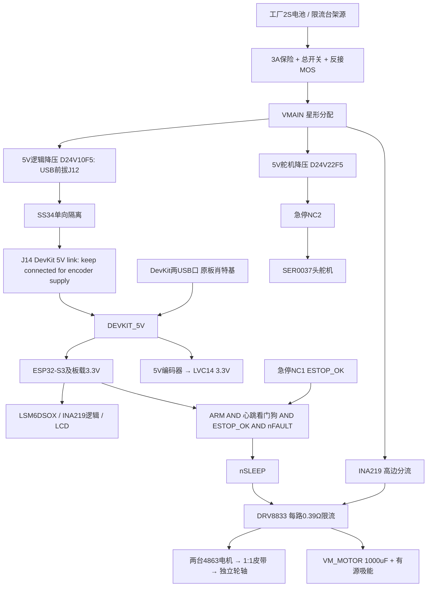

# 架构、坐标与实时资源

充电器只接已从机器人拔下的电池，原理图不含在机充电。电池负极、驱动大电流回流、降压器输入地在电源入口汇合；IMU/ADC地在安静逻辑区返回，不能串到电机回流线里。载板最终用连续地平面和就近回流，所谓星形是分支电流路径规划，不是割裂高速参考地。

控制右手坐标x前/y左/z上，对应Blender(-Y,+X,+Z)。**结构脚本的“L”对象在X负侧，和控制left不同：控制left对应模型Wheel_R / Motor_R（X正侧），控制right对应模型L。** J4/J5和固件左右按控制坐标命名；贴实物标签并实测，不按屏幕观察者左右随意接。原始IMU安装矩阵尚未证实，基线代码暂用单位矩阵，平衡编译门保持关闭。

## 资源与任务

引脚逐项看pinmap.csv，使用24 GPIO。N8R8的35/36/37用于Octal PSRAM；0/3/45/46启动配置脚不分配；38是v1.1 RGB；19/20留原生USB；43/44留UART0；39–42用于LCD/头/心跳后不能同时外接JTAG。旧DevKit RGB48会与急停冲突。不能把芯片GPIO数量当成可用开发板脚。

姿态I/O任务固定core1、优先级23，由416Hz陀螺DRDY唤醒；core0负责串口、日志和低优先级屏幕。I2C0 400kHz唯一拥有者是控制任务，IMU0x6A、INA2190x40；屏幕SPI2 20MHz DMA，不与IMU共SPI。LEDC四路20kHz/10bit电机；独立定时器50Hz/14bit舵机；PCNT两单元各两通道x4、1us毛刺过滤。ADC全部ADC1，避开无线ADC资源冲突。Wi-Fi初版不初始化。

## 时间预算（设计目标，均非实测）

|环节|预算/策略|测量|
|---|---|---|
|采样周期|1/416=2.404ms；内部滤波/采样相位另计|逻辑分析仪DRDY|
|唤醒|目标<150us，记录最坏值/抖动|IRQ时间戳→任务开始|
|IMU状态+12字节|400kHz理论线时约0.44ms，预算0.65ms含驱动|SCL与任务计时|
|每8帧电流/ADC|预算0.55ms，不与别的I2C任务争锁|分段计时|
|融合+控制+PCNT|预算0.20ms|esp_timer|
|PWM调用/余量|预算0.25ms，总软件目标≤1.8ms|GPIO打点+PWM实波形|
|PWM实际生效|20kHz周期上限约50us，需量测|驱动输入/输出|

内部传感滤波的相位延迟不可用任务运行时间替代；当前未使能陀螺LPF1额外级，滤波截止/带宽选择与实际传递延迟要读规格并扫频。LSM6DSOX噪声规格仅为筛选指标，不能推导实装抖动已满足。DRDY丢帧或样本不可读拒绝健康帧；正常任务超过2.404ms即故障，IMU8ms和监测50ms是严重失鲜后备；外部单稳态喂狗超时实测10–50ms，ESP任务WDT1s只作后备。

LCD RGB565全帧115200B、20MHz裸线时46.08ms，10fps约46%占用独立SPI；单条240×8=3840B约1.536ms。1个全帧115.2kB、双帧230.4kB，初版只用小条带DMA。更大480²为460.8kB单帧，且最终MIPI/RGB/QSPI接口不能由分辨率单独决定。
