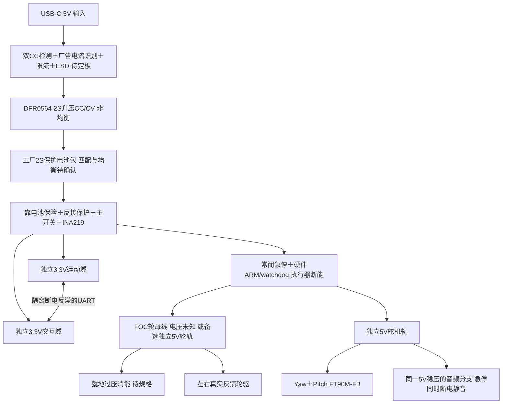

> H0.2采购更新：本文保留H0.1技术假设供追溯。最新国内候选见[采购核验表](procurement/BOM_国内采购核验.md)；新器件不能按本文或旧pinmap直接接线。

# V1-H0.1 电源、电平与接线设计约束

状态 PROTOTYPE / NOT_TESTED。下图为已选架构与阻塞位置，**不是可照接上电的原理图**。未知部件引脚、电压、限流及连接器已明确留空，禁止把分配净名当作供应商端子顺序。

## 1S / 2S 与电池匹配

选择2S作为待验证主方案。20W负载在1S3.2V/85%转换效率下约7.35A，在2S6.4V/90%效率下约3.47A；1S升压大电流、线损和接点负担更高。2S增加匹配充电与均衡要求；不能用1S充电板代替。ANSMANN2447-0105标称24.12Wh与99g可核，但价格高、5A放电定义、充电电流、保护阈值、均衡和回灌支持未齐全，故该电池链不能采购释放。

DFR0564输入5V、输出8.4V，商品说明明确非均衡，没有系统LOAD电源路径。暂定**系统主开关断开、托架上充电**，不承诺边充边运行。系统和充电支路分别受反灌约束，实际二极管/理想二极管损耗须列入电路。不直接复刻商品页中可能出现的非CC/CV充电建议。两线保护电池是否适合非均衡充电必须得到电池厂家确认；否则更换为匹配的工厂成品充电/电池套件并重算，不改成用户焊裸电芯。

USB-C限定5V sink，不进行9V及以上PD请求。两个CC的Rd、VBUS ESD和输入限流是分别的功能；Rd不授予2A/3A用电许可。候选TUSB320LAI检测源端电流广告，TPS2553限制实际取电；只有识别并验证足够的5V供电电流才能启充，默认/异常广告禁止大电流充电。具体封装、真值表、Rd是否集成、门限、欠压和热设计未审查，禁止下板。外部电源/线缆额定和输入电流须写在标签与测试记录。

充电接口VBUS存在应硬件禁止自由驱动；插线前必须已在托架。未来触点回充仅预留受同一输入保护控制的隔离焊盘接口名称 `DOCK_5V_IN/GND`，本版本不布置带电裸露触点，也不作自动回充功能承诺。

## 支路、电流与故障

运动/交互各用一块DFR0570，独立支路保护和去耦。两域共享电池与地。交互掉电时，UART使用两颗方向相反的SN74LVC1T45，RX上拉到接收域自身3.3V；两端供电为零时仍须验证Ioff，不能通过串口或USB给掉电MCU供电。EN各自复位，不串联复位两机。

两台FT90M-FB使用稳压5V。舵机6V厂家堵转1A只能用于瞬时上界警戒，不能当作可持续输出；5V并发峰值暂按2A加裕量估算。舵机PWM经双电源电平转换；反馈用20k上臂/10k下臂、10nF及限流钳位候选，5V满幅约1.67V，RC等效时间常数约67µs。3.3V ADC内部校准和源阻抗/采样稳定性需测。PDF只给反馈三点，不能线性外推到280°全程；外部读取通过后才将位置质量标为反馈实测。

功放与舵机共用所计价的一块DFR0753的不同布线分支；急停时功放也失去5V，不另藏一块未计价稳压器。交互MCU仍可能输出I2S，因此必须核对MAX98357A模块的断电输入容限；未得到允许证据前，在BCLK/WS/DIN/ENABLE加入带Ioff的跨域缓冲，费用暂包含在PASSIVE未知小料包，具体SKU/封装未冻结。不能只关闭软件音频就声称解决硬件反向供电。

普通对话按钮接交互GPIO48，本地解锁按钮接运动GPIO48。常闭急停在执行器供电链上，独立于两个MCU；开路即断轮/头动力，逻辑可保留记录。急停造成无支撑机器人跌落是物理边界，首次试验必须外部保护。硬件允许还需本地解锁锁存、外部watchdog和无USB/维护禁止；运动GPIO11默认拉低。复位、brownout、程序卡死、FAULT均需锁存，不自动重启电机。具体安全开关/保险/高侧开关/外部watchdog额定尚未选完，不能把上述逻辑描述当已实现安全电路。

FOC总线电压、信号电平、半/全双工、驱动电流模式和扭矩单位未冻结，`FOC_TX/RX/DIR`只是预留功能。备选FIT0521在独立5V轮轨降额，Pololu4035以PH/EN控制、SLEEP低coast；EN=0是制动，含义不能混用。编码器供3.3V，AB的推挽/开漏性质、输出幅度、左右符号与倍频要实测；不得因为模块有5V电源端就将5V信号接S3。驱动FAULT开漏上拉到运动3.3V；外部硬件锁存需消除驱动自动重试导致的再启动。CS约1.1V/A可作台架测试点，未分配为两个实时ADC输入；INA219不能代替绕组瞬态电流测量。

电池端并发情景33.8W，在6.4V约5.28A，**已超过候选包网页5A上限**，不能批准此并发组合。需要限制头部加速度/暂停音频、给平衡优先保留电流，并以硬件限制与台架数据验证；不能简单降低平衡力矩来保功能。启动依次为逻辑轨→传感器/状态检查→交互负载→本地解锁执行器，故障不得依赖交互网络通知。

先以7.0V作为实验预警起点、6.4V作为禁止新移动/要求托架的研究门限，**不是已批准的电池放电阈值**。应以最低单节电压、负载压降、buck实际掉压及轮驱余量重新校准；BMS突然断电不属于正常停机。当前没有单节采样接口，因此需确认成品包监测/均衡策略。

## 回灌、线损和热

重情景0.5m/s的平动+轮系动能约0.19J。仅以8.4→8.8V示例，需约55mF才能全装入电容；1000µF只能接收约0.00344J。8.8V不是批准的工作电压。还须增加机身转动、跌落恢复、转子和电感能量。buck通常不能反向吸能，保护MOS也可能挡回电池；低电流实验先同时观测驱动侧母线和电池侧，不以TVS“有一个”就宣称解决。

FOC过压阈值须低于驱动允许母线并高于满电/噪声；有刷5V轮轨单独设计主动消能。比较器、MOSFET、脉冲电阻的电压/电流/单脉冲能量与重复平均热负荷均待确定。电池满电且不吸能时也必须可处理制动。机械脚本的Nm是理想执行器量，绝不直接传给Hover协议整数。

大电流采用有额定依据的防呆插头和压接/螺钉端子，电池与马达不用面包板、开发板USB或杜邦线。20AWG铜线20°C典型约33mΩ/m只是估算：0.4m往返约13mΩ，5A约0.33W，另加端子接触电阻和封闭升温；到货线材必须测压降。主回流从马达/舵机电容直接回电池星点，避免穿IMU、ADC和射频下方；INA219分流Kelvin线远离开关节点。

四层模块承载板是待报价首选：L2连续地参考，L1/L4局部电源和信号，L3按布局分配；DVP/PCLK/SPI/I2S回流不能跨地缝，开关电源热环路与模拟采样分开，模块天线边界按Espressif15mm留空。外置轮驱大电流优先在线束/独立功率模块闭合。线宽必须按实际铜厚、长度、压降、温升与过孔数量复算；两层仅在所有回流与热检查通过后采用，不能用预算倒逼忽略这些要求。

## 线束定义

`harness.csv`中的端子号定义的是**未来MORI载板侧候选接口**，不是未经核对的设备端引脚。统一观察方向为板上插座**插合面朝观察者，卡扣在上，1号在左**；该约定必须与最终原厂壳体图核验，不可直接拿它当JST图纸。方焊盘、丝印1、线束两端号码三者一致才能释放压接图。任何device_pin为UNKNOWN的线束禁止带电连接。

两MCU调试使用独立隐藏测试接点：GND、3V3_SENSE、USB_D−、USB_D+、EN、BOOT。3V3_SENSE不用于外部给板供电，USB调试夹具的VBUS不得自动接电池或逻辑轨；主供电由限流电源提供。ROM下载需托架与硬件断能，先接地，核对防反插。外观仍只有一个充电USB-C口。
