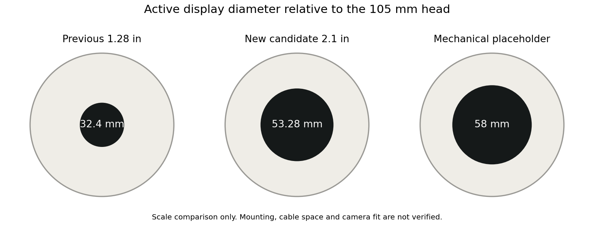

# MORI H0.3：大圆屏与轮驱复核

2026-09-22。计算已运行；实机、温升、站立和装配均 NOT_TESTED。

撤回 1.28 寸小屏主推荐；新显示主候选为冠显 TS021WVC02NP-B1323B（立创 C55111244）。撤回 FIT1034 2804 的当前直驱/1:1 轮驱主推荐，FOC 路线本身仍保留。

## 屏幕与国内采购

|项目|原候选|新主候选|
|---|---:|---:|
|实际圆形显示直径|32.4 mm|53.28 mm|
|分辨率|240×240|480×480|
|单件公开价，不含运费|¥71.00|¥105.30|
|显示面积比|1|2.70|

新件页面实读库存 10 个、1 件起订。价格/库存是当日快照，不是订单；不计满减券或运费券。原模型 Ø58 是预留显示区；新屏实际 Ø53.28，黑色面罩可大于发光区，但不能把发光区画成 Ø58。

厂商 V1.2 图纸：LCM 56.18×59.71 mm，厚 2.30±0.15 mm；40 针屏排线展开长 26.90±0.30 mm。独立 TR230S 转接板 34×34 mm、PCB 厚 1.0±0.1 mm；四孔 Ø1.70、中心距 30×30 mm。排针总高、排线弯曲半径和成套净质量尚未知。商城 19.57g 是毛重，不作净重。

采购 NP（无触摸）版本；20 针 0.5mm FPC 接口与 2mm 间距 2×7 排针端号不同，不能混用。模块支持像素 SPI/QSPI，由 TR230S 接口桥接；没有增加第三颗应用 MCU。新驱动不能沿用 GC9A01 初始化。

5V 彩条条件典型输入 0.58W；RGB565 缓冲假设每帧 460,800B，双缓冲 921,600B；30fps 净像素载荷 110.59Mbit/s。先用 QSPI 40MHz 预算，必须处理 WAIT 握手；并发摄像头/音频、实际像素格式与驱动仍待验证。不能把原小屏 0.15W 直接沿用到续航。

连接器净空、背板与头部舵机/摄像头碰撞检查尚未完成；共享机械契约已交接真实分件尺寸，不改动机械母球或擅自冻结孔位。

来源：[立创商品](https://item.szlcsc.com/58799605.html)、[厂商规格书归档](../procurement/evidence/TS021WVC02NP-B1323B_V1.2.pdf)。

## FOC 电机为什么需要换

FOC 是控制方法，不保证电机输出够大。FIT1034 的 300gf·cm 换算为 0.02942N·m；网页没有明确这是否为可长期持续值，电压/额定电流/功率标注也不自洽。1:1 皮带按假设 85% 效率只有约 0.025N·m/轮。

下表复用历史 1.0–1.4kg 包络，区分机身与轮系质量，重心高于轮轴约 66–69mm。这里的 10° 是重心已配平后的初始倾角。较大圆屏、现版机械和新轮驱的实际惯量必须之后重建。

|情形/整机质量|10° 时初始角加速度为零|初始回正加速度 2rad/s²|初始回正加速度 5rad/s²|
|---|---:|---:|---:|
|light / 1.00kg|0.023|0.024|0.027|
|medium / 1.15kg|0.026|0.028|0.031|
|heavy / 1.39kg|0.032|0.035|0.038|

表内单位均 N·m/轮。仅为初始瞬间的耦合动力学要求，尚未计延迟、有限角速度与摩擦。即使恰好角加速度为零，也不等于能把已有倾倒角速度刹住或稳稳站立。

公式：A=M+Jw/r²，b=m·l·cosθ，C=Jbody+m·l²；两轮总扭矩 τ=[mgl·sinθ+(C−b²/A)·α]/[1+b/(Ar)]。包含马达对机身的反作用扭矩，不能用静态 mgl 单独确定平衡电机。

随后运行离散控制、饱和、6ms 执行器滞后、2/10ms 反馈延迟及两档损失的 48 个情景。判据为末 1 秒倾角<2°、速度<0.1m/s；>30° 或 >0.8m/s 中止。

|每轮可用扭矩情景|满足本次仿真判据|
|---|---:|
|FIT1034_optimistic_direct (0.029N·m)|2/12|
|FIT1034_1to1_efficiency_85pct (0.025N·m)|0/12|
|requirement_0p10 (0.100N·m)|6/12|
|requirement_0p20 (0.200N·m)|6/12|

这些结果只说明该模型和控制器的裕量，不能证明更低扭矩绝对无法平衡，也不能证明通过者已经实机站稳。

0.10/0.20N·m 两组在 2ms 延迟下均满足本次判据，10ms 下均未满足，说明还必须控制反馈时延并重新调参。单纯增大电机不构成稳定性证明。

轮驱采购筛选先提高到**轮端连续约 0.10N·m、短时峰值至少 0.20N·m/轮**，并要求低电量、目标转速、峰值持续时间及温升数据。这是带余量的设计目标；目标输出 0.10m/s 对应约 20rpm，0.30m/s 对应约 60rpm。

不直接用 3:1/4:1 减速掩盖不足：电机转子惯量会按速比平方折算，低位轮轴现有空间也不能直接容纳更大的从动轮；布局、齿隙、张力与损耗需重算。2S 低电量还低于 FIT1034/DRI0058 的最低输入要求。

更大规格 FIT1036 4015 只作筛查：厂商“额定”与“最大”扭矩表相互矛盾，且最低 12V、体积 Ø45×26mm，未作为主推荐，不以商品标题替代连续能力证据。

来源：[FIT1034 厂商页](https://www.dfrobot.com.cn/goods-4230.html)、[FIT1036 厂商页](https://www.dfrobot.com.cn/goods-4232.html)。

复算：`hardware/.venv-v1/bin/python hardware/v1/calculations/review_display_motor.py`。完整输入、结果和限制见 [JSON](display_motor_review.json)。没有采购、改固件使能或导出制造文件。
