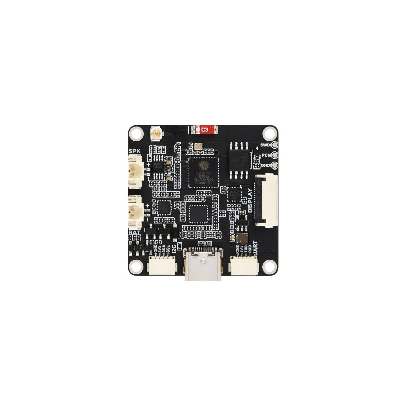

# CAM J11：官方照片的板端位置核对

2026-10-03。复核结论：可以把此前笼统的“视角资料缺失”收窄为 **官方照片中的板端位置映射已有；实际插座完整料号、正对插合面及线端针腔视图仍待确认**。本记录补充 A7/A8，不修改正式引脚表、PCB 或机械模型。

## 照片所示的顺序

已直接查看现存官方照片 `esp32-s3-cam-ovxxxx-3_1.jpg`：**芯片面正视，Type-C 位于下边，UART 位于右下方**。UART 焊盘上方四个丝印从照片左到右为 GND、3V3、TXD、RXD。结合既有官方原理图与 A7 电气针脚表，得到：

| 照片从左到右 | 可见丝印 | A7 逻辑针号 | 零姿态模型中的候选 slot |
|---:|---|---:|---:|
| 1 | GND | 4 | 3 |
| 2 | 3V3 | 3 | 2 |
| 3 | TXD | 2 | 1 |
| 4 | RXD | 1 | 0 |

右列仅为下述模型变换的推断，不是连接器厂家的针腔编号。照片中的 TXD/RXD 从 CAM 一侧命名；现有运动 J5→CAM J11 仍为 **1→1、2→2、3→3、4→4**，不会因为视角变化再交叉 TX/RX。第 3 脚仍仅用于 CAM 侧本地 3V3 电平参考。

来源 [Waveshare 产品照片](https://www.waveshare.com/media/catalog/product/cache/1/image/800x800/9df78eab33525d08d6e5fb8d27136e95/e/s/esp32-s3-cam-ovxxxx-3_1.jpg)，原项目 `source_manifest.json` 与 `browser_assets_2.json` 都记录该 URL。原图 SHA-256：`018cefb8862e411ebb126abadc5bb6dbbeb1b8ab99207918ba9e70d0504295b8`，本次本地文件校验一致。2026-10-03 的网页工具无法直接打开远程图片，本次视觉核对使用已有原图，没有声称重新下载了当前商品图；照片也不能确认未来到货板卡批次。

## 模型方向的检查范围

只读核对 `geometry.json#/waveshare_detail/cam`：本地 U 轴按 SD 面向右定义，芯片面照片与之相反；UART 的照片 x=482 对应 U≈−10.1 mm，I2C 的照片 x=319 对应 U≈+10.1 mm。`waveshare_detail.py` 的 CAM 零姿态变换第一行为 `[1,0,0]`，本地 U→全局 X。因此在**该零姿态和既有重建**下，照片右方→全局−X。

独立候选的几何 slots 按全局 X 递增排列，故可推断 `slot0..3 → 逻辑1..4`。这里核对的是映射方向；1 mm 槽距、位置、插入深度、壳形及公差仍沿用各自的候选/资料状态。本次没有重新运行 Blender、重新生成实体或测试任何姿态的线路通过性。运动时不能把固定的图像左右直接叫作全局左右。

## 状态细分

| 项目 | 状态与证据边界 |
|---|---|
| 照片丝印位置 | PASS，仅所存官方照片所示板面 |
| 丝印→现有逻辑针号 | PASS，照片观察与原理图针表对应；不是实物导通测试 |
| 几何 slot→逻辑针号 | ASSUMED，模型零姿态变换的有依据推断；核对计算 PASS |
| 实际插座厂牌/完整料号/版本 | BLOCKED |
| 插座正对插合面、配套胶壳的针腔编号及出线面视图 | BLOCKED |
| 针腔尺寸、压接端子朝向/保持、到货板导通 | NOT_TESTED / BLOCKED，不从照片估成已验证尺寸 |
| 完整线束加工图与制造发布 | BLOCKED |

照片是板面俯视，不能直接拿来当线端插合面图，也不能只把整图镜像就签发供应商针腔图。后续需按确定的插座/胶壳图注明观察方向、锁扣和 Pin 1，再将当前逻辑映射转成正式线端图。

`review_photo.py` 记录输入快照/哈希、原针表一致性及模型映射计算；`position_mapping.csv` 是照片证据对照表，**不是新版制造 pinmap**。原 A7 `physical_cavity_view=BLOCKED` 仍适用于真实针腔视图，无需改写历史来源。未联系厂家或下单。
