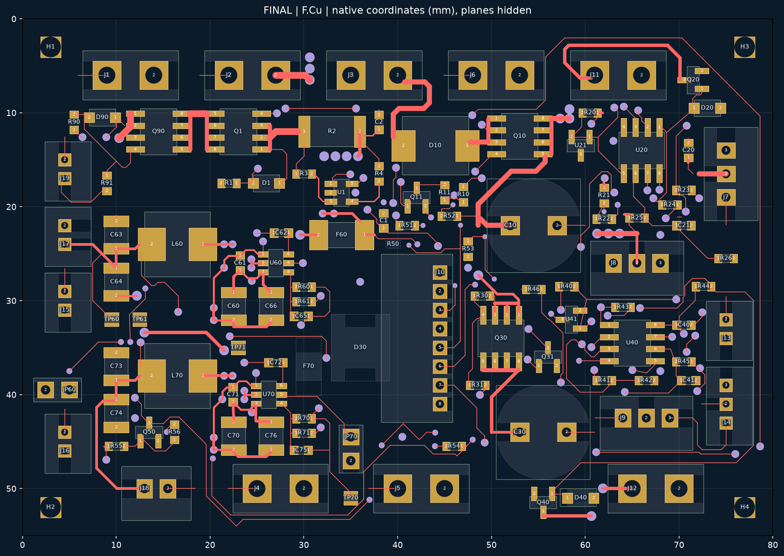
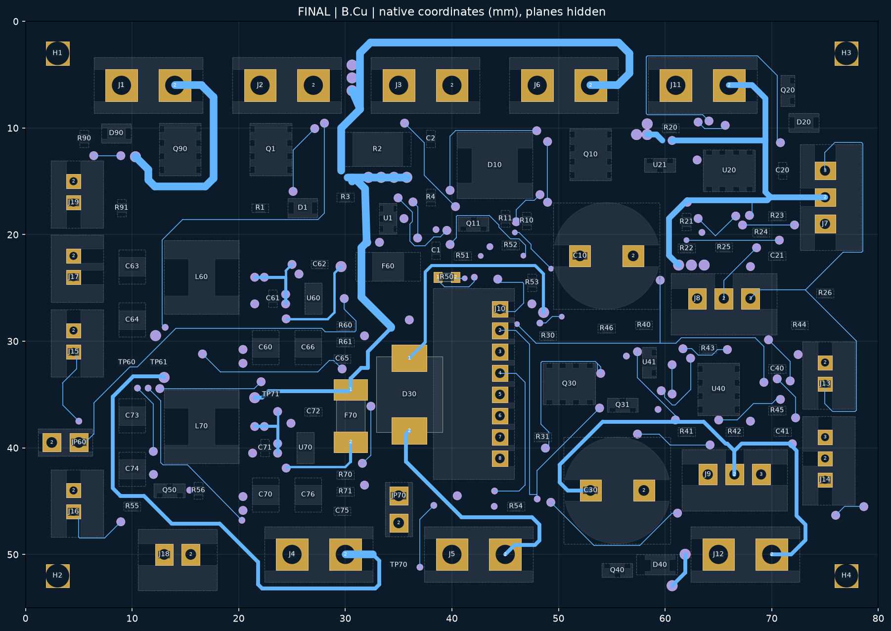

# J10 侧出线 C3：已布通的独立候选

2026-10-03。**完成 C2/A3 候选的电气布线收尾；PROTOTYPE / 物理 NOT_TESTED / 制造 BLOCKED。** 尚未替换正式电源 P5R6，也没有改主机械模型、PHC1 候选或 C2/A3 历史文件。

[KiCad 工程](MORI_power_J10_C3_CANDIDATE/MORI_power_J10_C3_CANDIDATE.kicad_pro) · [PCB](MORI_power_J10_C3_CANDIDATE/MORI_power_J10_C3_CANDIDATE.kicad_pcb) · [原理图](MORI_power_J10_C3_CANDIDATE/MORI_power_J10_C3_CANDIDATE.kicad_sch) · [布线与线宽复核](ROUTING_REVIEW.md) · [J10 针序](J10_pinout.csv)

## 实际交付状态

| 检查 | 结果 |
|---|---|
| KiCad 10.0.6 原生 ERC | PASS，0 条 |
| 原生 DRC / 未连接 / 原理图一致性 | PASS，0 / 0 / 0；忽略项 0 |
| 27 条负载路径的铜线连通筛查 | PASS；不包含载流和温升认证 |
| 112 封装 / 280 焊盘与 C2 几何及网络逐项比对 | PASS；坐标、朝向、面别、尺寸、孔径和针号不变 |
| 板框、安装孔、层数、本体禁布区和自定义规则 | PASS，保持 C2；80×55×1.6 mm、4 层 |
| 正式工程 249 文件、C2 源文件 | PASS，hash 未改变 |
| 本体筛查 | 104 器件，跨其他器件本体走线 0；自身引出例外详见复核记录 |
| 丝印/铜线布局视觉最终批准 | 仍供审查；不把 DRC 当作用户审美批准 |
| 真实端子装配、带线插拔、温升/制动/整机测试 | NOT_TESTED |
| 正式发布、采购和制造 | BLOCKED |

当前 PCB SHA-256：`94bb35c82705ff396a1f5a5899052b3e5d049d2177af2af5a7bd742c275ae92a`。最终原始检查、运行命令/版本和源文件验证在 `reports/FINAL_*`、`reports/invariants.json`，不是截图替代的检查。

另附 KiCad 自身导出的 [F.Cu/Silk](review/front.svg) 和 [B.Cu/Silk](review/back.svg)，均来自同一受检文件；这些是审阅图，不是制造数据。

## 接口及机械复核边界

J10 使用 **JST S8B-PH-K-S(LF)(SN)**，配 PHR-8 / SPH-002T-P0.5S，向原生 PCB **−X** 出线。1–8 孔中心仍为 X44.5、Y27/29/31/33/35/37/39/41 mm，成品孔候选 Ø0.90、铜盘 1.50 mm。针序严格为 **3V3、ARM_Q、FAULT_N、CHG_N、BAT_ADC、WHEEL_ADC、CURRENT_ADC、GND**。孔成品公差 −0.05/+0 mm 仍待板厂确认。

D30/F70/R50 继续在背面；JP70=(35,44.5)/0°、TP71=(23,35)，全部与 A3 相同。完整本体、插头及背面包络继承 A3，C3 没有添加新的机械尺寸。F70 背面包络 3.09 mm、R50 的 2×1×1 mm 装配包络仍有假定，不能将名义不相交说成实际可装。

仍需机械/供应资料闭合：真实插合后出线高度、端子及线根弯折要求、带线拔出与夹持路径；JP70/TP71 在整机装好后直进服务通道受阻，需要确认维护顺序或另审局部变更。这次没有擅自移动元件来消除这些问题。新的 14 线独立机械研究已接收快照，旧 A5 的失败报告保留，主模型仍未采用那些研究线束。

其他 PH 接口的成品孔统一修正还在 **PHC1 独立候选**；它们没有自动合并到这份 C3。正式四板亦未发布替换，不能混用不同候选的 DRC 或制造状态。

## 使用和复核

打开上述 `.kicad_pro` 即可使用本地封装/符号库。原生工程可独立打开；下面的比对/计算脚本依赖完整 MORI 工作区及其既有工具和源版本，应在原工作区运行。可在 KiCad 中重填铺铜并运行全部 ERC/DRC，或使用 KiCad 自带 Python 运行 `verify.py`、`run_audits.py`、`power_paths.py`。`finalize.py` 会更新本候选元数据、重填并重新生成最终检查，应只在需要更新候选时使用。

本目录的 `route.py`、`prepare/finish/smooth` 等脚本和编号日志是开发过程，不是按文件名批量执行的一键构建流程；它们会改候选。最终权威源是本页 hash 对应的原生 PCB/SCH 和 `FINAL_*` 报告。

没有导出 Gerber/钻孔/制造贴装文件，没有下单。`assembly_bom.csv` 是沿用电路的审查用器件清单。
