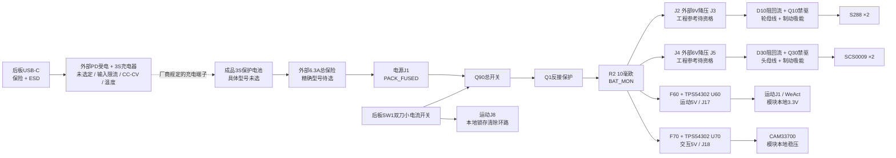

# P4 电源树与接线入口

原生针号以[connector_pinmap.csv](connector_pinmap.csv)为准，线束实际端点见[harness.json](harness.json)和[版本化线束表](../interfaces/harness_V1.2-H0.4-P4.csv)。坐标、器件面、旋转和插头空间见[机械交接](../handoff/mechanical_P4.json)。对插线端观察为镜像，不按颜色猜针号。

Q90 与 Q1 共漏极，前者关闭负载、后者保持反接保护；两者的实物方向、Vgs、浪涌与 SOA 都需测试。后部 SW1 不直接承载马达电流。普通电源开关断开会失去平衡，不能作为有支撑能力的“暂停”。恢复供电或解除故障仍需本地检查及显式解锁。

两路5V各自有保险和降压器；WeAct与CAM保留各自板载3.3V，不并联稳压输出。两域仍共用电池、Q90/Q1、分流器及地，不能称独立安全冗余。电机/舵机电流不经过MCU模块USB和PH信号线。

电源 J11/J12 的1脚为制动MOSFET漏极，**不是公共地**；2脚为相应正母线。外置电阻要核脉冲能量、壳内温升和安装绝缘。电源 J6 是 RAW BAT SERVICE/DNP，**不是5V输出**。J19.1 在OFF时可能达到电池电位，与相同PH2逻辑插头不得混插。

后板 J3 一只 PH4 分成电源 J19 与运动 J8 两只 PH2，必须按逐针线束表分叉。后板 J2 的第5针仅原始VBUS检测至电源J16，不能从该细线取充电电流。外部PD模块必须负责两个CC的Rd和协商；本板不重复下拉。1.5A熔断器不等于1A电子限流。

内部调试：WeAct使用其顶面P5/SWD且调试器不额外给目标板供电；CAM用模块自身USB，先托架、DISARM并拔掉机器人给CAM的5V线，避免主机5V与板端5V反灌。外壳只保留充电USB-C；机内J6是维护输入，非外部RESET。正式通信协议与GPIO未因P4更改。

宽铜连通审计在[load_path_audit.json](reports/MORI_power_P4/load_path_audit.json)。它排除细控制线后确认主负载路径仍有连续宽铜，并不证明温升、接触额定、地铜瓶颈或瞬态安全。头部母线补充了1mm路径与两枚1.0/0.45mm并联过孔；电源板名义70µm铜，保守电阻估算仍按35µm。板厂铜厚和孔铜均未实测。
