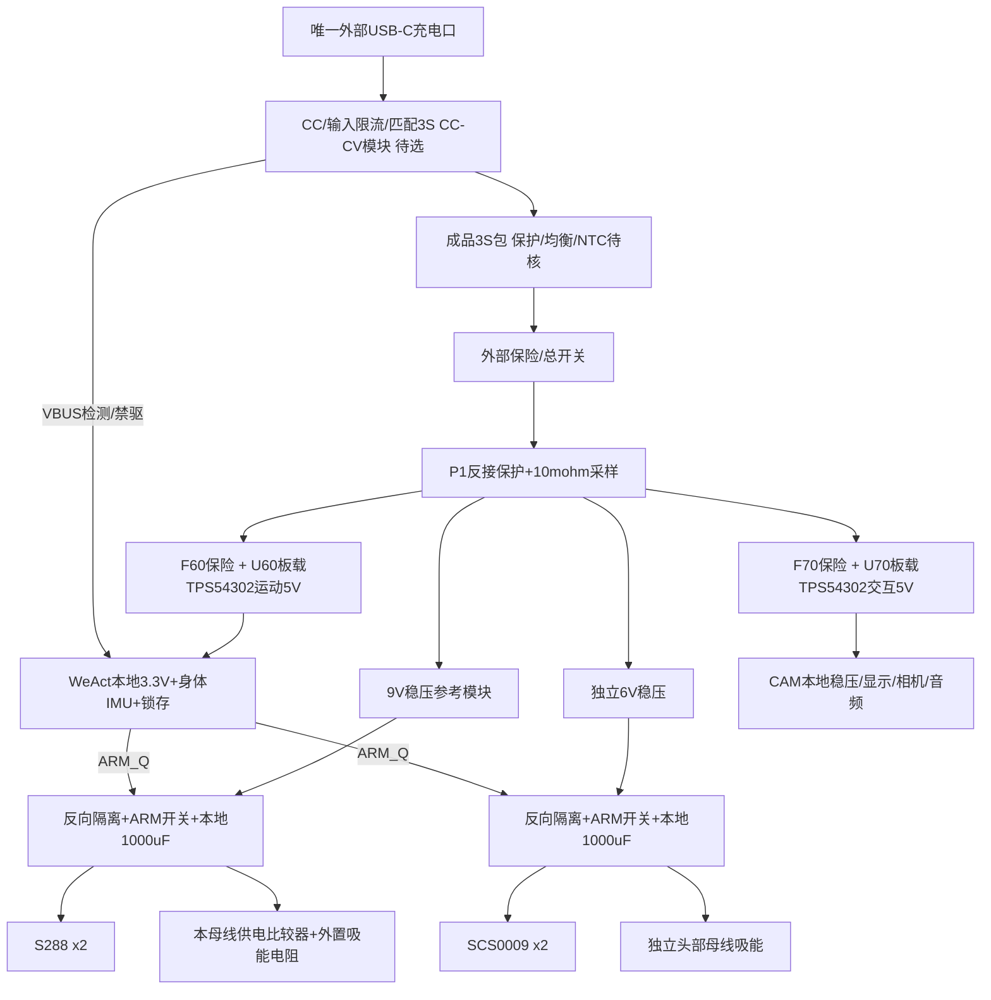

<!-- P4 power entry -->
**当前P4电源/总开关与接线：[P4电源树](layout_P4/power_and_wiring.md)。以下旧阶段数值与未测试假设保留；新增Q90和后部USB/开关接口以P4原生图为准。**

# S3 电源树与状态（仅原理图更新）

详见 [S3电源原理图](kicad/MORI_power_S3/MORI_power_S3.kicad_sch) 与 [S3电气审查](schematic_S3/README.md)。PROTOTYPE / NOT_TESTED。图中充电与成品包仍是待资格外部模块；新原理图包含反接、采样、执行器门控、吸能、故障检测和两路板载5V。PCB仍为旧P2，尚未同步；板框由后续结构冻结决定。

| 状态 | 执行器 | 运动/交互行为 | 实施与限制 |
|---|---|---|---|
| 断电/低压启动/复位 | 硬件锁存清除；电源开关关闭、两TX三态 | MCU可自检；不能自动ARM | Supervisor/NRST/J8/FAULT/CHG清除电路已画；瞬态未测 |
| 本地明确解锁 | 自检通过后新ARM边沿 | 先等轨稳定/反馈，再低限幅控制 | 上电电容浪涌、PMOS SOA及模块限流恢复必须测 |
| 站立/移动 | 500Hz目标、本地限幅/租约与反馈年龄 | CAM并发不参与实时保平衡 | 连续力矩/温升未知 |
| CAM失电或重启 | 健康运动域保持平衡，撤主动位移 | TXU0202隔离掉电侧；丢弃旧会话 | 共享电池/地仍可能共同故障 |
| 低电 | 提前请求托架，限制新的主动动作 | 暂定10.8V持续500ms告警、10.2V持续100ms紧急支持请求 | 随所选包/压降修订；不是突然DISARM阈值 |
| 严重故障/急停 | 清锁存、切执行器供能 | 故障锁定；解除后需再次本地ARM | 会失衡，外部保护承接；主动吸能仍处理有限回灌 |
| USB充电维护 | 托架、禁驱 | P1不批准边充边正常运行 | 充电模块/电源路径尚未选定 |
| 内部调试 | 托架、禁驱 | CAM拔掉机器人5V后接电脑USB；运动SWD只感知VTref | 维护电源互斥流程已定义，未实现自动MUX |

原P1分状态估算在 [power_states.csv](reports/power_states.csv)，其中约59W峰值口径仍为历史假设，不是S3新支路容量的验收值。S3另有[16组降压计算及并发容量预算](schematic_S3/reports/logic5v_calculations.json)：将运动0.75A/交互2A峰值容量和原轮/头峰值组合，约64.15W、9.9V时6.48A。与6.3A主保险的时间/温度配合需复核；没有扩大保险或宣称可持续。全部功耗和续航仍未实测。

当前一小时分析以 `engineering_model.py` 的**电池侧Wh/输入平均W，80%可用容量加15%余量**为准。`interface_gate.py`保留的早期负载侧90%效率算例只是另一口径，不代表本版续航验收。3S2200mAh在18W平均负载时本版估算不足一小时。
