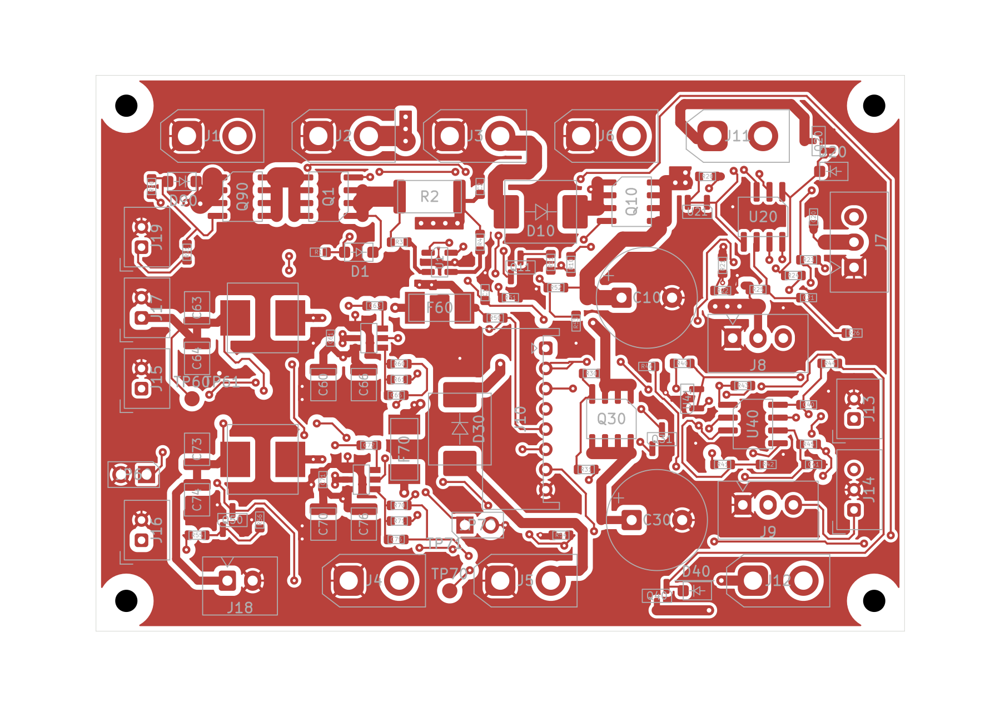

# J10 固定孔位侧出线候选 C1：FAIL，未发布

用户已于 2026-10-02 批准先做独立候选，机械复核后再发布。当前 [原生工程](MORI_power_P5R7_J10_CANDIDATE/MORI_power_P5R7_J10_CANDIDATE.kicad_pro) 不替代正式电源 P5R6。

采用 JST **S8B-PH-K-S(LF)(SN)**，配 PHR-8 / SPH-002T-P0.5S。厂家本体 17.9×7.6×4.8 mm；1–8 孔仍为 (44.5, 27+2n) mm，原 1.35 mm 铜盘和 0.75 mm 孔保持。原理图与 PCB 使用同一新封装，电路、所有网络和原走线未改。厂家第1页参考孔径为 Ø0.7 +0.1/0 mm；保留的0.75 mm名义孔位于此窗口内，但最终成品孔公差/镀层口径仍需板厂确认。侧出完全插合参考深度9.6 mm、高4.8 mm，不能只用空插座7.6 mm深度查机械。

在 F 面保持每个编号的孔位，只能让这款座朝 PCB **−X** 出线。旋转 180° 虽能复用无编号的孔集合，却会把 1–8 对调，不能采用。反装到 B 面需要重新验证背面高度，4.8 mm 也超过此前 −3 mm 分配；未采用。

发现的问题：

- J10 的 F.Fab 本体包络与 D30 本体包络沿 X 重叠 **0.85 mm**、沿 Y 重叠 7.1 mm。这是二维投影冲突筛查，尚非装配后的三维接触测量。
- 新的塑壳投影覆盖原有 BAT_MON / BAT_ADC 等线路。更新了 J10 两面的本体规则区，没有保留错误的旧小包络，也没有授予 GND/电源豁免。
- KiCad DRC：39 项禁止区域错误、3 项庭院重叠错误（R50、JP70、D30 与 J10）、7 项丝印警告，共 49 项；其中一个物理问题可能对应多条检查，不能解读成 49 个独立位置。
- ERC 0、未连接 0、原理图一致性问题 0，只证明本次候选连接未断，不抵消上述布局失败。

下一步需联合评估 J10 插头/拔出扫掠和 D30 电源回路的局部摆放。先前 12 mm 直拔空间是项目检查分配，并非 JST 额定要求。不可只挪开二极管、未查插头和线弯就宣称已闭合；也不可擅自反编号、移动板框/整板或切机械支架。**本轮未移动 D30 或其他器件。**

[真实 DRC](reports/drc.json) · [ERC](reports/erc.json) · [孔位及几何比较](reports/geometry.json) · [原始源文件哈希](reports/source_hashes.json)
