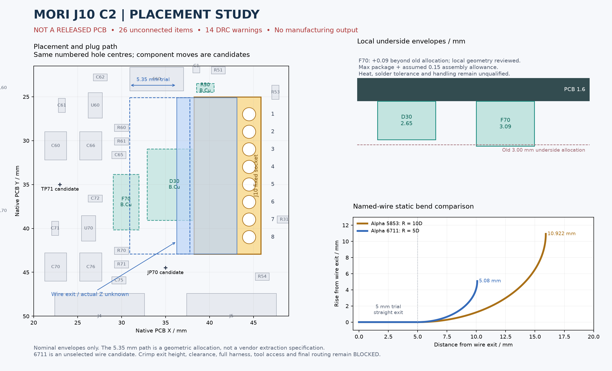

# J10 侧出线候选 C2 / 交接 A3

2026-10-02。**PROTOTYPE / BLOCKED：这是一份独立摆放与接口复核包，相关网络未布通，不是已完成的新 PCB。** 用户批准保持 J10 的孔排和 1–8 针序，先做侧出线候选、交机械复核、通过后再发布。本包尚未达到发布条件。

正式原生板仍是运动/后接口 P5R7、电源 P5R6、IMU P5R4。四套工程的 16 个 PCB/SCH/PRO/DRU 文件及已收到的 A2 交接均通过 hash 保留检查；主机械模型未修改。

**A3 机械补查已返回**：[接收记录](received_mechanical_A3/README.md)。R50 背面候选已补查；JP70/TP71 装配后的直进操作被上方结构挡住，J10 局部八线转弯仍依赖未知出线高度。该补查未批准完整候选，也未改变已交出的 A3。

## 已落实到原生候选的改动

| 对象 | C2 改动 | 保持或限制 |
|---|---|---|
| J10 | JST **S8B-PH-K-S(LF)(SN)** 侧出线座，配 PHR-8 / SPH-002T-P0.5S；出线朝原生 PCB −X | 编号孔中心仍为 X44.5、Y27/29/31/33/35/37/39/41 mm，针序和网络不变 |
| J10 焊盘 | 候选成品孔 Ø0.90、铜盘 1.50 mm | 提议孔公差 +0/−0.05 mm，尚未得到板厂能力确认；孔中心不移动 |
| D30、F70、R50 | 移到 B.Cu，保持各自原 XY 和同号焊盘位置/网络 | A3 已补查三者背面局部空间；R50 仍为假定包络，热、装配和整套线束未通过 |
| JP70 | 从 (36.5,44.5)/90° 改 (35,44.5)/0° | 服务跳线功能不变；插拔操作仍需检查 |
| TP71 | 从 (34.5,48) 改到 (23,35) | GND 裸测试点，无独立器件高度；可接近性仍待验证 |

未移动开关稳压器 IC、输入电容、BOOT 和反馈器件。原板 80×55 mm 板框、安装孔和其他连接器保留。失败的布线实验已撤出当前候选；没有通过加忽略规则、缩小本体或调整电路来消除问题。

[原生 KiCad 工程](MORI_power_J10_C2_CANDIDATE/MORI_power_J10_C2_CANDIDATE.kicad_pro) · [PCB](MORI_power_J10_C2_CANDIDATE/MORI_power_J10_C2_CANDIDATE.kicad_pcb) · [原理图](MORI_power_J10_C2_CANDIDATE/MORI_power_J10_C2_CANDIDATE.kicad_sch) · [逐器件差异与完整性检查](validation.json)

## 机械复核的实际边界

原 C1 侧出线座与 D30 冲突，不能直接替换。复核还发现早先把固定插座也随插头整体平移，夸大了取件扫掠。本轮只移动 PHR-8 插头包络：先退出 **5.35 mm**，再上提 **12 mm**。5.35 来自 43.10−38.25+0.50 的几何分离分配，不是厂家保证的解锁行程。

D30 最大封装加 0.15 mm 安装分配后占背面 **2.65 mm**；F70 为 **3.09 mm**。机械任务以 M1.47 实体复核，这两个局部包络无交叠，继续向下移动至首次碰撞的余量下界分别为 **1.84、1.40 mm**。这些是局部竖向扫描结果，不是全方向最小间隙。F70 超过旧 3 mm 分配的 0.09 mm 仅在此位置可继续研究，未扩大整板背面限高。详见原始[机械复核](../../../../mechanical/studies/prearrival_finish/J10_C2_review/REVIEW.md)及本包 `received_mechanical_C2/` 快照。

该复核仅证明名义包络不相交。导线的真实出线高度、线束连着插头拔出、手/工具夹持、焊接公差与背面散热尚未闭合。原有 8/10 mm 直进工具分配会碰 PCB/器件，不能把裸插头路径通过称为可维修。

## 线材比较，没有采用新线材

| 静态比较候选 | 公开外径上限 | 采用该线材自己的最小弯曲半径 | 本轮结论 |
|---|---:|---:|---|
| Alpha 5853，AWG26 | 1.0922 mm | 10D = 10.922 mm | 假设低位出线时，C66 等仍有冲突 |
| Alpha EcoWire 6711，AWG26 | 1.016 mm | 5D = 5.08 mm | 局部更容易排线；价格、国内短线供货和端子压接尚未确认 |

6711 的厂家页面：[Alpha Wire 6711](https://www.alphawire.com/products/wire/ecogen/ecowire/6711)。这是另一个完整型号，未缩改 5853 的弯曲参数，未作为头部动态线束的寿命依据。

已检查 1.5/3/5 mm 直段与多个出线高度。短直段的部分比较无名义交叠；**1.5/3/5 mm 均是比较用分配，不是 JST 规定的最小值，A3 仍保留原 5 mm 基准。** 本轮硬件单线扫描未附加机械复核使用的 0.3 mm 间隙，不得混用通过结果；真实线束、整束相互间隙和带线取件尚未通过。见 [5853 敏感性](wire_sensitivity.json)、[6711 比较](ecowire_comparison.json)。

## 新发现：四块正式板的 PH 成品孔问题

[JST 官方 FAQ](https://www.jst.com/resources/faq/) 对 B*B-PH-K-S / S*B-PH-K-S 在玻纤环氧**镀通孔**板的成品孔给出专门建议：2P 为 **0.80–0.85 mm**，3–16P 为 **0.85–0.90 mm**。这是镀后尺寸，优先于通用目录的材料未定参考孔。访问日期 2026-10-02，原文及 hash 已保存。

正式板抽取结果：运动 8 个、电源 7 个、后接口 2 个、IMU 1 个，共 **18 个接口**均为名义 0.75 mm，低于对应建议范围。详见[逐接口清单](PH_finished_hole_audit.csv)。当前 C2 只改 J10；其余正式板未改，全部列入制造阻断。后续必须一起审查成品孔公差、剩余环宽、邻线净距、端子插装和原生 DRC，不能只扩大钻孔而不检查铜盘与走线。

## 本轮真实检查

| 检查 | 结果 |
|---|---|
| KiCad 10.0.6 ERC | PASS，0 条违规 |
| 原理图/PCB 一致性 | PASS，0 条差异 |
| DRC | **FAIL：26 处未连接；14 条警告**，退出码 5 |
| 14 条警告明细 | 8 条悬空走线、3 个悬空过孔、3 条丝印覆盖铜；未忽略 |
| 当前未布通板的间距/短路/本体规则错误 | 未报告；不能作为布通后会通过的证据 |
| 正式工程/A2 保留、候选改动范围与报告 hash | PASS，仅文件与接口完整性 |
| 台架、温升、压接、真实插拔、整机带线装配 | NOT_TESTED |
| 制造/采购放行 | BLOCKED |

实际命令、退出码及 stdout/stderr：`reports/FINAL_PLACEMENT_ONLY_command.json`、`reports/FINAL_erc_command.json`。原始[DRC 报告](reports/FINAL_PLACEMENT_ONLY_drc.json)与[ERC 报告](reports/FINAL_erc.json)保留。没有导出 Gerber/钻孔文件，没有下单。`assembly_bom.csv` 是候选器件表，不是制造放行的贴装文件。

## 继续完成所需的资料与工程工作

1. **厂家资料**：S8B-PH-K-S、PHR-8 与 SPH-002T-P0.5S 的装配/剖面尺寸，特别是插合后线芯中心距 PCB 顶面、有效退出量、线根受力/弯折要求。现有公开系列图没有闭合这些字段，不能按照片猜成已验证尺寸。JST 的 [PHR-8 STEP 申请](https://www.jst-mfg.com/product/index.php?doc=2&filename=PHR-8.zip&series=199&type=10)需要真实联系资料并通过邮件交付；本轮未填写或发送申请。
2. **线束规格**：确定实际导线与压接件供应商，取得外径、弯曲要求和短线报价。6711 仍是空间比较候选，不是已确认国内可采购的最终线束。
3. **机械复核**：A3 已补查 R50 和 JP70/TP71 的局部空间，发现装配后服务通道被挡；仍须用真实出线位置验证带线插拔/夹持，并确认跳线帽、探针与维护次序，再决定是否调整 C66 所在稳压电路区域。不得为了获得几何通过而自行填高出线位置。
4. **硬件工作**：完成受影响网络重布线、背面热/回流审查和逐线外向引出检查；统一修复正式板 PH 孔/焊盘。之后再运行完整 ERC/DRC、交机械复核，并发布新的正式原生板。

没有把资料缺口当作已完成布线的理由；布线本身仍是一项明确未完成工作。当前 `reports/03_routes_drc.json`、`04_manual_drc.json` 和 `rejected_routing_trials/` 都是失败试验，不能作为交付版。

复核脚本：`validate_candidate.py`（KiCad Python，仅核对接口/源文件）、`check_envelopes.py`（Blender，只读主模型）、`audit_ph_holes.py`、`render_review.py`。`finalize_study.py` 会重建本目录内候选，应只在未发布的工作副本中运行；失败路由脚本不是认可的构建步骤。
