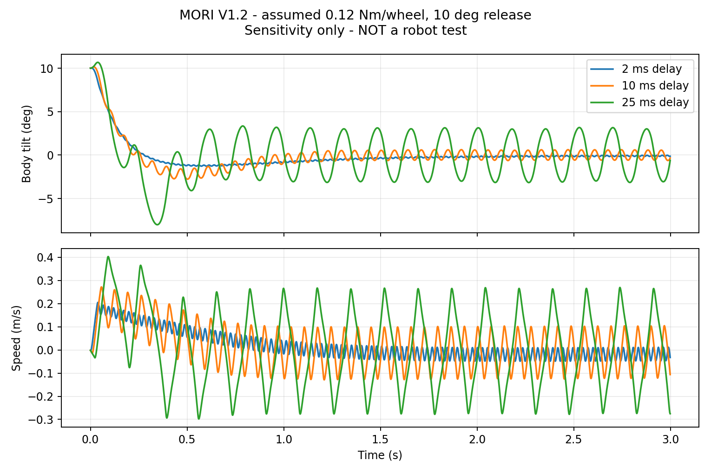

# P1 动力、质量和供电计算摘录

输入来自当前机械质量/几何与明确假设；计算脚本可运行。未称量、未台架、未自由平衡。完整数值仅保留计算精度，表中适度取整。

|情景|整机kg|被平衡机身kg|轮系kg|整机重心距地mm|机身COM距轮轴mm|pitch运动件g|
|---|---:|---:|---:|---:|---:|---:|
|light|0.85|0.70|0.15|118|86|117|
|nominal|1.14|0.94|0.20|119|86|155|
|heavy|1.55|1.28|0.27|119|86|210|

各情景对未知材料/器件质量乘0.75/1/1.35，电机与舵机按厂商质量保留，额外电源/线束预留50/90/160g。电池仍约190g假设；实际电源重排将改变COM/惯量。

机器人PLA几何估算约572g；加35%工艺损耗约772g。托架和试打件未得到切片用量，需另计；不得把这个质量当整机已称重或完整采购用料。

离线平衡方程含机身/轮系惯量、轮驱反作用、速度降额假设、2/10/25ms延迟、饱和、摩擦和反向损失。每格是满足“最后1s倾角<2°、速度<0.1m/s且不越界”的条件试验数/6。电机是否能连续提供这些力矩未知。

|假设每轮连续力矩Nm|light|nominal|heavy|
|---|---:|---:|---:|
|0.06|4/6|4/6|2/6|
|0.12|2/6|2/6|3/6|
|0.24|2/6|2/6|2/6|

另有2个重型反向损失情景；共56个中23个满足条件。LQR仅用于离线敏感性诊断，不作为固件调参。S288的0.6Nm最大/堵转值不作连续额定。

同一诊断控制器没有针对各力矩上限重新整定，带延迟与饱和时结果可不单调；此表不能用来给电机能力排序，也不是可靠性成功率。

|头部计算|最不利需求Nm|4.8V额定/需求|
|---|---:|---:|
|pitch|0.050|1.28|
|yaw，含机身±10°倾斜|0.044|1.46|

采用5rad/s²加速度、0.01–0.04Nm线缆/摩擦假设；按所核旧SCS版本4.8V连续额定0.65kg·cm。约1倍多的条件余量不宽裕，实际线缆阻力、零点/联合姿态和供货版本需验证。

|功耗假设状态|电池输入W|9.9V输入A|
|---|---:|---:|
|balance|7.84|0.79|
|moving|11.47|1.16|
|disturbance_peak|31.11|3.14|
|head_motion|13.86|1.40|
|display_on|8.61|0.87|
|vision_tracking|11.76|1.19|
|audio_record_play|12.65|1.28|
|network_tx|11.75|1.19|
|concurrent_peak|59.34|5.99|
|maintenance_charge|2.72|0.27|

功耗是分轨输出假设经效率换算后的输入预算，不是电机实测数据。maintenance_charge一行只是维护逻辑负载，不能理解为已实现边充边开机。

3S2200/2600mAh分别24.42/28.86Wh；80%可用能量、再留15%余量时，60min允许平均输入16.6/19.6W。2200mAh/18W仅约55min；不得先保证60min。早期interface_calculations另以90%转换效率算负载侧，不与这里电池侧功率叠乘。

重型保守回灌脉冲加倍后0.847J；1000µF从9.5升到10.8V仅吸收0.013J。5.6Ω电阻在10.8V约20.8W、等效脉冲约41ms；必须匹配实际脉冲曲线/重复率与散热，5W铭牌不能证明合格。

当前29mm轮轴悬臂/6mm轴承间距下，3g外轴承反力约133N；4mm实心轴弯曲应力约105MPa。缺轴材/疲劳/轴承额定/打印座数据，结论为需求估算，未判承载通过。

完整结果：[engineering_model.json](engineering_model.json)、[电源容差/线宽](power_integrity.json)、[预算门槛](budget_gate.json)、[全部平衡情景](balance_sweep.csv)。
