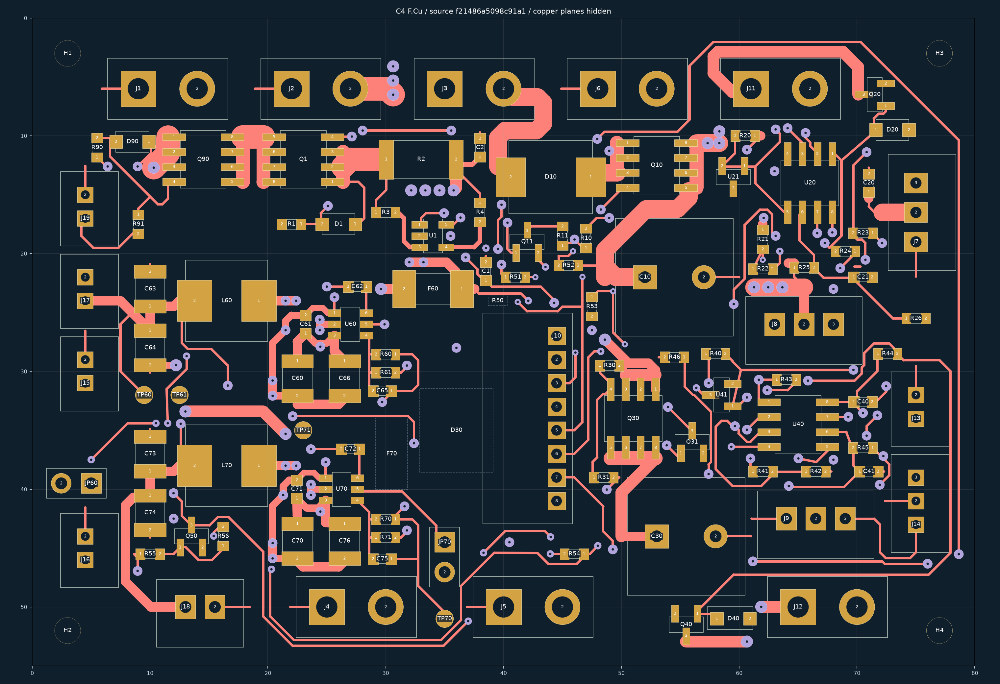
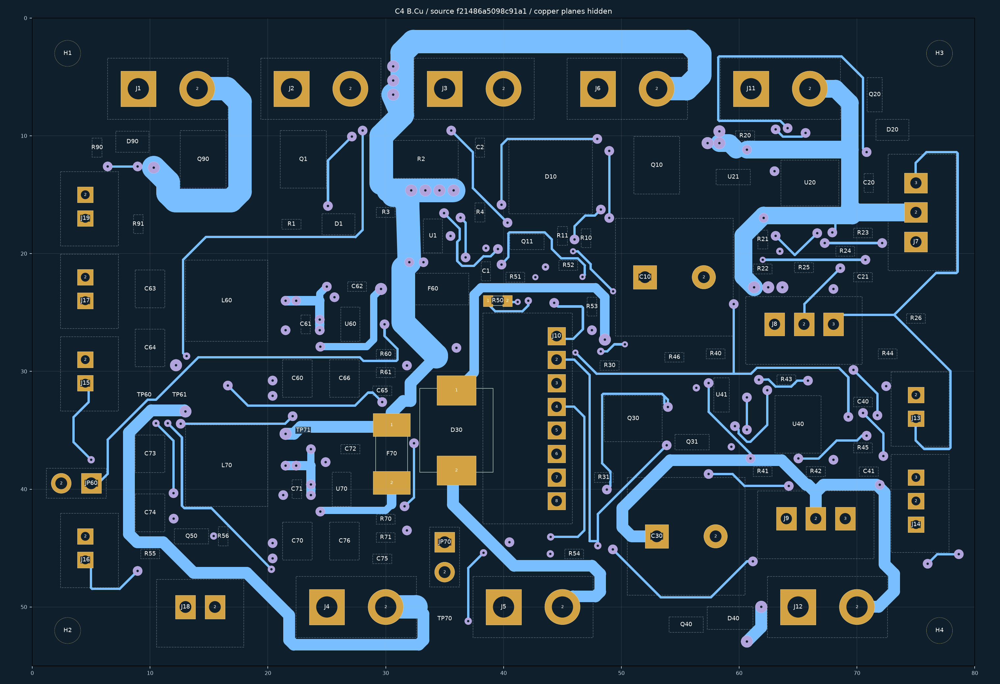

# J10 C3 视觉复核及 C4 独立候选

2026-10-03。**完成本页定义的绘图复核；C4 是独立 PROTOTYPE，正式四板没有替换。**

[C4 KiCad 工程](MORI_power_J10_C4_CANDIDATE/MORI_power_J10_C4_CANDIDATE.kicad_pro) · [PCB](MORI_power_J10_C4_CANDIDATE/MORI_power_J10_C4_CANDIDATE.kicad_pcb) · [39 条逐项意见](39_flag_dispositions.csv) · [检查报告](reports/invariants.json)

此前确实查看过 C3 正背面总览，但没有据此完成逐条意见闭合，不能将“看过图”和“逐线复核完”混用。这次复核 C3 全板正背面 12 个重叠放大分区、39 条提示的 25 个局部视图，并对 17 条历史分叉/重叠提示和 70 条自身外壳引出单独留记录。C4 的六处修改又逐张看了前后对比。**此范围只涵盖本次电源候选，不表示运动、后接口和 IMU 三板也在本轮重新复核。**

## 实际修改

| 对比图 | 网络与位置 | 处理 |
|---|---|---|
| [V01](images/V01_before_after.png) | CHG_N / J10 下方 | 去掉峰谷折返，改为平直通道 |
| [V07](images/V07_before_after.png) | CHG_N / 下板边 | 去掉过冲后返回的 V 形折点 |
| [V08](images/V08_before_after.png) | CHG_N / J15 下游 | 两段线改成精确同端点，清理铜边小凸出 |
| [V10](images/V10_before_after.png) | +5V_MOTION / L60 外侧反馈支路 | 消除局部上下折返，保留器件外侧通路 |
| [V11](images/V11_before_after.png) | BAT_ADC / Q11 与 R11 之间 | 以明确竖向段替代 0.2 mm 小偏移，保留跨面本体净空 |
| [V12](images/V12_before_after.png) | ARM_Q / R54 | 去掉 V 形凹口，支路在焊盘内汇合 |

共替换 23 段为 19 段，均是原本 **0.2 mm 的信号/反馈线**。总段数 862→858；147 个过孔、112 个封装、280 个焊盘、板框/孔位/朝向、网络、原理图电路及功率宽铜均不变。没有以细反馈线取代负载通道。另将 PCB 标题、复核链接和背面版本丝印标为 C4，避免与正式 P5R6 混淆。

## 提示逐项判断

39 条原提示：5 条对应已修正问题，24 条有具体几何理由保留，10 条是焊盘/过孔/宽铜内端点被当作外露折点的误报。多个 ID 可能描述同一短段，不能用提示数量充当独立缺陷数量。每条的网络、层、坐标、UUID、理由和图号都在 CSV 中；未按网络类型批量放行。

Q11、R60 邻边的两个 0.1×0.1 mm 转角是一次单向拐弯，仍保留。曾试放大倒角，但分别侵入 Q11/R60 本体投影，已撤回。R54 的直接三叉方案也触发用户规则 R27 的最小 60°接入角；最终改成焊盘内汇合。所有失败试改保留在 `reports/routing_changes.json`，没有增加忽略或改松规则。

摆放复核也考虑了替代朝向：R54 翻转会交换 ARM/GND 出口，当前焊盘内汇合已经清除凹口；R11/Q11 移位或旋转会改变相邻栅极回路；R60/L60 属本地 Buck 反馈与功率组，不为了单个小倒角扩大敏感回路。本轮采用可行的外侧通道，保留已交接的整体摆放。这是本次方案取舍，不能理解为所有摆放都已证明最优。

另更正一次检查中的误判：总览中一度以为 U41 的 H_REF 穿过本体。核对原生 Fab 和线宽后，所指线段最靠近边界的铜仍在右侧，间隔约 0.1875 mm；未据误判移动 U41。

## 可复核证据及边界

- KiCad **10.0.6** 原生 ERC=0、DRC=0、未连接=0、原理图差异=0、忽略项=0，命令与最终 PCB hash 在 `reports/FINAL_*`。
- 沿用用户 KiCad 项目规则的候选 `.kicad_dru` 与 C3 字节一致；R27、BODY/NETBODY 投影等继续生效，来源映射保留在工程目录 `rule_mapping.json`。
- 27 条关键负载路径在剔除细线后连通：PASS。这只检查铜路径，不证明温升或允许持续电流。
- 104 个器件中心线投影筛查未发现跨其他器件本体候选。70 条自身引出在 [逐条表](70_own_escape_dispositions.csv) 解释，包括连接器壳、径向电容和 D40 端部；同网不自动代表可穿本体。全铜宽禁布仍由原生 DRC 检查。
- [858 段原生清单](reports/after_all_segments.csv)、[17 条旧分支提示](17_legacy_branch_dispositions.csv)、[104 器件覆盖](104_component_coverage.csv)、[视觉记录](reports/visual_review_record.json) 都有明确范围。几何图隐藏铺铜，地过孔不因此被判开路。
- 正式工程 249 文件、C3 源均 hash 不变。C4 也没有合并 PHC1 孔径候选，没有生成 Gerber 或下单。

图中的焊盘角部做了显示简化；精确焊盘/丝印另见 KiCad 自身输出 [正面](native_review/front.svg)、[背面](native_review/back.svg)。这些是审阅文件，不是制造文件。

实际接插件、F70 背面高度/温升、线根弯折与带线拆装、JP70/TP71 装机维护路径等沿用 A6 的未闭合项。物理与通电均 **NOT_TESTED**；制造发布 **BLOCKED**。本报告不是用户视觉批准，也不是所有工程资格认证。

最终 PCB SHA-256：`f21486a5098c91a191b191adfac81cd88d05b975d01ca167c5656eba2ccbe82f`。

复查命令：KiCad 自带 Python 分别运行 `final_checks.py native`、`audits`、`invariants`；显示图由 `render_review.py` / `render_final.py` 生成。`refine_candidate.py` 是保留试改记录的候选编辑脚本，不能对正式板盲目批量执行。
