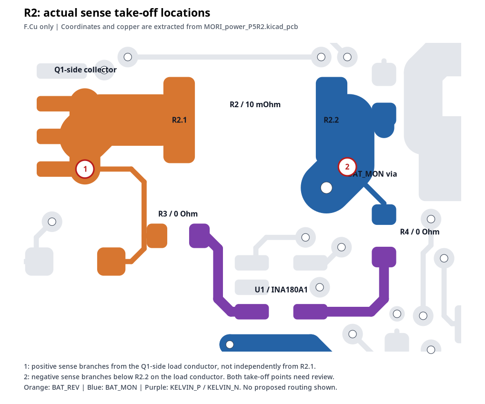
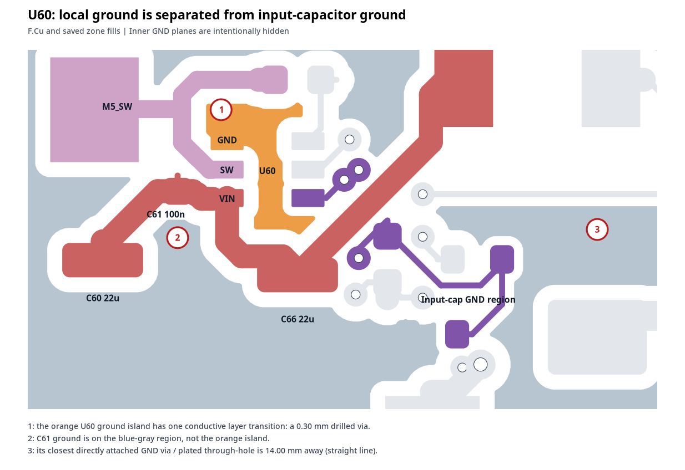

# MORI P5R2 · PCB 源文件布局审查

**审查对象：运动控制板 + 电源板｜版本：V1.2-H0.5-P5R2｜审查日期：2026-09-24**

> 结论：运动板保留整体布局，做局部整改；电源板优先重整 R2 的取样连接和两路 TPS54302 的局部地回流。主功率单孔换层应根据实际电流重新校核或加强。原始 PCB/原理图没有修改。

## 1. 范围与验证边界

输入为 MORI_motion_P5R2.kicad_sch、MORI_motion_P5R2.kicad_pcb、MORI_power_P5R2.kicad_sch、MORI_power_P5R2.kicad_pcb 四个文件。

本次直接解析了原理图中的符号、引脚、导线和网络标签，以及 PCB 中的焊盘、线段、过孔、叠层与**已保存的铺铜填充**；使用自定义几何/拓扑脚本核对连接。圆弧边界以多边形近似，焊盘几何按文件定义处理。

**没有运行 KiCad 10 原生 DRC/ERC，没有重新填充铜区，也没有进行热仿真、信号完整性仿真、实物测试或完整元器件引脚定义审计。** 未收到 `.kicad_pro`、`.kicad_dru` 及项目说明中的例外清单，无法复现项目全部制造规则、特殊规则及豁免。本报告不能代替制造签核。

| 源文件统计 | 运动控制板 | 电源板 |
|---|---:|---:|
| Edge.Cuts 尺寸 | 70 × 35 mm | 80 × 55 mm |
| 铜层数 / 板厚 | 4 / 1.6 mm | 4 / 1.6 mm |
| 外层铜厚，文件设定 | 35 μm | 70 μm |
| 内层铜厚，文件设定 | 35 μm | 35 μm |
| In1.Cu | GND | GND |
| In2.Cu | +3V3 | GND |
| 封装数量，含安装孔 | 53 | 112 |
| 铜走线段数量 | 455 | 807 |
| 过孔数量 | 96 | 130 |
| 原理图与 PCB 物理引脚网络映射 | 210 个，一致 | 276 个，一致 |

原理图中 3 个 / 7 个电源标记为原理图专用对象，不作为缺失 PCB 焊盘错误。自定义检查未发现异网铜几何重叠、阈值 0.10 mm 以下的异网铜间距，或已保存铺铜中同网焊盘的分离连接组。**0.10 mm 是本次探测阈值，不是确认后的制造规则；“未发现”不表示完整 DRC 已通过。**

## 2. 电源板 PWR-01：R2 两侧均未独立从分流电阻焊盘取样

**建议：投板前修改。置信度：高，源文件路径确认。**

R2 的值是 `WSL2512R0100FEA 10mR 1% 1W`，位于 (33.00, 12.00) mm。U1 为 INA180A1IDBVR。原理图明确写着“Sense from the shunt pads”，但实际 PCB 取样点没有遵循这一要求。

| 路径 | 实际取样点与走向 | 需要调整的部分 |
|---|---|---|
| 正端：R3 → KELVIN_P → U1.3 | BAT_REV 的 0.20 mm 支线从 (26.375, 13.905) 分出；这里位于 Q1 侧的载流铜上 | R3.1 应独立从 R2.1 的合适取样位置引出 |
| 负端：R4 → KELVIN_N → U1.4 | BAT_MON 的 0.20 mm 支线从 (36.576, 13.8176) 分出；这里已经在 R2.2 外的载流路径上 | R4.1 应独立从 R2.2 的合适取样位置引出 |

R2 焊盘中心分别为 (30.0375, 12.0000) 与 (35.9625, 12.0000) mm。正端取样包含了 Q1 侧铜连接的压降，负端也未从焊盘独立引出。R3/R4 之后的 KELVIN_P/N 网络较短，并不能消除取点之前的共用铜阻误差。

**整改要求：**让两路采样分别从 R2 两端的合适焊盘位置独立引出，再经 R3/R4 到 U1；结合电阻厂家建议确定取点；两路尽量短、靠近、对称。不要在粗电源铜的远端、主电流过孔附近取样。

示例仅用于说明敏感性：10 mΩ 分流电阻若额外包含 1 mΩ 的载流铜阻，比例误差约为 10%。这不是本板实际误差估计。TI 的 Kelvin 布局资料明确指出，应从分流电阻焊盘独立取样，而不是从大电流导体上分支。[参考 1]

## 3. 电源板 PWR-02：两路 5V 的局部地回流比 FB 绕线更值得优先修改

**建议：投板前局部重排。置信度：高，基于保存铜区的连接拓扑。**

U60、U70 均为 TPS54302DDCR。它们并非缺少输入电容：每路已有 22 μF 电容和 100 nF 小电容。问题在于地端的连接方式。

| 项目 | U60 / 运动 5V | U70 / 相机 5V |
|---|---|---|
| IC 中心 | (25.00, 26.00) | (25.00, 40.00) |
| GND 引脚焊盘中心 | (23.65, 25.05) | (23.65, 39.05) |
| IC 顶层局部地岛的唯一层间连接 | (23.45, 24.00)，外径 0.60 / 钻孔 0.30 mm | (24.00, 38.00)，外径 0.80 / 钻孔 0.30 mm |
| 100 nF 输入电容 | C61 | C71 |
| 100 nF 电容地端与 IC 地是否属于同一块顶层连续铜 | 否 | 否 |

C61 的地端属于另一块大面积顶层 GND 铜区。该铜区与内层之间最近的直接过孔/通孔焊盘连接，距离 C61 地焊盘中心约 **14.00 mm**，位于 (36.00, 28.00)。C71 地端的对应最近连接为 J4.1 通孔焊盘，直线距离约 **8.29 mm**。

这些数值是**同一顶层铜区上的实际导电层间连接点的直线距离**，不是求解得到的高频电流路径长度。它们说明“旁边看得见过孔”不等于“该电容地端就近接入了内层地”。

内层 GND 本身连续，但不能消除电容到内层接入点的局部绕行。U60 的地端附近虽然有 0.20 mm 线段，但同时存在并联铺铜，因此**不能简单声称全部电流都只经过那条 0.20 mm 细线**；真正确定的问题是局部地岛与输入电容地之间缺乏紧凑的返回连接。

**整改要求：**按 TPS54302 的参考布局重组 U60/U70、主要输入陶瓷电容、100 nF 电容和地连接；先形成短、宽、紧凑的 VIN—输入电容—GND 高频回路，再布 SW、电感、输出电容、反馈网络。输入电容地和 IC 地应就近接入内层地，反馈下臂返回芯片参考地，避免与噪声电流共用狭窄路径。不要通过随意分割内层地来“解决”。TI 数据手册要求足够的电容过孔、低阻抗地连接、小反馈节点及反馈地 Kelvin 返回。[参考 2]

## 4. 电源板 PWR-03：主功率路径中的单孔换层

**建议：必须结合电流校核；优先改善总线和轮部母线换层。不是已证实的过热故障。**

对铜连接图暂时移除下列过孔后，同一网络的相关功率焊盘会分成两组，说明该位置没有其它板内并联铜通路。判断不是只看截图中的圆点数量。

| 网络 | 过孔中心，mm | 外径 / 钻孔，mm | 该单孔连接的支路 |
|---|---|---|---|
| BAT_MON | (35.7632, 14.6304) | 1.00 / 0.45 | R2.2 后的主要负载分配 |
| BAT_MON | (30.6324, 6.5024) | 1.00 / 0.45 | J2.2，外部轮部降压输入 |
| BAT_MON | (32.0040, 20.7264) | 0.80 / 0.30 | F60.1，运动 5V 输入支路 |
| W_VM | (58.3184, 10.6172) | 1.00 / 0.45 | Q10 / C10 与轮部供电输出侧之间 |
| W_VM | (61.2648, 22.8600) | 1.00 / 0.45 | J8.2，右轮供电支路 |

电源板两个内层都是 GND，因此这里不存在未显示出来的 BAT_MON / W_VM 内层电源面替它们分担电流。

必须按实际持续/峰值电流、孔铜厚度和允许温升校核，不应只用“外层 2 oz”和“粗线 2 mm”作为通过依据。可以优先取消不必要换层，或设置就近的同网并联过孔与宽阔连接铜。**孔数不能在缺少电流、孔铜和温升预算时机械指定。**[参考 3]

对上一轮截图判断的修正：PACK_FUSED 可见的大过孔之外，源文件中还有另一条通过相邻小过孔的并联连接，不应把它简单列为“确认只有一个过孔”。此外，一些电源网络过孔只承载反馈/检测支路，不应误判为整路负载电流瓶颈。

## 5. 电源板 PWR-04：反馈布线随电源单元一起优化

M5_FB 的线段中心线总长约 **14.55 mm**，有 **3 颗物理过孔**；其中两颗相邻，不能把数量等同于三次信号换层。C5_FB 总长约 **9.16 mm**，没有过孔。

这些长度按整个网络的线段求和，可能含支线，不代表任意两点间唯一电气长度。建议重排局部电源单元时，一并收紧 R60/R61/C65、R70/R71/C75 与相应 FB 引脚的关系，缩小高阻节点，单独引出输出取样，避开 SW 噪声区。[参考 2]

优先级低于 PWR-02 的输入高频回流问题；不是两路都必须用相同方式重绕。

## 6. 运动板：保留结构，纠正截图阶段的过度怀疑

运动板 In1 为 GND、In2 为 +3V3；两个内层的保存铺铜各形成一个连续区域。上一轮“中央走线可能把地切碎”的结论只能用于提醒检查外层回流，不能据此认定没有完整地平面。

### MOT-01：IMU 的源端串阻已存在

| 信号 | 已有源端电阻 | 主控排针到串阻的网络线段总长 | 串阻后网络线段总长 | 串阻后物理过孔 |
|---|---|---:|---:|---:|
| SCK | R10 = 33 Ω | 3.66 mm | 43.61 mm | 2 |
| MOSI | R11 = 33 Ω | 3.12 mm | 33.65 mm | 2 |
| CS | R12 = 33 Ω | 5.52 mm | 43.21 mm，含分支 | 2 |

MISO 网络约 39.94 mm、0 过孔；DRDY 约 39.99 mm、2 过孔。当前没有依据要求增加一套源端串阻或为了外观做蛇形等长。改板时可以缩短明显绕行，但最终还需要结合 IMU 线束长度、SPI 时钟、GPIO 边沿设置和接收端波形验证。

底层邻近的参考平面是 +3V3，而非 GND。信号跨层时需要考虑参考面的转换与本地 +3V3/GND 去耦；不能把所有参考转换问题都归结为“多打一颗 GND 过孔”。这属于需要结合信号边沿和线束条件评估的优化项，不据此要求重做整板叠层。

### MOT-02：总线位置可优化，ESD 保护应按线束使用场景补充

S288_BUS 网络线段总长约 31.45 mm / 1 过孔；HEAD_BUS 约 52.90 mm / 3 过孔。头部缓冲器 U2 与 R2 可在不破坏电源、地与逻辑输入关系的前提下向 J3 靠近，以减少输出总线绕行。

本次核对元件值和网络后，未见运动板外部数据接口的专用 ESD/TVS。D1/D2/D3 为 BAT54，连接在复位/锁存清除相关网络中，并不是总线 TVS。若接口用于可接触、热插拔或较长线束，建议在连接器处预留并选配适当的低电容保护；若完全封闭且只用短内部线束，则应按实际场景评估风险。保护器件接地应短，位置靠近接口，避免长支线。[参考 4]

### MOT-03：已有滤波和底面器件不要重复“补设计”

ADC 输入已有 R14/R15/R16 = 1 kΩ，C9/C10/C11 = 10 nF。多个逻辑 IC 旁已有 100 nF 去耦。多数逻辑器件和无源件在 B.Cu、主控模块和接口在 F.Cu，所以不能仅依据顶视叠加图认定模块底部必然碰撞；仍需实际 3D 模型检查模块背面、载板底面与机壳的间隙。

## 7. 两板共同 DFM-01：全局锡膏开口 +0.05 mm

两块板均设置 `pad_to_paste_clearance 0.05`，没有查到封装或焊盘级锡膏缩放覆盖。运动板 U1–U5 的 DCU 封装为 0.50 mm 间距、0.85 × 0.30 mm 铜焊盘。

在没有其它项目级规则覆盖时，开口包络约扩大至 **0.95 × 0.40 mm**，同排相邻开口间隙约 **0.10 mm**。按矩形包络估算，面积扩大约 49%；实际圆角面积略有不同。

这是 **Paste/锡膏层**，不是 Mask/阻焊层，两者不能混用同一经验值。KiCad 的正绝对锡膏间隙会扩大开口，负值缩小开口。[参考 5]

建议在生成钢网前与贴片厂确认：取消未经验证的统一正扩张，使用厂家推荐或经工艺确认的封装级开口，并检查实际导出的 F.Paste/B.Paste。这里不等于认定必然桥连，也不预设所有封装必须统一负扩张。

## 8. 接口、机械与规则检查

### 8.1 两板对接网络映射

| 运动板 | 电源板 | 映射检查结果 |
|---|---|---|
| J1 | J17 | 1 = +5V_MOTION，2 = GND |
| J2 | J13 | 1 = S288_BUS / W_BUS，2 = GND |
| J3 | J14 | 1 = HEAD_BUS / H_BUS，2 = GND，3 = NC |
| J7 | J10 | 1 = +3V3；2 = ARM_Q；3 = FAULT_N；4 = CHG_N；5 = BAT_ADC；6 = WHEEL_ADC；7 = CURRENT_ADC；8 = GND |

运动板 ADC 接口网络带 `_IN` 后缀，是经过本板 RC 前的命名，不是接错网络。上述检查假定线束按针号一一对应；不代表从两个插头外观左到右观察就一定同序。

### 8.2 机械文档过期

电源板原理图文字仍写“80 x 45 mm PCB”，实际 Edge.Cuts 为 80 × 55 mm。需要同步机壳、固定孔和线束空间文档。它是文档/机械一致性问题，不是铜网短路。

### 8.3 自动生成的禁布区值得复核

运动板 207 个规则/禁布区、电源板 431 个，另各有 4 个实际铜区。其中大量 `BODY_*_OPPOSITE` 禁止在器件相反面布线/打孔，但允许铺铜。建议结合真实机械、电气和制造约束逐项确认，避免不必要的限制强迫走线绕行。**不能把所有规则区都当成地平面开槽，也不要在缺少项目规则说明时一键删除。**

## 9. 修改与验收顺序

| 顺序 | 项目 | 验收要点 |
|---|---|---|
| 1 | PWR-01 R2 取样 | 从两个分流焊盘独立取样；不包含载流铜段 |
| 2 | PWR-02 两路 5V 局部布局 | 输入电容与 IC 地形成紧凑回路；就近返回内层地；FB 参考返回明确 |
| 3 | PWR-03 功率换层 | 有实际电流/孔铜/温升依据；主电流不依赖未经验证的单孔连接 |
| 4 | DFM-01 锡膏开口 | 按实际封装和钢网确认，检查最终 Paste 输出 |
| 5 | PWR-04 / MOT-01 / MOT-02 | 收紧反馈与明显绕行；按线束场景处理 ESD |
| 6 | 原生 DRC/ERC、铺铜、装配与实测 | 用完整工程重新填铜、跑规则，负载与瞬态测试后再签核 |

改后应测量两路 5V 的启动、稳态纹波和负载瞬态，验证轮/头执行器动作及制动期间的母线、采样、通信和温升。DUMP 支路的 MOSFET/电阻脉冲能量和母线电容能力尚未完成负载条件下的签核；本次不据截图判定它们必然失效。

## 10. 外部技术依据

1. Texas Instruments，*Shunt Resistor Layout Considerations*，Kelvin good/bad layout 与取样路径示例：<https://www.ti.com/content/dam/videos/external-videos/en-us/4/3816841626001/6076326896001.mp4/subassets/current-sense-amplifiers-shunt-resistor-layout-presentation-quiz.pdf>
2. Texas Instruments，*TPS54302 Datasheet*，SLVSDG6C，2026-03，§7.4 和 Figure 7-16：<https://www.ti.com/lit/ds/symlink/tps54302.pdf>
3. Texas Instruments，*Best Practices for Board Layout of Motor Drivers*，SLVA959B：<https://www.ti.com/lit/an/slva959b/slva959b.pdf>
4. Texas Instruments，*ESD Protection Layout Guide*：<https://www.ti.com/lit/an/slva680b/slva680b.pdf>
5. KiCad 10，*PCB Editor Manual*，锡膏间隙和规则设置：<https://docs.kicad.org/10.0/en/pcbnew/pcbnew.html>

板上数值、坐标和拓扑结论来自上述四个用户提供的源文件及随报告附带的静态分析结果，外部文档用于解释布局原则，不是本板实测数据。
