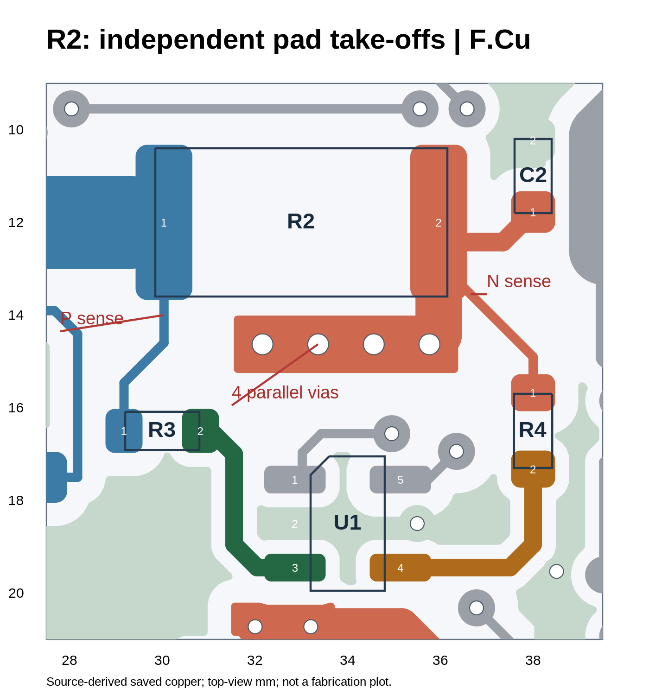
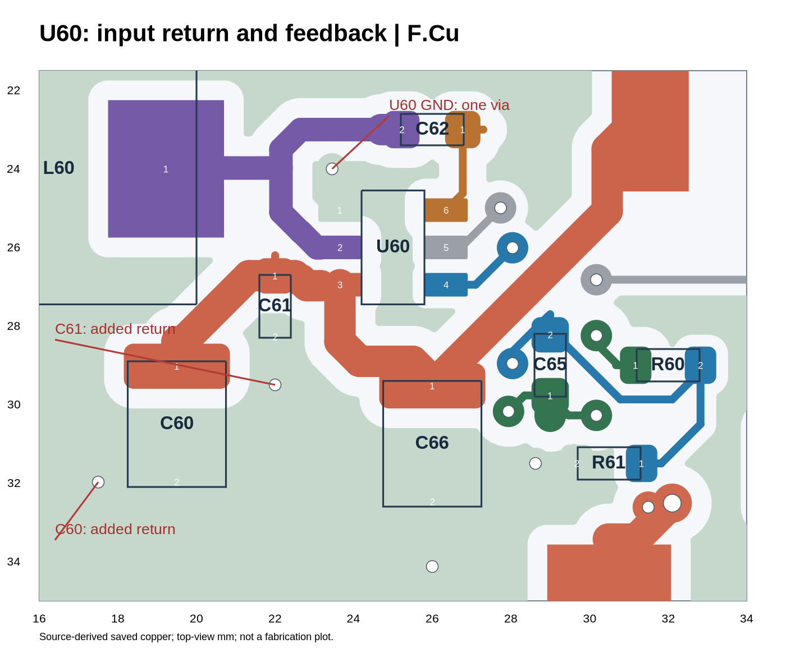
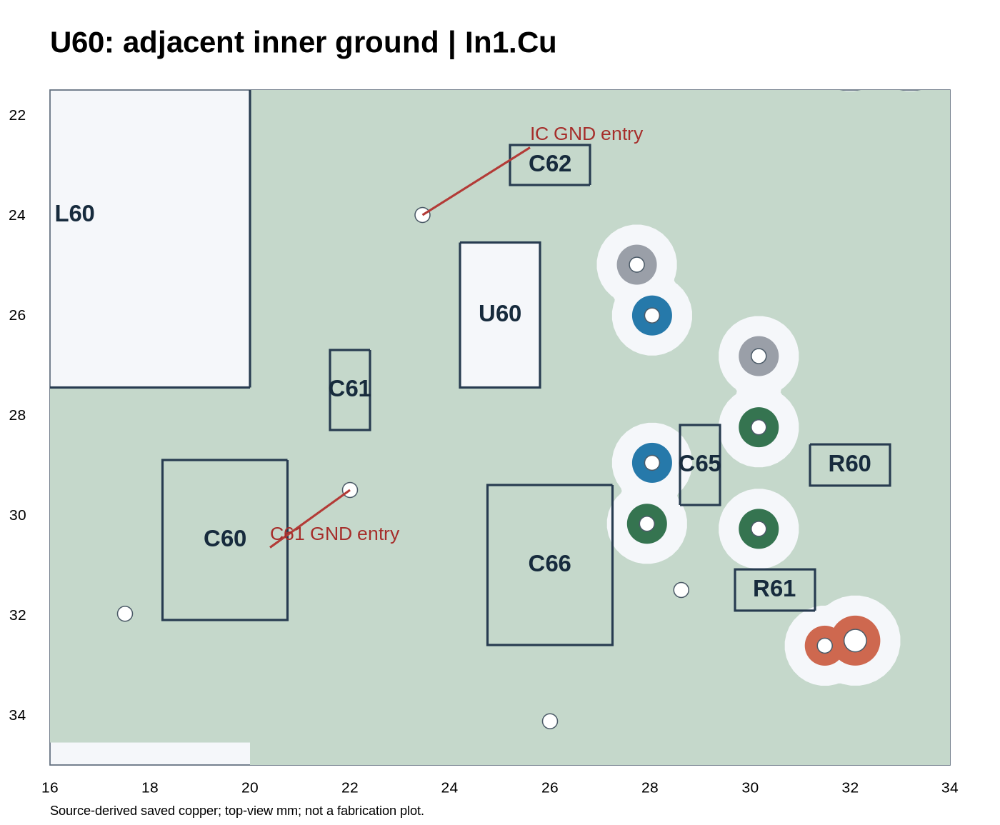
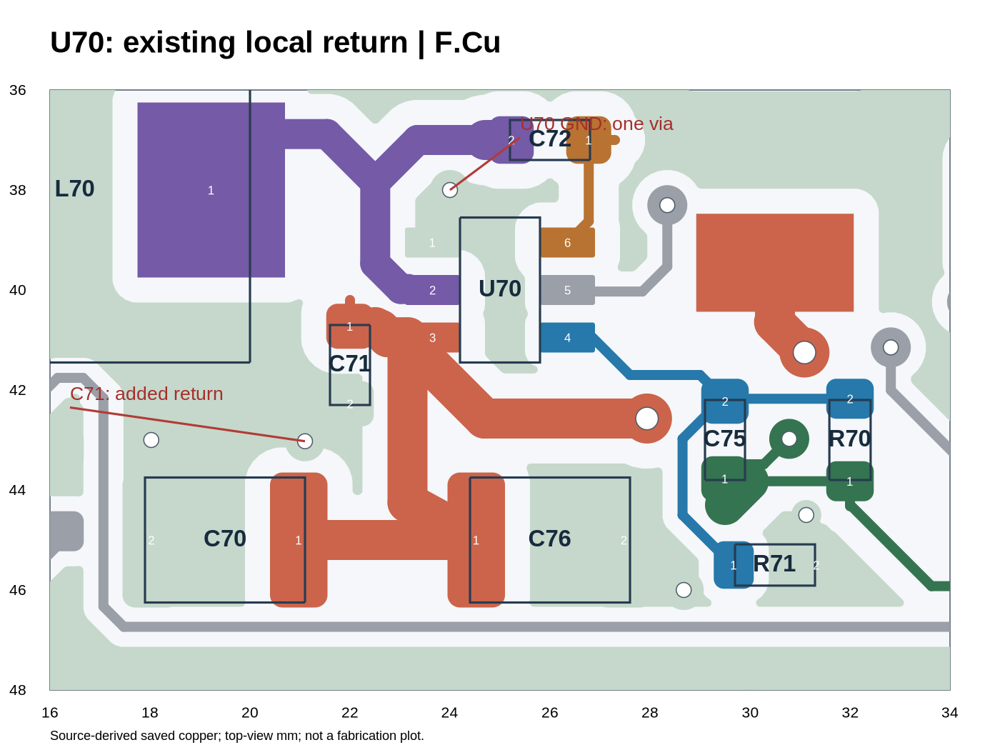

# MORI P5R3 电源板／运动板 Layout 复核

**对比基准：P5R2 → P5R3｜审查日期：2026-09-24｜未修改原始设计文件**

## 结论

P5R3 的电源板有实质改善：R2 的采样引出点已移回电阻焊盘，五处主功率单孔换层已增加有效并联通道，输入电容的本地接地已改善。两块板都取消了全局 +0.05 mm 锡膏扩张，电源板原理图的板框尺寸文字也已更正。

仍建议把 U60/U70 两个降压单元做一轮局部优化：这次没有移动它们的器件，芯片 GND 仍各自只有一颗通孔连接外部地，反馈网络也仍分散。**不需要重画整板，也不需要重做已经正确的 Kelvin 和功率过孔阵列。**

运动板不是重新布局版：455 段走线、96 颗过孔及保存的铜区几何完全未变，主要修改是锡膏参数和说明。可以保留目前铜布局，补齐接口丝印并完成工程规则、实际线束和装配验证。

## 1. 检查边界与方法

已检查：上传的两套 P5R3 PCB／原理图，与同一会话中的 P5R2 逐项比较；元件和引脚网络；走线、过孔、焊盘及保存的填充铜区的近似几何连接；五处功率换层的有效并联性；降压电容地与芯片地的局部连接；可见丝印文字。

**未运行 KiCad 10 原生 DRC/ERC；没有重新填铜；未提供 .kicad_pro／.kicad_dru；没有热仿真、SI 仿真和实物测试。** 近似几何模型不等同于板厂 DFM，也不验证封装厂商尺寸、内部芯片行为或核心板本体的真实电气网络。铜间距的 0.15 mm 扫描只是本次检查阈值，不是替用户确定的制造规则。

| 项目 | 运动板 P5R2 → P5R3 | 电源板 P5R2 → P5R3 |
|---|---:|---:|
| 封装数量 | 53 → 53 | 112 → 112 |
| 走线段数量 | 455 → 455 | 807 → 816 |
| 过孔数量 | 96 → 96 | 130 → 145 |
| 元件位置／旋转变化 | 0 | 0 |
| PCB—原理图引脚编号映射 | 210 个，无不一致 | 276 个，无不一致 |
| 本次模型内异网铜重叠 | 0 | 0 |
| 本次模型内同网焊盘分离组 | 0 | 0 |

电源板新增 22 段、删除 13 段走线；新增 16 颗、删除 1 颗过孔，另将 U60 GND 过孔的外径由 0.60 改成 0.80 mm。新增的 16 颗过孔包括 10 颗功率网络过孔及 6 颗 GND 过孔。运动板五个 IC 的 footprint 描述文本变化，不代表位置或铜形状变化。

## 2. 整改闭环

| P5R2 问题 | P5R3 核验 | 结论 |
|---|---|---|
| R2 正、负采样从载流铜中途取出 | 已分别从 R2 两个焊盘内独立引出 | 原问题已修正 |
| 五处主功率单孔换层 | 变为 4／3／2／3／3 颗有效并联过孔 | 拓扑已改善，载流仍需实测／计算 |
| 输入电容地绕远处换层 | 已增加本地过孔与明确铜连接 | 明显改善 |
| U60/U70 芯片地局部小岛 | 仍各自仅一颗 0.30 mm 钻孔过孔连接 | 未完成整体回路优化 |
| FB 网络分散、绕行 | 未移动电阻／电容；M5_FB 少一孔但总长略增 | 仍建议局部重排 |
| 全局 Paste +0.05 mm | 两板已取消，未发现封装／焊盘覆盖扩张 | 原问题已修正，钢网仍需工艺确认 |
| 电源板原理图写 80×45 mm | 已改为 80×55 mm | 已修正 |
| 接口文字丝印不足 | 运动板无可见文字；电源板仅 16 个 +/− | 下单前补齐 |

## 3. R2 的取点：已修正

R2 中心仍在 (33.0000, 12.0000) mm，焊盘中心分别在 (30.0375, 12.0000) 与 (35.9625, 12.0000) mm。两端都是 1.225 × 3.350 mm 铜焊盘。

正端从 (30.0375, 13.3500) 以 0.20 mm 独立引出，经过 (30.0375, 14.6000)、(29.1750, 15.4625) 到 R3.1；负端从 (36.4500, 13.3500) 以 0.20 mm 引出，经过 (38.0000, 14.9000) 到 R4.1。它们均在电阻焊盘内部取样，原先来自 Q1 侧和 BAT_MON 载流主干的错误支路已解除。

定位：MORI_power_P5R3.kicad_pcb 第 38416–38463 行、34656–34663 行、34712–34719 行。示意图是保存铜区的分层渲染，不是修改建议中的虚构铜线。

这满足独立焊盘取样的核心原则 [S1]，但不能据此保证零误差：两端焊盘、焊接、分流电阻自身公差和放大器误差仍需纳入测量误差预算。不要为追求外观对称而重新把采样线并入粗电源铜。

## 4. 五处功率换层：新增过孔确实有效

本次不仅统计网络名，还检查每组过孔在 F.Cu 与 B.Cu 两侧是否进入同一连续导体。下列组内新旧过孔确实构成并联，不是只有相同网络名的孤立圆孔。

| 网络与位置 | 原换层中心 mm | P5R2 | P5R3 | 外径／钻孔 mm |
|---|---|---:|---:|---|
| BAT_MON 主分配 | (35.7632, 14.6304) | 1 | **4** | 1.00／0.45 |
| BAT_MON → J2 | (30.6324, 6.5024) | 1 | **3** | 1.00／0.45 |
| BAT_MON → F60 | (32.0040, 20.7264) | 1 | **2** | 0.80／0.30 |
| W_VM 主干 | (58.3184, 10.6172) | 1 | **3** | 1.00／0.45 |
| W_VM → J8 | (61.2648, 22.8600) | 1 | **3** | 1.00／0.45 |

R2 下方四孔为 x=32.1632、33.3632、34.5632、35.7632，y=14.6304；J2 三孔为 x=30.6324，y=4.1024、5.3024、6.5024。

在模型中移除这五处原始过孔的任意单颗，不再造成相应主功率焊盘组断开。具体全部坐标与检查结果见 targeted_metrics.json 和 power_geometry.json。

**并联数量增加，不等于已经核准额定电流。** 主分配、单轮与相机 5V 的持续／峰值电流不同，铜厚、孔铜、铜颈、焊盘和连接器限制仍需一起检查 [S3]。R2.2 到阵列之间还有 1 mm 宽的短颈，不能只看阵列有四孔就跳过这个截面。不要用任意固定“每孔 1 A”代替计算，也不用把所有仅通向电阻／比较器的单孔信号支路都机械改成三孔。

## 5. 输入电容接地明显变好，但降压芯片侧还未完成

### 5.1 电容侧改善

下面是**电容地焊盘中心到同一顶层连续铜区内最近有效层间连接点的直线距离**，不是高频电流传播距离或回路电感仿真。

| 节点 | P5R2 | P5R3 | 当前最近连接点 mm |
|---|---:|---:|---|
| C61.2，100 nF | 14.003 mm | **1.225 mm** | (22.000, 29.500) |
| C60.2，22 μF | 15.292 mm | **2.000 mm** | (17.500, 31.975) |
| C66.2，22 μF | 10.956 mm | **1.650 mm** | (26.000, 34.125) |
| C71.2，100 nF | 8.287 mm | **1.172 mm** | (21.100, 43.025) |
| C70.2，22 μF | 5.601 mm | **2.000 mm** | (18.025, 43.000) |

R61.2 也新增了 (28.625,31.500) mm 附近的接地连接。这些修改与已有顶层地铜相连，是真实改善，不能继续沿用上一轮“电容地端需要绕十几毫米”的结论。

### 5.2 芯片侧保持原有单通道

| 芯片 | 芯片 GND 引脚中心 mm | 其顶层局部地铜唯一换层点 mm | 外径／钻孔 mm |
|---|---|---|---|
| U60 | (23.650,25.050) | (23.450,24.000) | 0.80／0.30 |
| U70 | (23.650,39.050) | (24.000,38.000) | 0.80／0.30 |

单独移除对应过孔，模型中 U60.1 或 U70.1 就与其他地焊盘组分离。输入电容地和芯片地仍不在同一顶层局部导体中；高频回流仍要经电容过孔、内层铜和芯片端唯一过孔返回。

**这不是断地，也不是“出现一颗 0.3 mm 孔就必然不合格”。** 是否满足温升与噪声目标仍与负载和寄生参数有关。但从设计改进目标看，这次做的是电容侧补孔，还不是对完整输入开关回路的重排。

U60 过孔外径由 0.60 增至 0.80 mm，钻孔仍为 0.30 mm；这个变化改善焊环／平面接触的几何裕量，不足以据此宣称孔筒载流能力按外径比例提高。

### 5.3 建议怎样改

仅移动 U60/U70、C60/C61/C66、C70/C71/C76 及相应反馈元件这一小片区域，按 TPS54302 的官方示例安排输入电容、VIN、GND 和 SW 的先后关系 [S2][S4]。需要同时安排 VIN 侧与 GND 侧，不是只缩短一根正极线。

当前 U60 的 SW 走线位于输入电容与芯片 GND 的邻近区域。可以根据官方示例调整 SW 出线路径／层、输入电容朝向与芯片周围空间，为输入回路留出短而低阻抗的返回。选择地过孔数量与位置时，应结合铜厚和实际电流，不给任意统一数量。不要为了“地连续”而让开关电流从敏感芯片下方穿行。

现存 P5_BUCK_RETURN_AVOID_U60/U70 内层禁布区也应与新回路一起审视。TI 对开关电流位置有明确要求，但不能只看规则区名字就认定当前整片禁铜是最优。按实际电流路径决定保留或调整，**不要无条件删除全部禁铜区**。

## 6. 反馈器件尚未收紧

本次没有移动 R60/R61/C65、R70/R71/C75。位置分别仍为：R60=(32,29)、R61=(30.5,31.5)、C65=(29,29)；R70=(32,43)、R71=(30.5,45.5)、C75=(29.5,43) mm。

| 网络 | P5R2 线段总长 | P5R3 线段总长 | 过孔变化 |
|---|---:|---:|---|
| M5_FB | 14.547 mm | **15.047 mm** | 3 → 2 |
| C5_FB | 9.159 mm | **9.159 mm** | 0 → 0 |

这里是网络全部走线段中心线总和，包含分支；不是某两点间传播长度，也不构成“超过某个毫米数就必然失效”的判据。减少一个过孔是有益的，但没有解决反馈高阻节点分散的问题。

建议把分压和前馈电容移到 FB 附近，降低高阻节点面积，并按厂商要求把反馈下端以安静路径返回芯片 GND。独立 VOUT 取样线可以跨越一定距离，而 FB 分压之后的高阻节点应尽量短；**不要把长 VOUT 取样线与长 FB 节点混为一谈** [S2]。

## 7. 运动板的实际变化

逐项比较后，P5R3 运动板 455 条铜线、96 颗过孔、全部铜区和元件位置没有变化；原理图的电气内容也没有变化。仅修改版本说明、五个 DCU 封装描述及全局锡膏设置。

所以，上一轮已经认可的 IMU 源端 R10/R11/R12、独立 In1 GND 和总体接口分区不必重做。此前关于 HEAD_BUS 绕行、外部接口 ESD 的建议仍属于原样未处理的建议，不能说这轮已经新增保护或缩短总线，也不必在内部短线束场景下一律强制加 TVS。应在实际线束、电机工作及热插拔使用条件下决定。

## 8. 钢网、丝印和机械文件

### 钢网

两块板 setup 均已取消 pad_to_paste_clearance=0.05，且未发现 footprint／pad 的 solder_paste_margin 或 ratio 覆盖。按 KiCad 10 默认 0 扩张，运动板 0.85×0.30 mm 焊盘的 Paste 包络回到该尺寸，同排 0.50 mm 间距下的开口间隙从约 0.10 mm 回到约 0.20 mm。[S5]

这是撤销无依据扩张，不代表自动完成钢网厚度、面积比和印刷工艺验证。不要再批量施加固定正扩张或固定负扩张来“优化所有器件”。

### 实际可见丝印文字

本次遍历 F.SilkS/B.SilkS 的未隐藏文字：运动板为 **0**；电源板为 **16**，均是连接器的 + 或 − 符号。大部分 Reference 均设置 hide yes，Value 多数在 Fab 层且隐藏。编辑器截图显示的网络名、焊盘编号和 J/U/R 标识不能当作最终制造丝印。

投板前建议至少补：板名／版本、连接器编号与用途、输入／输出电压、Pin 1 和 GND，关键测点标签。DUMP 接口应标出 DUMP_D／VM 等功能；它的开关耗能节点不能只凭“−”被当成常态 GND。不要把全部隐藏位号简单打开造成重叠；以接口和调试关键器件为主。

### 机械说明

电源板原理图第 250 行已由 80×45 mm 改为 **80×55 mm**，与板框一致。安装孔、核心板插接高度与实际线束弯折空间仍需装配验证。

## 9. 建议验收流程

先完成两个降压单元的局部重排与接口丝印；然后在完整工程中重新填铜并运行原生 DRC/ERC，特别检查新增铜区、异网间距、过孔焊环、孔边距、阻焊桥及装配间隙。所有豁免要有逐条依据，不以批量忽略清空报错。

实际样板测试至少覆盖：各 5V 支路预期负载范围与负载阶跃；输入最低／标称／最高电压；电流采样在多个已知电流点的比例与零点；执行器启动、换向与制动时的母线及联锁行为；主电流连接、分流电阻、MOSFET、整流二极管的温升；运动板在最终 IMU／舵机线束上的通信可靠性。测试电流必须取自实际预算，不把芯片标称最大输出能力当成这块板的连续额定输出。

最终判断：**保留已经完成的 R2、功率孔阵列与 Paste 修改。电源板下一轮仅聚焦 U60/U70；运动板以丝印、工程规则和实物验证收尾。**

## 10. 原厂依据

[S1] TI Precision Labs, Shunt Resistor Layout Considerations：独立焊盘取样与载流铜压降。

[S2] TI TPS54302 数据手册 Rev. C，7.4 Layout：输入／输出电容、低阻抗 GND、反馈 Kelvin 返回与 FB 节点。

[S3] TI SLVA959B, Best Practices for Board Layout of Motor Drivers，3 Vias：并联过孔与电流进入／离开位置。

[S4] TI SLVUAP9B, TPS54302EVM-716 User’s Guide，3 Board Layout：输入电容及反馈靠近芯片的参考布局。

[S5] KiCad 10 PCB Editor 文档，Solder Mask/Paste：全局开口扩张与局部覆盖规则。

本报告的 mm 坐标均为原始 PCB 坐标，不是图片像素。附图为本次分析的保存铜区渲染，不能用作 Gerber 或替代最终制造层输出。
