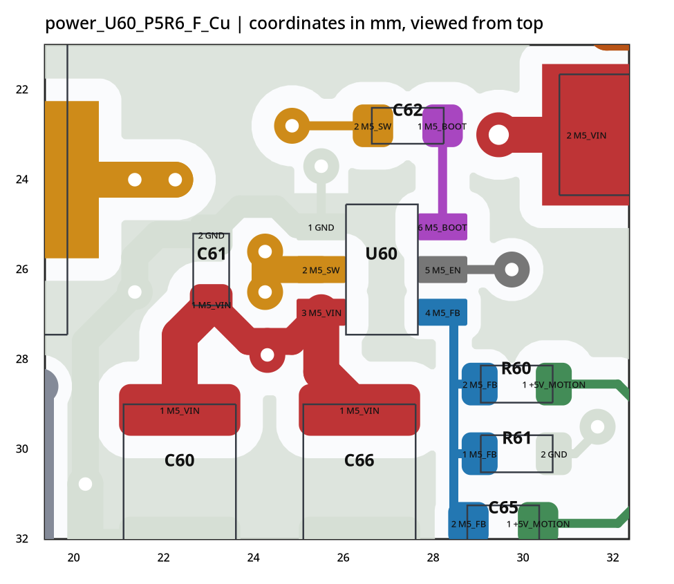
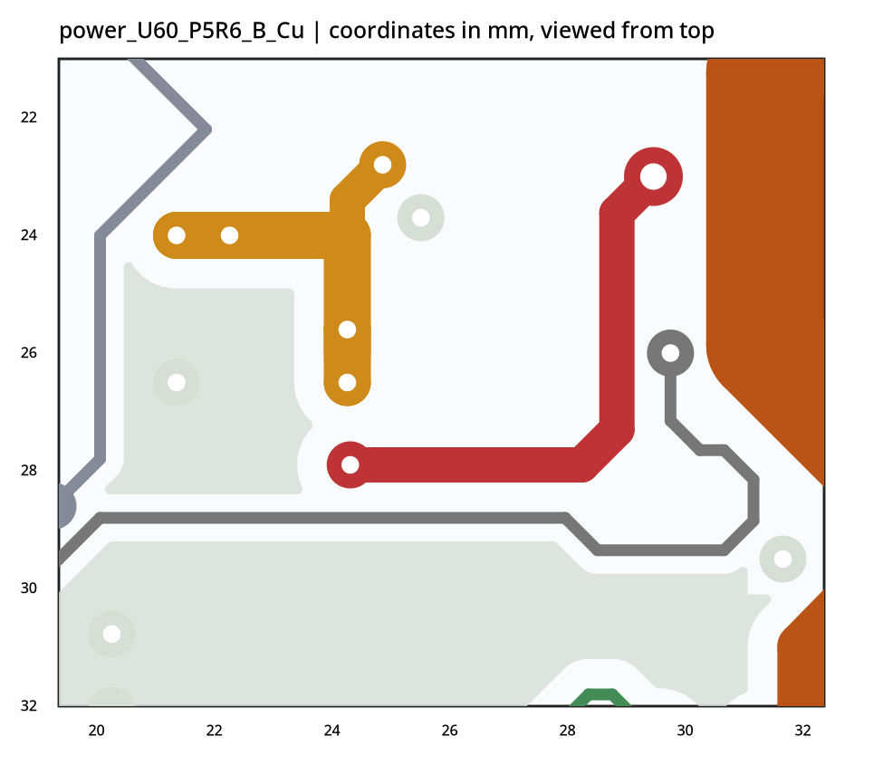
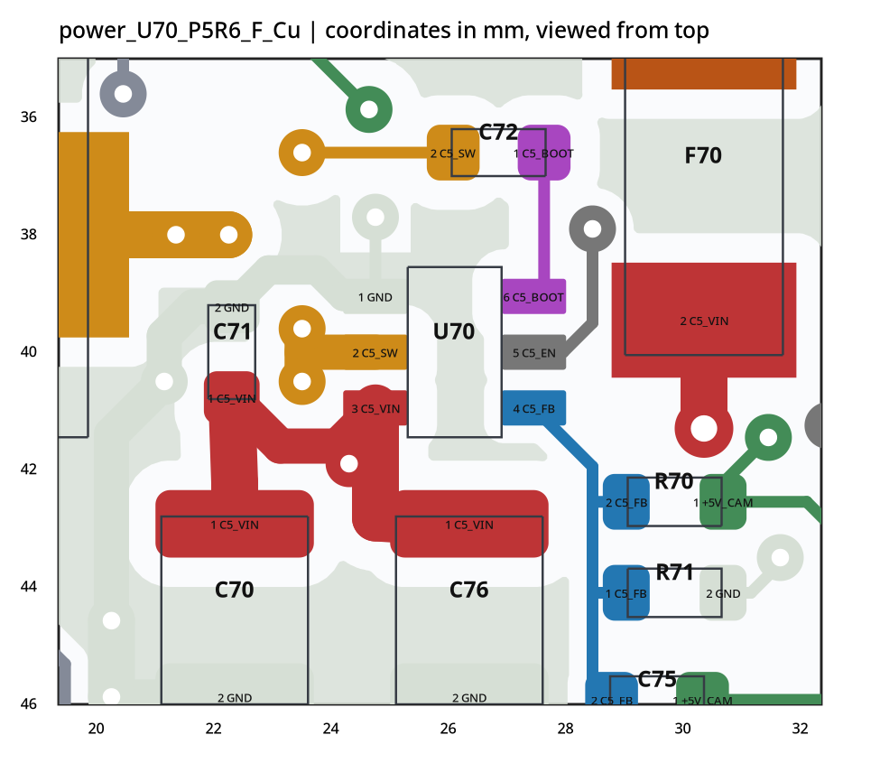
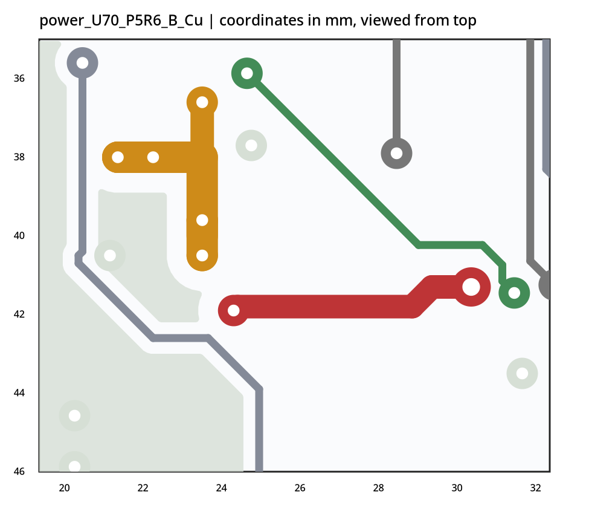
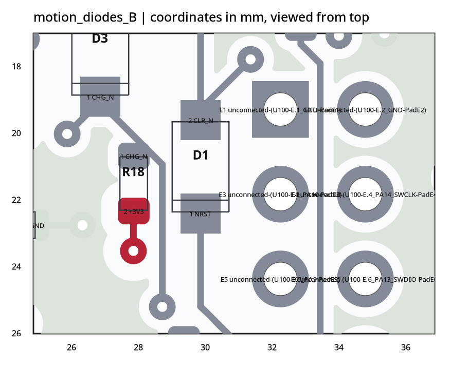

# MORI P5R6 / IMU P5R4 本轮复核

## 结论

本轮未在已执行的静态检查范围内发现新的异网铜重叠、同网焊盘分离或 SCH–PCB 引脚映射错误。上一轮提出的 BAT54H 焊盘、SW 主功率单孔换层和接口标识问题已实际修改；两路自举 SW 返回路径明显缩短。

建议停止无依据的大范围重排，在完整工程的原生 DRC/ERC、板厂 DFM 和钢网审核通过后，进入少量工程样板及台架验证。不是量产放行，也不是承诺所有工况正常。

## 输入与范围

对比：power P5R5→P5R6；motion P5R5→P5R6；rear P5R4→P5R6；imu P5R4→本次 P5R4(1)。IMU 的 PCB 和 SCH 均与前次文件逐字节相同。

已执行：八份源文件完整 S 表达式解析；版本几何差分；元件值/封装标识/DNP 一致性检查；SCH 导线和标签推导的引脚网络与 PCB 比对；保存铜区近似二维连通性、异网面积重叠及 0.15 mm 阈值间距筛查；功率过孔在顶、底两层的有效并联核查；相关路径长度计算。

未执行：KiCad 原生 DRC/ERC、重新填铜、完整 .kicad_pro/.kicad_dru 规则校验、Gerber/Paste 输出核验、全部料号逐一重新对照手册、三维装配、热/电磁仿真、负载测试。过孔镀铜厚度、允许温升、实际电流与外部 PD/充电模块仍未提供。

几何模型：普通焊盘/线段/通孔/已保存铜区的二维近似；不把 0.15 mm 筛查当成板厂或项目规则。不覆盖全部孔到铜、板边、钢网、阻焊、庭院、制造约束。网表一致不证明原理功能正确。

## 检查结果

| 板 | 引脚编号核对 | 原理图–PCB 不一致 | 模型内异网铜重叠 | 模型内同网焊盘分离 | 走线/过孔 |
|---|---:|---:|---:|---:|---:|
| 电源 P5R6 | 276 | 0 | 0 | 0 | 884/158 |
| 运动 P5R6 | 210 | 0 | 0 | 0 | 455/96 |
| 后接口 P5R6 | 42 | 0 | 0 | 0 | 86/16 |
| IMU P5R4(1) | 32 | 0 | 0 | 0 | 77/9 |

元件值、封装标识和 DNP 的 SCH–PCB 对照未发现差异；本轮 SCH 的 wire/junction/label/global_label/no_connect 均未改变。

## 1. 电源板：已完成与仍待验证

### 自举回路

C62 移至 (27.575,22.8)，180°；C72 移至 (27,36.6)，180°。单位 mm。

| 路径 | P5R5 / mm | P5R6 / mm | P5R6 换层次数 |
|---|---:|---:|---:|
| U60.2-C62.2 | 11.53 | 6.50 | 2 |
| U60.6-C62.1 | 1.68 | 2.25 | 0 |
| U70.2-C72.2 | 12.03 | 7.22 | 2 |
| U70.6-C72.1 | 2.17 | 2.62 | 0 |

两端外部走线长度之和：U60 通道约 13.21→8.75 mm；U70 通道约 14.21→9.85 mm。BOOT 侧略增长，但完整外部连接整体缩短。这是中心线路径计算，不含孔内长度、芯片内部和电容内部路径，不是环路面积/寄生电感或波形测试。

SW 仍有底层走线和换层，不能单凭这个事实判定错误。TI TPS54302 Rev.C 第21–22页明确给出短宽 SW、反馈地 Kelvin 返回，以及内层/底层 SW 和两端过孔组的参考布局。手册没有可用于本板的“低于某一毫米即自动合格”阈值。

### 四处 SW 主功率换层

| 通道/位置 | 两颗过孔中心，mm | 每孔外径/钻孔，mm | 顶层/底层均有效并联 |
|---|---|---|---|
| U60 芯片侧 | (24.4,25.6)、(24.4,26.5) | 0.80/0.30 | 是 |
| L60 侧 | (21.5,24)、(22.4,24) | 0.80/0.30 | 是 |
| U70 芯片侧 | (23.65,39.6)、(23.65,40.5) | 0.80/0.30 | 是 |
| L70 侧 | (21.5,38)、(22.4,38) | 0.80/0.30 | 是 |

当前每处是两颗钻孔0.30 mm，而非两颗0.45 mm；上一版为一颗0.45 mm。孔数增加不能直接解释成承载电流翻倍，仍需按实际镀铜及电流校核。模型中移除这四处任一颗孔，不再切断芯片—电感主功率路径。

SW 网剩余的单孔连接只在 C62/C72 的自举电容分支，不能混同为电感主电流的单孔瓶颈。

### 旧修复保留

本轮变化集中于 C62/C72、相应 SW/BOOT 线路与过孔及标识。R2 独立取样、BAT_MON/W_VM 的并联通路、输入电容与芯片 GND 的局部连接未被撤销。

### 仍可优化：反馈下臂返回

R61.2=(30.825,30.1)，通过地孔(31.8,29.5)回内层；R71.2=(30.825,44.1)，通过地孔(31.8,43.5)回内层。其顶层局部铜区仍与对应芯片的顶层 GND 铜分开，整网经地层连通；不是悬空。相比厂商“反馈地 Kelvin 到 GND 引脚”建议，仍有进一步优化空间。

仅根据这项几何事实不足以证明纹波/稳定性不合格。可作为样板例外记录，重点在负载阶跃、启动及真实供电线束条件下检查。不要为这一项随意分割完整功率地。

### 标识

J6 Value 和背面丝印已统一为 BAT_MON SERVICE/DNP；J15 已标 CHG_N/INTERLOCK，消除了把它当充电功率口的歧义。

## 2. 运动板：BAT54H 真实焊盘已修正

D1/D2/D3 均替换成 MORI_Custom:BAT54H_SOD123F_Nexperia_20241008_P5R6。铜焊盘1.20×1.20 mm，中心距2.80 mm；焊盘级 Paste -0.05 mm，矩形开口按当前规则为1.10×1.10 mm。三者不是只改封装名称。

与 Nexperia BAT54H 2024-10-08 第5页的铜焊盘尺寸/中心距相符。仍须在最终 Paste、BOM 和装配输出中确认，不以通用 STEP 模型代替实物机械验证。

引脚网络保留：D1.1=NRST；D2.1=FAULT_N；D3.1=CHG_N；三颗的2脚=CLR_N。原有走线与过孔未变；移动后的焊盘仍与旧走线连接，没有在本模型内新增开路或短路。封装标识在原理图中也同步更新。

## 3. Type-C 后接口：本轮是丝印收尾

电气焊盘、走线、过孔和保存铜区与P5R4一致。新增17段可见丝印，包括J2端子标记、FUSED/RAW、板名版本和J3联锁说明。旧版“没有实际丝印文字”问题已修改。

J2：1=VBUS_FUSED；2=GND；3=CC1；4=CC2；5=VBUS_RAW。RAW/FUSED不能在外部线束随意短接，否则改变保险前后关系。

外部PD受电控制器和3S充电模块未在本次八个文件中提供；本板原理图仍明确不承担PD协商和CC/CV充电，连续输入目标1A。此系统边界不能靠本次Layout变更证明已验证。

## 4. IMU：本次为相同文件

本次带(1)后缀的PCB/SCH与上次P5R4的对应文件哈希完全相同，不是新一轮改版。前轮去耦回路和轴向标记保留；U1专用Paste margin=0、ratio=-0.05保留。按当前规则开口约0.4275×0.225 mm，封装注释暂定100 µm钢网且要求供应商确认。

本轮未重新认证所有TDK装配要求。特别不要在开口不变时无说明地换成更厚钢网；工艺需与贴片厂整体确认。

## 放行与样板验证清单

1. 用完整工程重新填铜并运行原生DRC/ERC；按板厂规则进行DFM，逐项确认剩余告警，不全局忽略。导出并独立查看Gerber、钻孔、Paste、BOM/DNP和贴片坐标。
2. 贴片厂确认BAT54H与IMU开口和钢网厚度，确认双面器件装配、模块下方空间及连接器方向。
3. 两路5V用限流电源分级上电，在实际输入范围、负载阶跃和线束下观察启动、纹波、SW/BOOT波形及温升。验证电源芯片、主功率过孔、连接器和分流电阻的温升/压降；不直接把芯片的3A标称当作整板已验证的额定输出。
4. 对外部PD/充电方案和RAW检测线先做系统核对。装配后验证主开关、断线、充电插入、故障、复位等联锁状态，再接执行器。IMU验证轴向、通信和执行器启停时的数据。

这些是待完成的验收项目，不是已经测出的故障。当前建议是冻结大范围PCB改动，完成制造前检查后少量打样，而非立即宣称量产可用。

## 来源与证据

主要依据为用户上传的八份文件及紧邻上一版；原文件未改动。原始行号、各路测量路径与哈希保存在同包evidence中。

- 电源SW并联过孔：MORI_power_P5R6.kicad_pcb，38449–38496及43197–43256行。
- 运动D1焊盘：MORI_motion_P5R6.kicad_pcb，8656–8677及8761–8778行；D2在6880–6897行；D3在6419–6436行。
- 后接口丝印：MORI_rear_P5R6.kicad_pcb，3064–3257行附近。
- IMU独立锡膏参数：MORI_imu_P5R4(1).kicad_pcb，584–652行。
- 外部核验：[TI TPS54302 Rev.C，Layout第21–22页](https://www.ti.com/lit/ds/symlink/tps54302.pdf)。仅用于解释布局要求，不代替板上波形。
- 外部核验：[Nexperia BAT54H，2024-10-08，第5页](https://assets.nexperia.com/documents/data-sheet/BAT54H.pdf)。仅对本轮更换的三颗二极管铜焊盘等参数做针对性核对。

## 局部铜层视图

这些图从本次源文件的保存铜区生成，均为从顶面观察的坐标；B.Cu图不是实物翻板后的镜像。灰绿色是GND，橙色是SW，紫色是BOOT，蓝色是FB；不是KiCad原生渲染。图用于定位，不能替代原生制造输出。

### U60 顶层

### U60 底层

### U70 顶层

### U70 底层

### 运动板 D1/D3 局部底层

