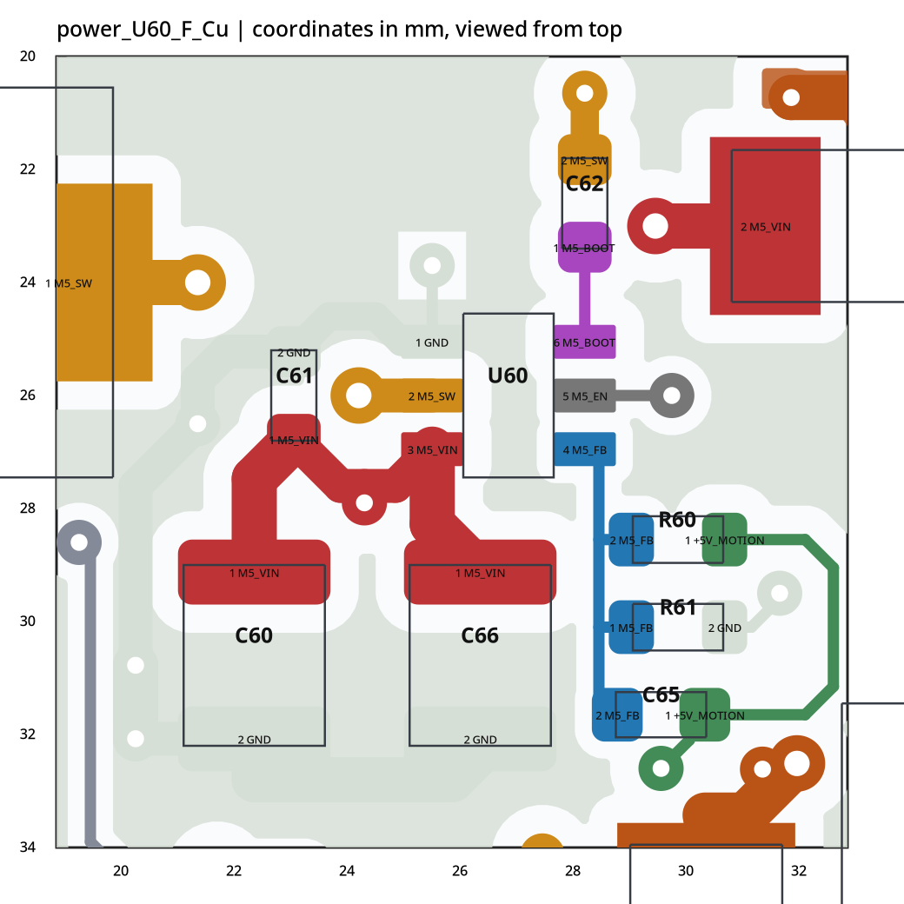
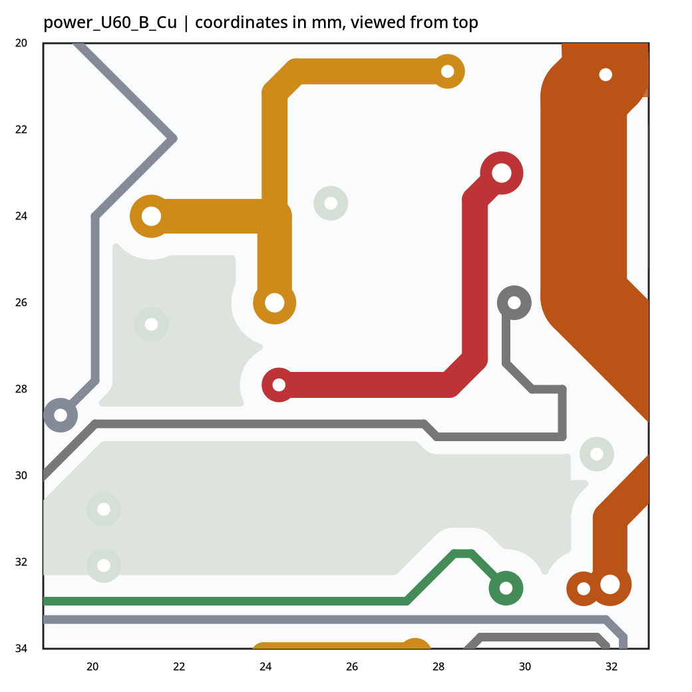
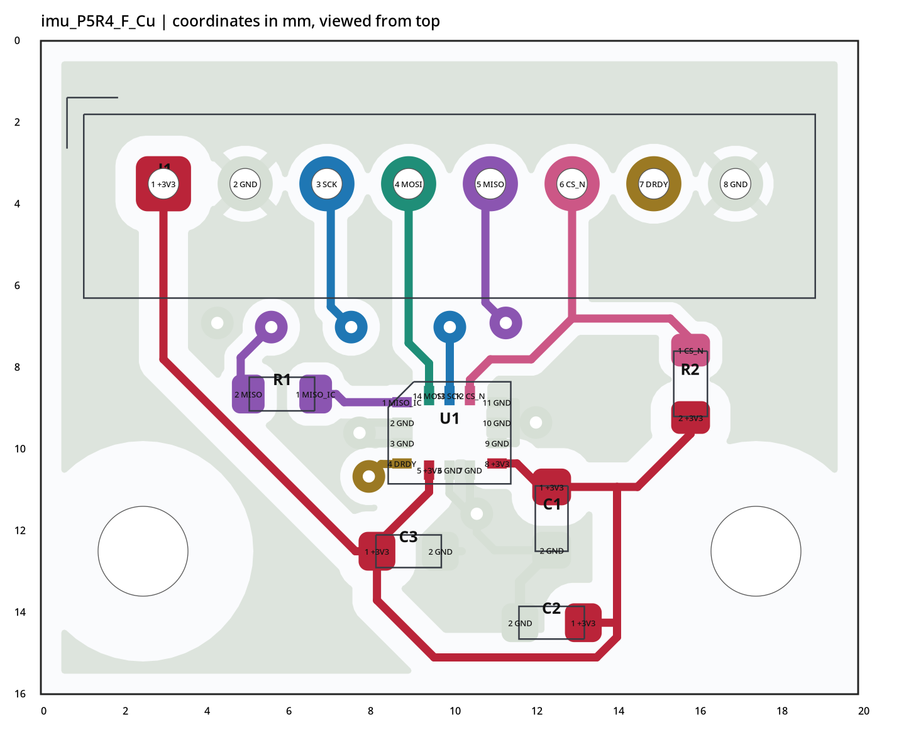
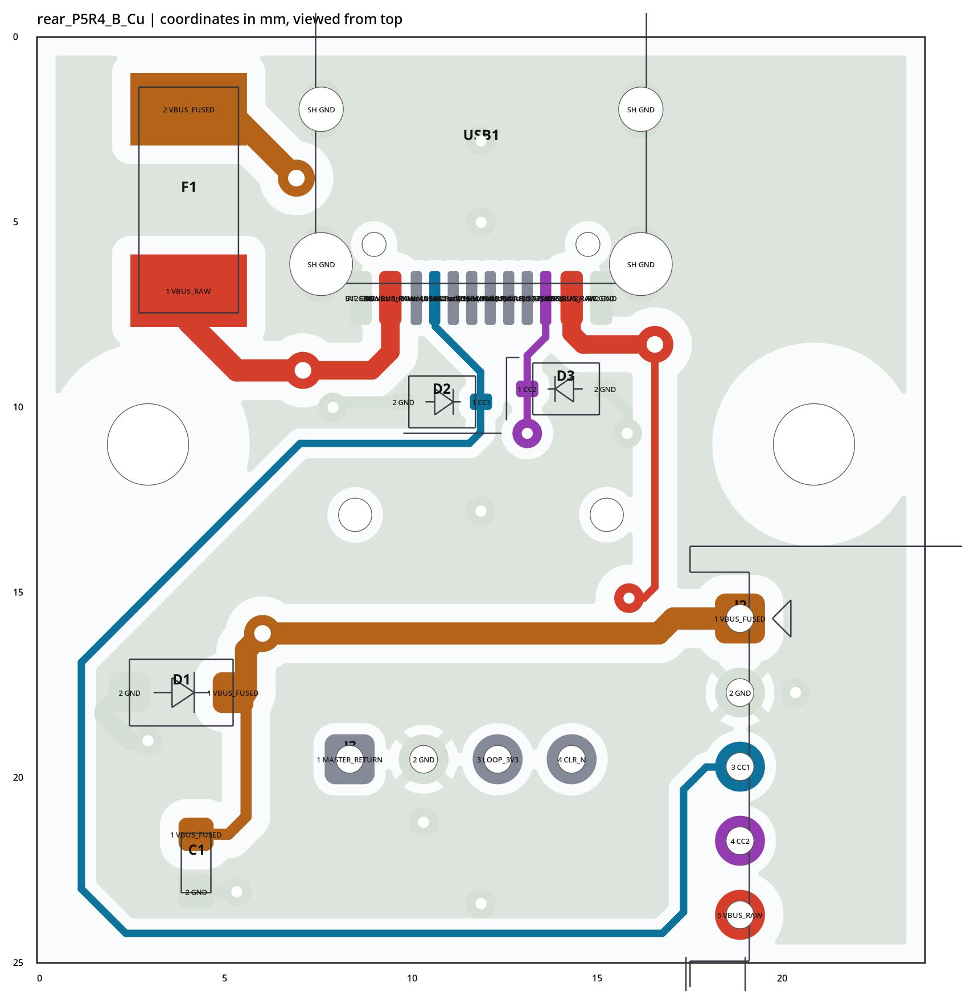

# MORI 四板更新版复核

**审查对象：电源板／运动板 P5R5，IMU／Type-C 后接口板 P5R4**  
2026-09-24 · 源文件静态复核 · 原始 PCB/SCH 未修改

## 结论

本轮确实解决了主要旧问题，不需要四块板重画。电源板的输入电容与芯片地回路、反馈网络已经明显改善；IMU 的近端去耦和钢网开口已有针对性整改；Type-C 的 D3 保护回流已改善。

**剩余工作以两项为主：电源板 SW／自举回路的局部收尾，运动板 BAT54H 与封装焊盘的匹配确认。** 此外需统一少量丝印和文档，完成原生设计规则及样板验证。没有发现本次静态模型范围内的明显异网铜重叠、同网焊盘分离或原理图—PCB 引脚网络不一致；这不是原生 DRC/ERC 通过报告。

| 板 | 实际版本 | 判断 |
|---|---|---|
| 电源 | P5R5 | 输入地与 FB 的旧问题显著改善；建议收紧 BOOT–SW 完整回路，校核新出现的 SW 单孔换层 |
| 运动 | P5R5 | 铜布局与 P5R3 相同，新增背面丝印；D1/D2/D3 的料号与推荐封装需确认 |
| IMU | P5R4 | 近端去耦、局部地回路、U1 专用锡膏均改善；可转入钢网确认和样板验证 |
| Type-C 后接口 | P5R4 | D3 和 TVS 局部连接改善；仍缺可见接口丝印，整机 PD／充电保护依赖外部模块 |

## 1. 范围、方法和限制

对八个上传的 PCB/SCH 做 S 表达式解析；与 power/motion P5R3、imu/rear P5R2 比较元件位置、值、焊盘网络、线段和过孔。通过原理图符号引脚、导线、标签、连接点及未连接标记建立引脚映射。将已保存的填铜、多边形、直线走线、普通焊盘和贯通孔建立近似二维连接图。

**没有安装／运行 KiCad 10 原生 DRC/ERC，没有重新填铜，没有完整 .kicad_pro/.kicad_dru、正式 BOM、板厂孔铜规格、实际负载预算或外部 PD／充电模块。** 不据此声明载流、热、EMC、钢网、装配及系统联锁全部合格。部分自定义焊盘和规则语义仅按本次实现支持的范围处理。

距离与网络长度来自源文件计算。网络总长包含支路；两点路径只计走线中心线的平面长度，不计孔内垂直长度，也不是电感、阻抗或实物电流路径仿真。局部铜区的“最近过孔”只有在同层连续铜实际连通时才计入，避免仅按视觉距离判断。

| 静态检查 | 电源 | 运动 | IMU | Type-C |
|---|---:|---:|---:|---:|
| 原理图—PCB 物理引脚编号映射数 | 276 | 210 | 32 | 42 |
| 引脚网络映射不一致 | 0 | 0 | 0 | 0 |
| 近似铜模型中的异网面积重叠 | 0 | 0 | 0 | 0 |
| 同网焊盘分离组 | 0 | 0 | 0 | 0 |
| 本次建模的禁布区域几何相交 | 0 | 0 | 0 | 0 |

最后一项已考虑规则区的内部挖空。后接口板部分器件禁过孔区域中有专门留给接地孔的小窗口，不能只看外轮廓就误报这些过孔违规。本检查仍不替代原生规则引擎。

## 2. 变更是否落实

| 项目 | 对比结果 | 状态 |
|---|---|---|
| R2 两端焊盘独立 Kelvin 取样 | 保留 P5R3 已修正的取样结构 | 已关闭原问题 |
| BAT_MON／W_VM 五处功率换层 | 之前的并联结构仍在，原位置不再形成单颗过孔割点 | 已改善；电流评级仍待负载资料 |
| U60/U70 输入去耦与芯片地 | 从分开的顶层铜区变为同一连续顶层地铜 | 已关闭旧“地岛仅靠单孔”问题 |
| M5_FB／C5_FB | 网络总长分别缩到 6.28／6.86 mm；均无过孔 | 明显改善 |
| 新 SW 底层连接 | 电感主电流现在每端各经一颗换层孔；自举回线变长 | 本轮新增关注点 |
| 运动板布线 | 455 段走线、96 颗过孔及元件位置未变 | 本轮主要为丝印修改 |
| IMU 近端去耦 | VDD→C1 由 4.60 缩至 1.58 mm；C1/C2/C3 与 GND6 同局部铜区 | 已改善 |
| IMU U1 锡膏 | 不再全局 +0.05 mm；U1 单独设置绝对 0、比例 -0.05 | 原扩大开口问题已修正 |
| Type-C D3 地回流 | 新增有效近端地孔并接入接口主地铜 | 已改善 |
| 实际丝印 | 运动板 27 段均在背面；电源板补充；IMU 有轴标记；后接口板仍无可见文字 | 还需少量整理 |

## 3. 电源板 P5R5

### 3.1 输入地与反馈：这次已经实际修好，不能重复提旧问题

U60 与 U70 已分别移动到 (27,26) 和 (26.25,40) mm；输入电容和反馈器件共 16 个元件重新安排。现在 U60.1、C61.2、C60.2、C66.2，以及另一通道对应接地点位于同一连续顶层 GND 铜区。它们不再各自困在只有芯片焊盘和一颗过孔的小岛上。

U60.3→C61.1 所对应的 VIN 两点中心线路径约 3.06 mm，U70 对应同为 3.06 mm，均不换层。M5_FB 总长 15.05→6.28 mm，过孔 2→0；C5_FB 总长 9.16→6.86 mm，过孔仍为 0。不能把网络总长当作某两点的唯一时序长度，但它们能显示本轮局部布局确有收紧。



**保留这部分改善。** 不要为缩短 SW 又把输入电容和芯片地拆回两个独立铜区。

### 3.2 本轮新增：完整 BOOT–SW 回路变长

自举电容必须同时考察 BOOT 一端与 SW 一端。C62/C72 到 BOOT 的短连改善了，但它们的 SW 端经过另一层绕回芯片。

| 平面中心线路径 | P5R3 | 当前 | 当前换层次数 |
|---|---:|---:|---:|
| U60.2(SW) → C62.2 | 6.76 mm | **11.53 mm** | 2 |
| U70.2(SW) → C72.2 | 6.05 mm | **12.03 mm** | 2 |
| U60.2 → L60.1 | 5.93 mm | **8.43 mm** | 2 |
| U70.2 → L70.1 | 7.57 mm | **7.68 mm** | 2 |

C62=(28.35,22.60)、C72=(27.60,36.10) mm。对应 SW 侧的小过孔是 (28.35,20.65)、(27.60,34.15) mm。顶层看起来 BOOT 连接很短，底层却能看到 SW 向上绕行的支路。



**判断：建议局部优化，不是已证明不能启动或必然振荡。** TI 的 TPS54302 参考布局本身就允许内层／底层 SW 铜，因此不能把“换层”本身认定为错误。应把 C62/C72 的两端一起规划，让 BOOT 与 SW 回到同一芯片附近的路径更紧凑。[R1]

### 3.3 新增四处 SW 功率换层，需要按实际负载加强或校核

以下过孔在当前连接图中是芯片—电感路径的单孔换层点，钻孔均为 0.45 mm，外径均为 1.00 mm：

| 通道 | 芯片侧过孔 | 电感侧过孔 |
|---|---|---|
| U60/L60 | **(24.35,26.00)** | **(21.50,24.00)** |
| U70/L70 | **(23.60,40.00)** | **(21.50,38.00)** |

它们不同于上一轮已并联改善的 BAT_MON/W_VM 五处位置。应检查电感电流、峰值、孔铜和温升；优先考虑短而宽的 SW 连接以及合适的并联过孔，不要用一个固定“每孔几安”数字直接放行。TI 参考图在芯片 SW 与电感两端使用了过孔组，具有借鉴价值，但不是所有板都必须复制相同孔数。[R1]

**建议整改范围：C62/C72 与上述 SW 换层局部。不要回退已改善的输入地铜，不需要全板重新自动布线。**

### 3.4 反馈下臂地：还有一个较低优先级优化点

R61.2 与 R71.2 分别通过 (31.8,29.5) 和 (31.8,43.5) mm 的单颗地孔连接内层地。它们的顶层局部铜没有直接接到各自芯片 GND 的同一顶层铜区；全局电气地仍然连通。

可在上述局部收尾时，进一步安排反馈下臂地的独立、安静取样连接，按芯片资料连接到对应 GND 参考点。不要把全板地网切成两块，也不要把这描述成“反馈悬空”。这是优化项，不是已证实的故障。[R1]

### 3.5 丝印新增有效，但有三处应澄清

**J6 标签相互矛盾。** 背面新增 `J6 H-BUCK IN`，但 J6 仍是 `RAW BAT SERVICE / DNP`（原理图确实设为 DNP），实际为 GND/BAT_MON；J4 才已标为头部降压输入。原理图还有旧的“J6→两路5V转换器”说明。请统一接口用途、丝印和文档；按目前 value/网络，建议写 `J6 BAT_MON SERVICE / DNP`。这不是针序错接，而是装配说明不一致。

**J15 的 CHG 建议写成 CHG_N / INTERLOCK。** 它是充电联锁逻辑，不是电池充电功率接口。避免用户据“CHG”把充电电源接入。

**TP71 GND 文字位置容易与 TP70 混淆。** 当前背面文字中心 (34.75,50.6)，更接近正面 TP70 +5V_CAM 的 (35,51)，而 TP71 GND 实际在 (34.5,48)。前后层不等于直接压在焊盘上，但作为测试标注建议对齐对应位置或增加引线。DUMP 的 D/VM 标识已经改善，保留。

## 4. 运动板 P5R5

### 4.1 铜线路没有变化，新增了可印刷背面丝印

与 P5R3 对比，455 段走线、96 颗过孔、元件位置和电气焊盘没有变化。新增 27 段可见文字均在 B.SilkS，包括板名、版本、接口功能和针号。这项应计为标识完善，而非信号重新布线。

已有的主控端 SPI 串阻、四层结构可以保留。对外接口 ESD／线束噪声与通信可靠性仍需按最终整机线束确认；不能仅由截图宣告已经通过。

### 4.2 本次新增封装核对发现：D1/D2/D3 需按实际 BAT54H 确认

三颗器件料号均为 **BAT54H,115**，当前 D1/D2 使用 `Diode_SMD:D_SOD-123`，D3 使用同样焊盘几何的自定义 SOD-123。焊盘为 0.90×1.20 mm，两端中心距 3.30 mm。

Nexperia 的 BAT54H 数据手册明确列为 **SOD123F**，其推荐回流焊盘为约 1.20×1.20 mm、中心距 2.80 mm。当前不是该推荐焊盘。[R2]

| 器件 | 坐标（mm） | 当前料号／封装问题 |
|---|---|---|
| D1 | (30,21) B.Cu | BAT54H 对应了 SOD-123 焊盘图形 |
| D2 | (13,15.5) B.Cu | 同上 |
| D3 | (27,17.5) B.Cu | 自定义名称，但尺寸仍相同 |

**这是旧版继承问题，本次扩展封装核对才发现，不是 P5R5 新引入。** 相似外形可能仍能焊接，不能据此断言绝对焊不上或极性接反。但在下钢网和贴片前，应按确切采购料号改用厂商认可的 SOD123F land pattern，或者由贴片工艺明确确认现有焊盘的兼容性。仅把封装字符串改名不算修复。

改动后保留 cathode/anode 与 NRST/FAULT_N/CHG_N/CLR_N 的网络关系，再做原生 DRC 和 BOM/贴片坐标确认。

## 5. IMU 板 P5R4

### 5.1 去耦：这次应明确关闭主要旧问题

C1 从 (13.2,9.9) 移至 (12.5,11.7)，VDD8→C1 正端的中心线路径 **4.60→1.58 mm**，不换层。C1/C2/C3 的地端与 U1.6、U1.7 现在属于同一顶层局部 GND 铜区；不再只是就近连接到另一组保留引脚的地岛。

该局部铜区仍通过 (10.668,11.5824) 的一颗 GND 过孔与另一层连接，但这里低功耗传感器的近端电容返回已直接连到正确电源地，不应照搬电机主电源的“必须多孔”要求。[R3]



C2 2.2µF 的正端支路变长，约 3.00→7.33 mm，这是重新放置后的取舍。100nF 近端 C1 已明显缩短，不建议为把体积较大去耦的中心线路径也压到最短而再次拆散局部地。后续用实际噪声和供电波形验证，而不是据该单一长度判失败。

MISO 源端 R1=33Ω 及 U1.1→R1.1 约2.20mm连接保留；芯片下方的禁布意图仍在。X/Y/+Z 已增加到顶层丝印；其对应整机方向与固件变换需装配后验证，不能只看文字存在就认定姿态定义无误。

### 5.2 锡膏开口：不再是 +0.05 mm 问题，已采用 U1 专用设置

当前 U1 定义：

```text
(solder_paste_margin 0)
(solder_paste_margin_ratio -0.05)
```

KiCad 的比例间隙按焊盘每边计算；对0.475×0.250mm矩形焊盘，预测开口为 **0.4275×0.2250mm**，即线性尺寸90%、面积81%。这与上一版0.575×0.350mm扩大开口有实质区别。[R4]

封装说明已注明“暂定100µm钢网，需供应商确认”。按这个假设，矩形开口的面积比：

**AR = L×W / [2×(L+W)×T] ≈ 0.737。**

在所核对的 TDK AN-000393 v1.8 中，参考最低值为0.66，说明该组数值具有合理起点；这不是对最终钢网脱模率的保证。按相同开口改成120µm钢网，AR约0.614，因此**不能保留开口却任意加厚钢网**。[R5]

上传封装注释引用的是AN-000393 v2.4；本次在线可直接读取的完整应用笔记是v1.8。报告不把v1.8冒充v2.4；最终应以供应商和最新适用文件确认。无需再重复取消一个已经不存在的全局+0.05mm。

## 6. Type-C 后接口板 P5R4

### 6.1 D3 和 TVS 局部路径已改善

D3 从 (14.3,10) 移至 (14.3,9.5)，地焊盘在 (15.35,9.5)，新增地孔 (15.95,10.7)。最近有效层间连接距离 **4.37→1.34mm**，并且它所在底层铜已接入USB地／外壳等构成的主地铜。CC2 也不再保留原来的前置分支绕法。[R6]

D1 从右上移动至左下 (3.9,17.7)，靠近保险后主干的换层节点；C1 移至 (4.3,22.3)。D1与C1电源端的线段路径从约23.18缩至5.25mm。虽然整板受USB、开关和机械孔限制，保险到TVS仍有一定路径，但原先“TVS在远处侧支路”的情形已经改善，不建议据器件外观看又要求全部搬回去。



D2 地回流约1.91mm、局部铜经一颗地孔连接，基本未变。这是可顺带优化项，不与D3旧长回路或功率单孔混为同一严重程度。

### 6.2 可见文字仍为零；接口必须补标识

当前后接口板没有可见丝印文字；编辑器叠加网络名不会自动印到实物。至少标明板名／版本、J2针序与RAW/FUSED区分、J3联锁用途和开关ON方向。

J2 = **1 VBUS_FUSED、2 GND、3 CC1、4 CC2、5 VBUS_RAW**。RAW是在保险前取出的原始VBUS。不能把1脚和5脚外部短接，也不能未经分析将5脚当作另一根主供电线。

### 6.3 PD／充电部分仍是系统外部依赖，不是本板漏画

原理图仍明确写着：本板不做PD协商或电池CC/CV充电，5～20V中高于默认电压的部分依赖外部受电协商，连续输入目标1A。应由外部模块确认CC终端、未上电识别、CC误接VBUS防护、后级瞬态耐压和3S充电控制。

本次未提供外部模块与完整线束，不能关闭整机充电保护配合验证。也不能据此盲加两颗CC下拉，或把高压输入路径的TVS直接改成5V型号。ESD器件与持续过压断开保护并不是一回事。[R7]

## 7. 四板接口交叉核对

以下是上传文件中的端点针号匹配，不是已经测过实际线束。

| 连接 | 针号／结论 |
|---|---|
| 电源J17 ↔ 运动J1 | 1=+5V_MOTION，2=GND，一致 |
| 电源J10 ↔ 运动J7 | 3V3、ARM_Q、FAULT_N、CHG_N、BAT_ADC、WHEEL_ADC、CURRENT_ADC、GND；运动板ADC输入后缀为_IN，功能一致 |
| 电源J13 ↔ 运动J2 | 1=W_BUS/S288_BUS，2=GND |
| 电源J14 ↔ 运动J3 | 1=H_BUS/HEAD_BUS，2=GND，3=NC |
| 运动J4 ↔ IMU J1 | 1=3V3、2=GND、3=SCK、4=MOSI、5=MISO、6=CS、7=DRDY、8=GND |
| 后接口J3.1/2 → 电源J19.1/2 | MASTER_RETURN/GND |
| 后接口J3.3/4 → 运动J8.1/2 | LOOP_3V3/CLR_N |

**运动J8不是“供电+地”的普通两芯接口。** 连接器插接面的观察方向、线束端子顺序、实际器件型号仍须核对。

## 8. 建议的最小整改与验证

**制造前关闭：** 运动D1/D2/D3的BAT54H-SOD123F焊盘匹配；电源J6用途标识统一、后接口RAW/FUSED丝印。钢网确认IMU U1专用开口和暂定100µm工艺，不覆盖回全局规则。

**电源板局部收尾：** C62/C72的完整自举回路、四处SW功率换层及实际电流校核；有条件时完善反馈下臂的Kelvin地。禁止回退已改善的输入地、R2采样和母线并联孔。

**原生放行检查：** 用完整项目与真实板厂规则重新填铜，运行DRC/ERC，逐条解释例外，并确认生成的Gerber/Paste/Mask、钻孔、BOM/DNP、贴片坐标与版本一致。自定义静态结果不能替代此过程。

**样板验证建议：** 电源先用限流台式电源和可控负载，分通道验证启动、负载阶跃、纹波和温升；运动/IMU使用实际线束与固件验证数据、执行器启停干扰和复位；联锁验证关机、断线、插充电器及重新ARM的行为；Type-C验证两个插入方向、外部受电协商和完整充电链路。以上是建议测试，不是已经完成的测试。首次验证时让执行器处于机械安全状态。

**最终定位：保留四板架构，收尾有限位置，再进入样板验证。不要继续全板反复自动布局，也不要在缺少原生规则和实物结果时宣称“可量产”。**

## 9. 证据索引

数据包中的comparison.json提供版本差分；metrics.json提供路径明细；*_geometry.json提供保存铜区连通与过孔割点；*_schematic_check.json提供引脚映射；final_checks.json提供接口、锡膏计算与规则区检查；manifest.json提供输入文件哈希。铜层图为源文件几何重建，不是KiCad原生Gerber，底层图仍采用从顶面看的统一坐标。

| 关键位置 | 原始文件行号 |
|---|---|
| U60 SW三颗孔及底层路径 | MORI_power_P5R5.kicad_pcb:38409–38470 |
| U70 SW三颗孔及底层路径 | MORI_power_P5R5.kicad_pcb:43121–43177 |
| U60／U70焊盘与网络 | 同文件:14115–14163、15522–15570 |
| R61／R71下臂地 | 同文件:22893–22900、279–286 |
| J6 service/DNP value、H-BUCK丝印 | 同文件:20907、34981 |
| TP71背面文字 | 同文件:34873–34884 |
| 运动D1型号、封装、焊盘 | MORI_motion_P5R5.kicad_pcb:10817–10849、11072–11087 |
| 运动D2／D3对应封装 | 同文件:8823–9106、7104–7387 |
| IMU U1专用锡膏覆盖 | MORI_imu_P5R4.kicad_pcb:584–650 |
| IMU C1／C2新位置 | 同文件:1845–1993、286–434 |
| 后接口D3新地孔及连接 | MORI_rear_P5R4.kicad_pcb:3216–3257 |
| 后接口J2 RAW/FUSED | 同文件:2950–3010 |
| 后接口外部PD/充电依赖 | MORI_rear_P5R4.kicad_sch:8–12 |

## 10. 外部核对依据

[R1] Texas Instruments，TPS54302 数据手册 Rev C，§7.4与Figure7-16。用于布局原则和允许底层SW／多过孔示例，不用于宣称本板热性能。https://www.ti.com/lit/ds/symlink/tps54302.pdf

[R2] Nexperia，BAT54H 数据手册，2024-10-08，SOD123F外形与推荐回流焊盘。https://assets.nexperia.com/documents/data-sheet/BAT54H.pdf

[R3] TDK，ICM-42688-P，DS-000347 v1.9，电源地与典型外围。https://d17t6iyxenbwp1.cloudfront.net/s3fs-public/2026-06/DS-000347%20ICM-42688-P%20v1.9.pdf

[R4] KiCad10 PCB文档及PAD::GetSolderPasteMargin源实现，用于每边间隙与比例计算。https://docs.kicad.org/10.0/en/pcbnew/pcbnew.html ；https://docs.kicad.org/doxygen/pad_8cpp_source.html

[R5] TDK，AN-000393，当前可读取镜像为v1.8，§2.3钢网与面积比。不是上传封装注释所指v2.4的逐页核验。https://www.mouser.com/pdfDocs/tdk-invensense-an-000393.pdf

[R6] Texas Instruments，SLVA680B，ESD保护布局。https://www.ti.com/lit/an/slva680b/slva680b.pdf

[R7] Nexperia，PESD5V0L1BA数据手册，仅用于器件功能范围。https://assets.nexperia.com/documents/data-sheet/PESD5V0L1BA.pdf
