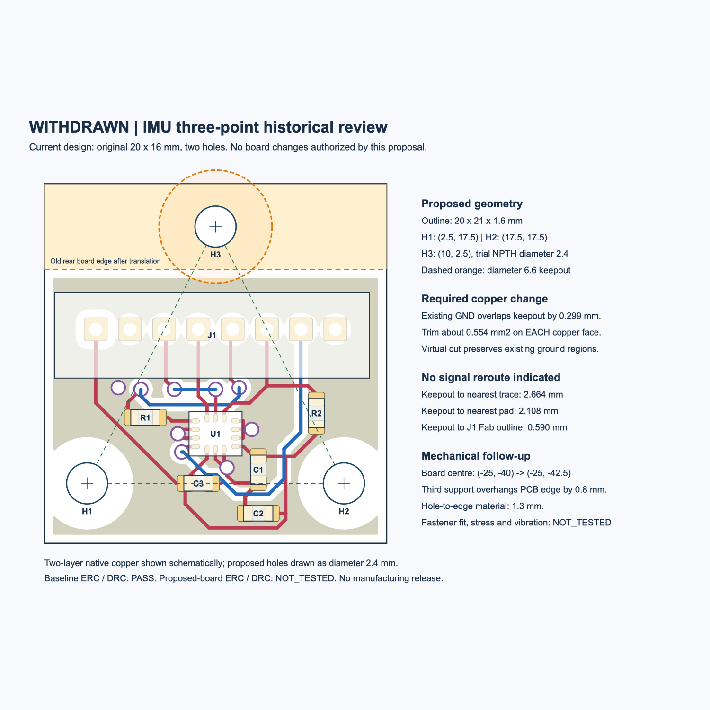

# IMU 三点固定提案电气评估 · 已撤回 · 2026-09-27

**最新决定：用户撤回扩板与第三孔提案，保留原20×16mm板框和两个安装孔。扩板不再实施，也不再等待扩板交接。**

当前继续使用P5R6交接中的 **MORI_imu_P5R4**：H1=(2.5,12.5)、H2=(17.5,12.5)，原生孔径均为Ø2.2 NPTH。器件、连接器、走线、铺铜、板框、原点及机械导入中心均保持原版；不新增H3、不扩大孔径、不作Y+5平移。已发布PCB与 `contracts/components.json` 未修改，哈希核对见 `withdrawal_record.json`。

`review_response.json` 已更新为撤回决定。以下文字、计算、图示、ERC/DRC报告保留为**撤回方案的历史评估**，其中提到的改板、退铜和机械坐标调整均不再是待办，也不阻塞原两孔版交接。原两孔方案的实物安装、应力与抗振资格仍为NOT_TESTED。

## 历史评估正文（不执行）

**结论：20×21mm、三点固定的方向可采用，现有信号走线无需因第三孔改道。正式采用前必须完成地铜退让、明确孔径，并修正机械导入时的板中心设置。** 本评估没有写入新PCB，没有修改机械、当前发布KiCad或共享契约，没有制造输出。

本轮仅评估 `mechanical/studies/prearrival_preparation/imu_mount_proposal.json`。基线为P5R6交接中的 **MORI_imu_P5R4**，原生PCB SHA-256：`b960058cd5e8660431ec619fe3c733d1d08a68f19847ed3bcd750c324061ff68`。机械侧三点提案的PASS是名义空间检查，不能代替本次铜皮检查或实际应力试验。



## 1. 可保留的设计与必须落实的改动

| 项目 | 评估结论 | 后续正式改版要求 |
|---|---|---|
| 板框20×16→20×21mm | 几何上可行，后侧增加5mm；电气拓扑可保持 | 保留1.6mm厚度、现有两铜层与原生元件方向；新增面积100mm²，质量尚未实测 |
| 新局部坐标整体Y+5 | 与原机器人内元件位置兼容 | **平移完整PCB对象**：封装、焊盘、走线、过孔、规则区、铺铜边界/填充、丝印等；不能只移封装。新板框单独定义0…20、0…21 |
| 第三孔H3=(10,2.5)，Ø2.4试孔 | 不碰现有信号线、过孔、焊盘或J1包络 | 采用NPTH机械孔；新增到原理图/板/本地封装的一致版本。孔径仍是试配值，非成品公差确认 |
| H3周围Ø6.6铜/器件禁布 | **现有地铜侵入，不能原样沿用** | F.Cu、B.Cu地铜均需局部退让约0.30mm；包括铺铜在内执行禁布，不能豁免GND。机械孔自身可以保留，不在此区域布置电气焊盘、过孔或器件 |
| H1/H2孔径 | 原板为Ø2.2；提案统一字段写Ø2.4，不能称“孔完全未变” | 建议下一版明确为三孔均Ø2.4 NPTH试配。若原两孔继续Ø2.2，则交接中逐孔列出，避免机械与制板数据分叉 |
| 传感器/连接器实际位置 | 正确应用变换后保持不变 | 机械接收新板时，板中心参数由(-25,-40)改为(-25,-42.5)；详见第3节。此轮未改机械配置 |

建议新增条带以机械支承为主，不需要为了填满新板框把地铜自动铺入第三支座区域。现有去耦、MISO串阻、CS上拉和信号路径可保持。先按现有铜区整体平移，再加入第三孔禁布并重铺铜，完成原生DRC/连通检查。

## 2. 原生铜与连接器的数值检查

以下来自KiCad10.0.6原生形状与保存的实际填充多边形。数值是设计几何，不是实物测量。

| 检查 | 结果 |
|---|---:|
| H3中心到最近走线/过孔的铜边 | 5.964mm；最近为F.Cu `/MISO`走线 |
| H3禁布圆边到该走线 | 2.664mm |
| H3中心到最近电气焊盘铜边 | 5.408mm；J1.4 `/MOSI` |
| H3禁布圆边到最近电气焊盘 | 2.108mm |
| H3禁布圆边到J1的F.Fab矩形包络 | 0.590mm |
| H3禁布圆边到J1的courtyard，含绘图线宽 | 0.475mm |
| H3中心到当前F/B地铜边 | 两面均约3.001mm；小于禁布半径3.3mm |
| 按禁布圆虚拟退铜的面积 | 每面约0.554mm² |
| 地铜区域数，虚拟退铜前→后 | F.Cu：4→4；B.Cu：1→1 |
| 已接触地铜的地焊盘，虚拟退铜后保留 | F.Cu：10/10；B.Cu：5/5 |
| H1/H2若扩大到Ø2.4，孔壁到最近铜边 | 两孔均约1.494mm，大于现有0.30mm孔铜间距要求 |

虚拟退铜使用包围真圆的256边形，最大径向外扩小于0.00025mm，只在内存中对已保存地铜做布尔差。它说明所需退让很小、没有观察到区域分裂或焊盘接触丢失，**不等于已生成新板或新板DRC通过**。

J1仍为B8B-PH-K-S(LF)(SN)直插8P，配PHR-8；引脚仍为1=+3V3、2=GND、3=SCK、4=MOSI、5=MISO、6=CS_N、7=DRDY、8=GND。接口朝向与板上0°旋转不变，组件面在机器人中仍朝下。

机械已有PHR-8装配包络的后侧Y=-46.225mm，第三支座轴Y=-50.5mm。以支座半径3.3mm比较，水平投影仍有约0.975mm间隔。这只复核已建插壳包络；新螺钉、批头、手指、线束弯曲及全部装配路径仍需机械复核，不能从“原连接器插拔PASS”直接推导第三螺钉可操作。

## 3. 坐标约定：提案坐标正确，当前导入中心必须同步

当前链路有两步：

1. KiCad原生二维坐标：+X向右，+Y向图纸下方；导出STEP时变为 `[x,-y,z_STEP]`。
2. STEP在机器人中绕X约180°安装，组件朝下。`imu_mount_transform.json`的 `native_to_assembly_rotation` 实际用于STEP坐标，不能不经Y翻转就直接乘KiCad图纸坐标。

近似表达式为：

```text
world = R_STEP_to_body × [x_native, -y_native, z_STEP] + translation

旧translation = (-35, -48, 108.355)
新translation = (-35, -53, 108.355)
原对象新坐标   = (x_old, y_old + 5)
```

| 对象 | 旧原生XY | 提案新原生XY | 机器人内XY，保持不变 |
|---|---|---|---|
| H1 | (2.5,12.5) | (2.5,17.5) | (-32.5,-35.5) |
| H2 | (17.5,12.5) | (17.5,17.5) | (-17.5,-35.5) |
| U1中心 | (10,9.6) | (10,14.6) | (-25,-38.4) |
| J1.1 | (3,3.5) | (3,8.5) | (-32,-44.5) |
| 新H3 | — | (10,2.5) | (-25,-50.5) |

按保存的浮点旋转矩阵逐封装检查，原位置最大差约0.00000114mm，低于0.001mm的数值比对容差。这是坐标算术检查，没有改变或重新标定传感器轴。

**实际需要机械任务在接收新板时更新：**

```text
config/geometry.json#/native_electronics/boards/imu/board_center_xy_mm
[-25, -40] → [-25, -42.5]

rotation_xyz_deg 保持 [180,0,0]
substrate_reference_z_mm 保持 108.355
```

原因：`mechanical/scripts/native_electronics.py::board_transform`按实际板框中心重新定位。若导入20×21板却仍保留中心Y=-40，全部原元件会向机器人前方平移2.5mm。必须更新中心或改为同一明确原点定位，不能同时套用两套补偿。

108.355mm是当前STEP导入参考值；现有PCB上侧支承面约Z=108.4，下侧约106.8。第三支座接触应对齐**实际同一板面108.4**，不能把导入原点误作另一支承高度。

## 4. 支承、孔边材料与应力

- 三个固定点构成三角形，U1处于其内部。传感器包体边缘到最近孔中心约6.223mm；即使三孔均Ø2.4，包体边到最近孔壁也约5.023mm。这支持“没有把新孔挤到IMU旁边”的结论。
- U1中心距H1—H2连线仍为2.9mm，包体最近边距该线1.65mm，与原板相同。TDK要求远离高应力位置和固定点连线，但没有给这条连线统一的3mm合格线；不能把上述数字解释为应力验收PASS。
- H3孔壁到新后边缘仅1.3mm。Ø6.6支座在该边外伸0.8mm，属于**部分圆形支座承压面**，并非整个圆都压在PCB上。扣除Ø2.4孔后，名义支承环面积约27.33mm²，约为完整环的92.1%。是否可承受实际预紧力尚未验证。
- 这0.8mm外伸不造成已检查铜/器件干涉，也不必因此强制扩大板框。应按部分承压面评估固定，采用平整且共面的三个座面，核实螺钉头/垫片包络、螺纹啮合和预紧方式。不要用大扭矩强行把翘曲板压平，不在MEMS附近引入硬顶、第四接触点或刚性拉紧线束。
- 如果机械明确要求Ø6.6完整圆面全部位于PCB内，则当前孔中心距边2.5mm不足，应另提“孔距边至少3.3mm”或扩边方案并重新查机械；本轮没有移动该孔或扩到其他尺寸。
- 需要实物比较：锁紧前后零偏、静态噪声、不同安装预紧状态、线束轻推/插拔、轮电机/舵机/扬声器工作时的频谱与温度漂移。不能把扩板和三点固定视为已经证明抗振或降低零偏。

参考依据需要更新：提案引用的TDK AN-000393 v1.5网页索引仍能读到三点建议，但原PDF链接本次访问返回404。项目已保存的[TDK AN-000393 v2.4](../../sources/parts/TDK_AN000393_v2p4.pdf)（首页日期2/9/2026，§3.1/3.2，pp.11–12）已改为**至少三个固定点，按板尺寸形状可用四个或更多，重点是均匀分布、共面并避免弯曲**。因此本提案可作为小板的三点方案，不能宣传为“三点以外都违反TDK要求”。这些是布局/安装建议，不是本机器人已经通过的资格认证。

## 5. 检查状态与后续发布边界

| 检查 | 状态 | 说明 |
|---|---|---|
| 原生板与P5R6交接哈希匹配 | PASS | 使用当前发布的IMU P5R4 |
| 原板KiCad10.0.6 ERC | PASS | 0违规 |
| 原板KiCad10.0.6 DRC，含重铺铜/全部走线错误/原理图一致性 | PASS | 0违规、0未连接、0原理图一致性问题；没有新增忽略 |
| 原位保持的坐标算术检查 | PASS | 前提是执行完整Y+5平移，并同步机械板中心 |
| 新孔与现有信号铜/元件包络 | PASS | 仅名义二维几何筛查，具体数值如上 |
| 把现有地铜直接沿用到Ø6.6禁布内 | FAIL | 两面均侵入约0.30mm，需要新板中实际退让 |
| 正式候选板ERC/DRC/丝印与孔封装检查 | NOT_TESTED | 本轮没有创建或保存新PCB |
| 新第三孔实物装配、预紧应力/抗振/温漂 | NOT_TESTED | 不等同机械名义空间PASS |
| 新板发布/生产 | BLOCKED | 尚需实际执行上表修改、检查并正式交接；无制造订单授权 |
| 已发布源文件及机械/共享契约保持不变 | PASS | 前后SHA-256核对，见commands_and_sources.json |

上述改版流程已随提案撤回，不再执行。历史条件性评估不构成新的改板任务或发布要求；继续保留当前P5R4原生板。

## 复核资料

- `evaluation.json`：全部原生走线/过孔/焊盘、铜区、位置与距离计算。
- `commands_and_sources.json`：实际命令、版本、输入哈希、前后完整性核对。
- `native_baseline/drc.json` / `erc.json`：本轮实际重跑的原板报告。
- `evaluate.py` / `evaluate.log`：可运行的只读评估与实际输出。
- `review_response.json`：供机械任务读取的最新撤回决定；不是发布契约。
- `historical_review_response_before_withdrawal.json`：撤回前的完整评估结论，仅供历史追溯。
- `withdrawal_record.json`：撤回记录及原生KiCad/共享器件契约未变的哈希核对。
- `proposal_overlay.svg`：从原生数据绘制的提案叠图；不是新PCB或制造图。
- `proposal_preview.svg` / `proposal_preview.svg.png`：完整显示注释的方形预览画布与经视觉检查的预览图。

历史复跑命令（仅写入本目录；提案已撤回，不再作为当前设计工作运行，机械源更新后需用当时输入快照复现）：

```sh
/Applications/KiCad/KiCad.app/Contents/Frameworks/Python.framework/Versions/3.9/bin/python3 hardware/v1_2/reviews/imu_three_point_20260927/evaluate.py
python3 hardware/v1_2/reviews/imu_three_point_20260927/make_overlay.py
qlmanage -t -s 1500 -o hardware/v1_2/reviews/imu_three_point_20260927 hardware/v1_2/reviews/imu_three_point_20260927/proposal_preview.svg
```
