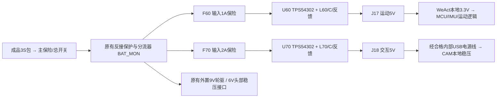

# MORI S3 电源原理图 · 两路板载 5V

2026-09-22，**V1.2-H0.3-S3 / PROTOTYPE / NOT_TESTED**。按用户最新要求，本轮只修改原理图与相关电气资料；**PCB、板框、安装孔坐标和器件放置均未更新或冻结**。现有 P2 电源 PCB 仍对应旧电路，不能用其 DRC 报告证明 S3，也不能将旧 80×45 mm 当成新电路的安装包络。

入口：[KiCad 工程](../kicad/MORI_power_S3/MORI_power_S3.kicad_pro) · [原生原理图](../kicad/MORI_power_S3/MORI_power_S3.kicad_sch) · [12 页阅读版](previews/MORI_S3_Power_Schematic_Review.pdf)。阅读版前两页是新增降压电路，后十页是继承的电源调理电路。

## 已实施的电气变更

- 两个独立 TPS54302DDCR 降压电路取代原先未采购的 Pololu D24V22F5 模块。每路包括输入保险、输入电容、屏蔽电感、输出电容、自举电容、反馈电阻和前馈电容。两 MCU 模块的本地稳压保留。
- JP60/JP70 为维护禁用跳线：**开路启用、短接本路 EN 到 GND 停用**。EN 使用芯片内部上拉，不能连接到 3S 电池。两路逻辑供电不受 ARM_Q 控制；启动顺序不构成隐含授权，原有运动锁存仍要求自检与本地明确解锁。
- TP60/TP61 为运动 5V/GND，TP70/TP71 为交互 5V/GND。它们现在只有电气定义，没有针床覆盖或位置资格。
- 原始电池服务口 J6 标为 **DNP（不装配）**，不再接两个外置 5V 模块。J6 原网仍是 BAT_MON，绝不等于 5V。J2/J3、J4/J5 的外置 9V/6V 电源路径继承，轮/头门控与吸能电路未改变。
- MCU GPIO、UART/SPI、ARM/FAULT/CHG、软件协议、IMU板电路均未改变。S3 未集成 USB-C 充电、BMS、自动 USB 电源切换或新的电机驱动。

## 选型、参数与计算

主芯片依据 [TI TPS54302 Rev C](https://www.ti.com/lit/ds/symlink/tps54302.pdf)，国内已找到 [立创 C311983](https://item.szlcsc.com/295057.html)。MA11S 的 TPS5430DDAR 作为既有电路参考已查阅；本次采用同步 TPS54302，减少续流二极管及两个逻辑支路的占板，未冒称直接复用了 MA11S 的电路。

| 项目 | S3 设计值与边界 |
|---|---|
| U60 / U70 | TPS54302DDCR ×2；芯片 3A 标称不等于本机输出额定 |
| L60 / L70 | Bourns SRP7050TA-100M，10µH±20%，DCR 最大69mΩ；4A温升条件 / 7.5A饱和定义分开记录 |
| 输入 / 输出电容 | 每路各2×22µF/25V X7R，另有100nF输入旁路及100nF BOOT–SW电容；有效容量仍需偏压/温度复核 |
| 反馈 / 前馈 | 100kΩ / 13.3kΩ，0.1%；75pF C0G。按典型参考电压算出的设定值 **5.077V**，没有将其写成精确5.000V |
| 运动输出 | 持续0.5A、瞬态0.75A为设计目标，受GH线束及模块能力限制 |
| 交互输出 | 持续1.5A、瞬态2A为设计目标；2A连续运行尚未批准 |
| 保险 | F60=0451001.MRL，F70=0451002.MRL；输入侧快熔保险，需要校核冷阻、温度降额、浪涌及与主保险的配合 |

精确 MPN、厂家、数量、来源、立创编号（已找到时）、待核项目保存在[新增电路装配表](../kicad/MORI_power_S3/assembly_bom.csv)和[更新后的主BOM](../bom.csv)。有供应目录不代表国内结算价、库存、所有后缀都已核实；未知费用仍为 UNKNOWN，未宣称整机预算闭合。旧两块5V模块已从当前主BOM替换，J6少计一只默认装配插座，没有将必要器件记为“已有”。

[可运行计算](../calculations/logic5v_S3.py)输出[完整结果](reports/logic5v_calculations.json)和[16组输入/负载情形](reports/logic5v_corner_cases.csv)。包括反馈容差、电感纹波/峰值、输入保险利用率、转换损耗、线束压降及温度假设。

- 在0～85°C反馈电阻温度窗口、25ppm/°C假设及±20mV纹波预算下，5V静态预算仍有余量，但**上端余量很小**。将电阻温度扩到−40～125°C后的组合上限会越过5.25V，报告保留该 FAIL 边界；不能宣称全温保证。
- 交互2A条件的估算芯片损耗约0.70W。直接代入两种数据手册热阻，在45°C环境下会得到约85～129°C结温范围，说明未来铜面/散热会决定可持续能力。这不是实板温升，也不支持把2A峰值直接升级为持续额定。
- 电容有效容量、前馈补偿和线缆/模块输入电容共同影响瞬态与稳定性。没有伪造环路仿真、相位裕量或负载阶跃结果。
- 两路同时的设计峰值约16.43W电池侧（85%效率假设），是供电容量预算，不是实际平均功耗。旧整机59W表使用不同的运动逻辑功耗假设，不能直接作为S3峰值设计值；合并轮/头原有42W负载及88%转换假设后约64.15W，9.9V时约6.48A，已超过原6.3A主保险的名义值。是否会熔断取决于时间/温度，**峰值包络、保险和电池资格仍需联合复核**，本轮没有无依据地加大主保险。

## 接线与故障边界

| 端口 | 引脚 / 连接 | 要求 |
|---|---|---|
| S3 J17 | 1=+5V_MOTION，2=GND；对运动P2 J1逐针1→1、2→2 | AWG26 GH压接候选；整回路电阻≤150mΩ |
| S3 J18 | 1=+5V_CAM，2=GND；经合格机内USB电源线到CAM | AWG22 XH候选；包括USB端在内整回路电阻≤70mΩ；具体线长由结构确定 |
| JP60 / JP70 | 1=本路EN，2=GND | 只在托架维护时短接；断运动电源会清ARM并失去平衡 |
| J10.1 | 来自运动模块的3.3V输入 | 供电源监测逻辑，仍不是电源板向MCU输出的3.3V |
| CAM J11.3 | CAM本地3.3V，仅供UART转换器B侧 | 不与运动3.3V稳压输出并联 |
| CAM BAT | 本轮不用 | 禁止接3S或本板5V |

引脚编号是电气端子号；本轮不定义新连接器在PCB上的朝向。CAM内部USB电源线的CC/源端行为、端子电阻与额定还需确认，普通两线“USB-C头”不能凭外观视为合格。连接电脑前拔掉机器人5V，保留已有的互斥维护流程。

独立降压与输入保险有助于减少部分耦合；共享电池、地、总保险、反接管及采样电阻仍是共同故障点。保险不是快速电子隔离；芯片自身的过压控制也不是“高侧开关击穿后仍能保护MCU”的独立OVP。CAM短路/重启时运动是否能保持健康必须实测。线束供电与回流成对，电机大电流不得经MCU板返回。

## 检查与后续台架项目

[真实检查报告](reports/verification.json)：KiCad10.0.6原生ERC **0项违规**；导出网表与全部物理ref/pin **0差异**，19项检查PASS；所有继承的P2电路网络保持一致，三块P2原生CAD哈希未改变。未新增ERC排除；四项继承的KiCad默认关闭规则在报告中逐项列出。因没有修改PCB，本轮不运行或宣称“S3 DRC通过”。机械任务同期已更新至M1.8；读取时的机械哈希变化记录不表示本任务修改了机械文件。

[接口与交付物复核](reports/interface_verification.json)：21项PASS；原59条IO定义不变，新增12条电源/维护测试端子与原生网表一致；83行主BOM、71行引脚、27行连接器端点表与契约一致。27行是连接器端点记录，不等于27根独立线束。阅读版12页均标明PCB未更新，文件哈希已记录。

下面均为 **NOT_TESTED**。接原装模块前先用假负载；无电池、无电机，托架维护。已有万用表和限流电源可以完成静态初检；纹波、瞬态、短路恢复及温升需要示波器、受控负载和温度测量设备。

| 项目 | 前置 / 操作 / 设备 | 通过条件 | 停止条件与记录 |
|---|---|---|---|
| S3-T01 断电检查 | 装配后、无外部供电；DMM核保险、极性、BOOT–SW、5V两路不互连、J6未装 | 与本版网表一致，无焊桥；允许电容充电造成瞬态读数 | 无法解释的低阻、错件即停；记录版本、阻值、极性和照片 |
| S3-T02 单路空载 | 先短接两JP禁用；限流50mA从0升至9V，再分别开路JP；按观察调整限流，不接MCU | 单路可启动，另一输出保持关闭；9/9.9/11.1/12.6V下输出4.75～5.25V | 超压、持续限流、异常发热即断电；记录Vin、Iin、Vout、JP状态 |
| S3-T03 静态假负载 | T02通过；功率电阻/电子负载，运动逐级到0.5A、交互到1.5A；同时记录温度 | 实际端子维持4.75～5.25V；温度可稳定，反馈电阻不超85°C设计窗口 | 端子欠/过压、热持续上升、反馈电阻达85°C、器件额定越界即停；记录负载/V/I/T/时间 |
| S3-T04 线束与瞬态 | T03通过；真实线束，受控负载阶跃与示波器；0.75A/2A峰值从10ms低占空开始，不预先承诺持续时间 | MCU端全程4.75～5.25V，稳态纹波≤40mVpp候选门槛；无持续振铃；报告实际可承受脉宽/占空 | 超界立即停；记录探头带宽/接地、波形、最低最高电压、线阻和恢复时间 |
| S3-T05 分支故障与顺序 | 假负载保持运动域；托架禁驱；受控关闭/启动CAM，再用限流负载增加到保护区 | 没有错误ARM；运动电源/复位状态满足已定义接口；若共电池压降导致重启必须判失败并修订 | 禁止用金属直接硬短未知电池；过压、器件温度超界或保险异常即停；记录两路波形、ARM/RESET、恢复条件 |
| S3-T06 模块并发 | 前项通过；接WeAct/IMU，最后接CAM屏幕/相机/录播/Wi-Fi；按现有总测试计划继续 | 不掉电重启，无持续过热；上电/维护流程正确；随后才进入悬空电机和保护平衡台架 | 任何复位/电压越界/异常动作即停；保存固件版本、并发配置、功耗与波形 |

## PCB 接续条件

[结构交接](../handoff/mechanical_S3.json)只说明新增功能、删除的外置模块及线束/散热要求，不带新板框或孔坐标。TI芯片焊盘按DDC0006A核对；电感候选焊盘仍需对照厂商图视觉终审。结构确定后，还需根据实际环路、电流回流、反馈Kelvin连接和散热安排布局，重新运行DRC/原理图一致性检查。原P2的R14、扇出、测试点和钢网例外仍未被本轮处理或批准。

本轮没有PCB文件、Gerber、钻孔、贴片坐标或新STEP；没有采购、下单、烧录、提交或推送。

复核：`python3 hardware/v1_2/tools/verify_S3.py`；计算：`python3 hardware/v1_2/calculations/logic5v_S3.py`。重绘S3：`logic5v_S3.py`，之后必须重新ERC/网表审查，再用bundled Python运行`export_S3.py`。这些脚本不触碰P2 PCB；`publish_S3.py`更新硬件契约后可运行`build_reports.py`刷新表格。

交付物一致性复核：使用含pypdf的bundled Python运行`hardware/v1_2/tools/verify_S3_interfaces.py`，仅写检查报告，不改CAD或契约。
