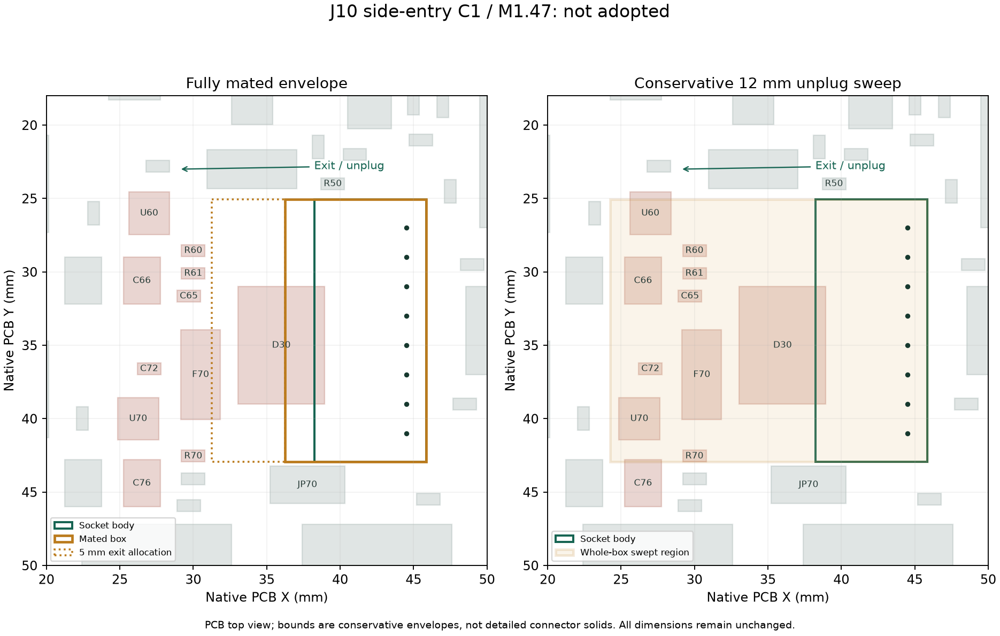

# J10 侧出 C1：独立机械包络筛查

基于正式M1.47实体及硬件A2交接。主模型、正式电源板P5R6、原孔位、1–8编号和其他器件均未移动；电气候选本身仍FAIL。

## 当前结果

使用JST文档本体17.9×7.6×4.8mm、完全插合深度9.6mm，按实际PCB顶面Z=121.10mm放置。旧J10本体从研究障碍集中排除，其他电源板器件保留原源网格。所有几何均来自现有主模型和厂家包络，未缩小连接器。

| 检查 | 筛查结果 |
|---|---|
| 空插座外包络 | 与D30模型重叠约11.05mm³ |
| 完全插合外包络 | 与D30模型重叠约45.69mm³ |
| 朝PCB−X直拔12mm，49个采样 | 每个采样均有板上器件包络重叠；涉及D30、F70、U60、U70、R60、R61、R70、C65、C66、C72、C76 |
| 出口后5mm、整个出线面的保守走线走廊 | 与D30、F70区域重叠 |
| 上述包络对其他打印件 | 未检出重叠 |

这次采用外包络，**重叠表示该空间不能直接认作空闲，不等于实物精细形状已被证明接触**。拔出检查还保守地扫过整套插合包络，包含原本固定的座体范围，可能过度排除；目前不足以给出可用拔出路径。没有宣称整个线束或手指操作通过。

## 给硬件的具体空间反馈

当前保持孔序的方向只有PCB−X。完全插合包络占原板坐标X=36.25…45.85、Y=25.05…42.95mm；若继续使用12mm直拔分配，联合扫掠覆盖X=24.25…45.85、Y=25.05…42.95mm、PCB顶面上0…4.8mm。12mm是项目分配，不是JST额定要求。

因此不能只让D30避开0.85mm投影就认为解决。须连同端子后直段、插头退出和涉及器件的布局一起复核；请硬件先给出电气可行的局部重排候选，或提供精细插合/拔出所需行程，使包络可进一步收紧。机械目前无需根据此筛查切支架，但也未证明“挪开D30后一定能走线”。

A2的Alpha5853筛查样本外径上限1.0922mm，10D保守弯曲参考10.922mm，端后直段分配5mm。原R6的历史路线不适用于这个新输入。8根线的真实出口位置、压接后形态和成品束径尚未冻结，此次没有伪造一个通过的线弯。

数据：[J10_A2_envelope_review.json](J10_A2_envelope_review.json)；命令：`Blender --background mechanical/mori_v1_2.blend --python-exit-code 1 --python mechanical/studies/prearrival_finish/check_J10_A2.py`。A2来源及16个正式项目文件哈希见[接收记录](hardware_A2_receipt.json)。状态BLOCKED，未应用候选、未制造放行。
