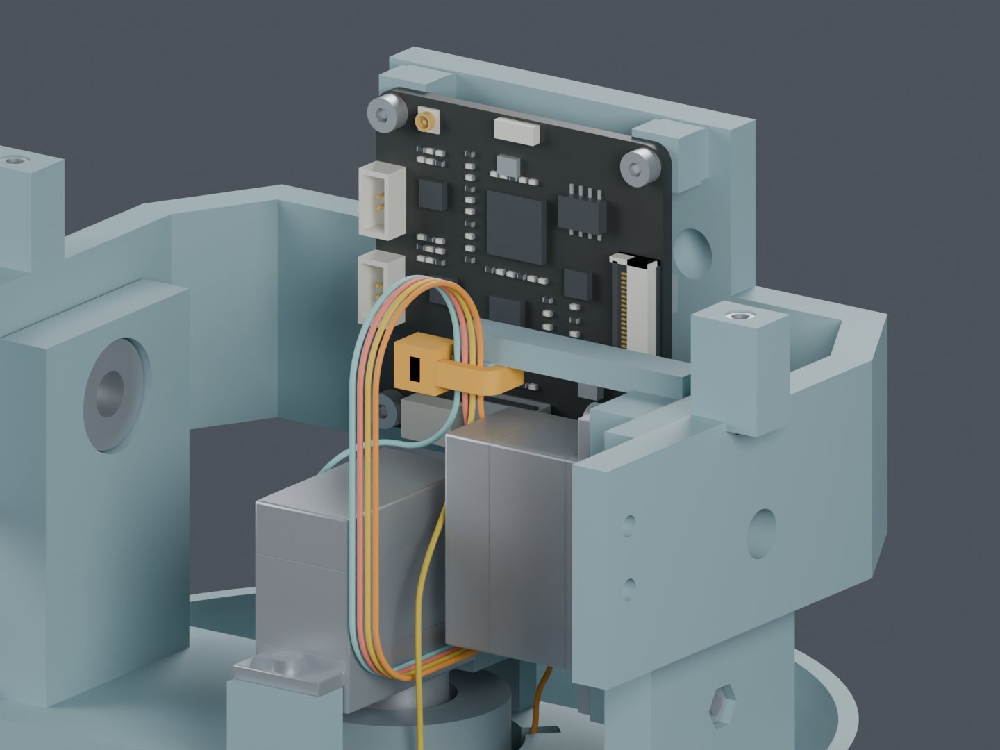
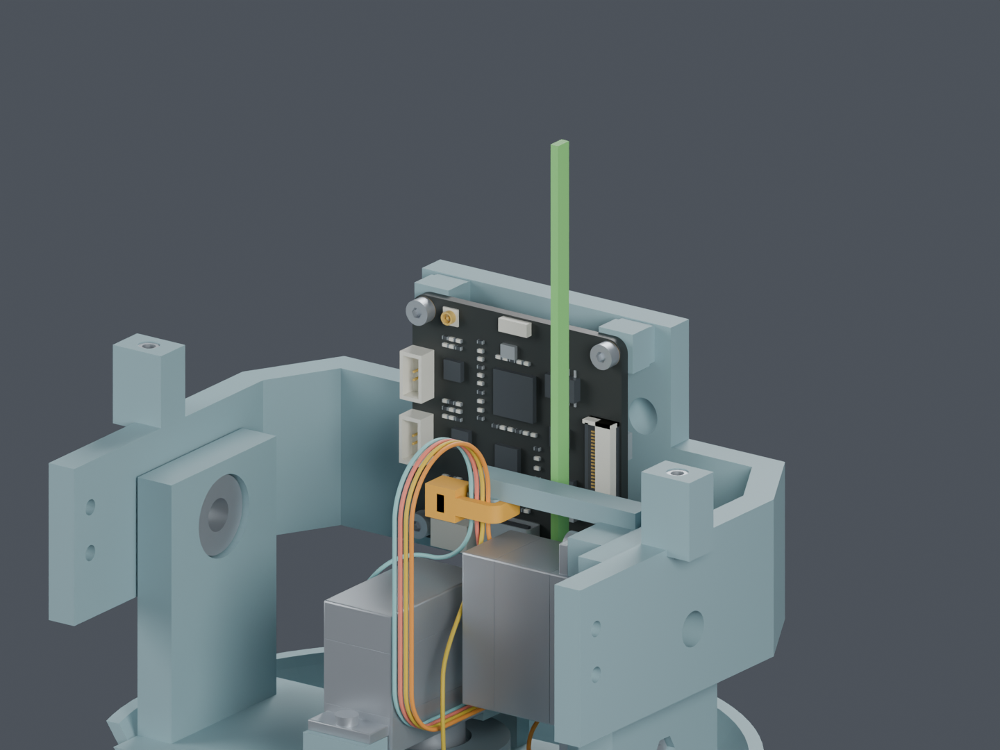

# M1.48：CAM 线固定与装入候选

**补齐了本页列出的局部数字检查；完整线束仍为 BLOCKED。结构候选尚未应用主模型。**

两处固定座分别并入 Pitch_Yoke 和 Pitch_Cradle，不增加打印件，增加两根扎带预留。
固定座按四根线的直线段定位；它们不会证明柔性导线会自然保持数学曲线。
使用前一研究的 Yaw_Base/Pitch_Yoke 通道，因此总计涉及三个未采用的打印件。

橙色为扎带估计外形，四色细线区分机械路线，不表示电气线序。
屏幕、相机、头壳及部分头部轴件尚未安装，符合本次工具检查的工序。
图中 CAM 板为当前来源模型，仍包含照片估计细节。

| 检查 | 结果及边界 |
|---|---|
| 两处固定座与扎带 | PASS：130 个组合姿态、3120 组线与局部特征检查；两座与各自主体均连通 |
| 固定点的导线长度位置 | PASS：24 个指定位置、各 130 姿态；最大数值变化 0.00001583 mm。只验证曲线，不是加工公差 |
| 剪尾工具与扎带长尾 | PASS：两处工具进出；CAM 侧找到向上弯起的 80 mm 临时长尾空间。长尾不是成品长度 |
| 四向端子穿颈及局部线形放松 | PASS：每方向 410 个包络区间；端子名义间隙下界 0.308025 mm，线体 0.305996 mm |
| CAM 板后装 | PASS：抬高 6 mm 后插线、再落座的 16 个位置，64 条完整线对当前实体复核；板卡逐元件和胶壳的 6 mm 刚性平移扫掠通过 |
| 完整工序 | BLOCKED：以上局部工序还未连成完整带线装配，不能算整项完成 |

端子穿颈仍以 1.0×1.8×4.1 mm 估计包络检查，不是已确认的压接后最大尺寸。
0.31 mm 检查膨胀扣除网格和插值误差后仍超过原定 0.3 mm 间隙。
早期 neck_feed.json 使用切槽时的 0.32 mm 工具面重放，在共边处出现微小相交；保留该诊断，
没有提高相交豁免值或再次切薄结构。当前依据为 neck_feed_verified.json。

绿色只表示操作时的临时扎带长尾。实际弯折能力、穿入锁头、收紧手势及剪切仍未验证。
工具外形含照片估计；这不是完整的人手操作或工艺认证。

## 还需要完成

1. 身体端独立应力释放；现有 J5 插头不能代替线束固定。
2. 自由线尾穿颈、线形形成、CAM 插接、扎带收紧、其他部分装入之间的完整衔接。
3. 其余七根跨关节导线、相机 FPC、屏幕 FFC 及整套线间干涉。
4. 通道与固定座的可制造性和结构复核；三个打印件的改动需确认后应用。
5. 实际线端针腔、压接最大尺寸和线材资料；供应商制作图仍不发布。

轴颈通道的采样最薄壁仍约 1.48 mm，原件约 2.25 mm；本次没有进一步减薄。
扎带夹持力、PA12 强度、真实插拔、磨损与动态寿命仍需实物。
CAM 板的柔性运动是 16 个离散位置；本次没有宣布全线连续运动或重新批准全部线间排布。
插头自身的五毫米出线区域只对自身接口预留体作有界排除，实际端子配合仍 BLOCKED。

主模型仍为 M1.48，正式 STL、装配动画和硬件文件保持已批准状态。
距离实物前工作完成仍有五类：完整线束、反力夹初装、采购件及安装、供应商接口资料、质量与驱动预算。

[候选 Blender](review.blend) · [固定座反面](anchors_rear.png) · [前一阶段完整路线](../yaw_service_M1_48/index.html)

[固定与姿态](anchors.json) · [导线材料点](material_stations.json) · [工具及长尾](tools_and_tail.json)
· [穿颈扫掠](neck_feed_verified.json) · [CAM 后装](board_installation.json)
· [发布来源](publication.json) · [交付核对](delivery.json)

更新：2026-10-05T12:19:54.813511+00:00
