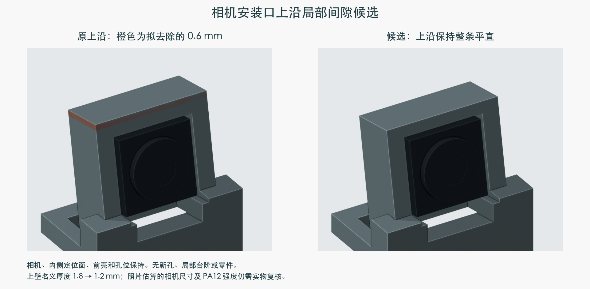
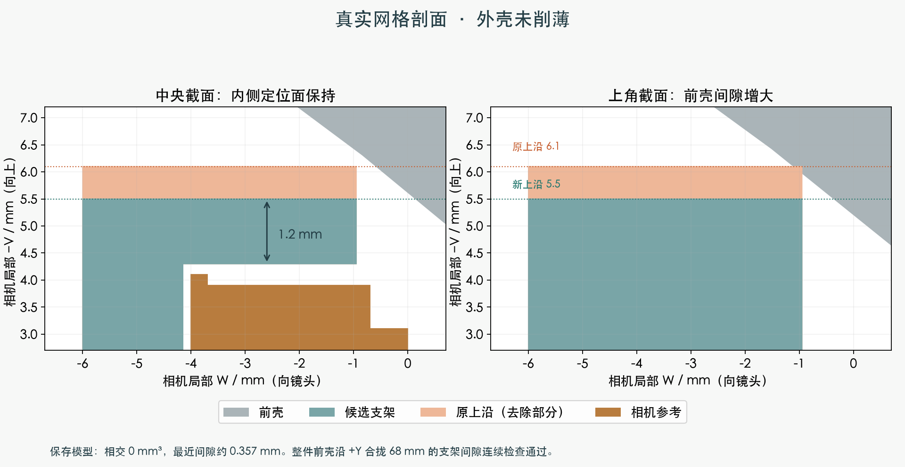

# 相机支架上沿：连续平直的局部间隙候选

状态：**独立候选，尚未采用**。当前主模型仍为 M1.47，配置、合同和其他 208 件源对象保持。

主模型 Display_Frame 相机口的两个上角与 Head_Front 有约 0.00765 mm³ 名义相交。
候选把相机口上方外边整条降低 **0.6 mm**，不增加局部缺口、台阶、孔或零件。
相机、原内侧定位面、前壳夹持唇、镜头和所有安装轴保持；前壳没有削薄。
代价是这一段上壁名义厚度由 **1.8 mm 变为 1.2 mm**。

## 已完成的名义几何检查

- 保存后的网格闭合、单个连通实体；其他 208 件源对象的网格和世界变换不变。
- 保存模型的支架/前壳相交为 0 mm³，最近间隙 0.356777 mm。
- 上壁 20 个截面样本 1.199985–1.199993 mm。只代表该上壁，不能当作整件最小壁厚或强度认证。
- 相机沿局部三轴正负各移动 0.5 mm，仍被原支架或前壳阻挡；这是名义限位检查，不是夹持力试验。
- 光学框架、相机、前壳分别 141 / 49 / 137 个具名装配位置通过。按工序未安装的部件逐项列在报告中，没有把全装状态与分步装配混淆。
- 前壳相对这次修改的支架沿 +Y 0–68 mm 平移，以距离变化界覆盖完整连续路径，共 8 个区间通过。其他部件对仍为有限位置检查。
- 理想布尔候选严格包含于原支架内部；全部安装变换保持，所以材料减少不会新增刚体运动干涉。原有其他接口不因此获得放行。

相机细部仍为官方尺寸加照片估算，实物配合与 PA12 上壁强度未验证。
完整线束、身体段供线和舵盘接口仍未完成。本页不代表可发厂生产或整机装配已通过。

[独立 Blender 候选](candidate.blend) · [保存模型与路径检查](verification.json) · [构造记录](construction.json) · [供应商资料](../harness_A8/supplier_source_update/index.html) · [返回总进度](../index.html)
