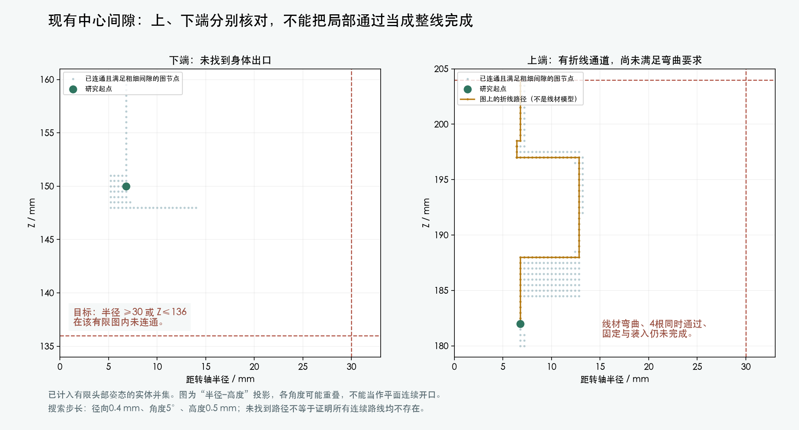

# 中心通道两端：三维出口复核

本次延续 A8 的四根细线局部研究。**完整 H06 仍为 BLOCKED；主模型、PCB 和装配动画未修改。**



## 已查明什么

- 在零位检查了 108 条径向直线：下端 36 条被 Yaw_Base 阻挡，上端 72 条被 Pitch_Yoke 阻挡。只排除了这些直线。
- 原始自由空间检查不能支持“中心间隙完全封死”的结论。随后三维图搜索确实找到了上端绕行。
- 下端按身体坐标系建立有限姿态障碍物并集，搜索起点 (6.8, 0, 150) mm；目标为距轴半径 ≥30 mm 或 Z≤136 mm。本次有限图内没有找到达到目标且满足间隙的路线。满足要求的 3448 个连通节点限于半径5.2–14.0 mm、Z148–160 mm。搜索框顶边也是限制，**不是所有可能路线均不存在的证明**。
- 上端按随 yaw 转动的坐标系搜索，从 (6.8, 0, 182) mm 连到 Z204 mm。单条折线路径对有限姿态障碍物的中心线距离下界为 0.683521 mm，大于线半径加0.3 mm间隙的0.6302 mm。计入线半径后，名义表面间隙下界约 0.353 mm。
- 上端路径包含急转角；没有完成6.9342 mm保守弯曲半径、四根线同时通过、固定点、装入与CAM端连接检查。**图搜索 PASS 只指单条折线的粗细间隙，不是可加工线束 PASS。**

## 方法与边界

源为当前 M1.47 的209实体及已声明验证代理。身体段障碍物并集包含相关固定件和13个yaw/130个组合姿态的相关活动件；上端采用yaw坐标系，包含相关固定yaw件、10个pitch姿态和13个反向yaw身体姿态。裁剪盒内实际包含26/125个相关实体实例。它们是有限姿态采样，不是完整连续扫掠。

圆柱坐标图步长为径向0.4 mm、角度5°、Z0.5 mm。每条接受边的最近面距离减去覆盖项，保守覆盖整条直边；已验证的外部起点与正距离连续边防止路线穿过实体。搜索结果没有为所有连续路径提供全局上界。图中半径–高度投影会叠合不同方位，不能当成二维连续孔道。

两个端部都只以方位0°为图搜索起点；没有把这一条上端折线冒充四根线的同时通路。此前四根线各33.2 mm的中心活动段检查仍有效，但该长度不能用于供应商下料。

## 下一项实际设计工作

需要先形成能连接身体与头部、满足弯曲和装入要求的完整候选，再确定固定点及逐线长度。当前证据不足以直接在Yaw_Base或Pitch_Yoke上开孔；涉及承重座或反力件的结构变化须形成可审查候选后确认。舵盘接口和其依赖的反力件尚未定型，也会影响最终走线。

官方端子/线材资料已补齐一部分；这处卡点包含尚未完成的机械路线设计，不能全部归因于缺资料或等待实物。

## 结果与复现

- [径向直线结果](radial_endpoint_openings.json)
- [原始自由空间检查](central_void_check.json)
- [有限姿态障碍物来源](central_route_unions.json)
- [下端搜索结果](central_body_escape_graph.json)
- [上端搜索结果](central_yaw_escape_graph.json)
- [交付核对](delivery.json)

```sh
/Applications/Blender.app/Contents/MacOS/Blender --background mechanical/mori_v1_2.blend --python-exit-code 1 --python mechanical/studies/prearrival_finish/harness_A8/build_central_route_unions.py
/Applications/Blender.app/Contents/MacOS/Blender --background --factory-startup --python mechanical/studies/prearrival_finish/harness_A8/check_central_escape_graph.py -- --lower
/Applications/Blender.app/Contents/MacOS/Blender --background --factory-startup --python mechanical/studies/prearrival_finish/harness_A8/check_central_escape_graph.py -- --upper
/Users/dean/.cache/codex-runtimes/mori-cad/bin/python mechanical/studies/prearrival_finish/harness_A8/plot_endpoint_review.py
```

Blender5.2.2 LTS、构建d13f752e3b9c；主模型SHA256：`bcaa5736a8cdf43441a6a83a6cb69606546cc01d2c0d28d98f4c09383e07368f`。没有采购、制造发布或实物资格声明。
