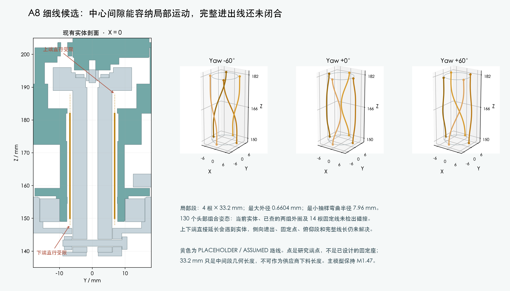

# A8 细线候选与中心通道局部复核

<!-- A8_PITCH_FLEX_LATEST -->
最新见[分步装配与完整线长](cam_wire_forming/lifted_end2/contact_refined_forming/root_seating/body_supply/complete_head/split_assembly/index.html)：22件偏航与舵盘先装、14件头托与CAM后装的有限刚体路径通过；四根名义全长及共同PH插头已建入，供线动作仍未通过。既有颈部局部候选保持未采用，完整顺序、扎带和真实端子入壳未完成。LCD代理误报已修正，相机支架与前壳小相交仍待处理。主模型保持。
<!-- /A8_PITCH_FLEX_LATEST -->

<!-- coupled-feed-latest:start -->
**最新进展：**已从JST原厂目录推导CAM候选插头外露2mm，补查插头、5mm出线直段及6mm拔出行程。CAM端向左/向前两组R7以上出线通过源实体姿态检查；与旧Z206暂存线段相交，保持旧分段的30种后续尝试也未通过。把未定型的偏航分段点降至Z193后，两段之间130姿态、4160组合检查通过。中间活动线段仍未连接，不能给最终下料长度；主模型未改。

[CAM接线端与低位分段研究](cam_pitch_port/index.html)。
<!-- coupled-feed-latest:end -->

<!-- body-prefix-latest:start -->
**最新进展：**H06四根UART线已从Motion J5分配出线面接到偏航上方暂存点；四线成组、209源实体/代理、29个插头包络及14根静态线的130头部姿态检查通过，四线间隙保守下界0.738mm。与另外两组局部Yaw线束包络也通过。尚缺固定、穿线/带线拆装、俯仰段与CAM连接，J2打印改动未采用；主模型保持M1.47。

[四线身体端三维候选](body_prefix_v2/index.html)。下文失败结果保留为早期有限家族记录。
<!-- body-prefix-latest:end -->

<!-- amass-latest:start -->
**最新补充：**新互配尺寸已复跑，名义包络通过、上界分配未通过。[查看原厂图和最新结果](amass_mating/README.md)。以下首次J2记录保留为历史，完整线束仍未完成。
<!-- amass-latest:end -->

用户已确认 **供应商按图制作**，制作方式不再等待选择。本包是 M1.47 的独立研究，没有更换正式线材、PCB、打印件或装配动画，也不是线束加工图。

<!-- threading-update:start -->
## 历史阶段：J2与旧对插包络复核

A8/J2完成裸端子临时穿入的局部研究，并修正两件候选的保存网格；对209源实体的局部线形检查通过。加入29个保守对插包络后仍有冲突，身体端尚无四线成组路线。新取得AMASS 2025V1互配尺寸，推导板上名义17.1mm/极限17.9mm，需替换旧23.1mm分配再复跑。固定、俯仰段、CAM接口、FPC和逐线长度未完成；主模型未改。

[最新评审](terminal_threading/index.html) · [新找到的AMASS互配尺寸](amass_mating/README.md)。下文J1的结果仅属此前范围。
<!-- threading-update:end -->

<!-- joined-entry:start -->
## 历史阶段：连续局部候选J1

[J1路线与装配检查](joined_entry_candidate/index.html)已把四线下端、中央活动段和上端相接。独立副本中只改两件打印件，导线姿态/弯曲/相互间隙检查通过；端子参考包络沿线装入尚有干涉。主模型未改，也没有最终下料长度。以下原Z150–182及折线结果保留为历史研究，不应替代J1的最新范围说明。
<!-- joined-entry:end -->

## 新资料已接收

硬件补交 [A8 报告](../../../../hardware/v1_2/head_harness_A8_20261003/README.md)；[接收记录](receipt.json)核对了 14 个来源和 537 个受保护文件。A8 补充 A7，不替换 C4、PHC1 或正式四板。

- PH 细线端子 **SPH-004T-P0.5S**：AWG32–28、绝缘外径0.5–0.9 mm。
- SH 端子 **SSH-003T-P0.2-H**：AWG32–28、外径0.4–0.8 mm。
- 两端共同外径范围0.5–0.8 mm。PHR-4胶壳和板座可保留作为研究方向；实际CAM插座完整厂牌/料号及插合面仍未确认。
- Alpha **2841/7** 原厂目录参考：30AWG、7/38、PTFE，外径0.5588–0.6604 mm。目录10D弯曲参考按最大外径为6.604 mm。完整订货后缀、价格、压接工艺、动态寿命尚未确认；不是已选采购料。
- GAM-050的ASSHSSH28K152是单根SH→SH线，其原BCD线外径仍未知，不能当作已配好的PH→SH四芯H06。

针序保持运动J5→CAM J11的1→1、2→2、3→3、4→4。第三根是CAM本地3V3电平参考，四根全部计入；不承担CAM主电源。

## 中心间隙：局部几何通过，完整线路仍受阻

四根线分别沿现有中心环形间隙布置，中心半径6.8 mm；研究端点Z150与Z182 mm。每根中间段几何长度33.2 mm，13个yaw姿态长度计算保持，各根不是圆束中心线的代替。最小抽样曲率半径7.955 mm，大于本次采用的保守筛查值6.9342 mm。

对当前209实体的验证网格/已声明代理进行13 yaw×10 pitch组合姿态检查，共520个“导线×姿态”，未检出这段路径与源实体、14根固定线候选的干涉；与已有两组外圈用径向间隔下界另行检查。名义外部间隙要求0.3 mm；线间距离的全参数对界得到最小表面间隔下界6.410 mm。详见[曲线](central_uart_curves.json)与[源实体检查](central_uart_source_check.json)。这是有限姿态和名义实体检查，不是连续运动、实际保持位置或疲劳资格。

继续检查[八条直行延伸](central_exit_check.json)：下端从Z150向下，Z148之后的直行间隙界被Yaw_Base阻断；上端从Z182向上，Z188之后由Yaw_Reaction_Link阻断。报告在0.25 mm步长下记录首次保守间隙界不足，不能把Z147.75/Z188.25当作精确接触高度。这只排除了这八条直行路线；侧向转弯、进出口可达性、弯曲空间和真实装入尚未闭合。

外侧平面环的两个完整有限搜索池没有找到通过项，后续大搜索已终止，转而核对中心通道；[保留日志与终止范围](uart_planar_attempt.json)。另一种连续径向变化的盘绕曲线试了2835组，仍未找到通过项，见[记录](uart_spiral_loops.json)。这些失败均不等于证明所有外侧路线无解。

<!-- endpoint-review:start -->
## 后续：三维出口已检查

108条径向直线均未通过，但三维搜索找到了上端折线路径；在有限头部姿态实体并集内，单线中心线距离下界为0.684 mm。弯曲、四线同时通过和固定尚未完成。下端在本次有限图内未找到身体出口；这不是所有路线无解的证明。完整说明见[出口复核](ENTRY_REVIEW.md)。

当前卡点包含完整机械路线尚未设计完成，不能全部归为等资料或等实物。
<!-- endpoint-review:end -->

## 下一步与未解决项

1. 完成J1端子装入、固定和俯仰连接，确认不会把局部通路误当成可装配线束；结构候选完整后再提交确认。
2. 定义实际上下固定点和四根线的定位方式，再连接运动板与CAM；目前没有套管、绑带、胶、导向件或插头后直段。
3. 俯仰活动段、其余7根跨yaw导线的端部连接、USB尾线与相机完整FPC仍未解决。
4. 按实际端子、插合视图和整条路线填写加工长度、分支与检验要求。**33.2 mm不能用作供应商下料长度。**

本研究不新增打印孔，不修改主模型；不联系供应商、不询价下单、不发布制造图。当前整套线束仍为BLOCKED，实物压接、装机与动态寿命为NOT_TESTED。

## 补充：压接工艺参考已找到

已下载并逐页检查JST两份原厂压接指导表，参见[数值和供应商回签要求](CRIMP_REFERENCE.md)。这补齐系列工艺参考；对实际线材、完整端子后缀和模具的过程认可仍未完成，不能作为制造放行。

后续取得了完整料号的公开查询数据及-H后缀说明，见[逐线规工艺数据与来源限制](TOOLING_DETAILS.md)。
