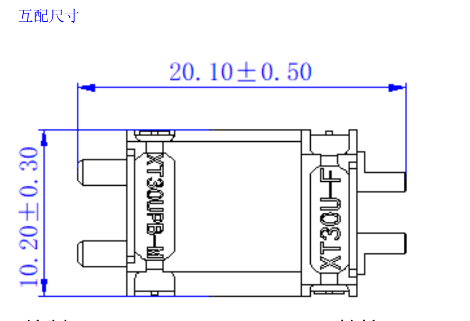
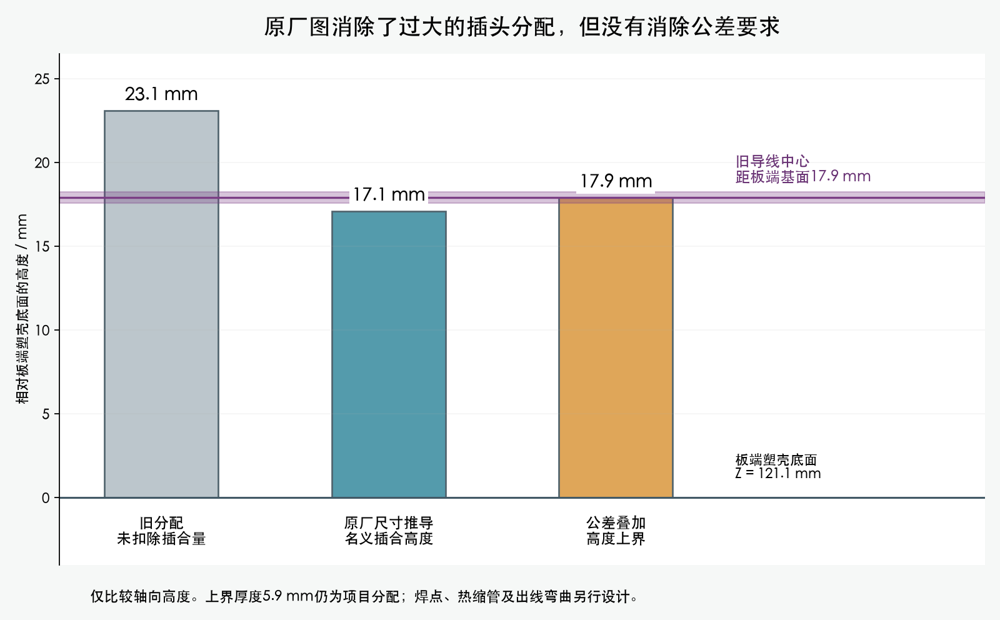

# AMASS XT30UPB-M / XT30U-F：已找到原厂互配尺寸

2026-10-03。通过[艾迈斯产品页](https://www.china-amass.net/xt30upb-m-product/)的 Specification Download，取得官方 `XT30UPB-FM.rar`。内含两份 2025V1 规格书。下载没有填写资料、联系厂家或下单。

本项目用板端 **XT30UPB-M**，配线端 **XT30U-F**。已目视核对 M 规格书第 1 页底部的互配图：左件标 XT30UPB-M，右件标 XT30U-F，不是把 UPB-F 的板对板尺寸移植过来。

| 字段 | 尺寸 / mm | 证据边界 |
|---|---:|---|
| 互配后两端最外端之间 | 20.10 ±0.50 | 2025V1 第1页直接标注，包含板端焊脚 |
| XT30UPB-M 板端焊脚 | 3.00 ±0.30 | 同页直接标注 |
| 插合后从板端塑壳底面到线端最外端 | 17.10 名义 | 上面两尺寸相减；是推导值，不是实测 |
| 上项按两个独立极限叠加 | 16.30～17.90 | 19.60−3.30 至 20.60−2.70；不假定公差相关性 |
| 互配图中的总宽 | 10.20 ±0.30 | 同页互配图直接标注 |
| 板端厚度 | 5.60 ±0.30 | 同页单件轮廓直接标注；不能据此独立认证线端厚度公差 |
| 板端总长（包括焊脚） | 13.70 ±0.30 | 同页单件轮廓直接标注 |
| PCB 推荐孔距 / 孔径 | 5.00 ±0.05 / 2×Ø1.80 +0.20/0.00 | 供应商推荐图；没有据此更改本项目 PCB |

旧检查把 **10.7+12.4=23.1 mm** 当作未扣除插合量的保守空间。这不能继续叫“插合高度未知”。新资料可以替代这一高度假设；旧检查和旧包络保留为历史证据，不静默改成已通过。

按现有电源板端基准 Z=121.10 mm，以上推导对应顶部名义 Z=138.20 mm，独立极限上界 Z=139.00 mm。此时旧 J1 径向线段正好处于 Z=139 mm，仍不能直接判定拥有足够间隙。需要以正确插合包络、焊锡/绝缘和出线空间重跑，而不是先为旧大包络切打印件。

不包含：焊锡和热缩管厚度、线材弯出过渡、完整胶壳 CAD、实际插接深度测量、装配拔插手位、真实尺寸公差检验。主模型和正式板卡未改；对插研究包络的最新独立复核见下方。

## 来源

- [原始官方压缩包](sources/XT30UPB-FM.rar)；[下载记录与哈希](source_receipt.json)
- [XT30UPB-M 2025V1 原厂 PDF](sources/XT30UPB_M_2025V1.pdf)；[完整页渲染](XT30UPB_M_2025V1.png)
- [XT30UPB-F 2025V1 原厂 PDF](sources/XT30UPB_F_2025V1.pdf)（仅存档，未作为本项目线端）
- [XT30U 2023V2 原厂 PDF](sources/XT30U_2023V2.pdf)；[完整页渲染](XT30U_2023V2.png)
- [归档内文件与哈希](archive_members.json)

全部字段属于 VENDOR_DOCUMENTED 或显式推导，没有 MEASURED 字段。未借此修改电流、温升或电气资格结论。

<!-- mating-replay:start -->
## 已按新资料复核

七个电源板XT30对插研究包络已在独立计算中重建；其余22个研究包络保持。主模型、PCB及真实硬件模型没有改。

| 检查 | 结果 | 范围 |
|---|---|---|
| 名义10.2×5.6×17.1mm插合包络 | PASS | 52个局部导线/Yaw实例及4条临时参考端子扫掠，对29个插头研究包络 |
| 10.5×5.9×17.9mm上界研究包络 | BLOCKED | 52个局部导线检查均未满足分配间隙，4条端子扫掠均占用预留空间；5.9mm线端厚度是显式假设 |
| 内收板端过渡，保留上界插头包络 | BLOCKED | 内收端点过渡已避开插头，但未找到完整四线方案；剩余受承重桥、既有线束及弯曲半径限制 |

这证明旧23.1mm空间确实过大；也说明只按名义尺寸放线不够。新的检查仍不包含焊锡、热缩管与实际出线，不能用名义PASS发布加工图。

[名义结果](nominal_replay.json) · [上界结果](upper_with_thickness_allocation_replay.json) · [身体端新尝试](../body_leads/documented_mate_prefix_pools.json) · [命令与版本](commands.json)。有限曲线家族失败不表示所有路线无解。需要继续完成走线和固定，这部分不能归入“等实物”。
<!-- mating-replay:end -->
