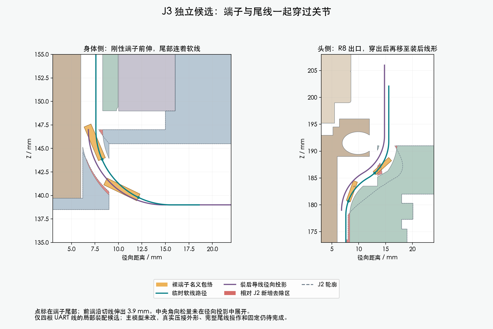
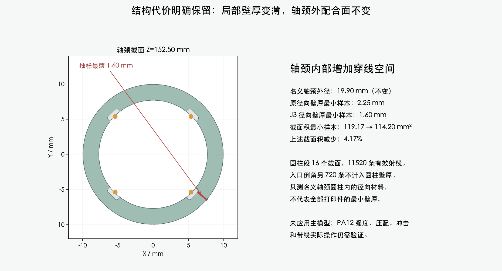

# J3：端子与尾线一起穿过偏航关节

**独立研究，整体线束仍为 BLOCKED。主模型、STL 和装配视频未更新；本页不是打印或线束加工放行。**

H06局部端子与随行软线的连续穿入包络、穿出后22个理线阶段、与另外3根已就位UART线的装入顺序检查通过；J3保存重载后的130个头部姿态也通过。两件打印候选仍未应用；头侧出口还留有薄边，完整固定、身体松散尾线操作、俯仰段/CAM和其余7根活动线未完成。主模型保持M1.47。

## 原厂资料与本次设计的关系

供应商按图制作已经由用户确认。已取得[JST SH官方目录](https://www.jst-mfg.com/product/pdf/eng/eSH.pdf)、[JST PH官方目录](https://www.jst-mfg.com/product/pdf/eng/ePH.pdf)、[AMASS XT30UPB官方产品资料](https://www.china-amass.net/xt30upb-m-product/)。本地来源、SHA256和限制见[A8接收记录](../receipt.json)、[端子工艺查询](../TOOLING_DETAILS.md)和[XT30互配尺寸](../amass_mating/README.md)。

SSH-003T-P0.2-H目录图的名义外形0.8×1.35×3.9mm用于穿装参考；这不是压接完成后的带公差CAD。Alpha2841/7的最大OD0.6604mm用于细线研究，未冻结订货后缀或声称动态寿命合格。压接查询还有来源版次限制，制线方仍需按具体线材、模具和适用文件确认。

## 这次补上的装配过程

J2只研究过裸端子自身的轨迹，不能替代带线穿装。J3让端子尾部沿导线中心线前进，刚性前端沿切线伸出3.9mm；软线始终接在端子后面。临时穿装半径位置为7.6mm，下、上转弯均为R8。只改变独立副本中的Yaw_Base、Pitch_Yoke，其余207个实体几何/位置保持。

名义穿线从下端R8弯前方3mm的暂存位置开始，不从PH胶壳开始；PH插头和身体端固定点尚未连接。穿出后，先径向移到6.8mm并调整上端高度，再引入中央角向松量。内部线长增加5.10mm，由松散尾线补入；这不是整束装配松量或裁切长度。

| 检查 | 结果 | 严格范围 |
|---|---|---|
| 端子与随行线的连续扫掠 | PASS | 4个入口方向，207个未改源实体/代理、29个对插分配、14根静态线；两件候选实物网格另行回读检查 |
| 保存重载后原料空间检查 | PASS | 名义端子净空下界0.306mm，名义线净空下界0.302mm |
| 穿出后的线形调整 | PASS | 22个规定阶段×4根线，共88项；第一段径向/高度调整有连续包络，角向松量引入只有11个有限样本 |
| 局部逐根穿线顺序 | PASS | 12组有向组合；端子、尾线及第一段理线扫掠均避开另外3根已处于最终零位的UART线 |
| 已装形状的头部运动 | PASS | 130个Yaw/Pitch组合、520个线/姿态实例，使用保存重载后的J3实体；其他两组局部线环的既有检查仍只代表包络 |
| 两件网格保存与拓扑 | PASS | 均为单个连通闭合网格、无零面积三角面；数值整理后对实际保存实体再次检查所需通道 |
| 全部打印薄边与强度 | NOT_TESTED | 已发现并标出出口薄边；轴颈截面采样不能代替全件强度 |
| 整束装配、手和工具、固定、实际制线 | NOT_TESTED | 身体松散尾线、PH胶壳操作、7根其他活动线、完整俯仰段与CAM、FPC仍未完成 |

上表PASS只指名义几何。候选仍用未完全确认的插头分配，不代表实际端子、摩擦/插入力、磨损或线材弯折寿命已合格。

## 结构代价和未解决的薄边

轴颈名义外径19.9mm保持。在圆柱工作段16个截面、11520条径向射线中，最小壁厚样本从2.250mm降到1.601mm。另一个入口倒角截面的720条射线不适用于恒径圆柱壁厚指标，已明确列为NOT_APPLICABLE，而不是漏检或自动通过。

截面积采用全部17个截面（含入口倒角）、限制在名义轴颈圆柱内；最小样本119.172→114.196mm²，减少4.17%。这是截面计算，不是承载/疲劳结论，也不是全件最小壁厚。

**头侧出口仍需清理：**在45°径向剖面，R13.50–13.777mm、Z190.166–191.00mm处有一片约0.277mm径向宽的薄边。它是J1运行线通道切出来、由J2/J3继承的材料，原主模型没有。偏离该剖面约±1mm后与主体相连，不是多出的独立零件，也不是法线显示问题。[来源与相邻剖面](upper_mouth_inspection.json)已保存。尚未盲目切除或宣称已经适合打印；需把通道出口整理成简单开口，并复核局部材料与功能面。

## 已处理的建模数值问题

早期构建把大量同向直线小段逐个并集，在Blender浮点存储后出现退化三角面。处理方式是把严格共线且方向相同的小段合并成单个端点凸包，再做原来的扫掠。没有放宽净空或网格验收门槛。旧失败结果保留在`history_initial_storage_fins/`；未加入理线微小包络时的失败结果保留在`history_feed_only/`。

## 可复查文件

- [独立可编辑Blender](cleaned/candidate.blend)：仅研究候选，未获应用确认。
- [连续穿装构建](candidate_screen.json)、[保存与回读](cleaned/storage.json)、[实际回读几何检查](reloaded_verification.json)。
- [理线阶段数据](relaxation_screen.json)、[逐根穿线顺序](local_wire_order.json)、[截面与功能件间隙](journal_sections.json)。
- [当前图像与报告来源清单](review_manifest.json)、[实际命令和复现命令](commands.json)。
- [身体端4线此前结果](../body_prefix_v2/index.html)、[完整项目状态](../../index.html)。

主模型SHA256：`bcaa5736a8cdf43441a6a83a6cb69606546cc01d2c0d28d98f4c09383e07368f`。硬件源文件只读。采购、制造、最终逐线加工图均未发布。
