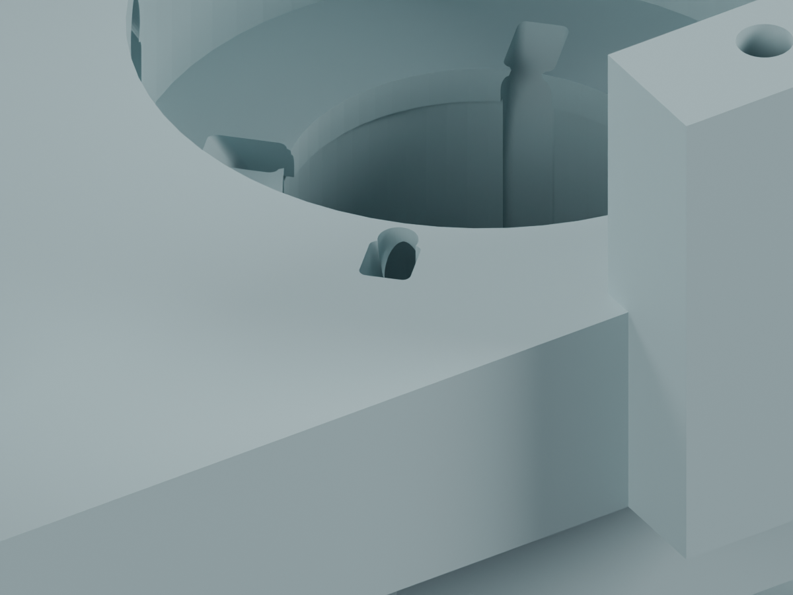
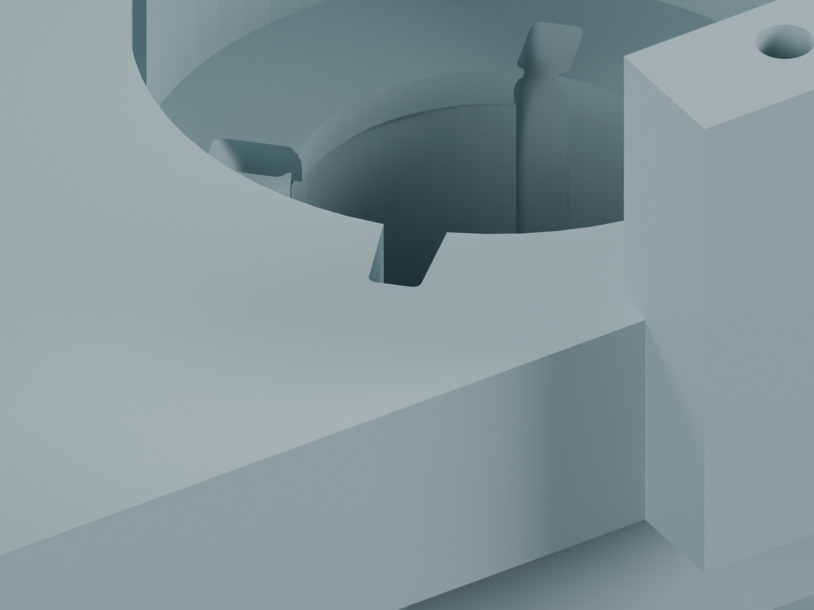

# J3M：穿线出口整理

**独立候选，未应用主模型；完整线束仍为 BLOCKED，不能据此下料或打印放行。**

J3M独立候选已把四处穿线出口薄边整理为连续开口；保存实体的穿装、130个头部姿态、局部相邻剖面和规定角向理线过程的连续间隙检查通过。轴颈壁厚样本不变。候选尚未应用主模型；完整固定、松散尾线操作、俯仰段/CAM、其余7根活动线和FPC仍未完成。

## 改了哪里

在J3两件打印候选的基础上，只进一步移除Pitch_Yoke四个出口上方的薄边，形成连续开口。
准确布尔构建共移除33.876 mm³，不增加材料、台阶、零件或紧固件。
开口限定在局部R12.5–19、切向±1.2、Z183.5–191.01 mm区域，功能轴线和轴颈不移动。
其余207个原有实体与主模型一致。这里的“四处开口”属于未应用的线束候选；正式M1.47没有这些通道。

## 已完成的数字检查

| 检查 | 结果 | 范围 |
|---|---|---|
| 保存重载拓扑 | PASS | 两件候选均为单个连通闭合网格，无零面积三角面 |
| 出口薄边清理 | PASS | 每版100个相邻剖面，局部孤立截面片92→0；检查保存后的实际网格 |
| 原通道保持 | PASS | Z183.5以下材料差异仅数值量级；轴颈最小径向壁厚样本仍1.601 mm |
| 端子连尾线穿入 | PASS | 4个入口；名义端子/软线间隙下界0.306/0.302 mm |
| 已装线形与头部姿态 | PASS | 130组合姿态、520线/姿态；209源实体、29对插分配、14根静态线 |
| 规定角向理线过程 | PASS | 64个自适应参数区间，包含区间内运动与曲线离散误差；弯曲半径下界7.955 mm |

角向理线是明确规定的运动学曲线，不是软线受力/弹性模拟。径向与高度调整沿用J3已检查的连续扫掠；88个有限阶段复核也保留。
内部补入的5.10 mm只是局部理线长度变化，**不是最终下料长度或完整装配松量**。
保留[J3逐根装入顺序数据](../local_wire_order.json)：导线路径与顺序不变，本次仅移除打印材料。

仍未证明全件最小壁厚、PA12强度、手部操作、摩擦、实际压接形状或动态弯折寿命。CAM插座位置/配套仍含照片估计，不能将目录候选当作实物确认。

## 原厂资料与待完成项

[JST SH原厂目录](https://www.jst-mfg.com/product/pdf/eng/eSH.pdf)和[JST PH原厂目录](https://www.jst-mfg.com/product/pdf/eng/ePH.pdf)已提供端子、线径与工具资料；[逐料号工艺查询](../../TOOLING_DETAILS.md)保留来源和版本限制。
后续需完成俯仰段与CAM、固定点、全部分支及加工长度。实际匹配和工艺仍需供应商按具体线材/端子确认，不要求用户代替检索公开资料。

- [独立可编辑Blender](cleaned/candidate.blend)
- [保存实体复核](reloaded_verification.json) · [薄边与相邻剖面](mouth_cleanup_audit.json)
- [连续理线检查](continuous_slack.json) · [轴颈截面](journal_sections.json)
- [图像来源](render_manifest.json) · [复现命令](commands.json) · [发布清单](review_manifest.json)
- [J3历史检查](../index.html) · [完整项目状态](../../../index.html)

主模型SHA256：`bcaa5736a8cdf43441a6a83a6cb69606546cc01d2c0d28d98f4c09383e07368f`。本次未修改硬件文件、STL或装配视频。
