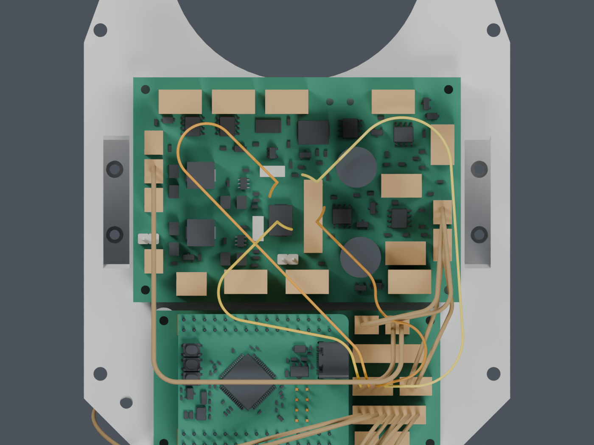
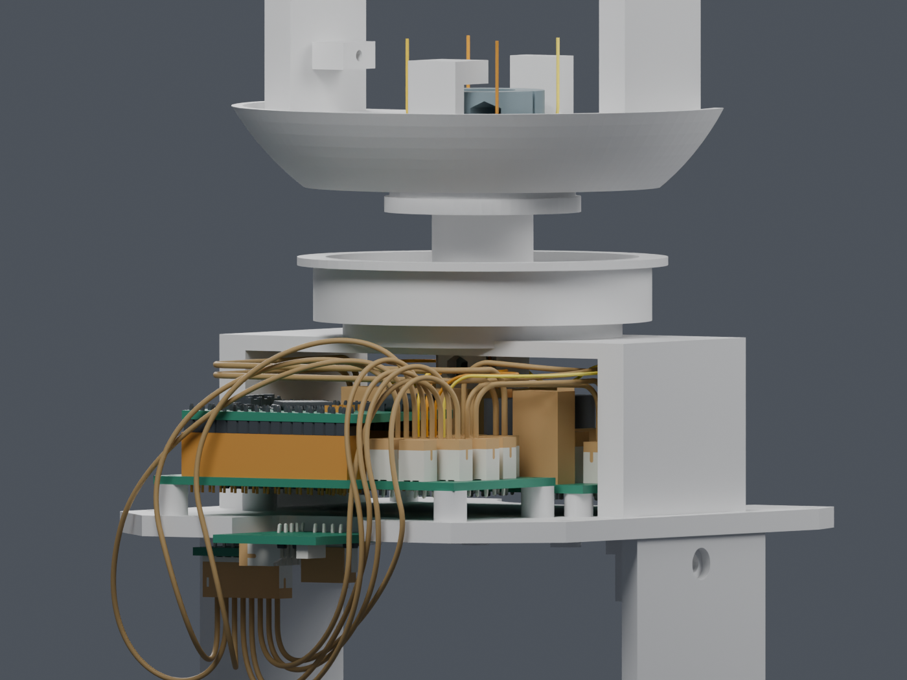

# H06：身体端四线已接通到偏航段

**这是独立候选，整体线束仍为 BLOCKED。主模型 M1.47 未改，不能据此下料或打印。**

H06四根UART线已从Motion J5分配出线面接到偏航上方暂存点；四线成组、209源实体/代理、29个插头包络及14根静态线的130头部姿态检查通过，四线间隙保守下界0.738mm。与另外两组局部Yaw线束包络也通过。尚缺固定、穿线/带线拆装、俯仰段与CAM连接，J2打印改动未采用；主模型保持M1.47。

## 具体完成的设计

四根线保留 Motion J5 的原针号与2mm针距，保留5mm轴向出线分配。随后使用R7起弯、相切圆弧/直线和降高过渡，分别到达中央偏航段的225°、135°、315°和45°入口。没有交换电气针序，没有挪动板卡或缩小硬件。

采用0.6604mm最大外径研究值，来自此前Alpha2841/7候选；尚未采购或冻结制线用料。端子真正出线面仍为分配值，真实SH/CAM配套接口仍待核实。

俯视图为看清走线，隐藏了承重桥、转台和反力件；电源板、运动板及插头包络保留。琥珀色是候选/预留物。图中的线交叉属于不同高度，间隙已按三维曲线检查，不能仅看二维投影判断。

## 检查结果与边界

| 项目 | 结果 | 覆盖范围 |
|---|---|---|
| 四根身体端线一起布置 | PASS | 全部6对，保留原针序；不是只找4条各自可走的线 |
| 接上已有偏航曲线 | PASS | 13个Yaw×10个Pitch，520个线/姿态实例，对209源实体或既有代理 |
| 29个对插包络、14根既有静态线 | PASS | XT30使用17.9mm高度上界；5.9mm线端厚度仍是显式分配 |
| 四线互相间隙 | PASS | 78项检查，保守下界0.738mm ≥ 0.3mm项目分配 |
| 非相邻线段回绕 | PASS | 52项检查；相邻2mm弧长由连续曲率形状单独约束 |
| 与另两组Yaw局部预留环 | PASS | 104项，间隙下界6.516mm；不等于另外7根线已完成 |
| 线束固定、供应商穿线及带线拆装 | NOT_TESTED | 不能拿装后形状代替装配过程 |
| 上方暂存点到CAM、完整俯仰段 | BLOCKED | 当前图中上端为明确的暂存端，没有假装已经接入板卡 |

圆弧身体段最小中心线半径7mm；偏航段沿用既定有限姿态曲线。这里是名义几何复核，不是运动寿命、受力变形或抗磨验证。

## 长度基准已建立，但不是加工长度

| 原针号 | 入口方位 | 身体段中心线 / mm | 到偏航上方暂存点 / mm |
|---|---:|---:|---:|
| Motion J5 #1 | 225° | 71.48 | 147.14 |
| Motion J5 #2 | 135° | 110.86 | 186.52 |
| Motion J5 #3 | 315° | 61.74 | 137.40 |
| Motion J5 #4 | 45° | 115.21 | 190.88 |

上述长度从分配的塑壳出线面算起，未含端子内部、完整CAM/俯仰段、固定及拆装松量、公差和剥线。禁止作为逐线裁切长度。四根线的各自长度在13个Yaw样本中保持；这也不等于真实柔性线束不会受拉。

## 还需要现在完成的工作

1. 身体端固定/应力释放，以及松开固定后的插拔和整机装配顺序。
2. 裸端子实际穿入与随后的柔线；旧J2参考端子扫掠不能直接代替本次完整带线安装。
3. 俯仰段、CAM配对接口和其余7根活动导线；焊点、热缩管与真实出线空间也要纳入。
4. 两件J2候选打印件的局部壁厚/承力复核，再向用户提交具体结构确认。未增加新零件，不代表可以跳过这一检查。

## 可复查文件

- [独立可编辑Blender](H06_BODY_TO_YAW_CANDIDATE_NOT_ADOPTED.blend)；[预览来源清单](preview_manifest.json)
- [四线成组选择](packing.json)；[130姿态及三维间隙](body_to_yaw_motion.json)；[曲线数据](body_to_yaw_curves.npz)
- [与其他两组局部环的共存检查](other_loop_coexistence.json)
- [实际高度带投影](corridors.png)；[独立路线候选池](dubins_pools.json)
- [命令和版本](commands.json)；[原厂插合数据](../amass_mating/index.html)

主模型SHA256：`bcaa5736a8cdf43441a6a83a6cb69606546cc01d2c0d28d98f4c09383e07368f`。硬件文件只读。没有更新主STL或装配视频，没有发布制造数据。
