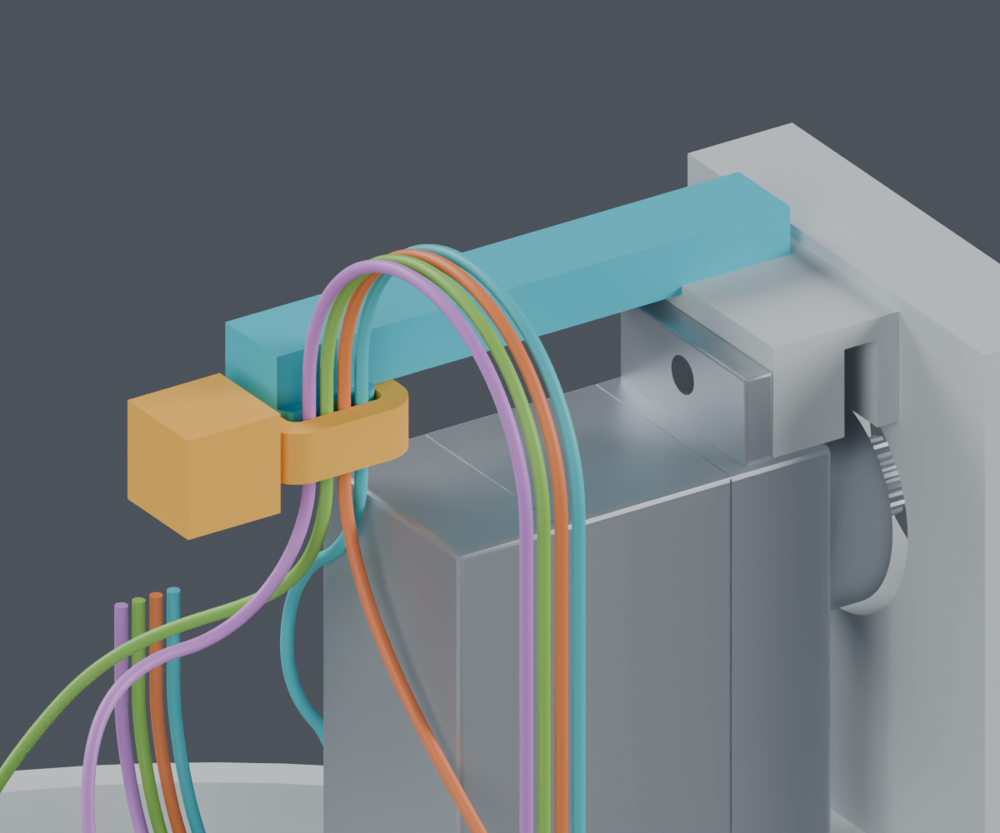

# CAM 四线：一处压线座候选

**独立结构候选，主模型未采用。完整线束仍为 BLOCKED。**

这次补了俯仰线环靠近 Yaw 一侧的固定座。小横臂与 Pitch_Yoke 一体打印，端部四条浅槽定位导线，外侧用一根扎带压住。增加 0 个打印件、0 枚螺钉，提出 1 根外购扎带；颜色仅用于说明。

青色为本次新增的压线座与横臂，灰色为原支架。黄色扎带及方块是保守尺寸占位：方块包住扣头各方向，**不是实际产品外形，也不是新增打印件**。线色只区分几何槽位。局部图隐藏其他支架、插头和外壳，避免遮挡；完整源实体仍参与相对姿态筛查。

| 检查 | 结果和范围 |
|---|---|
| 压线座与原支架连接 | 一个连续实体；梁截面4.5×3.0mm，根部较初稿扩大；未证明打印强度 |
| 压线座/扎带与源实体 | 每项2653次相对位置检查通过，覆盖13个Yaw与10个Pitch取值；有限姿态，不是连续碰撞证明 |
| 与四条已有线路 | 44条路线及4根夹持段实体扫掠检查通过；形状与前版相同 |
| 舵机装入 | 选择前移方案：按拆卸方向先+X6mm，再+Y6.5mm，再+X至35mm，最后上提；安装反向进行 |
| 舵机路径间隙 | 后三段存储实体的平移距离下界至少0.400mm；起始定位面的接触单独保留，不宣称全程正间隙 |
| 螺钉操作 | L形内六角钥匙−120°到+120°共121个样本无碰撞，角度跨度240°；手部空间尚未验证 |
| 保存后实体 | 两个候选打印件均封闭、单体，无退化三角面；207个其他源件保持 |

## 舵机如何放进去

不能沿原路径一直横推，压线座会挡住上安装耳。候选采用下面的台面装配顺序：先安装俯仰舵机，随后再装Yaw舵机、俯仰头框及线束。图按拆卸方向排列，安装反向进行。

| 步骤 | 相对安装位的平移（mm） | 图 |
|---|---|---|
| 0 就位 | (0,0,0) | [查看](removal_0.png) |
| 1 退出轴承与安装座 | (+6,0,0) | [查看](removal_1.png) |
| 2 向前让开压线座 | (+6,+6.5,0) | [查看](removal_2.png) |
| 3 移到开口中央 | (+35,+6.5,0) | [查看](removal_3.png) |
| 4 向上取出 | (+35,+6.5,+65) | [查看](removal_4.png) |

这是刚性零件路径，不包括手、舵机真实尾线、扎带尾端的穿入与剪切工具。另一条下移3mm路线也没有名义碰撞，但间隙只有约0.05mm下界，因此不选用。原直线失败和各次修复记录均保留。

## 扎带依据

已取得[HellermannTyton T18R官方产品数据](https://www.hellermanntyton.com/products/cable-ties-inside-serrated/t18r/111-01712)及两份官方图纸的网页提取数据：[CSC图](https://www.hellermanntyton.com/shared/assets/CAD_10-0585-001-CSC.pdf)、[CSH图](https://www.hellermanntyton.com/shared/assets/CAD_10-0585-001-CSH.pdf)。各地区版尺寸有差别，本候选按宽2.7mm、厚1.3mm、扣头5.3mm立方体上界预留；供应版次未冻结，安装状态为 ASSUMED。

直接下载返回403，记录在[下载回执](sources/receipt.json)。本轮使用的是官方网页工具读取的[逐项尺寸记录](sources/web_dimensions.json)，没有虚构已下载PDF的哈希，也没有把80N环拉断值当作扎紧力。

## 仍未完成

1. 其余固定点、应力释放和整体线束装入顺序；这一个压线座不能使整条路线自然保持设计形状。
2. 扎带穿入、尾端和剪切工具空间，以及压紧后对细导线的影响；不下发扎紧力。
3. 另外七根头部导线、CAM的实际互配件/针腔视图和完整相机FPC。
4. 供应商加工图中的最终端到端长度、公差、线材和压接组合；名义曲线长度不能直接下单。
5. 实物抓持、滑移、拉脱、PA12蠕变与弯折寿命。

供应商按图制作已确定；[之前的公开资料补查](../../supplier_made_harness/recheck_20261004/README.md)仍有效。公开目录中的尺寸与项目自己的布线/固定设计分开记录。

## 复查文件

- [独立Blender视图](review.blend)、[纯候选实体](candidate_v3/cleaned/candidate.blend)、[图像来源](render_manifest.json)。
- [局部实体与线形](candidate_v3/screen.json)、[保存后复核](candidate_v3/cleaned/storage_verification.json)、[舵机完整路径](candidate_v3/cleaned/servo_installation_replay.json)、[工具重放](candidate_v3/cleaned/tool_replay.json)。
- [复现命令](commands.json)、[本次来源清单](review_manifest.json)、[前一阶段四线连接结果](../cam_fan_in/index.html)。

原候选统计曾把121个角度样本乘2写成242°；新工具重放按端点差报告240°。网格修复采用1e-6mm合并，保存实体对目标布尔并集的双向顶点至表面最大偏差约0.000539mm，体积差约0.040mm³；这是数值检查，不是实物精度承诺。所有模型仍为 PROTOTYPE / UNVALIDATED。
