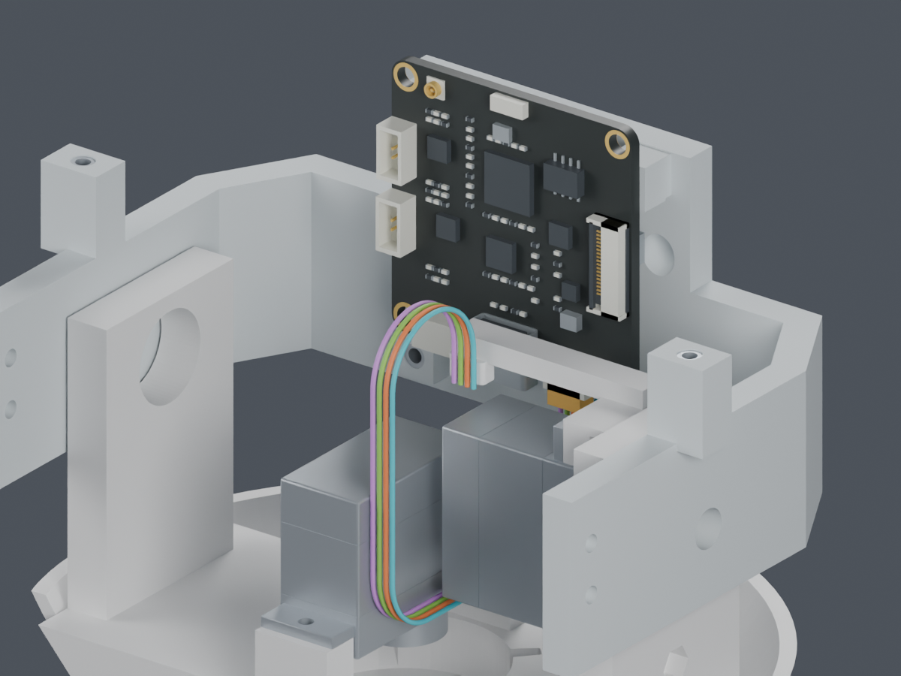
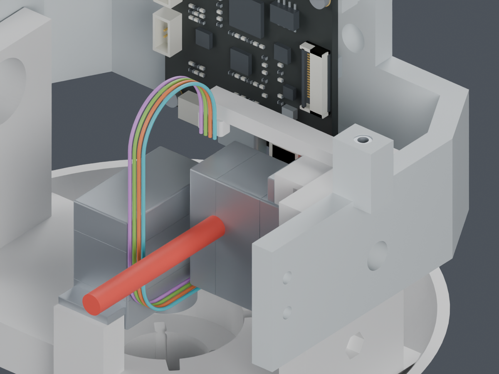

# 已有公开资料与CAM板后装研究

供应商按图制作已经确定，不再等待用户选择制作方式。完整线束图仍未完成；本页把公开资料、机械设计和实物验证分开列明。

## 能查到的资料

| 项目 | 已取得的厂家资料 | 还不能据此声称什么 |
|---|---|---|
| JST SH | [官方目录](https://www.jst-mfg.com/product/pdf/eng/eSH.pdf)：SHR-04V-S、SSH-003T-P0.2-H、尺寸、线规及绝缘外径 | 不能据此认定微雪板端就是JST原厂插座 |
| JST PH | [官方目录](https://www.jst-mfg.com/product/pdf/eng/ePH.pdf)：PHR-4、SPH-004T-P0.5S及适用范围 | 不能把不同端子型号的压接要求混用 |
| 压接工艺 | [PH系列指导表](https://www.jst-india.com/downloads/series/SPH-004-P0.5S.pdf)、[SH系列指导表](https://www.jst-india.com/downloads/series/SSH-003-02_SSHL-003-02_2.pdf)及[完整料号查询记录](../TOOLING_DETAILS.md) | 指导值不等于所选线材、工具组合已通过工艺验证 |
| 微雪CAM | [V1.1原理图](https://files.waveshare.com/wiki/ESP32-S3-CAM-OVxxxx/ESP32-S3-CAM-OVxxxx_Rev1.1.pdf)标有SH1.0四针UART接口 | 未给出完整插座厂牌料号及真实线端针腔视图 |
| SCS0009 | [厂家规格书](https://www.feetechrc.com/Data/feetechrc/upload/file/20220915/6379883463905538176347522.pdf)及项目留存的[参考STEP说明](../../supplier_made_harness/SOURCE_REVIEW.md) | 参考STEP不含原配舵盘；厂家网页25T与20T标法仍不一致，未冻结采购版次的传动接口 |

线长、分支、固定点和整机带线装配顺序由MORI项目设计，供应商目录不会提供这些尺寸。此前取得的文件和失败检索都保留在[公开资料复查](../../supplier_made_harness/recheck_20261004/README.md)。此次未获得能直接关闭实际CAM插座或舵盘缺项的新图纸。

## 更换装配顺序的独立尝试

原工序将CAM板固定在头托后，把整组下放42mm，受导线折回限制。本候选先让头托到位，再将CAM板暂时抬高6mm，插头从下方向上插合，最后板卡落座。四枚CAM安装螺钉暂不安装，四个嵌件留在头托。

图中只展示四根头部候选线段；颜色用于区分几何槽位，不是电气针序或最终线色。实际CAM插座、照片估算元件和两处未批准的扎带座仍保持原有证据限制。

| 检查 | 结果 |
|---|---|
| 7个板卡落座位置、9个插头进入位置 | 16个均PASS；完整曲线按离散位置检查，不是连续柔性运动证明 |
| 每根线的总长度 | 解析保持不变，不向身体侧凭空借42mm余线 |
| 最小曲率半径保守下界 | 7.1447mm，超过本次筛查值6.9342mm |
| 已检查位置的导线表面间距下界 | 0.3059mm，达到0.3mm要求 |
| CAM板与插头6mm连续刚性平移 | 各原始元件起止外凸包覆盖整段平移，未发现外部碰撞 |
| 板卡落座后的四枚螺钉工具 | 3处PASS；CAM_Mount_Screw_0的直柄PH1刀杆穿过Pitch_Servo，BLOCKED |

为保全真实空腔，连续板卡检查按原始132个组件索引逐件处理（排除自身UART互配件后为131件），没有把整板与背面元件之间的空隙当成实心。互配插座内的名义插合接触不作为外部障碍物；这不验证实际插入力或插合深度。

红色仅表示直径4mm、长60mm的直柄刀杆检查体。不是新零件，也不是打印件的切孔建议。另一个80mm长刀杆同样受阻。该失败只针对这两种直柄工具，不证明所有弯头工具或装配次序都不可能。

因此本候选没有批准为最终装配工序。下一步需要先解决这枚螺钉的工具/先后顺序，再闭合裸端穿线、线形形成、两处扎带收紧以及其余头部线、USB和相机FPC。最终裁线长度仍不发布。

## 保留的42mm滑动候选

另一个[独立检查](../cam_sliding_departure/screen.json)允许CAM端直线段随42mm下放缩短，15个姿态及[连续上部导线检查](../cam_sliding_departure/continuous_upper_wires.json)通过；但需要身体侧每根提供42mm余线。共同PH插头的暂存及全长守恒尚未闭合，不能据此声称完整装配可行。

主模型M1.47、config、STL、动画和正式硬件均未更改。没有新增永久零件，也没有订货、联系供应商或发布制造图。实体装配、PA12配合、压接和动态寿命仍需实物验证。

[独立Blender](review.blend) · [16个位置](screen.json) · [连续刚性路径及工具](verification.json) · [命令记录](commands.json) · [交付清单](review_manifest.json)
