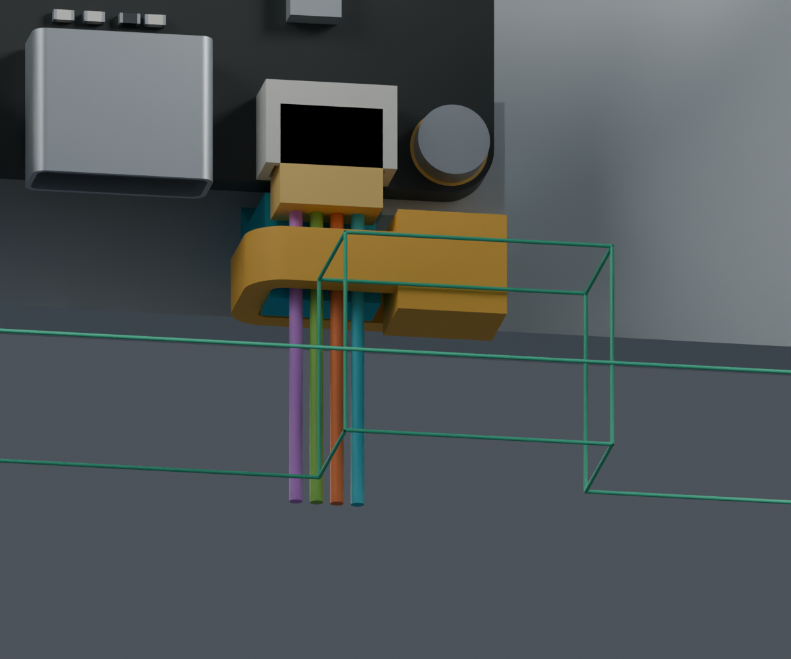
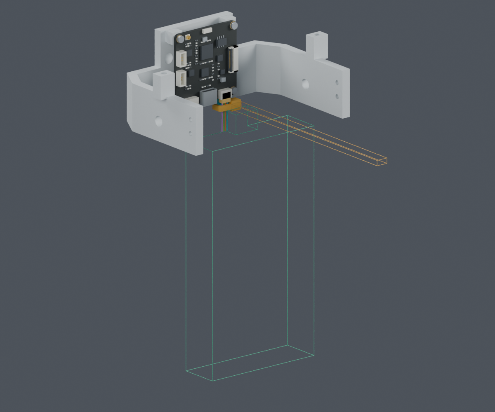
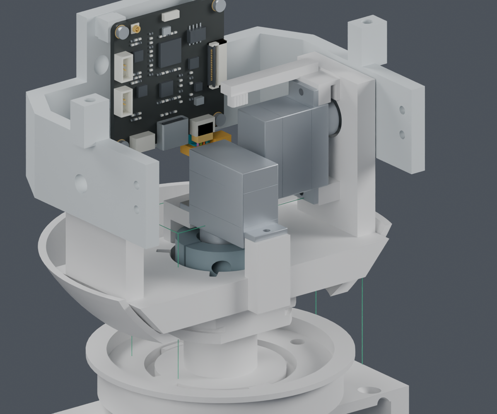

# CAM线束：操作空间与长度基准

**本轮完成两项数字工作：离机操作空间、四根路线的模型长度基准。完整线束仍为 BLOCKED，主模型仍为 M1.47。**

## 固定之后怎样剪尾

沿用已检查的[短固定座候选](../cam_pitch_anchor/index.html)，本轮没有新增或修改打印结构。CAM板先插线再装到离机头托；扎带剪尾工具朝下摆放，从下方接近，最后才整理俯仰线环。

青色为候选固定座，黄色是插头/扎带的目录尺寸空间分配，绿色线框是参与碰撞计算的实体工具包络边缘。图中四色只用于区分几何路线，不代表电气针序；导线仍只显示Z200–214.6mm的临时局部直段。

| 检查 | 数字结果 | 范围 |
|---|---|---|
| 剪尾工具朝下、直线接近60mm | PASS | 扩大的钳头/手柄实体盒连续扫掠；与离机板卡/头托最小名义间距2.14mm，与局部直线导线1.56mm |
| 扎带自由尾端工作区 | PASS | 所设6×110×2.7mm工作区，最近名义间距1.31mm；不代表手指空间或真实拉紧行程 |
| 工具朝上/横向 | BLOCKED | 与头托相交；仅排除本次工具分配和方向 |
| 斜向135° | 未采用 | 虽未相交，但对CAM板仅约0.09mm间距，继续采用向下方案 |
| 先形成最终线环再剪尾 | BLOCKED | 工具与既定线路的间隙检查失败，要求先剪尾、再理线 |
| 完整离机俯仰组件、拆下两片头壳 | 工具空间PASS | 包括光学支架及其硬件；不包括连接线束后的组件取出过程 |
| 留在机器人上、只拆头壳 | BLOCKED | 工具被偏航座、承重桥等下方结构挡住；不能声称可原位剪尾 |

工具参考[已归档的KNIPEX79 22 125目录尺寸](../cam_tie_install/sources/dimensions.json)，采用扩大盒体，未选购工具，也不是厂家完整CAD。工具与扣头/带身的0.25mm名义切面偏置是设计工作位置，不是工具精度或允许残尾公差。实际钳口、手部、拉紧力、抓持和绝缘压伤仍未验证。

## 四根模型路线的长度

测量基准是身体端Motion J5的**分配出线面**，沿当前规定曲线，到CAM目录/照片分配插头的**出线面**。表内含当前服务环，没有将端子内部长度、剥线长度或制造公差编成已知数值。

| 几何线号 | 身体端来源 | 全路线模型长度mm | 身体出线面至yaw夹持中心mm | 两夹持中心间模型长度mm | 实际裁线长度 |
|---|---|---:|---:|---:|---|
| H06-G1 | Motion J5.1 | 287.3 | 176.9 | 107.75 | 未定 |
| H06-G2 | Motion J5.2 | 327.9 | 217.5 | 107.75 | 未定 |
| H06-G3 | Motion J5.3 | 285.1 | 174.7 | 107.75 | 未定 |
| H06-G4 | Motion J5.4 | 339.6 | 229.3 | 107.75 | 未定 |

CAM夹持中心到其分配出线面均约2.60mm。两夹持中心之间约107.75mm，包含活动线环及相邻未被刚性导轨约束的曲段。

这次对13个yaw×10个pitch×4根线共520组保存曲线重新求长并检查接点，与来源模型长度差均小于0.003mm。该数值仅说明数字曲线一致；不是制造精度、实物线长公差或动态变形证明。

CAM侧实际针腔视图尚未确认，所以G1–G4只表示几何槽位，不是CAM pin1–4；不得据此接线。CSV文件有明确REFERENCE_ONLY标记，裁线列留空。

## 制作图与装配仍需要闭合的部分

目前J3穿装证据覆盖的是**先让未入胶壳的SH端子逐根穿过颈部**。它不支持把两端已装胶壳的整束直接穿过；也不能把相反方向的PH端子当作已验证。

已知顺序约束如下，并不是整束安装已经通过：

1. 逐根SH端子穿过颈部后，才完成头侧插壳；实际针腔视图及供货组装状态仍待定。
2. CAM插头先插板，再把板装到头托。
3. 离机操作、先剪扎带尾端，再整理最终线环。
4. 必须继续核对两个离机子组件之间的整段导线暂存、连接后的头部装入/取出，以及身体侧固定。

**不能把这些局部顺序直接串成一条已验证的整机装配流程。** 当前完整线束暂存和柔性穿紧仍为NOT_TESTED，CAM真实互配及端子端部修正量仍为BLOCKED。

裁线尺寸应由路线长度、两端带符号的端部基准修正及约定加工公差组成，不能直接把上表四个数字发给供应商裁线。供应商按图制作的路线已经确定，无需重复确认；目前没有联系供应商或发布加工订单。

## 文件

- [独立Blender](review.blend)、[工具及维修检查](work_access.json)。
- [长度和夹持基准报告](route_datums.json)、[长度表：仅模型参考](length_datums_REFERENCE_ONLY.csv)、[零位路线坐标：仅参考](route_reference_only.csv)。
- [原夹持座候选](../cam_pitch_anchor/index.html)、[原颈部端子穿装](../assembly_feed_v3/open_mouth/index.html)。
- [复现命令](commands.json)、[图像来源](render_manifest.json)、[交付记录](review_manifest.json)。

正式主模型、STL、装配动画和硬件文件均未修改。仍属PROTOTYPE / UNVALIDATED；所有PASS均限本页所述数字检查。
