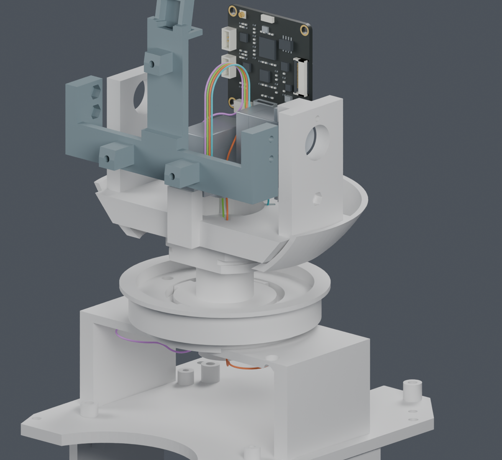
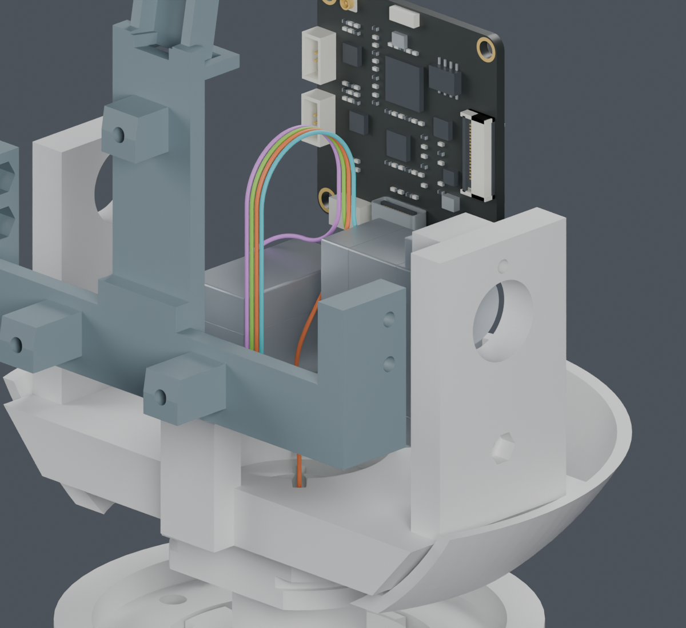
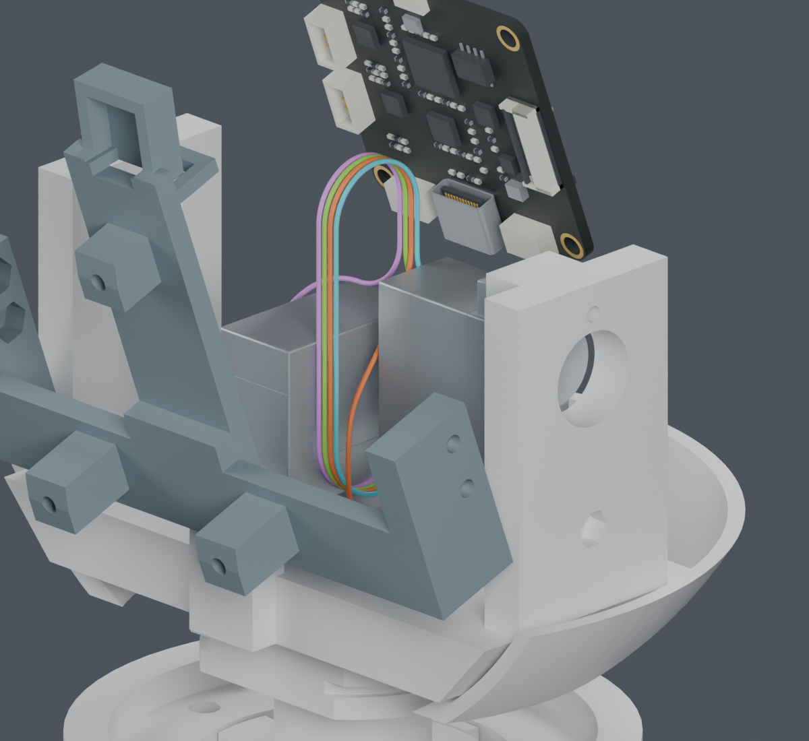
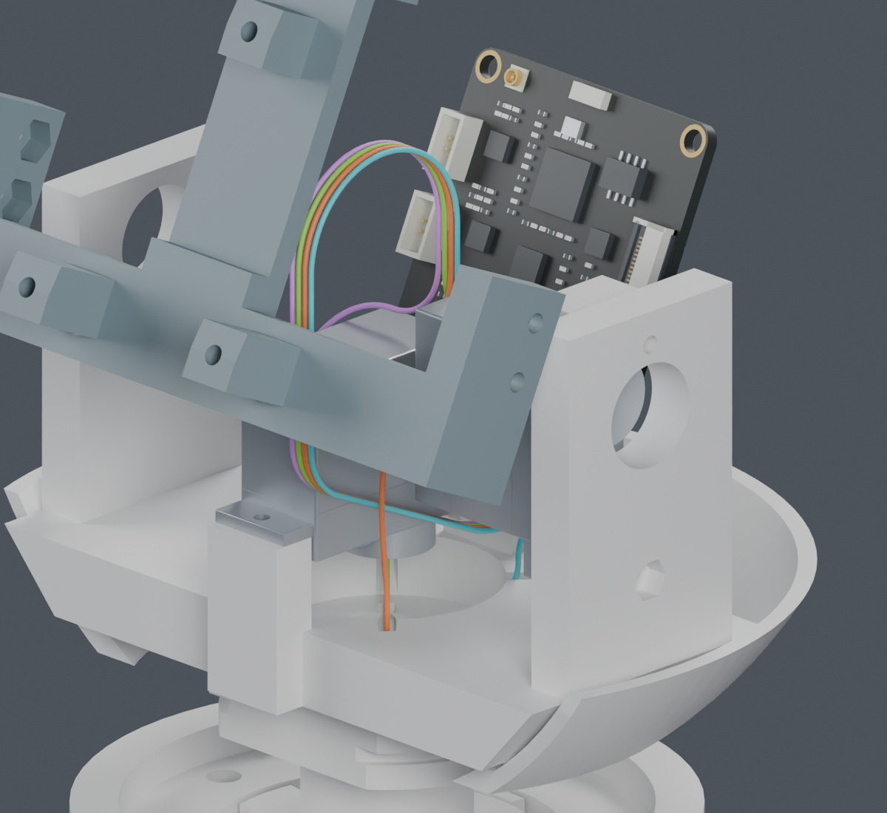

# 身体到 CAM：四条名义导线路径接通

**本轮完成过渡连接和四线共同排布。完整线束仍为 BLOCKED，主模型保持 M1.47。**

身体侧原路线在颈部 Z193 mm 接出，经各自的过渡进入 Z230 mm 的俯仰线环。相机端原有直段仅缩短2.5mm，之前的曲线和插头出线直段保留。四条路线现在首尾相接，无新增打印件；实际夹持座尚未设计。

| 检查 | 当前证据 |
|---|---|
| 新过渡的源实体、既有插头及静态线 | 12条候选逐一重放通过；相对姿态覆盖13个yaw × 10个pitch，即130组合 |
| 新过渡与活动线环、身体线段 | PASS；各候选检查自身接续、其他三根及相对运动 |
| 四条过渡同时存在 | 54个候选配对检查均通过，81种组合可用；展示组合为0/0/0/0 |
| 过渡之间表面间隙 | 下界不小于0.327218mm；名义要求0.3mm |
| CAM端四条线环间隙 | 下界0.305837mm；与身体线段共存检查通过 |
| 路线接续 | 130姿态共1560处接点；最大坐标差0.000007657mm，属于保存变换的数值误差 |
| 线环全俯仰范围 | −20°至+25°长度恒定，活动段72.610689mm；上部弧半径下界7.077939mm，下部7.5mm |
| 过渡整段曲率 | 全部12候选半径下界≥7.0mm；当前筛查值6.9342mm，不是动态寿命规格 |
| 未改段的证据继承 | 相机端仅删除直段尾部；保留段逐点一致，曲率下界7.2009mm继承原检查 |

## 三个头部姿态

图中隐藏部分壳体/器件，实体检查仍包含209个物理源件、29个插头分配和14条静态线。使用的是独立J3M打印件候选，不能把结果直接算作现有主模型通过。四色仅表示几何槽位，不定义供应商线色或针腔视图。

## 还没有完成的部分

1. 实际固定点和应力释放：路线中的固定坐标目前只是设计基准，不能保证自由导线会自然呈现图中形状。
2. 完整装入及拆修：此前局部松端子穿入检查，不等于本轮完整四线可实际装入。还需要连同固定结构检查装配顺序、手和工具空间。
3. 其余七根头部活动导线、相机FPC，以及照片位置误差与制造公差。
4. CAM实际互配料号、针腔视图、具体线材/端子/工具组合和供应商工艺参数。之后才能完成整根加工长度与公差。

0.306mm是名义模型的间隙下界，距0.3mm筛查线很近；没有包含实物误差。弧段解析界不证明连续姿态碰撞、弯折寿命或整机可靠性。所有模型仍为 PROTOTYPE / UNVALIDATED。

## 资料与复查

供应商按图制作已经确定；不再等待制作方式选择。[2026-10-04公开资料补查](../../supplier_made_harness/recheck_20261004/README.md)列明了已取得的JST官方数据，以及舵盘、WeAct、CAM插合/FPC等具体缺项。未取得的字段仍需进一步资料或实物确认，不是把全部检索工作转给供应商。

- [独立 Blender 检查副本](comparison.blend)、[图像来源](render_manifest.json)、[复现命令](commands.json)。
- [过渡候选](four_bend_transition/pool.json)、[独立重放和整束检查](four_bend_transition/packing.json)、[过渡整段数学界](four_bend_transition/math_bounds.json)。
- [CAM线环实体检查](short_tail_v2/screen.json)、[线环整束检查](short_tail_v2/packing.json)、[全角度线长/半径界](short_tail_v2/math_bounds.json)、[接点与直段裁短证明](joins.json)。
- [本次来源清单](review_manifest.json)、[之前尚未连接的阶段](../cam_parallel_pitch/index.html)。

早期尝试和失败日志原样保留。早期Bezier搜索记录中的connection_checks被覆盖为空值，不能作为通过证据；本轮packing.json中的individual_replay重新执行了全部12个候选的自交、相邻路线和源实体检查，并明确记录PASS。未完成的广泛搜索未用于本轮结论。
