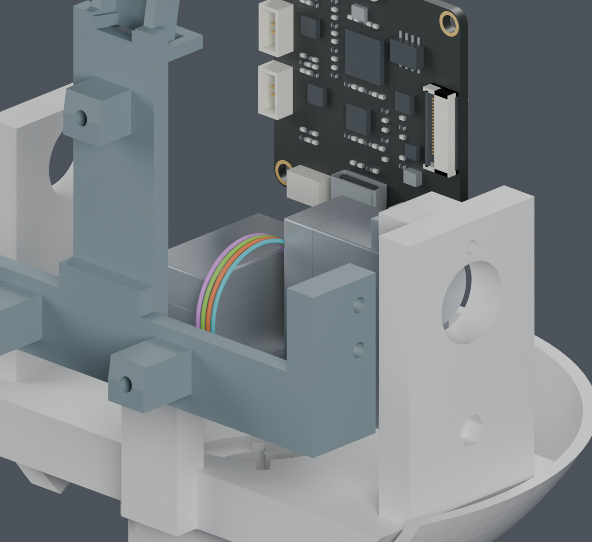
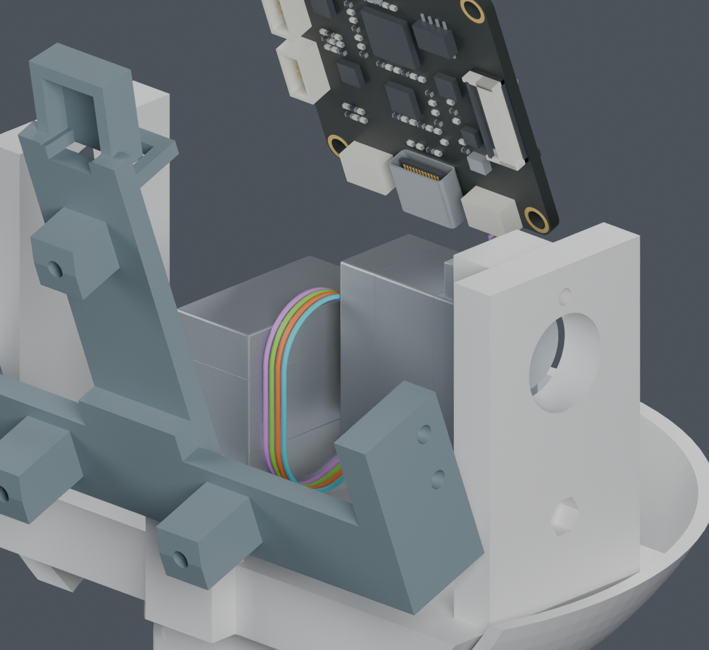
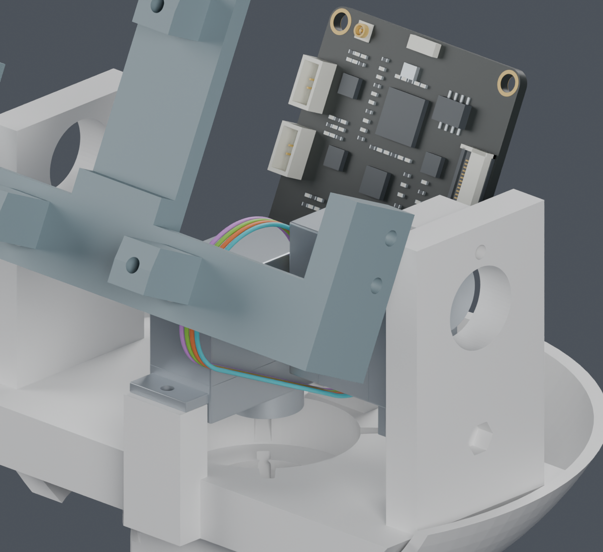

# CAM 端四线俯仰线环

**本次完成 CAM 端局部成组路线。完整线束仍为 BLOCKED，主模型保持 M1.47。**

之前把四根线分别优化，会在抬头时互相靠近。当前候选让四根活动线位于间距1mm的平行平面；前侧线段随俯仰变化，上方半圆的高度补偿长度变化。相机插头后先保留5mm直段，再缓慢侧移到两只舵机之间。

| 检查对象 | 结果与范围 |
|---|---|
| 源实体、29个既有插头分配及14根静态线 | 3组候选各130个 yaw/pitch 组合姿态 PASS；使用未采用的J3M局部打印候选 |
| 每根 CAM 端线自身及四根线相互间隔 | PASS；最小表面间隙下界 0.305837 mm，要求0.3mm |
| 与原身体侧四条线段共存 | PASS；每组2080个组合，间隙下界至少 3.980 mm；两端还没有连接 |
| 俯仰线环长度、圆弧半径、直段长度 | 整个−20°至+25°范围解析检查 PASS；活动段半径不小于7.5mm |
| 相机端侧移曲率 | 整段下界 7.2009 mm，筛查值6.9342mm |
| 连续角度碰撞、真实导线自然形状、弯折寿命 | NOT_TESTED；解析长度证明不代替这些检查 |

## 三个姿态

图片选择性显示CAM、两只舵机、俯仰座和显示支架，其余零件为看清路线暂时隐藏，实体检查仍包括它们。四色表示几何槽位，不能当作供应商颜色或针腔定义。线环下端为**临时接续基准**，未建夹持座，也未连接颈部原线段。

[独立可编辑 Blender 副本](comparison.blend)。没有修改正式模型、STL、动画、PCB或针序。

## 仍需在下图前完成

1. 把颈部原四个出线点接到新的线环基准，并一起检查线间距离与完整拆装顺序。
2. 设计真实固定和应力释放；涉及打印结构变化时，按既定要求先展示具体候选再确认。
3. 纳入其余七根头部活动导线、相机FPC及其插拔空间，检查照片位置误差。
4. 确定实际CAM插合料号、针腔视图和供应商采用的压接组合，再给整根下料长度与公差。

候选0的CAM端局部中心线长约101.12mm，仅从临时接续点到插头出线面。它不含身体线路、尚缺的过渡段或端子加工余量，**不是下料长度**。6.9342mm是参考线材数据形成的当前筛查值，不是动态寿命保证。

## 来源与保留记录

- [CAM板端照片复核及JST目录资料](../cam_pitch_flex/index.html)：板端照片映射已复核，实际针腔插合视图仍未确认。
- [固定出线](shifted_tail_screen.json)、[固定出线整段数学界](tail_math_bounds.json)、[线环源实体检查](following_arc/screen.json)、[整束检查](following_arc/packing.json)、[全俯仰区间数学界](following_arc/math_bounds.json)。
- [旧单独线环未通过的整束](../cam_pitch_flex/side/packing.json)、[本轮直下弯失败](tail_screen.json)、[固定前侧位置失败](arc_service/screen.json)保留；失败的有限路径族不能说明所有路线都无解。
- [命令](commands.json)、[图像来源](render_manifest.json)、[本次交付来源](review_manifest.json)。所有模型仍是 PROTOTYPE / UNVALIDATED。
