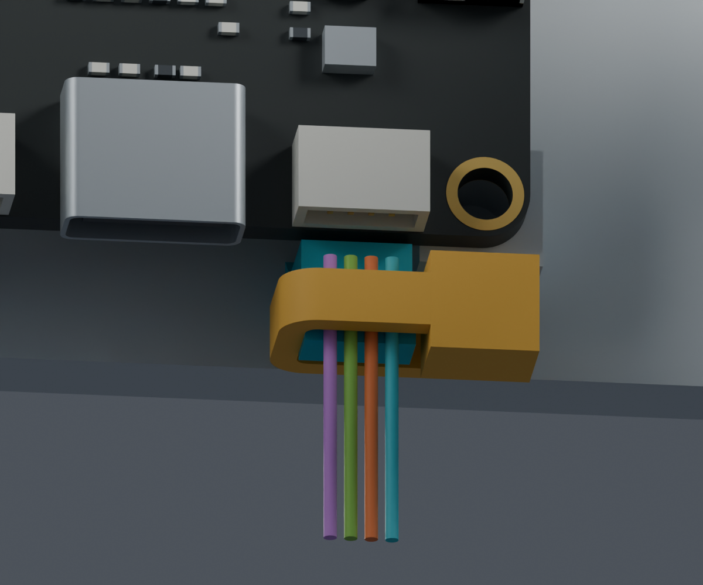
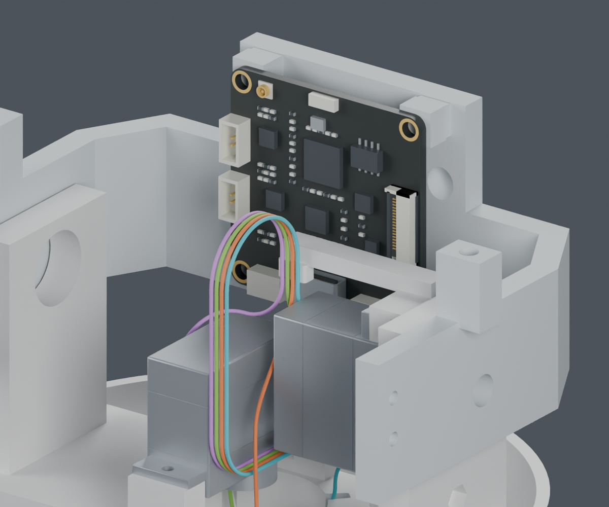
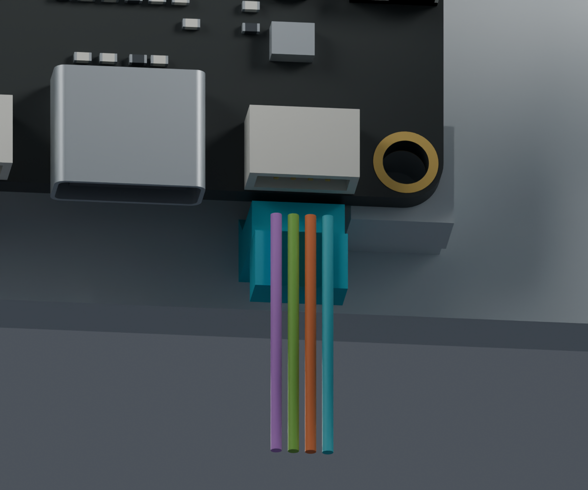
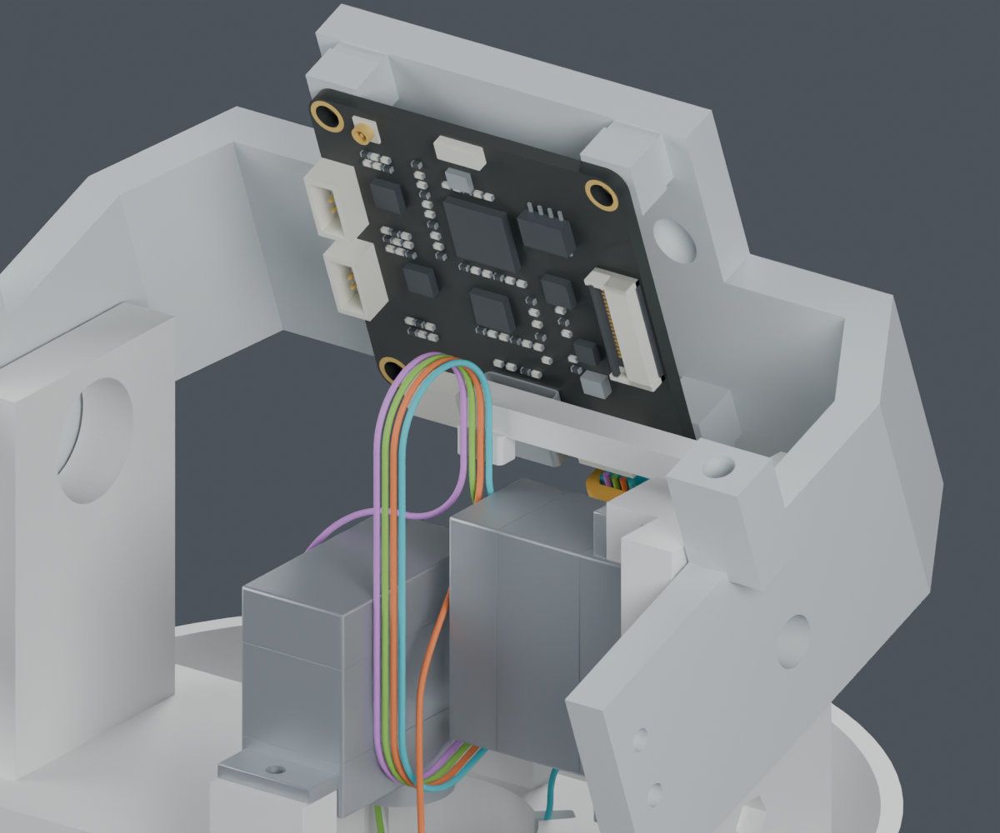

# CAM 插头附近的固定座候选

**局部候选已完成名义几何检查，尚未应用主模型。完整线束仍为 BLOCKED。**

供应商按图制作线束已经确定。标准资料继续由项目收集；MORI 的固定点、分支和长度基准需要由我们设计，不能把现有空间分配直接作为供应商下料图。

## 本次候选

在 CAM J11 的原有 5 mm 直线出线段旁设置短固定座，并入现有 Pitch_Cradle。使用一根 T18R 目录扎带空间分配，不增加打印件、螺钉或走线孔，不移动板卡、插头及已检查的四根导线。

青色为现有头托上增加的材料；黄色为扎带空间分配，并非完整供应商 CAD。四色导线只是几何槽位，不规定针脚或供货线色。局部图只显示 CAM 和离机头托，线段暂时保持竖直。

固定座用短连接接到后板，根部上表面连续倾斜，以增大与原板的连接截面。它替代了原先从显示支架延伸约 22 mm 到线环前端的尝试。这里仅确定应力释放位置，未证明 PA12 强度、抓持力或弯折寿命。

| 本轮检查 | 结果和边界 |
|---|---|
| 固定座与现有几何 | PASS，22590 次相对源件检查，包含 130 组头部姿态；最近名义间隙约 0.40 mm |
| 扎带本体空间 | PASS，近插头三个候选高度分别检查；当前选 Z212 mm；最近名义间隙约 0.60 mm |
| 既有导线 | PASS，600 条相对路线和 4 根局部直段；仅已完成的 CAM 四线和已有身体线路 |
| 连接实体 | 单一连续实体，和后板重合约 22.91 mm³；不是强度验证 |
| 保存到 Blender | 单一实体，其他 208 个物理对象保持；局部之外的几何差异受检查 |
| 完整线束、实际夹紧、柔性安装 | BLOCKED / NOT_TESTED，不能合并成整机安装通过 |

## 必须遵守的装配顺序

1. 在离机 CAM 板上先插入线束。
2. CAM 板连同插头、局部松弛导线一起装到离机头托。沿前后方向 20 mm 的 201 个位置采样通过；不包括完整线束尾端和手部。
3. 随后固定扎带、整理线环。闭环从下方预放的 121 个位置采样通过，但真实柔性穿带、扣合、拉紧和剪尾尚未完成验证。

**板卡装好以后，再把插头从下向上直接插入会碰到固定座。** 已保存该失败路径，不能把零件最终姿态不相交当作任意顺序都能装。

这四根线的全部路线保持原样。插头到活动线环之间仍是预设柔性线形，不是有刚性导轨约束的形状。实际运动中的变形、张力和触碰仍需验证；本轮没有发布最终裁线长度。

## 保留的失败尝试

- [原显示支架延伸](support_screen.json)：低头时只有约 0.01 mm 的局部间隙，未采用。
- [整体侧移](warp_v1/screen.json)、[只调整前段侧移](warp_v2/screen.json)：会碰到相邻过渡导线，未采用。
- [沿前方直段夹持](clamp_positions/screen.json)、[从下方夹持](clamp_below/screen.json)：与舵机或颈部结构冲突，未采用。
- [初版短根部](connector_anchor/root_v2_screen.json)及[其局部装配记录](connector_anchor/assembly_before_taper.json)是中间计算记录；当前依据下列 V3 根部、重跑装配和保存记录。

## 公开资料与待补字段

[JST SH 官方目录](https://www.jst-mfg.com/product/pdf/eng/eSH.pdf)提供胶壳、端子、线径范围和压接工具资料；已下载的 [PH 目录](../../supplier_made_harness/recheck_20261004/JST_PH.pdf)与[逐型号压接资料](../TOOLING_DETAILS.md)继续保留。扎带依据[上一阶段取得的官方图纸](../cam_tie_install/index.html)。

尚缺的是具体采购版本的匹配信息：SCS0009 舵盘/有效啮合和轴向叠层、CAM 插头真实互配与针腔视图、OV3660 完整排线、WeAct 成品孔和排针插接数据。[逐项补查记录](../../supplier_made_harness/recheck_20261004/README.md)记录了已取得资料和未找到字段；不把目录候选称为实物配套。

当前没有联系供应商、下单或修改正式硬件。主模型、正式 STL 和装配动画均未采用本候选。

## 文件

[独立 Blender](connector_anchor/review.blend) · [V3 几何检查](connector_anchor/root_v3_screen.json) · [装配顺序检查](connector_anchor/assembly.json) · [存储及图像检查](connector_anchor/render_manifest.json) · [复现命令](commands.json) · [交付清单](review_manifest.json)
