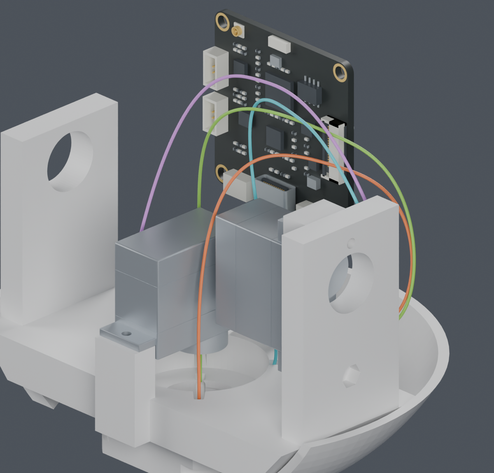
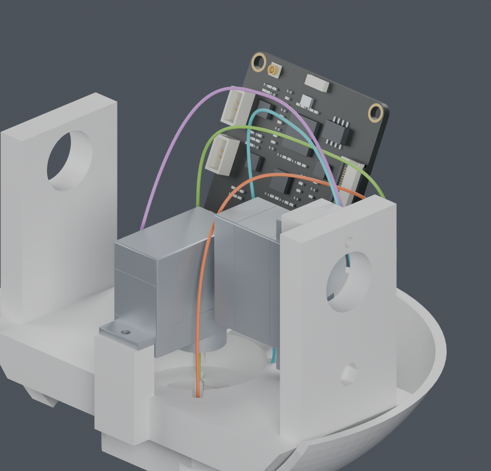

# 公开资料与头部活动线：已取得什么、设计还差什么

**完整线束 BLOCKED，主模型与装配视频没有替换。本页是设计研究，不是可交厂加工的图纸。**

## 公开资料已由项目查证

| 内容 | 来源与结果 | 仍不能据此确认 |
|---|---|---|
| SH、PH连接器外形与适用线径 | [JST SH](https://www.jst-mfg.com/product/pdf/eng/eSH.pdf)、[JST PH](https://www.jst-mfg.com/product/pdf/eng/ePH.pdf) | CAM实际采用的完整原厂料号 |
| 完整端子料号的压接参考 | [逐料号查询与新旧差异](../TOOLING_DETAILS.md) | 实际线材、工具、版本组合的工艺资格；查询来自test-jst公开主机 |
| CAM板端UART位置 | [硬件照片复核](../../../../../hardware/v1_2/cam_uart_photo_review_20261003/README.md) | 正对插合面的实际针腔图及线端镜像视图 |

官方照片芯片面正视、Type-C朝下时，UART上方左→右为 **GND、3V3、TXD、RXD**，对应现有逻辑4、3、2、1。
该照片在当前零姿态模型中的位置映射给出slot0..3→逻辑1..4，证据等级仍是**ASSUMED推断**，没有改正式针序。[只读接收记录](photo_receipt.json)。

“供应商按图制作”已经确认。公开器件资料由项目查找；路线、固定位置、分支与长度基准也必须由项目设计，不能以此交回用户或归为等待实物。

## 本次活动线路检查

从Z193临时偏航分段点连接到CAM端，建立保持长度的两段Bezier活动曲线。先保留向前出线的失败记录，再检查向左出线。
四根线合计19条单线候选，在130个组合姿态下通过源实体检查；拼接原身体前缀与CAM端后，自身和其他原前缀检查通过。
用De Casteljau细分及凸包界检查各Bezier段的全参数弯曲与长度；十个俯仰角度下，最大长度偏差上界为0.0000825 mm。
这覆盖的是曲线参数，不是角度采样之间的连续运动，也不是实物导线会自然保持这些形状的证明。6.9342 mm是本轮筛选半径，不是线材动态寿命承诺。

**整束检查没有通过。**对现有候选池的所有组合，尚未找到四根线同时满足0.3 mm表面间隔的路线。最优组合的最小间隙下界约-0.0435 mm；未降低间隔要求，也没有把单线通过当作整束通过。

图中只显示CAM、两只舵机与俯仰U托，其余实体为看清线路暂时隐藏；实体检查包含它们。四色为几何路径。此图不是固定点设计，导线当前没有按该姿态的真实保持件。[独立Blender检查副本](comparison.blend)。

## 已定位一个原因并验证局部调整

最紧的一对出现在抬头25°：首根线上行段靠近CAM末根固定出线。其位置在颈部暂存点以上几毫米，并不是上方大线环末端的随机交叉。
在原起点保留+Z切向，增加两个R7圆弧提前向+X侧弯，终点仍为+Z切向。局部候选与源实体、四个原身体前缀及四条CAM固定出线的名义检查通过；CAM端最小间隙下界0.462 mm。
该局部调整**尚未接回完整活动线**，也未解决其他线对间隔或固定问题。[局部结果](early_turn/screen.json)。

下一步应先重新衔接这个起点并检查四根线共同的活动区域，避免继续只优化互不相关的单线大环。之后完成固定点、装入顺序、照片误差包络、其余七根头部活动导线及FPC，才有条件给完整长度。

## 复现与边界

- [单线池](side/flex_pool.json)、[拼接与整束检查](side/packing.json)、[完整曲线数学界](side/math_bounds.json)、[每个线对的所有姿态](side/full_pair_diagnostic.json)。
- [首轮向前出线失败](flex_pool.json)、[小幅调整仍失败的记录](bundle/flex_pool.json)均保留；有限曲线族失败不表示所有路线无解。
- [图像来源](render_manifest.json)、[命令](commands.json)、[本页来源](review_manifest.json)。
- 配套舵盘、实际端子/线材/插合、PA12配合、固定强度、弯折寿命及整机性能的原限制保持。
