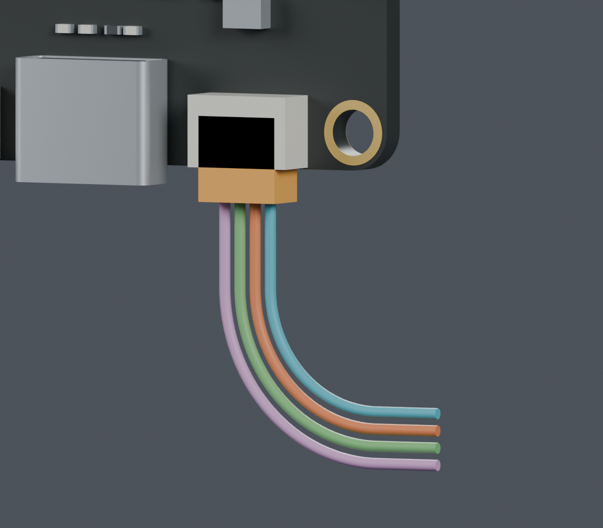
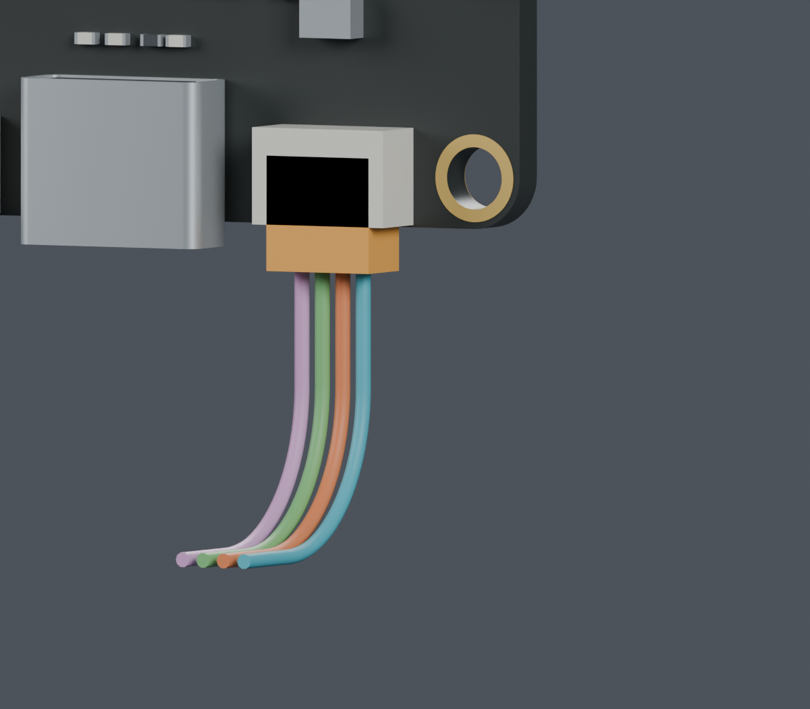

# CAM接线端：官方尺寸与条件性出线研究

**整体线束 BLOCKED。以下是独立路线研究，不是采购替换、最终线束图或主模型更新。**

## 原厂资料能补齐什么

- [JST SH公开目录](https://www.jst-mfg.com/product/pdf/eng/eSH.pdf)：SHR-04V-S无侧凸版本5×2.8×5 mm、1 mm间距；SM04B-SRSS-TB轴向长度4.25 mm；侧插配对长度参考6.25 mm。因此，以共同后端基准推导的前侧外露长度是2 mm。
- [JST PH公开目录](https://www.jst-mfg.com/product/pdf/eng/ePH.pdf)和[现有逐料号压接查询](../TOOLING_DETAILS.md)：提供两端端子、适用线径、配套工具和工艺参考。供应商按图加工的方式已确定，不需要用户代替检索这些公开资料。
- [微雪原理图](https://files.waveshare.com/wiki/ESP32-S3-CAM-OVxxxx/ESP32-S3-CAM-XXXX-schematic.pdf)只描述SH1.0 4P，没有完整厂牌/料号。本研究采用JST目录尺寸作条件性分配，**不能据此断言CAM实际装的是这只JST插座**。
- [JST CAD列表](https://www.jst-mfg.com/product/index.php?lang=2&series=231)列有相关STEP/2D数据，但链接进入个人和公司资料提交、邮件发送流程。本次没有提交资料或取得受该流程限制的CAD；使用的是公开目录。[来源记录](source_update.json)。

## 条件模型和检查边界

以已有官方照片定位的CAM UART口为基准，插头出线面约为Z214.600 mm；X/Y及实际插合位置仍属ASSUMED。
CAD里的橙色块是条件性插头包络；四色仅表示四个几何槽位，**不代表已核实的实物针号或线色**。
原有电气1→1等逻辑针序保持；不擅自指定插合面pin1。

检查只排除了CAM自己的UART配合件，保留PCB与其余元件。重构CAM实体与原检查缓存体积对称差0.004664 mm³，小于预先设定0.02 mm³数值门槛。
130个组合姿态下，名义插头和四根5 mm直段未检出材料相交；零位6 mm直线拔出扫掠也未检出相交。插头与PCB面按目录参考贴合，**未证明0.3 mm装配间隙或实际公差 fit**。
照片定位±0.4 mm、凸出高度±0.5 mm没有包含在这次名义检查中，实际配套、插入深度、卡扣和压接仍待确认。

## 两个CAM端候选

为看清端子与线，图片只显示CAM，其他支架暂时隐藏；几何检查使用全部源实体。完整场景保存在[可编辑比较文件](comparison.blend)。

| 局部形状 | 左转 | 前转 |
|---|---:|---:|
| 首段直线 | 5 mm | 5 mm |
| 圆弧中心线半径 | 7/8/9/10 mm | 4根均7 mm |
| 后段直线 | 4 mm | 4 mm |
| 四根线外表面间隙下界 | 0.3294 mm | 0.3294 mm |
| 本段名义长度 | 约20.00–24.71 mm | 每根约20.00 mm |

源实体及29个对插分配、14根静态线的130个相对姿态检查通过。这只完成CAM端一段，表中的长度不能用作供应商裁切长度。

## 同时装入后发现的问题，以及本次调整

两种端部候选分别看都避开实体，但与此前到Z206的四根偏航暂存线一起检查时相交：[旧组合失败记录](coexistence_screen.json)。固定原Z206分段，改圆弧顺序/半径/方向的30种尝试仍未找到满足全部条件的方案：[保留记录](departure_v2/screen.json)。这不是所有布线形式无解的证明。

Z206原本是**临时路线终点，不是硬件或已完成的固定点**。本次研究把其末尾13 mm竖直段截去，改以Z193为下一段活动线的暂定起点；每个新点严格位于旧直线上，不移动板卡、接头、支架或既有通道，不改变已通过的下面那段路线。

采用较低分段后，两侧仍彼此分离：130姿态×4CAM槽位×4偏航线×2方案，共4160组检查通过；左转最小间隙下界1.969 mm，前转4.672 mm。[完整检查和截取依据](lower_staging/coexistence_screen.json)。
**这尚未连接成一根线。**两段之间的恒长活动线、固定点、装入顺序、其余活动线和FPC仍需完成。不能把分开的两段无碰撞说成整束已完成。

## 文件和复查

- [插头与直出段检查](mating_allocation.json) · [局部出线](departure_screen.json) · [临时分段调整](lower_staging/coexistence_screen.json)
- [图像来源](render_manifest.json) · [复现命令](commands.json) · [发布清单](review_manifest.json)
- [J3M通道上缘清理](../assembly_feed_v3/open_mouth/index.html) · [项目状态](../../index.html)

主模型SHA256：`bcaa5736a8cdf43441a6a83a6cb69606546cc01d2c0d28d98f4c09383e07368f`。硬件文件、针序、STL、装配视频不变；没有订单或制造发布。
