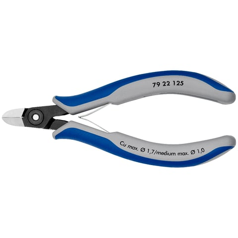
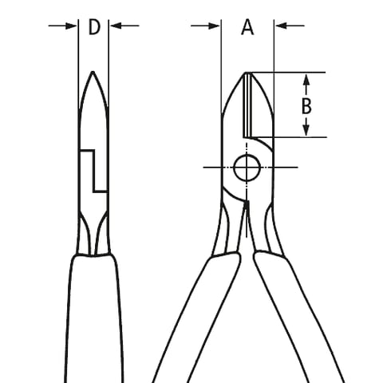
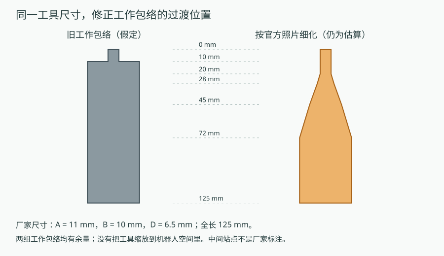
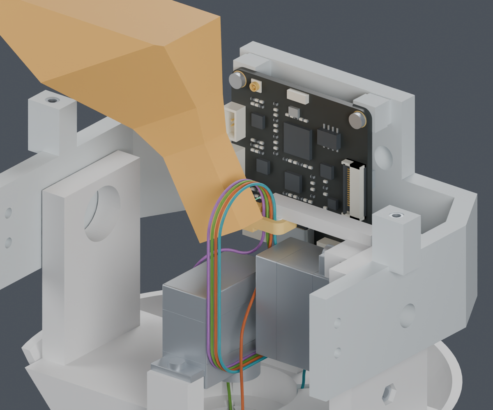
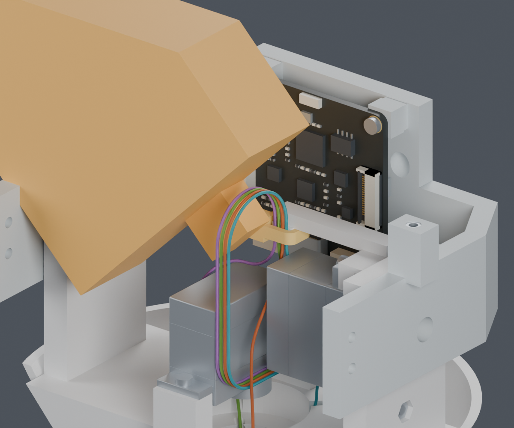
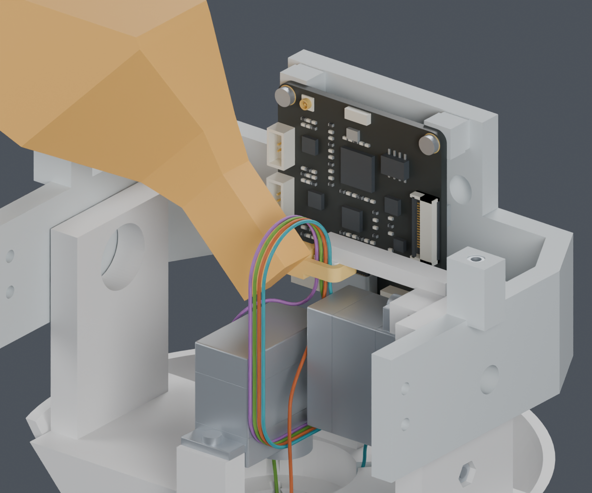
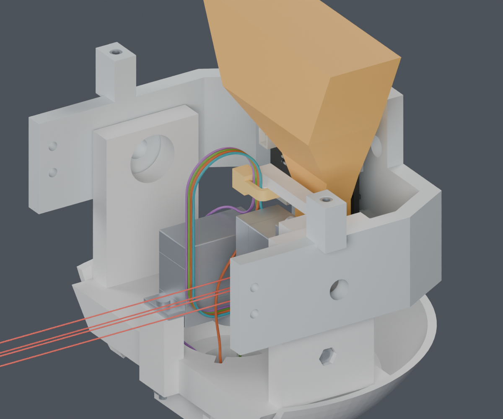

# CAM剪尾工具：官方资料与装后操作空间

**Yaw侧找到一个有余量的局部工具方向；完整线束仍为 BLOCKED。主模型 M1.47 未修改。**

供应商按图制作已确定。公开的连接器、端子与压接资料已经有[完整料号查询记录](../TOOLING_DETAILS.md)和[系列压接表](../CRIMP_REFERENCE.md)。MORI自己的路线、装配顺序和裁线长度需要由项目设计完成，不能把它们列成等待厂家提供的资料。

## 本轮找到的工具资料

KNIPEX 79 22 125的[官方产品页](https://www.knipex.de/produkte/elektronikzangen/praezisions-elektronik-seitenschneider-mit-geschraubtem-gelenk/praezisions-elektronik-seitenschneider-mit-geschraubtem-gelenk/7922125)和[官方数据表](https://www.knipex.com/sites/default/files/Product%20data%20sheet%20EN%2079%2022%20125.pdf)给出125×60×19mm、钳头宽A=11mm、刀口长B=10mm、关节厚D=6.5mm。厂家的[扎带应用说明](https://knowledge.knipex.com/en/why-is-the-oil-on-the-pliers-dark-brown)也列出此型号。

旧检查把62mm宽的手柄工作区直接放在距刀尖10mm处。10mm是厂家标注的刀口长度，不能据此认定宽手柄从这里开始。新包络保留原来扩大的13mm钳头宽度，以官方照片补出细颈和渐宽过渡；完整长宽和厚度没有按机器人空间缩小。

**证据边界：**长宽厚、A/B/D为VENDOR_DOCUMENTED；过渡站点、开口余量和切口工作位置为ASSUMED。不是完整厂家CAD，也没有实际工具测量。图中的实心橙色形状是工作占用区，不是剪钳的精细外观模型。此次没有选定或采购工具。

## Yaw侧：装好头托后斜向操作的候选

在同一套已经落座的CAM/头托、两只舵机及四根规定CAM线路上，对照旧包络和新包络各14个方向。旧包络没有通过；新包络30°、45°通过。两者都检查完整工具及沿其长轴60mm直线进出工作体积。

| 候选 | 原工作包络 | 加宽/加厚、过渡提前后的包络 |
|---|---|---|
| 30° | PASS；线表面间隙保守下界1.34mm，刚性件最小间隙2.14mm | PASS；线间隙保守下界0.66mm |
| 45° | PASS；仅参考轮廓 | BLOCKED；扩大后的过渡靠近头托 |

这里的扩大为工作包络宽度+2mm、厚度+2mm，中间过渡站点提前3mm；它只是明确给定的敏感性检查，**不是照片测量误差或厂家公差**。因此后续优先考虑30°方向，不把45°也列成稳妥方案。

局部图为便于观察，省略Z278mm以上的工具；[全工具图](yaw30_full.png)和实际检查都保留125mm全长。头壳、屏幕支架及未定型传动件尚未装入这一步。手部、刀片开合、夹紧力及真实扎带锁舌未验证；几何通过不能证明实际剪切完成。

## CAM插头侧：工具与尾端操作区分别看

在已落座头托上，工具本身在-15°、0°、15°三个方向避开刚性件和四根CAM线。但原先6×110×2.7mm的直向自由尾端操作区与Pitch_Servo相交，因此整步仍BLOCKED。红线表示这个操作区，**不表示真实柔软扎带一定沿这条长直线，也不表示实际扎带必须相交**。

暂缓安装两只舵机后，操作区避开刚性件，但仍进入规定的颈部引线余量。回放此前两条裸舵机装入路径，也先后遇到引线和Yaw扎带头；它们是具体路径失败，不是所有装法都被排除。

本轮前段另试的[保持线长、侧向展开的头托下放曲线](../cam_sequence_loose/screen.json)仍有引线余量或弯曲约束失败，没有采用。旧的42mm固定两端下放仍不能直接使用。

## 接下来还需完成

- 把CAM端预绑扎、Yaw端暂不锁紧、身体端松线暂存放入同一条可检查的装配路径；避免用固定两端的42mm抬升来替代真实工序。
- 补齐真实自由扎带尾端的操作形态和手部空间，再决定是否需要调整工序。当前没有新增孔、打印件或改变支架。
- 七根其余头部线、FPC、身体侧固定和完整插合视角针序仍待完成；四线模型长度不作为下料长度。

## 文件与复现

[独立Blender](review.blend) · [28组轮廓对照](screen.json) · [两处固定点26组检查](both_anchors.json) · [4组敏感性检查](sensitivity.json) · [后装舵机路径](late_servo_sequence.json) · [来源收据](sources/receipt.json) · [复现命令](commands.json) · [交付记录](review_manifest.json)。

主模型、STL、正式装配动画与硬件文件未修改。未发布制造图，未联系供应商或下单。
