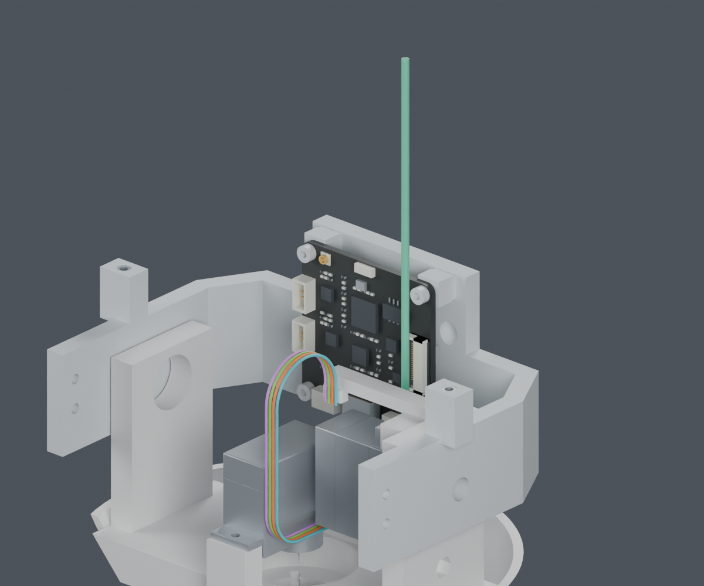
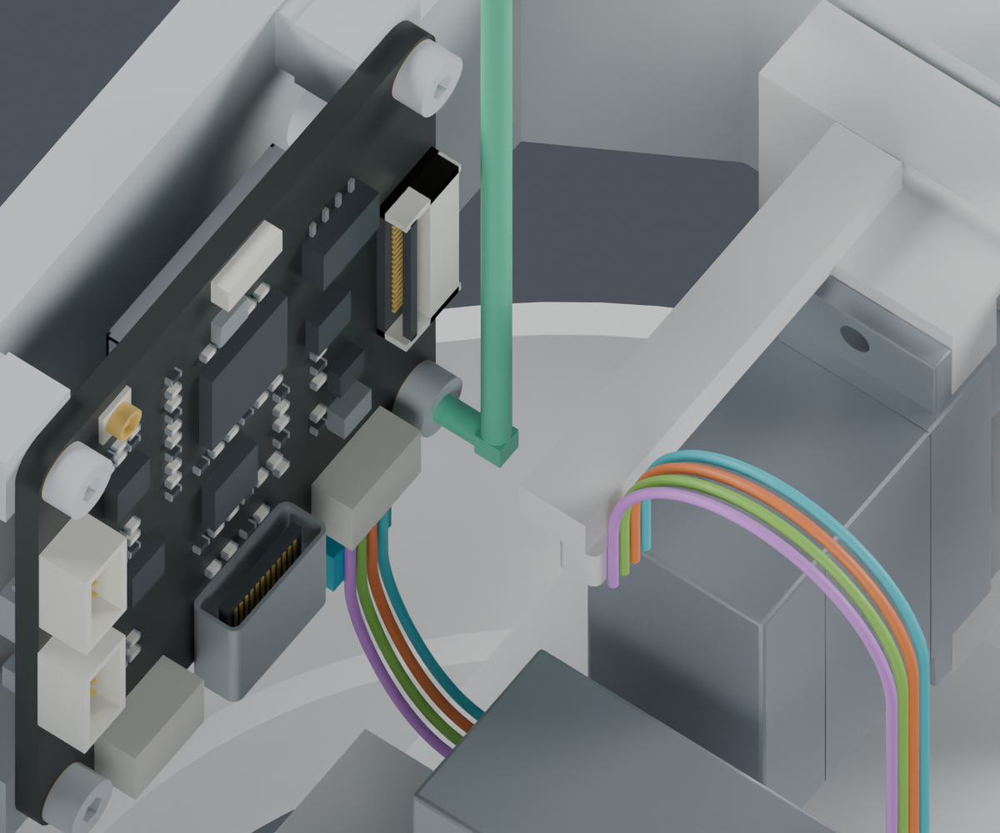

# CAM固定工具候选：四枚M2×5改内六角

本页是独立候选，尚未采用。供应商按图制作线束已经确定，公开资料由项目继续搜集；本次新取得的工具与标准螺钉尺寸，解决了前一版CAM后装工序的一个工具障碍。

## 推荐改动

只将四枚CAM固定螺钉从GB823十字盘头换成 **DIN912/ISO4762 M2×5内六角头**。孔位、5mm杆长、四个嵌件、板卡、舵机及所有打印件都不变。螺钉头由直径3.5×高1.4mm变为直径3.8×高2mm；零件数量不增加。

工具采用 **Wera 950 PKLS / 05022040001，1.5mm内六角，长边90mm、短边4.5mm**。用短端锁紧，长端向上伸出头框供握持。头部原有舵机耳螺钉也使用1.5mm内六角，不增加新的驱动规格。

绿色是扳手检查包络，不是新增的机器人杆件；方形转角包络有意覆盖未知弯曲轮廓。彩色线仅区分四条候选几何线，不代表最终针序或线色。两处已有线束固定座仍属于未采用的线束候选。

## 厂家资料

| 项目 | 来源与已知尺寸 | 证据边界 |
|---|---|---|
| Wera 950 PKLS 05022040001 | [官方产品页](https://www.wera.de/en/tools/950-pkls-l-key-metric-chrome-plated)，[保存的官方PDF](sources/Wera_05022040001.pdf)：1.5mm、90mm、4.5mm | 尺寸已公开；圆弧弯头不是厂家CAD，检查体按偏大的圆杆和转角包络构造 |
| Bossard BN610 1420569 | [厂家CAD目录](https://bossard.partcommunity.com/3d-cad-models/?info=bossard%2F01%2F01_100%2F01_100_100%2F01_100_100_10%2Fbn_610_612_31101%2Fbn_610.prj&languageIso=de)：A2、M2×5、头径3.8、头高2、内六角1.5、槽深至少1、螺距0.4mm | 按公开参数重建名义包络；没有冒充厂家STEP，没有拟合或验证真实螺纹 |
| VESSEL TD-74、ENGINEER DR-55 | [VESSEL](https://www.vessel.co.jp/english/product/screwdriver/250074)为18mm头；[ENGINEER](https://www.nejisaurus.engineer.jp/product-page/dr-55-%E3%82%AA%E3%83%95%E3%82%BB%E3%83%83%E3%83%88%E3%83%A9%E3%83%81%E3%82%A7%E3%83%83%E3%83%88%E3%82%BB%E3%83%83%E3%83%88-%E8%96%84%E5%9E%8B)为22mm头 | 不适用于原十字螺钉附近约14.71mm的轴向名义空间；不能因产品叫“薄型”就认定放得下 |

[来源文件与哈希](sources/receipt.json)。这里只提出机械选型，没有核价、下单或证明预算达标。

## 装配顺序与检查

1. 保留俯仰及水平舵机，暂不装显示支架和头壳。沿[前一版板卡后装研究](../cam_board_last/index.html)将CAM临时抬6mm完成插头插合，再落座。四条线总长不增加。
2. 三枚螺钉从上方送入，先在孔前8mm处对齐，再沿孔轴进入。右下CAM_Mount_Screw_2上方有板上器件，改从正前方沿轴送入；没有删除这个器件或更改PCB。
3. 短扳手从上方进入，用短边驱动。已检查从−30°到+30°的连续60°摆动，以及0–8mm连续轴向空间，覆盖拧入过程和退出1mm重新插入。完整工具、螺钉、所有现有舵机和四线都参与检查。
4. 线束固定及后续合壳仍按线束总工序继续完成；本页不将整机装配标记为完成。

| 检查 | 结果 |
|---|---|
| 四枚新螺钉在名义最终位置及装入路径 | PASS；保留每枚螺钉与其自身嵌件的螺纹配对排除，不排除PCB或打印件 |
| 扳手连续60°摆动＋轴向行程 | PASS；使用包围整个角度范围的外切扇形实体，不只比较几个角度 |
| 扳手从上方进入90mm | PASS；四处都检查完整长边与短边 |
| 入口握持区 | PASS；在工具上端额外检查直径18×长25mm的假设空间，不是手部动作或扭矩验证 |
| 新螺钉随头部转动 | PASS；yaw −60…60°、pitch −20…25°共130个姿态，与当前全部209个物理对象逐件比较 |
| 头部四线的板卡后装变形 | 两段6mm插合/落座过程中，连续线形对当时已安装实体、线与线及非相邻自接近检查通过；初始穿线成形及真实插合仍未完成 |
| 完整线束与制造放行 | BLOCKED |

按连续扳手工作体计算，最小名义间隙约0.43mm（到候选扎带）；到打印支架约0.58mm，到CAM板器件约1.29mm。不能把1.29mm当成整体最小间隙。这些是当前尺寸模型的计算值，CAM照片估算部件、真实工具弯头、打印偏差及手部操作仍需实物复核。

新增[连续线对实体检查](../cam_board_last/continuous_wire_solids.json)：把连接器插合与CAM板下落分成两个6mm行程，用曲线位移上界、真实结构件的距离及弦误差覆盖全部中间位置。共128个自适应区间全部通过，保留原0.3mm名义间隙要求和原有固定/出线接触区域；没有缩小线径或改变线路。初始姿态为头部机械零位，显示支架及头壳等尚未安装，具体零件清单见报告。

之后另补[连续线间检查](../cam_board_last/continuous_packing.json)，用14组固定/包围路线、解析分离界限和8个自适应区间覆盖四线及非相邻自接近，最小已证表面间隙下界约0.306mm。初次成形发现中途碰撞；[先抬高回环的候选与对比图](../cam_wire_forming/index.html)原41位置筛查之后，[加入散端子并检查连续过程](../cam_wire_forming/terminals/index.html)发现末段对头托间隙不足。1480个区间已证，原整段仍为BLOCKED；[最新逐根路线](../cam_wire_forming/lifted_end2/index.html)已从负侧绕开原相交位置，四线规定成形动作的连续检查和步骤衔接通过；板卡8→2mm连续下降也已通过。初始穿线、真实端子入壳、扎带及完整装配仍未完成。因此这些检查不是线束力学、初次穿线成形或整机装配完成的证明。

## 保留的失败路线

原直柄PH1刀杆会撞到俯仰舵机。另检查了[舵机后装的8条路径](../cam_servo_last/screen.json)：水平舵机保留时阻挡横移；两舵机后装的几条既定路径会触及已摆好的线形。这些失败只针对所测路径，不声称其他工序不可能。此次采用更换标准螺钉头型作为推荐候选。

CAM_Mount_Screw_2的垂直送入试验也保留在verification.json，候选选择已通过的前方轴向送入，不覆盖或隐去失败。

主模型M1.47、config、STL、动画及hardware均未更改。本候选采用与否按用户“有疑问先确认”的要求待确认。PA12强度、实物插合、紧固扭矩和线束动态寿命不由这些几何检查保证。

[独立Blender](review.blend) · [初步检查](screen.json) · [连续工作体/装入/运动](verification.json) · [实际命令](commands.json) · [交付清单](review_manifest.json)
