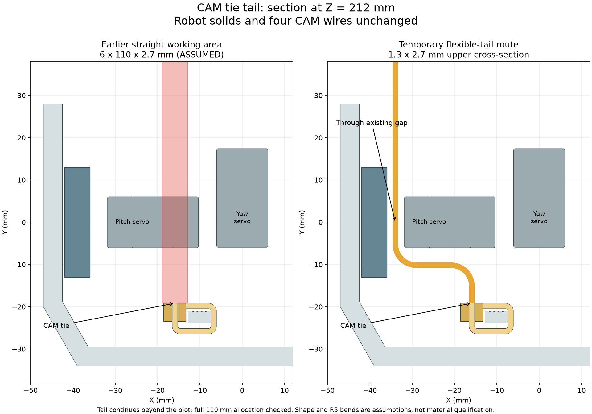
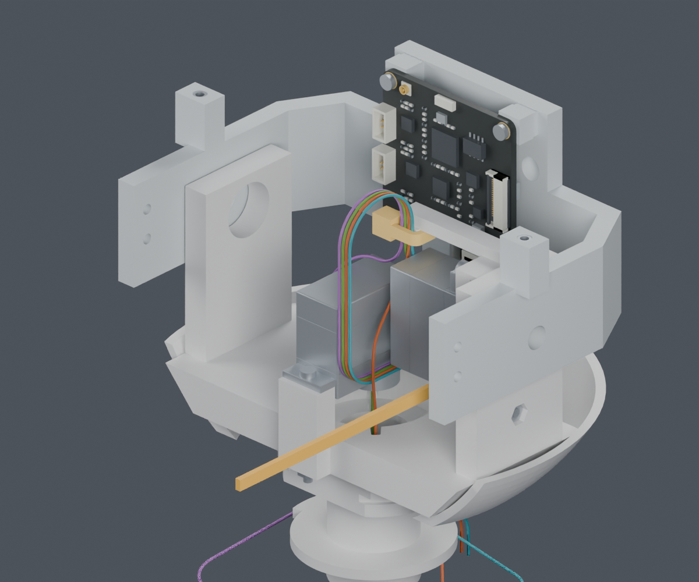
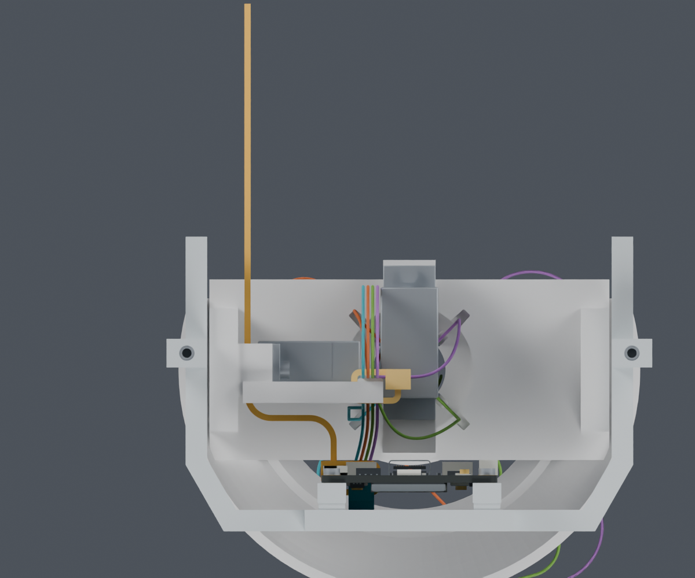

# CAM端扎带尾端：保留结构，利用现有侧向间隙

本轮局部临时尾端路径通过。完整线束、裁线图和整段带线装配仍为 **BLOCKED**。

## 公开资料和项目设计的边界

用户已确定供应商按图制作。公开的连接器、端子、适用线径和工具资料由项目检索；MORI的路线、固定点、端部直段、逐芯长度和安装顺序也由项目完成。

已取得的[JST完整料号压接参考](../TOOLING_DETAILS.md)保留原始查询和来源版本限制。当前可访问[JST SH目录](https://www.jst-mfg.com/product/pdf/eng/eSH.pdf)及[PH目录](https://www.jst-mfg.com/product/pdf/eng/ePH.pdf)。它们不等于已确认CAM板实际采购插座的完整型号和配对针腔视角。

[HellermannTyton T18R产品页](https://www.hellermanntyton.com/products/cable-ties-inside-serrated/t18r/111-01712)允许手工或工具安装；既有[三份官方尺寸图](../cam_tie_install/README.md)提供尺寸来源。厂家给出的最小束径不是本研究自由尾端的弯曲寿命或拉紧力证明。

## 这次修正了什么判断

旧6×110×2.7mm直线操作区穿过Pitch_Servo。它是人为预留的空间，不是柔软扎带实际必须占据的形状。按图纸带宽、厚度上界2.7×1.3mm，把临时尾端先向侧面绕，再从小舵机与座壁之间通过，局部可以避开零件和四根CAM导线。

右图橙色是安装时尚未剪掉的扎带尾端；**不是新增打印件、永久横梁或最终保留的凸出物**。全长110mm仍作为偏长的检查分配；真正成环后可用自由长度更短，不能把110mm当成采购或剪切尺寸。检查了整个带宽和厚度，剖面只用于说明路径。

## 实体检查

| 范围 | 结果 |
|---|---|
| 原先48个靠外侧的绕行形态 | BLOCKED，碰到座壁/头托；记录保留 |
| 位于舵机与座壁之间的36个形态 | PASS，刚性件和四根已规定CAM线路均无相交 |
| 选定例：先直行4mm、两处R5转弯、侧向列X=-34mm | 最近刚性间距0.50mm；导线表面间距下界3.65mm |
| 9个扩大/偏移检查：截面增加0.2mm，起弯和侧向列各偏移±0.5mm | PASS；最小刚性间距0.40mm，导线间距下界3.56mm |
| 保存后实体回读 | 单实体、闭合、体积与110mm带段核对通过 |
| 主模型/正式硬件/打印件 | 未修改；独立预览保留209件原有几何 |

上述R5及形状属于ASSUMED设计假设；偏移复核也不是厂家公差。扣头内孔、材料弯曲力和实际拉紧力没有被此检查认证。零件间距列排除了起点与本身扣头/已成环带身的预期接触。

## 完整工序仍需继续

局部尾端检查让“必须给110mm直尾再开孔或拆掉舵机”不再成为本阶段的依据。它没有证明初次穿带、手指/拉紧工具操作、剪钳真实刀口开合或整段导线的形成顺序。之前固定两端后抬升头托42mm的路线仍失败，不将该失败改为通过。

继续完成的设计工作包括：让CAM端预绑扎、Yaw端暂不锁紧、身体端松线暂存和最后定长进入同一装配顺序；补其余头部导线、FPC和身体固定。最终下料长度仍空缺，不能交供应商直接加工。

[独立Blender](review.blend) · [36个局部形态](inner_corridor.json) · [回读与扩大检查](verification.json) · [先前48个失败形态](screen.json) · [完整说明](README.md) · [命令](commands.json) · [交付记录](review_manifest.json)。
