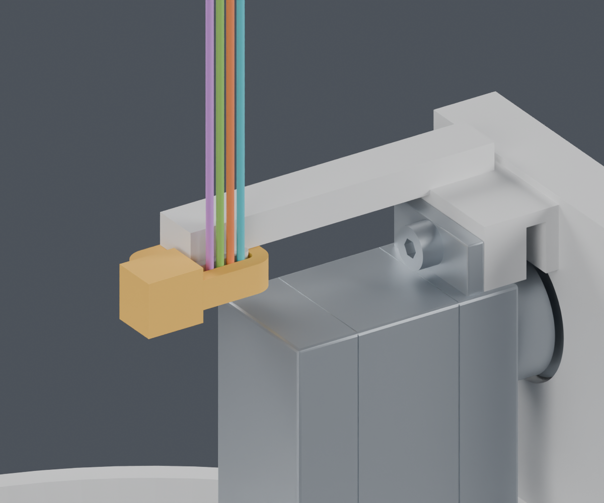
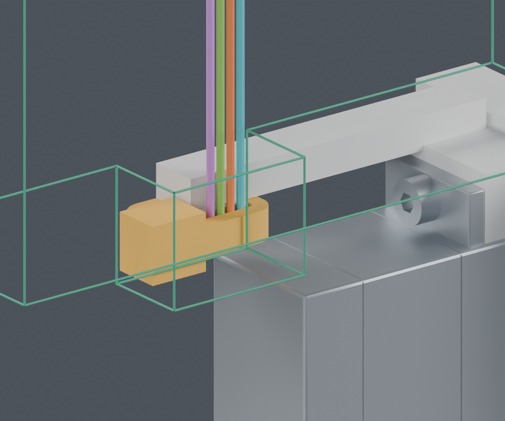
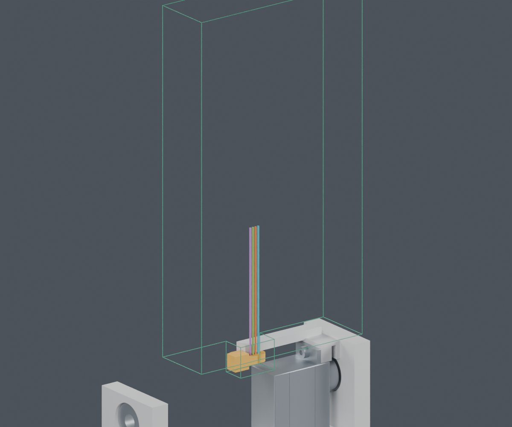
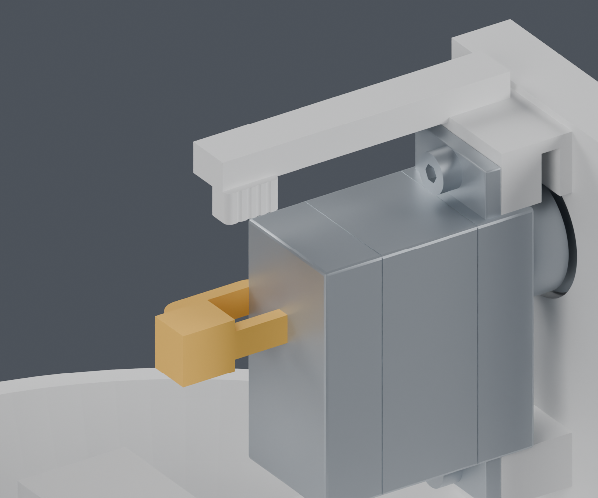

# CAM 扎带：官方图纸和台面操作空间

**来源和局部几何检查已更新；完整线束仍为 BLOCKED，主模型没有采用候选。**

## 公开资料已补到哪里

已取得三份 HellermannTyton T18R 官方 PDF，逐页看过并记录版本和 SHA256。
原来的直接下载403记录保留；本次通过产品页公开下载链接取得文件。

| 图纸 | 版本 | 日期 | 性质 |
|---|---|---|---|
| [CSC](sources/CAD_10-0585-001-CSC.pdf) | 10.1 | 2025-12-05 | 官方尺寸图 |
| [CSH](sources/CAD_10-0585-001-CSH.pdf) | 01.3 | 2019-11-27 | 官方尺寸图 |
| [CSE](sources/CAD_10-0585-003-CSE.pdf) | 01 | 2008-11-28 | 标有UNCONTROLLED DRAWING，仅作历史对照 |

各图的厚度和扣头公差有差异。当前空间筛查按带宽2.7、厚1.3、扣头长5.3×高4.3×宽5.0mm覆盖所查图纸上界，采购地区/版本尚未冻结。这些尺寸不代表实测。

图中带身从扣头侧面连出，回程带身穿过扣头。内部穿带孔中心、棘爪和安装弯曲形状没有完整标注；暂按图示比例分配孔轴，仍是ASSUMED。碰撞计算保留完整扣头盒，不用一个假孔制造间隙。

黄色为带身/扣头空间分配，不是精准成品CAD，也不是新增打印件。四色线为临时直段，起止Z229.9–274.9mm，线色不代表针脚。图中只显示台面子装配。

JST SH/PH胶壳、端子与适用线径资料已经取得；当前舵盘、CAM/FPC、WeAct等具体缺项见[公开资料补查](../../supplier_made_harness/recheck_20261004/README.md)。MORI分支、固定点和最终长度仍需我们完成设计，公开目录不能替代项目加工图。

## 这次核对出的顺序

1. 俯仰舵机未装时先预放扎带。对独立Pitch_Yoke作闭环从下向上的121个位置采样，未检出碰撞。这不是柔性穿带或收紧的证明。
2. 再按已有分步路径装入俯仰舵机。加入实际非空带身/扣头及四根局部直段后，1066个位置检查通过；相对于这些新增障碍的连续平移间隙下界至少0.81mm。原框架/轴承的检查仍由前一阶段记录负责。
3. 剪尾时保留前方工具入口，先不形成最终俯仰线环；图示临时直段放在工具后方。既定线环形成后会与这套工具包络相交。

这里是可继续细化的安装顺序，没有证明实际扎带可以按此形状穿紧，也未包含真实舵机尾线、完整CAM线束暂存和手部操作。

绿色线框是计算使用的实体工具包络边缘。参考KNIPEX79 22 125目录长125×宽60×厚19mm及钳头A11/B10/D6.5mm，额外留了开口余量；它是ASSUMED工具空间，不是厂家CAD或采购选型。工具从上方直线接近60mm的连续扫掠与台面子装配名义间距2.14mm，与临时线段1.56mm。手指、剪切力、真实铰链及钳口运动未验证。

不能把这几项局部通过合并成“扎带安装完成”。尤其不能沿用“先装舵机、再从下套闭环”的直观做法：该路线121个位置中93处与Pitch_Servo相交。

## 检查边界

| 项目 | 当前结果 |
|---|---|
| 带身非空且连续 | PASS，单实体，体积93.82193mm³，与解析截面×弧长差小于0.02mm³ |
| 有方向的扎带与源件 | PASS，每种后侧位置2653次相对位置；有限Yaw/Pitch样本 |
| 既有CAM线路 | PASS，44条路线和4个夹持直段；不等于压紧后绝缘不受损 |
| 舵机装好后从下套闭环 | BLOCKED，93个碰撞位置 |
| 先预放，再装舵机 | 局部刚性包络PASS；柔性穿带/尾线暂存NOT_TESTED |
| 剪尾工具与自由尾端空间 | 局部包络PASS；手部、钳口运动与实际切断NOT_TESTED |
| 既定最终线环与同一工具 | BLOCKED，四条线均有相交样本，要求先剪尾后整理线环 |
| 其余固定点、整束安装、七根其他头部导线/FPC | NOT_TESTED；完整线束仍BLOCKED |
| 最终下料长度、供应商加工放行 | BLOCKED |

本轮不改打印件和正式CAD。已形成的带身长度约26.73mm仅用于空间分配，不是扎带或线束下料尺寸。T18R80N是环拉断指标，不能当作对细导线的安装拉紧力。

首轮脚本因多边形方向错误输出空带身，检查被作废并保存在[无效记录](invalid_empty_band/README.md)。已修正方向，增加非空/单体/体积核对后，全部重跑；正文仅引用新报告，保留原始失败用于追溯。

## 来源与复查

- [扎带官方产品页](https://www.hellermanntyton.com/products/cable-ties-inside-serrated/t18r/111-01712)、[钳子官方尺寸](https://www.knipex.com/en-uk/products/electronics-pliers/precision-electronics-diagonal-cutters-with-bolted-joint/precision-electronics-diagonal-cutters-bolted-joint/7922125)。
- [下载回执](sources/receipt.json)、[逐项尺寸/假设](sources/dimensions.json)、[有方向的实体检查](oriented_tie_screen.json)、[台面顺序和工具](bench_access.json)。
- [独立Blender](review.blend)、[图像清单](render_manifest.json)、[复现命令](commands.json)、[交付清单](review_manifest.json)。
- [前一阶段压线座](../cam_anchors/index.html)。上一阶段的无扎带舵机路径仍保留；安装扎带时以本页追加的先后约束为准。

所有装配仍为PROTOTYPE / UNVALIDATED；打印强度、PA12蠕变、实际抓持、绝缘压伤与弯折寿命没有资格结论。
