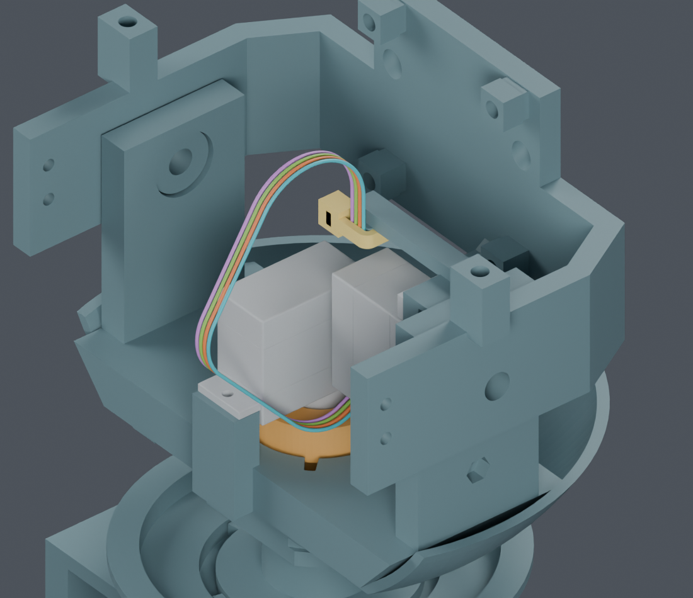
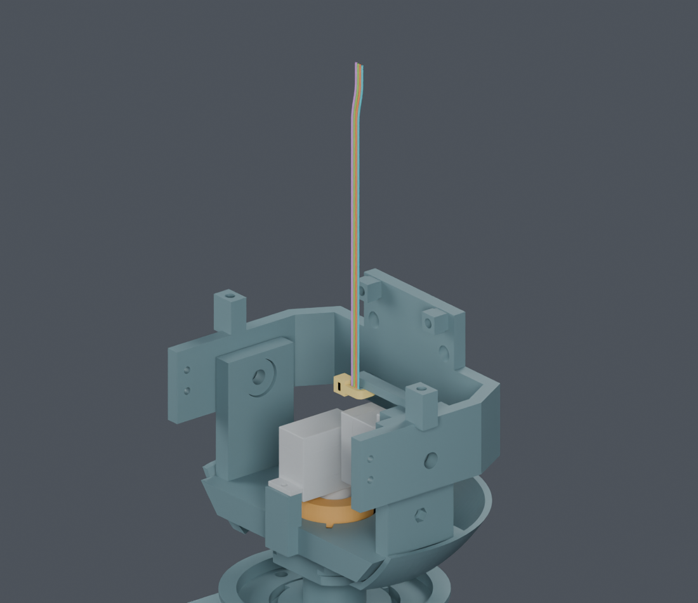

# CAM四线：插合、落座与成形工序

本页新增的是独立线束候选的装配研究。M1.47主模型、硬件、STL及正式装配视频均未改；颈部通道、扎带座和内六角螺钉候选尚未全部采用。供应商按图制作已确定，本页不是下料图。

## 最新补充：端子与连续成形对结构件

[端子与连续成形结果](terminals/index.html)：按JST目录0.8×1.35×3.9mm跨度加入散端子包络后，连续检查发现接近最终位置时端子对头托间隙不足0.3mm。1480个区间已证明，另31个末段区间未通过，完整覆盖未完成，原路线为BLOCKED。[当前路线](lifted_end2/index.html)：最后一根从负侧绕开原相交位置，四线规定成形动作与步骤衔接的连续检查通过；板卡8→2mm连续下降也已通过。初次穿线、端子入壳、扎带及完整工序未完成。以下保留最初41位置记录及其对比图，不能将它们理解为整段路线通过。

## 插合与板卡落座：连续几何检查通过

CAM板先保持在安装位置上方6mm，四芯插头从下方插合，然后板和插头一起下落6mm。头内曲线按规定方式变形，四根线各自的总长度保持不变。

| 检查 | 结果和证据 |
|---|---|
| 对该工序已安装实体 | PASS；两个行程共128个自适应区间，用位移上界覆盖连续过程，保留0.3mm名义表面间隙 |
| 四线相互间隙、非相邻线段自接近 | PASS；14组固定/包围路线、解析分离界限与8个连续参数区间；最小已证间隙下界约0.306mm |
| 对原有汇线段和身体引线 | PASS；沿用固定前缀，额外比较13个存档yaw姿态；不是所有运动导线的动态验证 |
| 弯曲半径下界 | 保持约7.145mm；不把目录静态弯曲要求当作动态寿命认证 |
| 真实插合、线材力学和手部操作 | NOT_TESTED；实际CAM插座及针腔视图仍未确认 |

[连续对实体结果](../cam_board_last/continuous_wire_solids.json)和[连续线间结果](../cam_board_last/continuous_packing.json)分开保存。原16个位置检查没有被改写成连续检查。最新连续检查发现末段端子间隙不足，路线仍需修正。

线间证明按几何分段：变形回环各自X坐标固定；尾段用能包含全过程的共同曲线包围，尾段横移区域与回环在Y向分开。回环与固定前缀使用连续位移界限。检查同一根线的非相邻段时，使用固定材料弧长的速度上界1mm/mm，并把数值弧长排除范围从2mm收紧为1.95mm，覆盖离散误差。包围线比实际任一位置长，不能把它当成新增线长或下料长度。

## 新发现：散线不能直接折成最终线环

把上方散线直接弯成最终线环，41个位置中有8个未通过。相交并不只是间隙下界不够：在成形参数0.825处，线中心落在反力连接件实体内，已保存[内部点证据](collision_witness.json)。图中橙色是被碰到的现有反力件，没有改它。

候选在成形中增加临时上方直段，同时等量缩短回程直段；各弯曲段逐渐转向，X方向过渡保持。这样3D总长不变，也不新增孔或打印件。额外抬高量按9×sin(πf)mm变化，最大9mm；上图f=0.825时约4.70mm，最终恢复原位置。

最大抬高6mm的试验仍受阻；9mm候选的41个位置全部通过原0.3mm线对实体间隙检查。**这份原始记录只是有限位置筛查；后续散端子与连续对实体结果见页首。线间、装壳和完整装配路线仍未完成。**

此时CAM板、显示支架及头壳尚未安装，CAM侧扎带未收紧。图只画出Yaw固定点以上四根线；黄色是Yaw侧的候选扎带，未收紧CAM扎带的最终闭环被明确排除。这一临时姿态允许导线伸到机器人上方，不是正常使用外形。本组早期图未画末端压接件，后续已另加入目录尺寸包络；四色仅区分几何线号，不能当作电气针序。

## 装配还欠哪几步

1. 把已检查的颈部逐根端子穿入，连接到本页的竖直自由端初态；需要完整松线形态及身体共同插头的操作。
2. 修正连续检查发现的末段端子间隙不足，继续核对2mm临时抬高候选、四线之间、端子对线和装壳工序。模型中CAM针腔位置含照片估计，不冻结插壳线序。
3. 补CAM侧扎带初次穿入、收紧与尾端剪切的连贯工序。既有剪钳和柔软尾端局部通过不等于这一整步通过。
4. 形成线路后，按已验证的6mm插合/落座过程装CAM板；四枚内六角螺钉方案仍待用户确认。
5. 其余七根跨关节功能线、USB完整尾线、LCD排线、相机FPC及身体固定继续完成后，才能生成正式线束分支和裁线图。

主模型未修改，没有采购或制造放行。实物压接、夹持力、PA12配合和弯折寿命仍需到货验证；上述未完成的数字工作不能统称为等实物。

[独立Blender](review.blend) · [直接成形筛查](screen.json) · [抬高候选](raised/screen.json) · [螺钉待确认方案](../cam_socket_tool/index.html) · [命令](commands.json) · [交付记录](review_manifest.json)
