# 当前结果：四根CAM线的规定成形动作连续通过

最后一根线改为从负侧小角度绕开，再逐步回正；原来从48°直接归位的相交路线保留为失败记录。按几何槽位3→2→1→0操作，四段动作共8681个自适应区间完整覆盖，每段起点到终点均已检查，8个边界姿态与下一步骤保留的导线和端子一致。

| 项目 | 当前结果 |
|---|---|
| 四根线各自从初始竖直姿态弯至临时落座姿态 | PASS；四段连续覆盖0→1，固定的其他三根线、上游线和身体段始终保留 |
| 普通线间及线对结构 | 保持0.6604mm线径与0.3mm筛查裕量；既有功能接触区按原定义检查 |
| 目录尺寸重建的散端子 | 名义不相交；不是实物压接轮廓认证，也没有声明通用0.3mm端子操作裕量通过 |
| CAM板8→2mm下降 | 先前的1057个连续区间检查保持PASS |
| 颈部穿线到初始姿态、端子入壳、扎带操作 | 尚未连成完整工序 |
| 其他七根跨关节线、排线及最终供应商裁线图 | 未完成 |

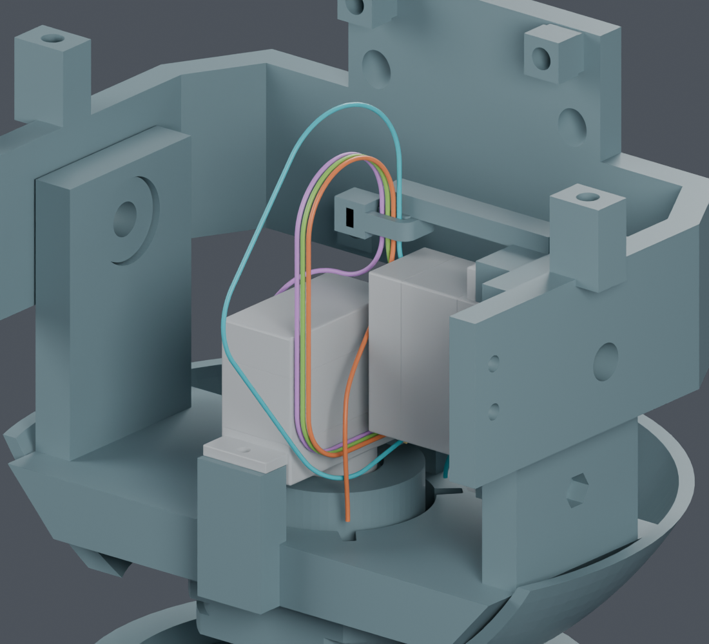

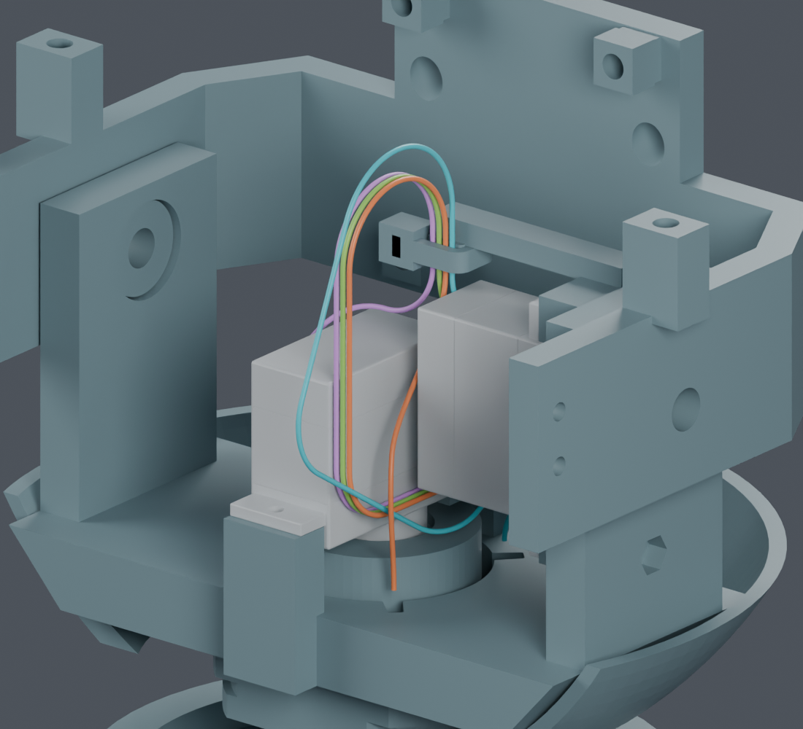

三张图分别是最后一根线的参数0.8025、0.825、0.875；最后一张仍在成形途中。其后0.875→1的1032个区间也已通过。颜色和槽位仅作几何标识，不替代供应商针脚图。真实线材回弹、操作力和端子压接仍未验证。

主模型M1.47、STL和正式装配动画未修改。这里只完成独立候选的四线成形子步骤，**完整线束仍为BLOCKED**，没有制造放行。

[完整四段路径与区间覆盖](contact_refined_forming/negative_complete/screen.json) · [八个边界状态复核](contact_refined_forming/negative_complete/junctions.json) · [前三根连续记录](contact_refined_forming/first_three_continuous/screen.json) · [最后一根连续记录](contact_refined_forming/negative_tail/screen.json) · [归位阶段Blender](contact_refined_forming/negative_return_branch/review.blend)

## 下一步的外部空间已检查

空胶壳从上方8mm沿轴线接近，完整凸扫掠体对219个当时结构实体及12组非接合导线检查通过。未装CAM板、显示支架和头壳；四颗配套端子及各自最后2mm压接邻域不属于这项外部接近检查。

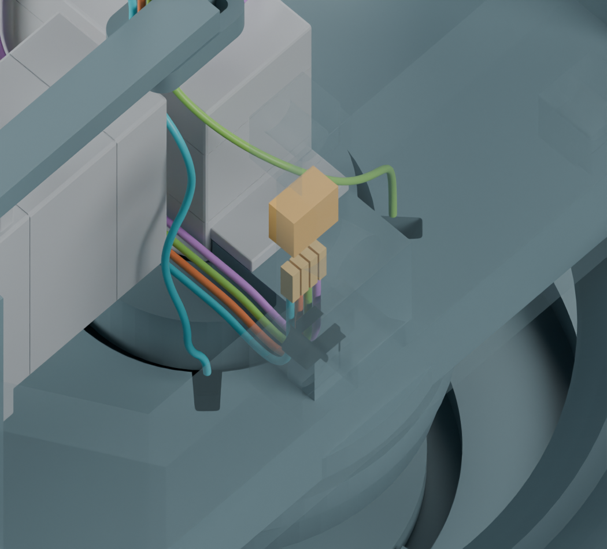
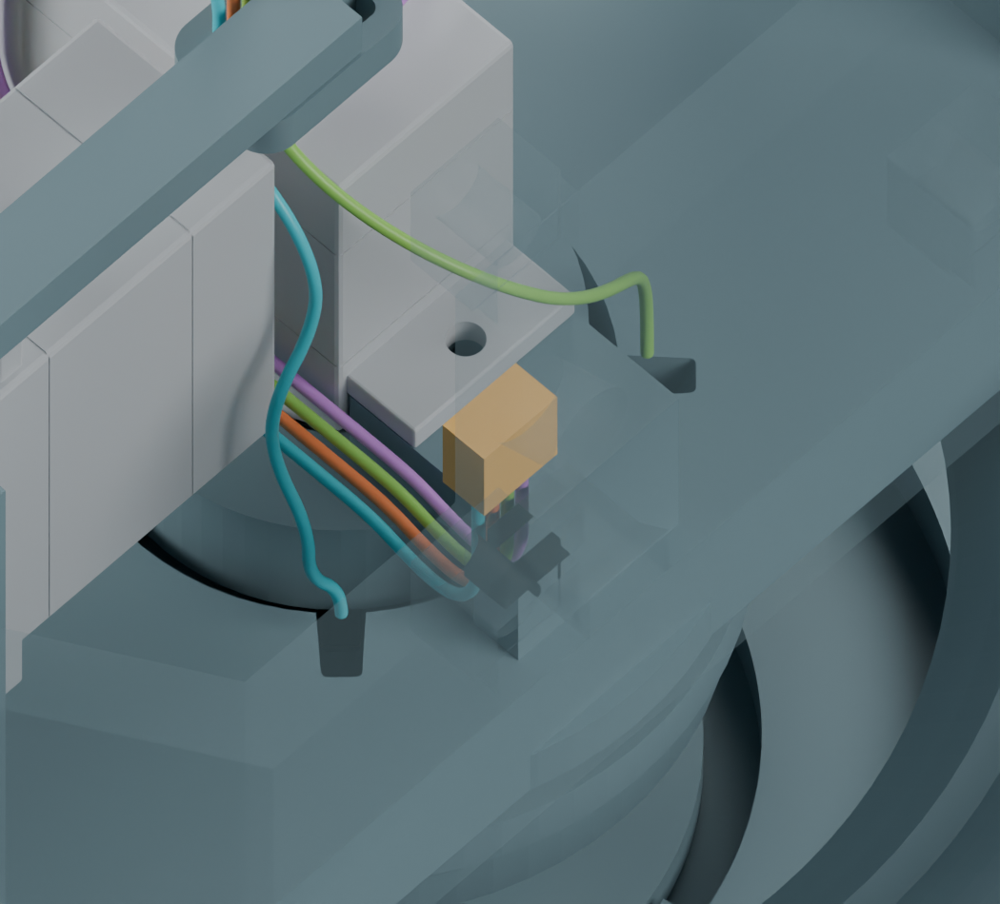

头托在图中半透明以便查看内部，完整实体仍参与计算。橙色盒子只是胶壳目录外形。它到位不代表端子已经进入或锁住：针腔、锁舌、朝向、插入力和抓持均未闭合。[接近检查](contact_refined_forming/housing_approach/screen.json) · [资料及范围说明](contact_refined_forming/housing_approach/SOURCE_NOTE.md) · [独立Blender](contact_refined_forming/housing_approach/review.blend)

## 根部扎带的工具空间与装入顺序

已把剪尾工具检查扩展到当前完整成形阶段：219 个结构实体、12 段导线、4 个散端子均参与。原 0° 方向的完整 60 mm 直线接近名义通过，朝外 110 mm 扎带尾操作空间也通过；工具与扎带头、带身只有约 0.25 mm 间隔，通用 0.3 mm 余量仍为 BLOCKED。真实钳口、手部和剪断动作未验证。

同时排除了“先收紧扎带，再沿四条竖直轴穿端子”的候选：四个目录端子包络均碰到打印座和带身。必须先完成导线放入，再收紧；仅松开扎带还没有证明能避开打印座。下方已补齐绝缘导线的局部入座动作；完整初次穿线与收紧过程仍需继续设计，未据此修改结构。

[局部图、全部记录与证据范围](contact_refined_forming/root_tie_access/README.md) · [工具空间](contact_refined_forming/root_tie_access/screen.json) · [收紧后穿入失败记录](contact_refined_forming/root_tie_access/contact_feed.json)

## 新补齐：先放入导线，再安装根部扎带

四根绝缘导线从固定座前方 1.5 mm 处移入槽内，根部暂时抬高最多约 0.86 mm。下方端点、线径及总线长保持，21 个位置复核和 256 个连续区间均通过。上部转弯段保持对齐，只用原有末端直线段补偿长度变化；剩余直线段全程保守下界大于 5.2 mm。

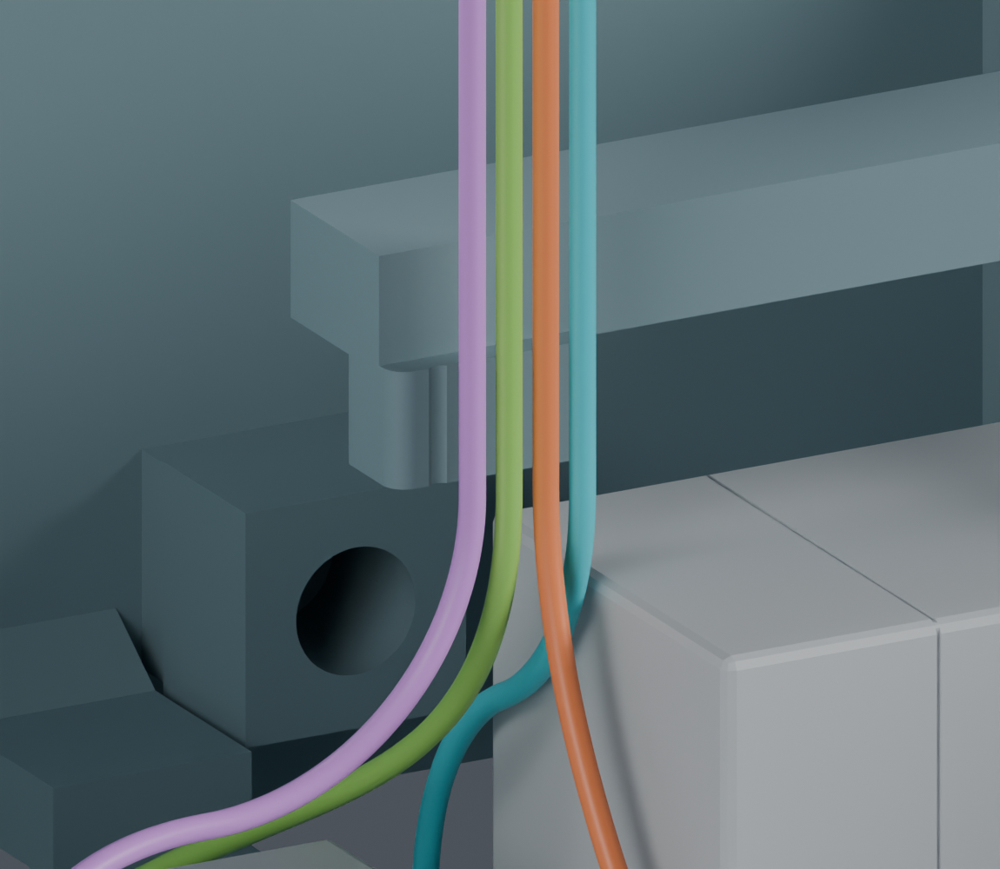
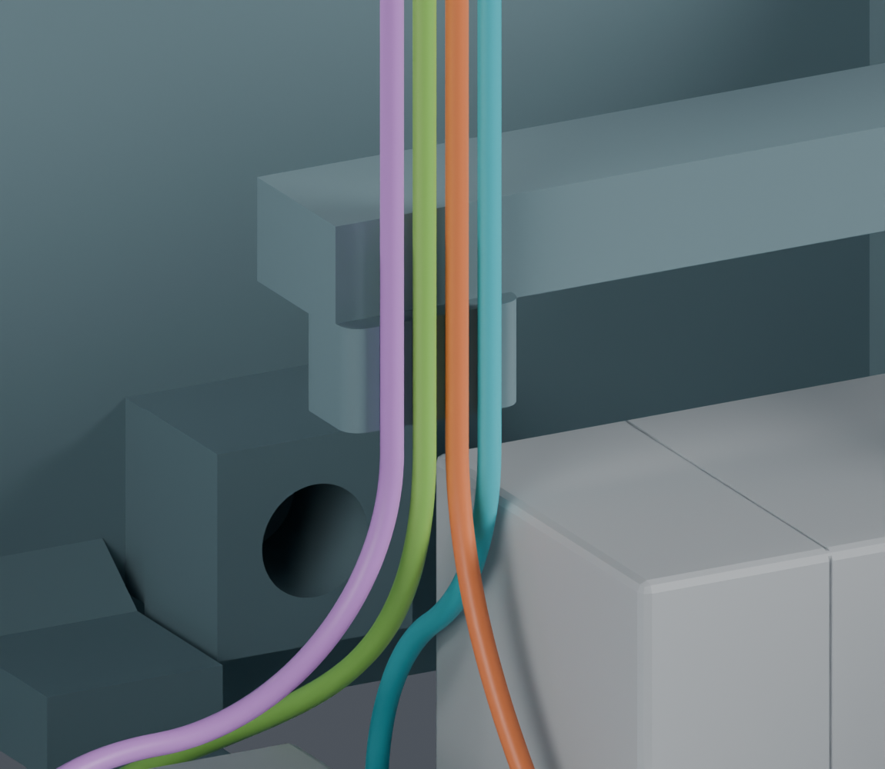

这一步尚未装根部扎带。初次端子穿入并到达起点、扎带穿绕收紧及端子入壳仍未完成。主模型未改，完整线束仍为 BLOCKED。[局部说明](contact_refined_forming/root_seating/aligned_tails/README.md) · [连续记录](contact_refined_forming/root_seating/aligned_tails/continuous.json) · [独立复核](contact_refined_forming/root_seating/aligned_tails/verification.json)

另从 JST 官方 LBT 目录找到同料号端子的更细图面。其下方锁止弹片不包含在 1.35 mm 的尺寸线内；已有方盒检查不能视为完整真实端子已通过。[新增原图与尺寸范围说明](../../ssh_catalogue_addendum/README.md)。

以下为保留的旧路线、失败记录和此前子步骤，不能用旧路线状态覆盖上方新路线，也不能用新的局部PASS覆盖未完成的完整装配。

[最新资料与初次穿线诊断](../../supplier_source_update/index.html)：新增 JST APSH 同料号端子细节图及 M5Stack 官方摇臂参考。同样较大端子预留尺寸下，上部穿入1228、回位256、入座256、四段弯线1735个连续区间通过；后续弯线调整了两处临时动作，见[尺寸统一复核](contact_refined_forming/root_seating/large_contact_downstream/index.html)。身体侧每根约140–162mm原有材料的暂存过程、真实端子、扎带和其他线仍未完成。

# 连续检查更新：原逐根路线仍有中途相交

此前644处有限位置筛查通过的记录保留，但不能用于放行完整装配。连续检查在最后一根线参数0.846875、侧角约6°时发现遗漏；对相关线段重新计算后，中心线距离约0.268451mm，小于两线半径之和0.6604mm，名义导线包络确实相交。

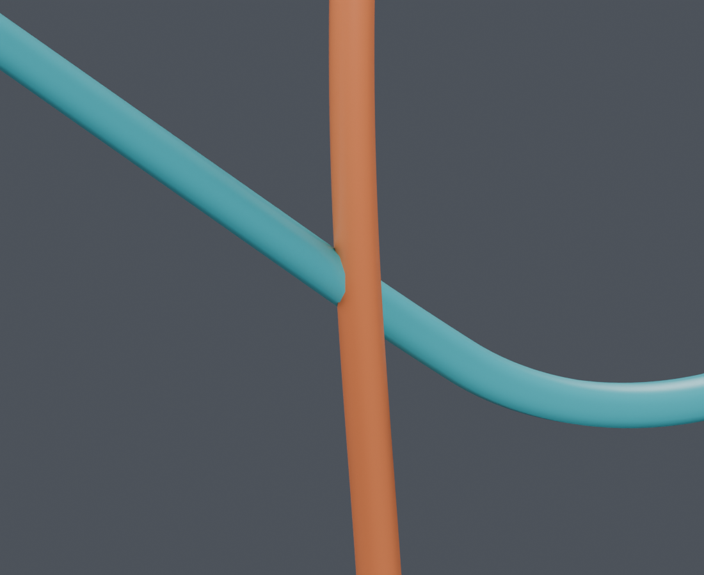

上图隔离两根相关导线，保留真实模型线径，没有把导线加粗。完整结构及四条线仍参加数值检查。原路线连续审查只通过145个局部区间后停止，整体BLOCKED；它不是仅差实物验证。

随后加密到0.0025参数步长的局部修正，虽然离散位置再次通过，连接动作依然未通过连续检查。因此后续搜索改为**每段动作先通过连续界限，再接受这一段**。最新关键中段搜索为BLOCKED，范围只涵盖最后一根线的0.75→0.875；完整四线成形、初始穿线、端子入壳与扎带仍未闭合。通用0.3mm端子操作裕量仍BLOCKED，主模型M1.47未改。

[原路线连续记录](contact_refined_forming/continuous/screen.json) · [相交数值复核](contact_refined_forming/continuous/first_failure_segment_distance.json) · [整机上下文图](contact_refined_forming/continuous/conflict_context.png) · [独立Blender](contact_refined_forming/continuous/conflict_review.blend) · [加密局部路线失败](contact_refined_forming/return_corridor/continuous/screen.json) · [关键中段连续搜索](contact_refined_forming/critical_return_continuous/screen.json)

下面的644位置PASS属于此前有限筛查，已被本次连续失败限定，不能理解为当前完整路线通过。

# 新进展：四线逐根弯线候选已找到

原来的同步弯线会与上游导线相交。改为按**几何槽位3→2→1→0**依次安装，并为最后一根线安排侧绕及临时抬高后，四段路径共644个检查位置通过线/结构筛查及名义散端子不相交检查。槽位数字和颜色仅标识几何位置，不替代电气针脚或供应商线色。

| 项目 | 当前结果 |
|---|---|
| 四段路径的节点及四分之一、中点、四分之三位置 | 每段161处，共644处；有限位置检查通过，尚非连续证明 |
| 普通导线对结构、其他导线；活动端子对结构 | 普通区域保留0.3mm筛查裕量；既有固定/落座接触区按原边界检查，不新增排除 |
| 全部散端子对四条自由线、上游过渡、身体线及其他端子 | 644处名义不相交检查通过；自身压接附近2mm局部区间按既有模型定义排除 |
| 静置导线和端子对结构 | 4根×初始/最终两态，共8项通过 |
| 相邻散端子的通用0.3mm裕量 | 仍未通过：1mm节距减0.8mm目录宽度只余0.2mm；没有把它改写为0.3mm |
| 连续过程、真实压接外形与端子入壳 | 未完成；不得据此放行供应商裁线或整机装配 |

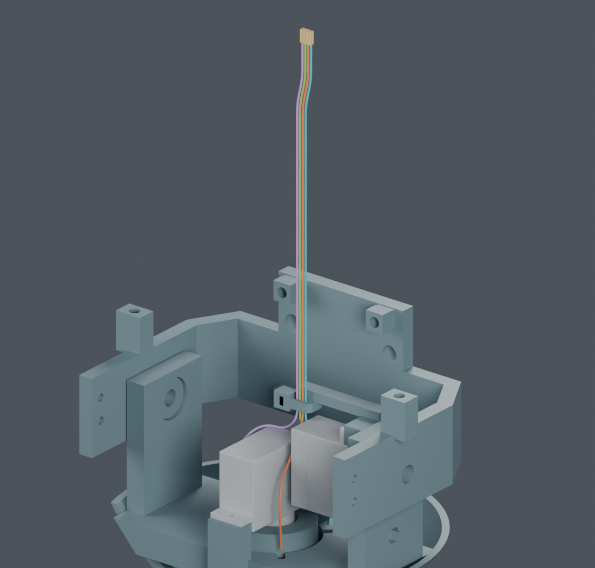

初始状态假定四根线已穿过颈部，并在现有独立固定座候选处接续。上图中的初始穿入、暂放与固定仍需连成完整工序；不能从这张图推定已经能操作。显示支架、CAM板和头壳尚未安装。

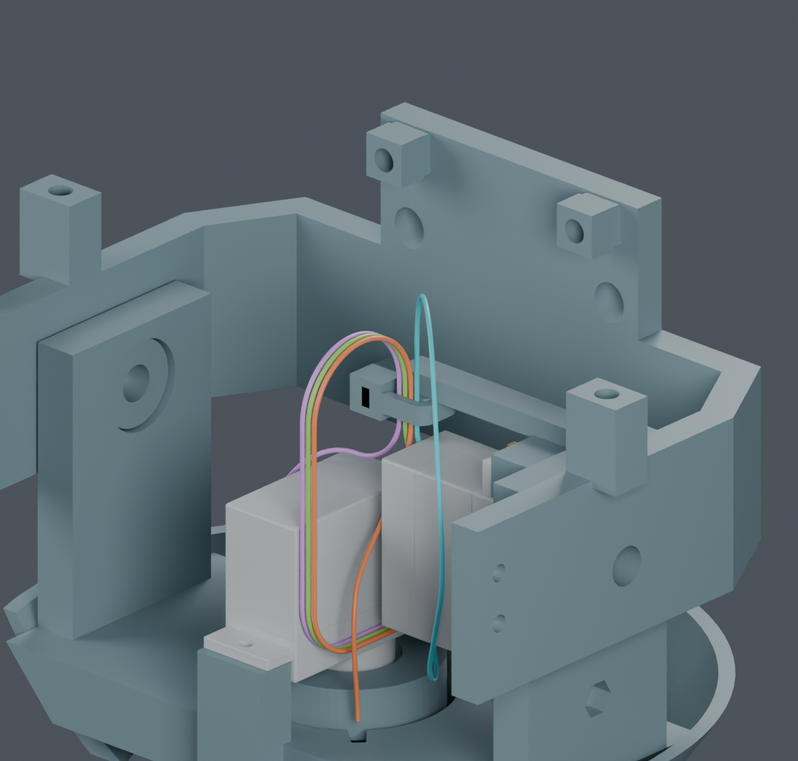

前三根保持已经摆好的位置，最后一根青色线在这个姿态暂时侧转48°，抬高参数为10.5mm，随后归位。所有线和端子始终参与检查，没有暂时删除妨碍装配的线。端子仍是JST目录尺寸跨度构造的估算盒，未经实物或完整压接CAD确认。

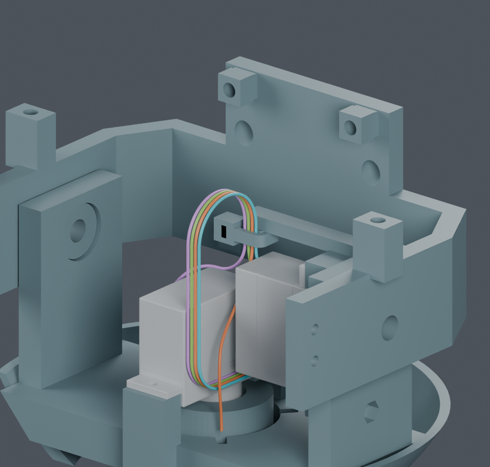

四根线到达最终位置上方2mm的状态，线长、线径和正式机器人实体不变。该状态与下文已检查的CAM板8→2mm下降衔接；端子装入胶壳、扎带安装、连续弯线、合壳及其余七根跨关节线等仍未完成。

本轮先保留了一个只通过导线筛查的候选。补入端子后，在最后一根线参数0.825处未通过与三根已摆好导线的不相交界限；随后把该处抬高参数7.5→10.5mm，并重新检查四段共644个位置。这个修正只改变临时装配动作，不改变最终线形或机器人零件。

[修正后的完整位置记录](contact_refined_forming/screen.json) · [独立Blender](contact_refined_forming/review.blend) · [图像来源](contact_refined_forming/render_manifest.json) · [修正前端子问题](outer_first_forming/contacts.json) · [反向顺序搜索](outer_first_forming/screen.json)

以下保留之前的同步路线失败和已完成的板卡下降证明，二者不覆盖或替代本轮新路线的未完成检查。

# CAM临时抬高2mm：板卡下降已核查，弯线顺序仍需修正

本页更新上一版“有限位置通过”的结论。主模型M1.47、STL、PCB和正式装配动画均未改；这是未采用的线束工序研究，不是供应商裁线图或制造放行。

## 已完成：板卡从8mm下降到2mm

保持插头与四线在最终位置上方2mm，CAM板从上方8mm降到2mm。对当时的结构件、固定插头和四线，用1057个带运动距离上界的区间覆盖整个6mm行程，结果PASS。各区间首尾连续，不是只检查若干截图。

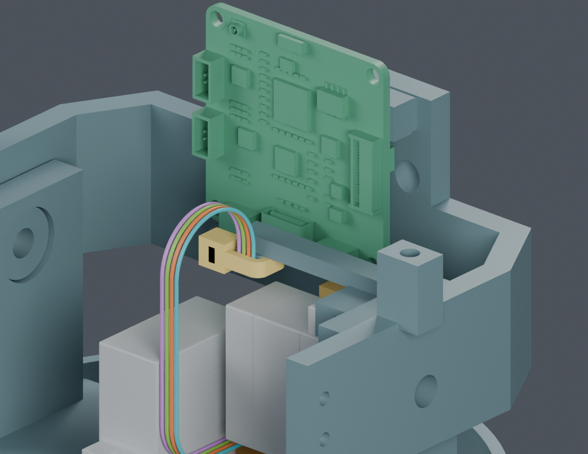
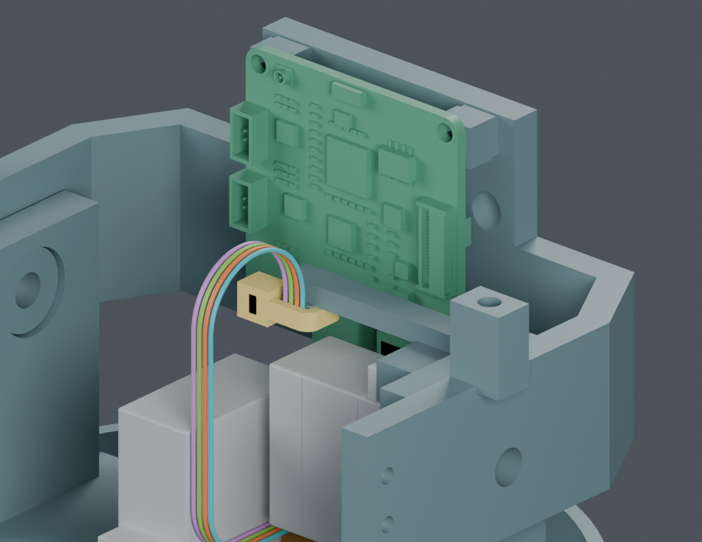

两张图中插头和线的位置保持不动，只有绿色板卡下降。图中金黄色座与线束通道仍属于已有独立候选；颜色用于区分几何对象，不代表采购配色或电气针序。

先前的距离上界算法无法判定插头与板上相邻平面几乎贴合的情况。现用**凸插头沿直线运动的完整扫掠体**直接与原板卡实体求交，未删除接合面，也没有缩小插头；名义相交体积为0。该处约0.00000057mm的模型面间距不能解释为实物装配余量。

这里只排除插头与其配对UART插座的预期接合，导线对板卡的普通区域仍保留0.3mm裕量。CAM实际插座完整料号、插合深度、端子入壳及插入力仍未验证。后续2→0mm落座属于原0→6mm已查曲线的子区间；本页未据此声称整条工序完整。

## 新发现：弯线时会碰到上游另一根线

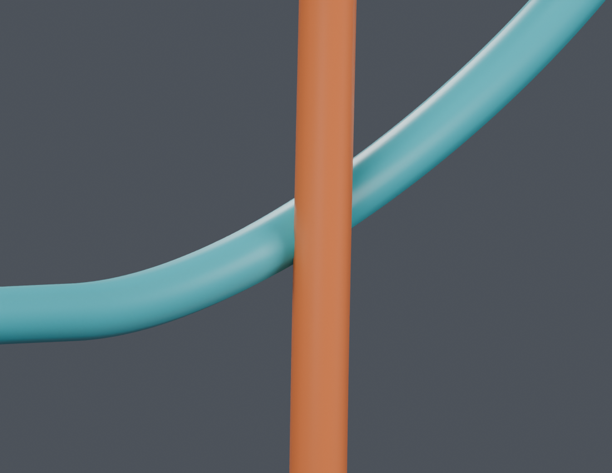

上图只显示两根相关导线，以免支架遮挡。青色为正在弯曲的线0，橙色为上游线1；两根线都保留原0.6604mm最大外径。

在原9mm抬高、2mm自由端候选的成形参数0.8处，两条中心线的距离上界为**0.527150mm**，小于两线半径之和**0.6604mm**。因此这不是仅仅没留够0.3mm余量，而是当前名义线径模型确实相交。41位置线间检查在0.75、0.775、0.8、0.825附近均给出失败；完整线束不得标PASS。

发现这一确定障碍后，已停止只检查线对结构件的长时间连续计算，保留日志及停止原因。该计算没有覆盖全过程，状态NOT_TESTED，不能用已经算过的一部分区间支持完整路线通过。

## 已比较的临时动作

| 路线类别 | 本轮候选数 | 结果 |
|---|---:|---|
| 提高临时回环 | 4 | BLOCKED；保留首个失败位置 |
| 减小抬高或侧转整组线 | 9 | BLOCKED；保留首个失败位置 |
| 先弯尾部两个90°弯，再弯主回环 | 4 | BLOCKED；保留首个失败位置 |
| 其余线保留，逐根弯线 | 4 | BLOCKED；保留首个失败位置 |

提高回环会让端子进入俯仰舵机；侧转和逐根操作的既定路径仍有支架或线间冲突。以上是这些具体路线的失败记录，不能据此推断所有装配方法都不可行。没有为此给支架新增孔槽或缩小硬件。

散端子仍按[JST官方SH目录](https://www.jst-mfg.com/product/pdf/eng/eSH.pdf)尺寸跨度构造估算盒，真实压接外形并未得到认证。在1mm节距下，其0.8mm宽度只剩0.2mm名义间距，导线接近相邻端子的工序余量也未闭合；没有把这一点静默放宽为0.3mm通过。

## 后续工作

需要继续设计弯线的先后顺序及暂放位置，再把初次颈部穿线、端子入壳、扎带安装与已通过的板卡下降/落座步骤连成完整工序。其余七根跨关节线、USB、LCD排线、相机FPC和身体固定段仍在总待办中。没有新的结构变更需要本页代替用户确认。

[连续板卡下降](board_descent_continuous.json) · [线间筛查](packing_screen.json) · [确实相交的数值证据](packing_collision_witness.json) · [停止原因](continuous_interrupted.json) · [逐根弯线记录](one_wire_at_a_time/screen.json) · [独立Blender](review.blend) · [命令和版本](commands.json) · [交付清单](review_manifest.json)
