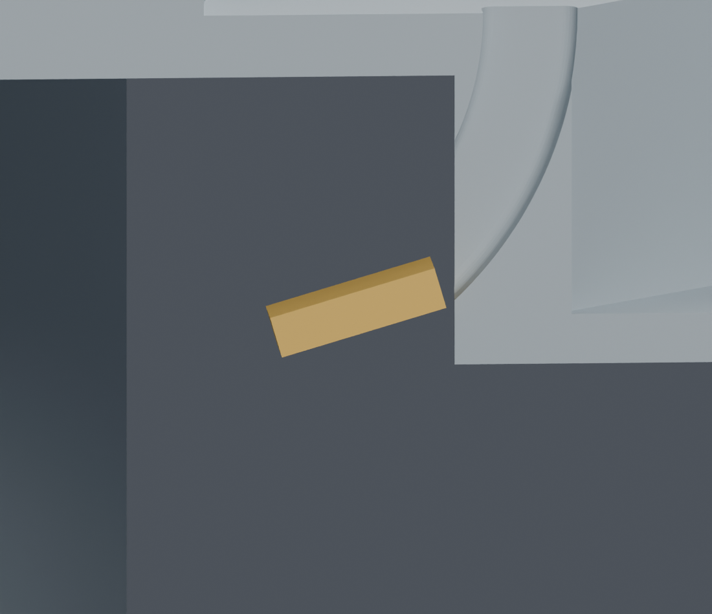
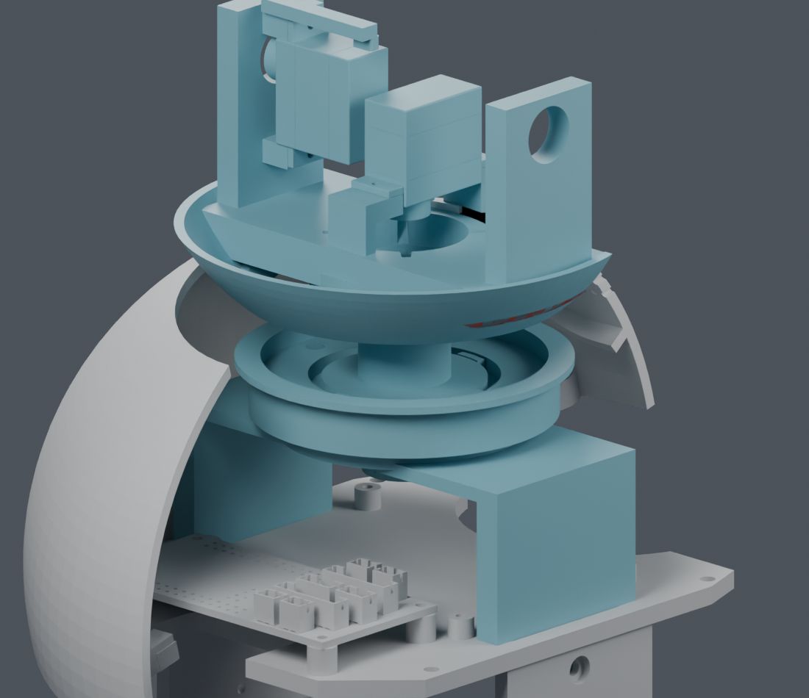

# CAM 身体供线与整套装配：补查结果

**完整装配仍为 BLOCKED。主模型、结构参数和硬件文件未改。**
此前的上部穿入、回位、入座和弯线通过各自范围的检查。

## 最新：颈部已有独立局部候选

较大端子 1×1.8×4.1 mm 预留已有局部可行候选：临时 R10 弯道、竖直起点上移 1 mm，仅扩大两件未采用候选的既有通道。四方向连续穿入及导线回位通过，端子/导线间隙下界约 0.308/0.306 mm；轴颈径向壁厚最小样本 1.601→1.479 mm。强度、全长供线及完整顺序仍未完成，候选未应用主模型。

[剖面对比、保存网格与连续检查](larger_neck_candidate/index.html)。下文保留原路径
与整套装配失败证据，不能把局部候选通过解读为这些装配问题都已解决。

## 更新：分步装配与完整线长

新顺序按身体上壳/承重桥、22件偏航与舵盘、14件头托与CAM分步装入，所查刚体位置通过。四根线的全长及PH插头已建入，身体段临时走位仍未通过。LCD代理姿态误报已修正；相机支架上角与前壳约0.00765mm³相交仍需处理。

[分步顺序、全长导线和局部剖面](split_assembly/index.html)。这次完整材料候选将每根约153–162mm
头侧材料暂存在上方；还没有通过从身体到头部的整个过程，不能据此发布裁线尺寸。

## 原路径的颈部尺寸问题

同一条既有颈部路径、同一组候选打印件下：旧 0.8×1.35×3.9 mm 方盒通过
四个方向的有限位置检查。上部研究已经使用的 **1×1.8×4.1 mm 预留体**，
在四个方向的下部 R8 弯道均出现余量不足；首个位置的间隙约 **0.252 mm**，
低于项目分配的 0.3 mm。该首个位置预留体本身相交量为零，不能描述成
真实端子撞坏结构或整个行程都没有碰撞。

保持打印件不变，另试了 7 个导引半径和 7 个端子滚转角，共 49 组；均未通过。
这只排除了已检查的参数组合，不表示一切装法都不可能。

较大方盒依然是 **ASSUMED 空间要求**，并非厂家完整压接成品外形。
原研究没有缩小端子或降低 0.3 mm 要求；最新通道调整仅在上方链接的独立候选中。

## 完整头部不能直接套用承重桥装配动作

模型中 209 个机器人实体全部分配到移动组、固定组或明确的后装组。
旧动作的 22 件身体上壳组，配上完整 72 件头部组后发生碰撞；暂缓 8 件头壳
及其紧固件仍不能绕开 Pitch_Yoke。前期只移动承重桥的 PASS 不覆盖这套完整总成。

| 检查方向 | 结果 |
|---|---|
| 原上壳独立倾斜动作，完整头部或后装头壳 | 两组各四段，均检出碰撞 |
| 上壳与完整头部同步移动 | 10 种限定动作均未通过；插舌约束与基板阻挡仍在 |
| 把完整下部框架从下方装入 | 位移约 3 mm 时，基板与身体上壳相交 |
| PH 端子反向穿过当前颈部路径 | 两种参考预留均在上部入口检查失败 |

这些都是有限位置的诊断。失败证据足以否定相应动作，但不能代替新方案的
连续路径、全长导线、插头、扎带和工具检查。

## 厂家资料与设计责任

[JST 官方 PH 目录](https://www.jst-mfg.com/product/pdf/eng/ePH.pdf)可找到系列端子
5.7、1.5、2.08 mm 的图示标注，以及 SPH-004T-P0.5S 的线材范围和压接工装。
共用系列图没有完整确认该型号压接后的外轮廓、公差和弹片突出，因此反向穿线
只用作参考空间比较。不能拿 PH 系列标注替换 SH 端子的尺寸。

供应商按图制作的方式已经确认。**路线、分支、长度基准和装配图仍由项目完成**；
目前的问题不能全部归到等实物。最新全长存放候选仍有间隙问题，需要与颈部进线
及后续动作统一设计，再确定裁线尺寸。

下一步将局部颈部候选与分步穿线、身体端胶壳后装或后插接统一，并核对整条导线的材料
长度和暂存空间；改变交货入壳状态或打印结构需在完整候选可审阅后交用户确认。
没有采纳这些变更，也没有给供应商发送信息或下单。

[数据总表](publication.json) · [完整总成成员与检查](rigid_screen.json) ·
[颈部尺寸一致性](neck_contact/screen.json) · [49组姿态尝试](neck_contact/pose_search/screen.json) ·
[独立 Blender](review/review.blend) · [此前的材料账](../README.md)
