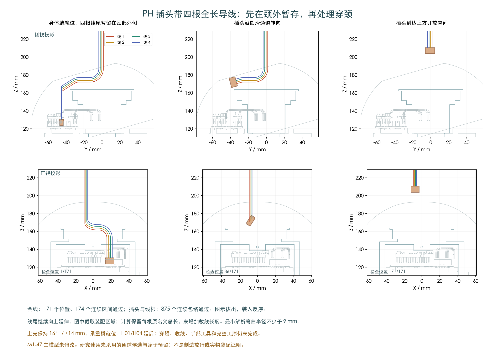

# PH 插头带四根完整导线的装配路径

更新时间：2026-10-05T02:02:56.403740+00:00。主模型 M1.47 未修改。候选图示拔出，装入按反序；四根自由线尾先留在颈部外侧，再另行处理穿颈。

## 已完成的名义几何检查

- 四根完整导线的171个位置复核通过；每根名义总长仍为 287.29、327.86、285.09、339.61 mm，未借此增加裁线长度。
- 插头与四根前5mm直段：875个连续扫掠包络通过。
- 四根全线：174个连续区间通过。固定弯道的剩余部分始终是原曲线的子集；上方直线余料用覆盖范围验证，移动线根另做扫掠与线间检查。
- 四个自由端的竖直移动，以及54个关联端子对区间通过。端子形状仍是注明的预留，并非实际压接成品尺寸。
- 采用0.6604mm线外径、0.3mm间隙、至少9mm解析弯曲半径。最初8mm插合段沿用已记录的自身插座重叠例外，实际插合仍未验证。

模型检查中的“最大余线覆盖范围”是数学验证用的并集，不是给供应商追加的线材。每个实际姿态保持原来的四根总长。

## 装配前提

上壳保持16°并抬高14mm，固定承重桥已就位。H02/H03共4根身体线及24个其他插头空间参与检查；H01/H04的10根线和4个插头明确延后。
本研究仍使用此前记录的未采用通道候选，不能直接视为主模型整机装配通过。

## 为什么改变穿线顺序

原来先让线尾进入颈部，再抬升PH插头的五种线尾高度方案，在初始8mm抬升位置附近均遇到承重桥或轴承间隙问题。
新候选保持自由线尾在颈外，插头随圆滑路径转向。它关闭了这一段带线插接的几何缺口，不代表后续工序已经通过。

## 仍需在到货前完成

自由线尾从本页临时位置穿入颈部，并接上已研究的头部穿线与回位动作；H01/H04后装、其他跨关节线与FFC、扎带固定、手部工具和完整装配顺序；逐线最终长度及供应商制作图。
这些仍是项目设计工作。实际端子、线材、压接及未公开配件尺寸另等厂家资料/实物确认。

供应商按图制作已确定。PH/SH官方目录已有外形、适用线径和工装资料；具体压接工艺与资料版本边界见[完整端子工艺记录](../../../../../../../../TOOLING_DETAILS.md)。本研究没有发布制造图、联系供应商或下单。

[171位置与来源](screen.json) · [875个连续包络](verification.json) · [全线连续检查](full_wire_continuous.json) · [命令及校验](publication.json)
