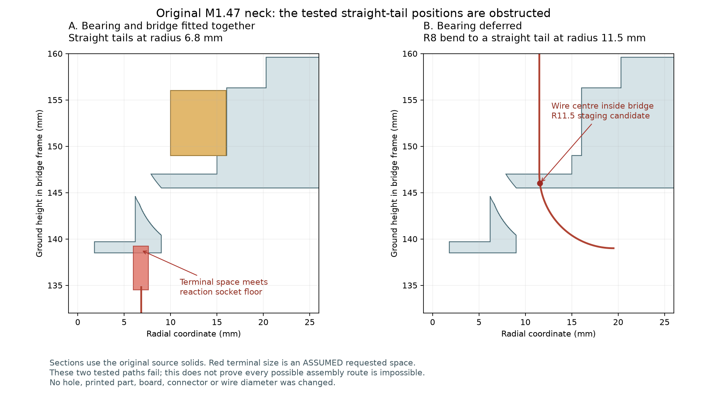

> **M1.48 来源更正**：更正：旧研究初始化时加载了尚未采用的 Yaw_Base / Pitch_Yoke 切槽候选，原文“全部使用原桥座”的表述不成立。当前 M1.48 主模型未改；重新核对后，下套端子的局部碰撞仍成立，原 R8 下弯线中心也穿入主模型材料。下方保留历史文本及数值，不能据此认定现有主模型线路已通过。
> [查看当前复查](../../../../../../../../../neck_threading_M1_48/index.html)

# 原桥座的带线装配顺序检查

更新时间：2026-10-05T02:51:03.632076+00:00。M1.47 主模型、参数和两份合同保持原哈希。全部使用原桥座及轴承实体，没有套用未批准的通道候选。

## 结论

**不能把“先接好身体导线，再把桥座和上壳直接套下去”写成已通过的装配工序。**

1. 4根CAM线保持名义全长，14根身体导线保留，原29个插头空间按身体/上壳所属保留。R6.8临时直立线尾的最终静态排布通过；带轴承桥座下套时，第4根线端的请求空间与反力座底面相交约2.718mm³。
2. 已检查4组左侧线尾位置，未找到满足间隙的排布。这些是具体失败范围，不能据此认定左侧不存在任何装法。
3. 将轴承延后安装后，R11、11.5、12、13mm的四组直立线尾仍未通过。R11.5候选的一处解析线中心（Z146mm）确在桥座材料内；不是仅因检查余量偏保守。其他候选的记录仍按原来的间隙失败解释。
4. 上壳的5条所试路径未通过：原方向下落时，后接口J3插头空间与一根IMU线重叠约0.300mm³；另外4条后移路径先遇到线端与上壳问题。这里保留了已建的插头空间，但后板和喇叭完整导线尚未建齐。

中心的小孔仍然存在；上下可通过范围在所试的四根线尾位置错开，不能把桥座描述成完全封闭或所有穿线方法都不可行。

## 已通过与未完成的边界

此前[PH插头带4根完整导线的插接阶段](../PH_guided_wire_entry/index.html)已有连续检查通过；它使用独立通道候选并把自由线尾暂留颈外，不能直接接成主模型的完整装配。
后续穿颈、头部装入、H01/H04、其他跨关节线/FFC、扎带和手部工具仍需处理。新的失败研究没有推翻此前局部通过，也没有关闭这些缺口。

端子1×1.8×4.1mm及0.31mm扩展仍是明确标注的请求空间；0.6604mm线外径与0.3mm间隙保持。名义长度保持，不是最终供应商裁线长度。没有新增孔、零件、改小端子/线径或移动PCB。

[桥和上壳](../bridge_then_shell_over_wires/screen.json) · [左侧临时排布](../bridge_left_tail_staging/screen.json) · [轴承延后](../bridge_before_bearing/screen.json) · [原实体剖面及点内诊断](../bridge_then_shell_over_wires/diagnosis.json) · [来源与实际命令](publication.json)
