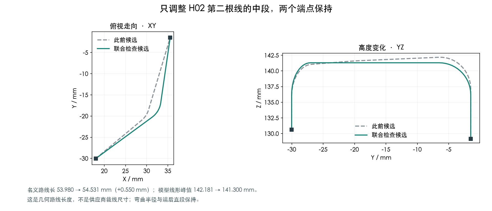
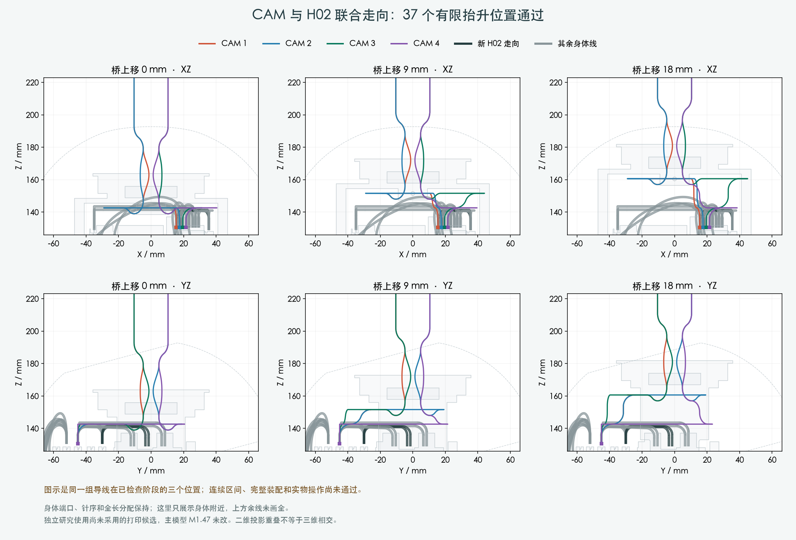
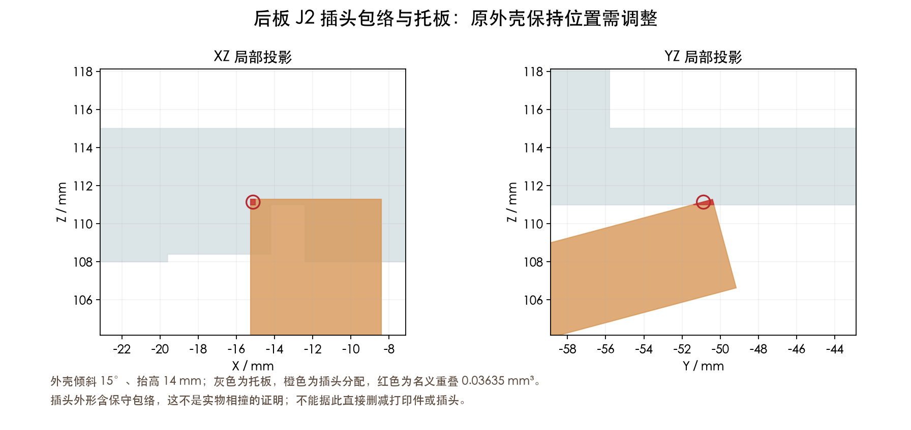

# CAM 与 H02 联合走向：局部通过，完整装配仍未完成

## 这次实际解决的部分

此前 CAM 第4根线与 H02 的抬升走向没有配合起来。本次只调整 H02 第二根线的中段，保留两个原接口、针序、端后5mm直段和原弯曲半径。
H02 第一根未改。第二根名义路线 53.980 → 54.531mm，增加 0.550mm；这是几何路线长度，不是供应商裁线长度。
模型折线的最高点 142.181 → 141.300mm。不要与旧控制点142.4mm混用。

| 检查对象 | 范围 | 结果 |
|---|---|---|
| 4根CAM线＋2根H02线 | 桥上抬0–18mm，每0.5mm，共37个有限位置；14根身体线均保留 | PASS，仅线形与所列障碍物 |
| CAM相互间隙 | 6对导线，端子相互及端子对他线检查 | 最小保守线间隙0.439mm |
| 新H02实体 | 当前209件、29个插头分配、其他12根身体线 | PASS |
| 新H02提前装入 | 开敞机身、两端插头与线一起，201个位置 | PASS；早于CAM/H01/H04/桥/上壳 |
| 新H02后续占用 | 408个身体位置、130个头部姿态 | PASS，仅H02对运动零件 |

上述37个位置不是整套装配通过。该阶段的线束检查没有把“上壳及其插头对托板”的完整刚体路径当作通过条件。
本次补查这项后发现了下文问题。无连续区间证明，无人手/支承验证。

## 还卡在哪里

1. **继续后移桥**：当前圆弯形式在中途出现无解或不足间隙，未形成4根线的完整后移组合。
2. **桥和外壳直接继续竖直抬高**：桥抬至22mm时，外壳与H04第3根的线包络有名义重叠。
3. **把外壳先单独后移**：加入后板插头后，原“外壳倾斜15°、抬高14mm”的保持位置，J2插头包络与Load Frame重叠约0.03635mm³。6种提前后移动作也在释放途中未通过这处。

J2采用厂家胶壳尺寸加保守法向包络，尚不足以断言实物一定相撞。下一步先核对后板连接器拔插/接线的装配时机和准确外形，再连接完整外壳路径；不靠缩小插头或删除托板来消除检查结果。
这些属于可继续做的设计工作，不应全部归为“等实物”。

## 当前范围

- 使用此前尚未采用的Yaw Base/Pitch Yoke/Pitch Cradle研究几何；主模型M1.47和PCB保持。
- H02的201位置检查是单独的早期装配工序，不能代替H01/H04及后板带线拔插工序。
- CAM完整名义线长保留。自由端子的1×1.8×4.1mm仍是明确标注的空间分配，实际压接外形待来源/首件。
- 其他跨关节线、FPC、扎带、人手支承和完整连续装配顺序仍未完成。供应商制作方式已确认；裁线图仍未放行。

[联合检查](verification.json) · [后移诊断](../CAM_H02_back_transition/screen.json) · [竖直诊断](../CAM_H02_vertical_withdrawal/screen.json) · [包含插头的动作诊断](../CAM_H02_shell_schedule/screen.json) · [来源清单](publication.json)。
