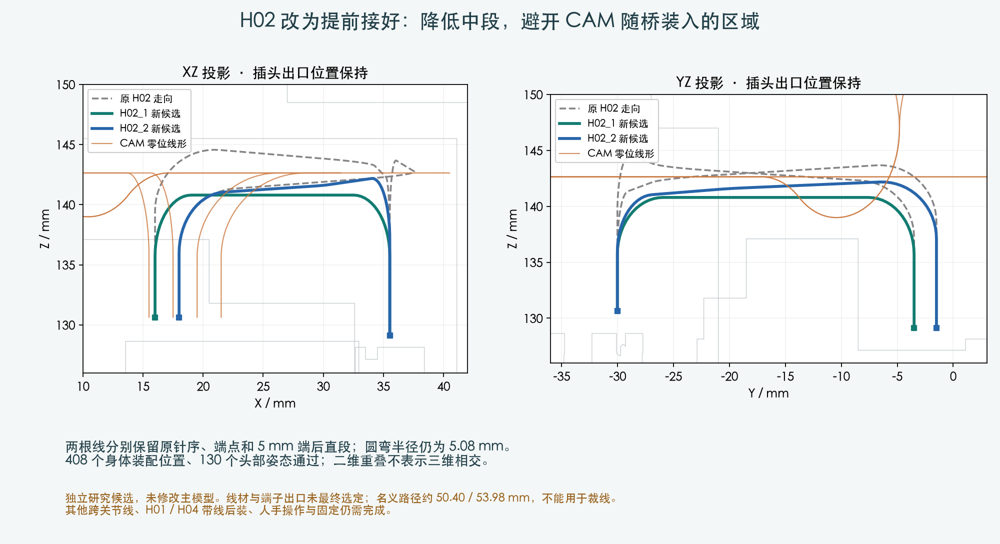

# H02 提前连接：线长复核与工序调整

**H02 的两根线可以采用较低的新候选走向，在开放的身体内先接好，再装 CAM 与承重桥。**
主模型和硬件未改。这是独立的名义几何候选，完整线束仍未完成。

## 为什么调整

前一轮六个插头的路径检查没有带上导线。加入现有名义线长后：

| 线束 | 只移动一端的线长必要条件 | 两端到原外部位置 | 后续处理 |
|---|---|---|---|
| H01 | 两端各自移动都未检出长度不足 | 未检出长度不足 | 继续检查带线过程 |
| H02 | 两端各自移动都存在长度不足 | 这个位置本身满足，但有限协调进度未找到可行顺序 | 改为开敞机身内先装 |
| H04（IMU） | 移动运动板端时部分线不够；只移动 IMU 端满足此必要条件 | 部分线不够，最大差约40.44mm | 另改装配工序或接入路径 |

必要长度下界采用两端各5mm直段加直段末端距离。正余量不证明弯曲与碰撞通过；
负余量只排除测试位置和当前候选长度，**不证明线束无法安装**。
两端同步使用每端81个采样进度；没有穷尽所有柔性动作。

## H02 新候选

原 motion_J2 / power_J13 接口、针序、5mm端后直段均保持。只调整两根候选导线，
圆弯半径保持5.08mm、线径1.016mm；仍为未选定采购的 Alpha6711 参考线材。
参考路径长度约50.40 /53.98mm，不含最终端接、制造与维修余量，不能发给供应商裁线。

| 本轮检查 | 结果与范围 |
|---|---|
| 静态两根 H02、209件源零件、29个插头空间分配、其他12根身体导线 | PASS，名义间隙0.3mm；出口与实际配套仍未确认 |
| H02 两线互相间隙 | PASS，膨胀胶囊几何下界约0.613mm |
| 两个插头与完整H02线形，从上方落入开敞机身 | 201个有限位置PASS，保留H03；人手和临时保持形状未验证 |
| H02/H03已经连接，CAM四根全长与承重桥随后装入 | 408个有限位置PASS；H01/H04后装 |
| 头部130个组合姿态 | 没检出新增实体相交；不是连续运动证明 |

建议工序：开放机身内先装 H03、H02 → 安装 CAM 四线与承重桥 → 再处理 H01、H04。
H03自己的既有工序并未由本次重新认证。研究继续使用未应用的颈部与头托候选。

## 仍需完成

H01/H04带线装入、临时线尾处理、扎带与固定、人手/工具、其他跨关节线、FFC，
以及最终供应商分支与长度图仍是设计工作。H02的实际线材/端子、容差和实物弯曲保持另待确认。
没有变更 PCB、打印件、主模型或主装配动画，没有采购或制造放行。

[线长检查](../later_connections/length_budget/audit.json) · [H02候选](screen.json) · [实体与运动检查](verification.json) · [开敞机身装入](open_deck_insertion.json)
