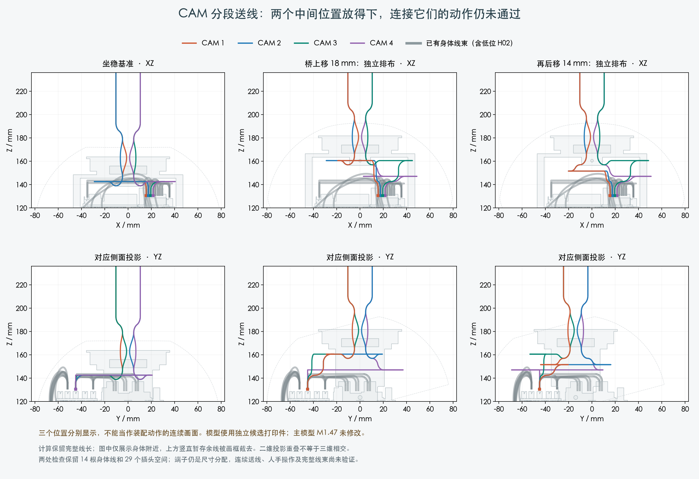

# CAM 分段送线：配置有解，装配动作还没完成

## 本轮实际完成

保持身体端 PH 接口不动，保留 14 根身体线（包括已通过的低位 H02），在两个明确位置分别找到四根 CAM 线的排布。

| 独立位置 | 已检查 | 四线之间最小保守间隙 |
|---|---|---|
| 桥上移 18 mm | 四线对当前阶段零件/插头/身体线、自绕、端子占位、六对线及六对端子和十二项端子对他线 | 0.439 mm |
| 同样上移 18 mm，再向后移 14 mm | 同上；身体端胶壳不动 | 0.765 mm |

两处都保留完整的原名义线长，用上方暂存余线补偿下部路线变化。身体端前 5 mm 直段保留；解析圆弯最小半径为 7 mm。
端子是明确标注的 1×1.8×4.1 mm 空间分配，并非实际成品端子的完整厂家模型。

图中包含零件真实投影，不是装配动作连续帧。为便于观察，画框截去了上部暂存余线；计算没有截短导线。

## 仍未完成的具体动作

从坐稳位置开始，每 0.5 mm 检查一次桥上抬，共 37 个位置；保持原弯线形式，避免在独立方案之间突然换圈。
第 1–3 根各自有通过这段有限位置的候选；第 4 根的原形式在中途靠近 H02，未形成四线组合。

调整第 4 根收弯时机的 6 组候选仍未通过。已保留原解析误差，将线段细分到最大 0.015 mm 复核：
三组有明确模型相交证据，其余三组最小采样间隙约 0.170、0.260、0.279 mm，小于 0.3 mm 名义要求。
不能把所有保守拒绝都说成相撞，也不能把两个端点放得下说成中间能装过去。

又检查了临时降低中段 0.5–4 mm 的 7 组动作，仍未形成四根线同时通过的抬升组合。

这些是所测试动作的结果，不证明所有布线和装法都不可行。下一步需要调整第 4 根与 H02 的相对走向或分段动作，并验证前后工序的同一份导线。

## 范围和保留项

- 研究使用已有未采用的打印候选：Yaw_Base, Pitch_Yoke, Pitch_Cradle。没有据此修改主模型 M1.47、PCB 或针序。
- 全部 209 件原始模型中，本身体阶段装入 122 件；偏航/俯仰头组按工序暂不装。29 个插头空间分配保留。
- 主装配视频保持；不得把独立排布图替代完整装配验证。
- H01/H04、其余跨关节线、FPC、端子入壳、扎带、人手和供应商最终裁线图仍需完成。
- 已取得的公共厂家资料继续有效。上面的路线和工序属于项目设计，不能归为等待实物。

## 可复核文件

[抬高位置](lift18/verification.json) · [后移位置](rear14_lift18/verification.json) ·
[逐步抬升](../feed_lift_transition/screen.json) · [收弯时序](../feed_lift_schedule/screen.json) ·
[间隙细化](../feed_lift_refinement/screen.json) · [临时降低中段](../feed_lift_pulse/screen.json) ·
[来源和保护文件](publication.json)。

本页发布检查通过，只表示结果、来源和页面一致。完整线束及制造图状态仍为 BLOCKED。
