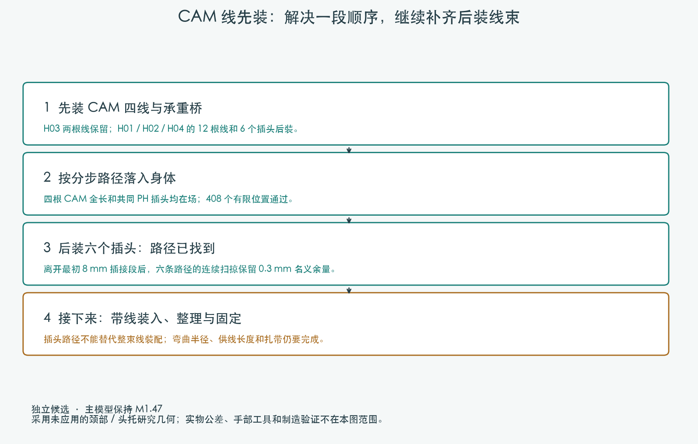
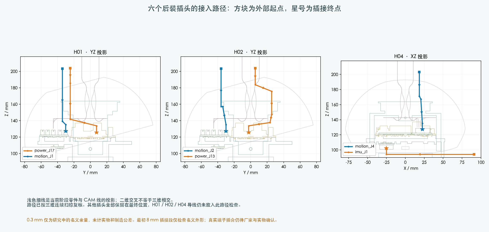

# CAM 先装与身体线束后装：独立顺序候选

**本轮完成了身体阶段的有限位置检查，以及六个后装插头的连续接入路径。完整带线装配仍为 BLOCKED。**

## 后续线长复核：H02 改为先装

前一轮六条是裸插头路径。接上现有名义线长后，H02 与 H04 部分位置不满足必要长度下界，不能作为整束装配方案。
H02 已有较低的独立走线候选：开敞机身内先接好 H02/H03，再装 CAM 与桥；H01/H04 继续后装。
H02 两端插头与完整线形竖直落入通过201个有限位置，随后身体408个位置与头部130个姿态复核通过。
不改打印件或接口，线长尚非供应商裁线尺寸。H01/H04 的10根导线带线装入仍未完成。
[查看新走向、线长问题和具体范围](../H02_preinstalled/index.html)。

以下图片与六个裸插头路径保留为前一轮对照，不能直接按图制作完整线束。

## 前一轮：三组线全部后装

先让四根 CAM 导线、共同 PH 插头及固定承重桥随同安装，H03 的两根导线保留。
H01、H02、H04 的 12 根导线和 6 个插头明确延后；不是把这些零件从最终装配删掉。
身体核心 94 件、上壳 22 件、承重桥 6 件均参与计算，共 122 件源部件。
偏航与俯仰总成在这一阶段尚未装入。

使用四根完整名义线长（约 287.29、327.86、285.09、339.61 mm），保留头上方临时竖直线尾。
这些是模型中的路径长度，**不是供应商裁线尺寸**。不额外截短导线以通过检查。

| 阶段 | 有限检查位置 | 本轮结果 |
|---|---:|---|
| 上壳保持 15° / 上移 14 mm，承重桥上下移动 | 37 | PASS |
| 上壳与承重桥后移 14 mm | 57 | PASS |
| 整段提起至装配台位置 | 253 | PASS |
| 桥已落座，上壳回位 | 61 | PASS |

共 408 个位置；安装采用相反次序。有限位置不等于身体过程的连续运动证明。
独立支撑和人手操作仍需检查。研究使用尚未应用的颈部 / 头托候选，不能称作主模型装配已通过。

## 六个后装插头的路径

H01：power_J17 / motion_J1；H02：motion_J2 / power_J13；H04：motion_J4 / imu_J1。
最初沿插接轴退出 8 mm 后，采用小幅绕行再从上方或侧方退出；反向即接入。
每条路径检查时，**其他插头保留最终位置**，完整四根 CAM 线与 H03 导线也保留。

六条路径均通过保存结果复核。自由移动段用整个凸体扫掠加 ±0.3 mm 包络检查结构；
对 CAM 线使用包含检查、采样间距和源曲线弦误差界限，保留 0.3 mm 名义余量。
最初 8 mm 插接段只做名义外形检查，保留原有自身插座的接合体积；没有放宽后续运动的碰撞条件。
真实插头轮廓、端子插合和制造公差仍未确认。

## 仍未完成的设计

- H01、H02、H04 连线后的柔性送入过程、临时弯曲半径、线长与相互次序；本轮是插头本体检查。
- 后续偏航组件从上方装入时，如何处理当前临时竖直线尾。
- 扎带穿绕和收紧、手部与工具空间、其余跨关节线和 FPC。
- 结合最终工序确定分支、长度基准和供应商裁线图。

先前整束刚性上提的失败不代表柔性线束无法安装。新增路径也不能据此放行完整线束。
M1.47 主模型、配置和硬件合同未改；未发制造图或采购单。

[身体位置检查](../dense.json) · [六条带余量路径](../later_connections/grid_margin_approach/screen.json) · [保存路径复核](../later_connections/grid_margin_approach/verification.json)
