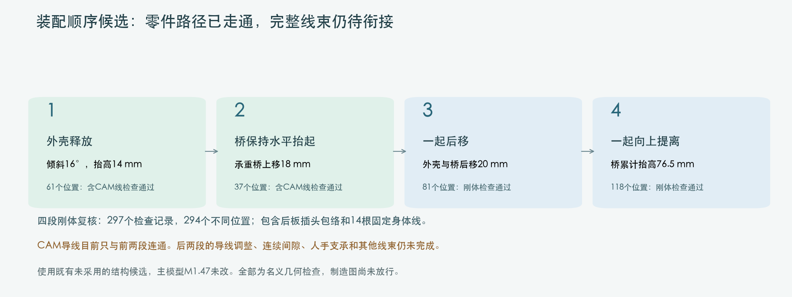
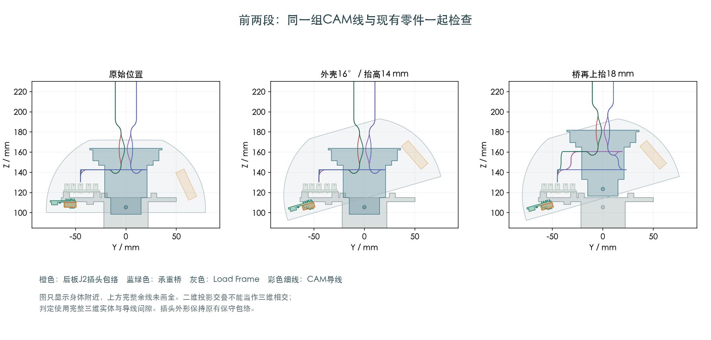

# 外壳与桥的装配顺序候选

四段刚体路径已通过有限位置检查；完整带线装配仍未完成。主模型M1.47和硬件文件保持。

## 相比此前解决了什么

后板J2插头继续使用11.8×6.85×4.8mm的原保守包络，没有缩小或删去。
外壳倾角从15°改为16°，仍上抬14mm；随后桥保持水平上抬18mm。
接着外壳与桥一起后移20mm，再一起竖直提离。
这个动作替代了原先会在后板J2/托板或外壳/桥之间相交的几种直接移动方式。

四段刚体复核：61、37、81、118个检查记录，总297记录、294个不同位置。
包含94件身体核心、22件上壳组、6件固定桥组，已安装身体/后板插头分配，以及14根固定身体线。
后续头部组件尚未装入；这些成员和该工序限制已在检查文件中列明。
直至最后一步，桥累计上移76.5mm，外壳累计上移72.5mm，保持16°和20mm后移。
这里的提离高度用于明确刚体已分离，不是要求人手精确停在这个高度。

## 导线检查的真实范围

前两段含四根CAM线共同检查：61+37记录、97个不同刚体位置，精确复用已经保存的完整导线形状。
两个阶段边界相同，全部名义线长保持；前两段导线相互最小保守间隙0.439mm。

三根受限CAM线分别找到分步后移路径，第4根已有路线；合并检查仍有线间间隙问题，后移阶段尚未整体通过。

分步搜索中，CAM1、2、3各自检查位置分别为89、89、125。
这三项是单根线对零件和既有身体线的结果，不能代替四根CAM线相互检查。
最初合并时CAM3/CAM4的保守间隙为0.173mm，未达到本研究0.3mm几何预留。
后续比较提前调整第4根临时弯线的方式，以及第1/2根配对收弯的时机，具体结果见[第4根调整](../shell16_fourth_wire_relief/screen.json)和[共同收弯时序](../shell16_coupled_hold_timing/screen.json)。
这是所列有限参数和离散位置的结论，不是所有方案不可能，也不是无接触的连续运动证明。

## 插头来源

JST原厂PH目录给出了胶壳名义尺寸。本模型法向4.8mm来自直角板座的完整高度，PHR胶壳名义4.5mm；
准确插合位置和凸筋未完全定义，不能仅删减这0.3mm来放行。[本次来源核对](../../../../../../../../../rear_plug_source_review/README.md)。
原厂[PH目录](https://www.jst-mfg.com/product/pdf/eng/ePH.pdf)与[JST德国PHR-5页](https://jst.de/produkt/3526/680902-00)均有记录。

## 仍未完成

- 四根线的后移/竖直提离衔接及完整连续间隙；人手、夹持和扎带操作。
- H01/H04带线装入、其余跨关节线、FPC、后板支路线的完整顺序。
- 真实端子入壳及压接外形、实际线材/供应商首件。自由端子仍是明确标注的空间分配。
- 此研究使用既有尚未采用的Yaw Base/Pitch Yoke/Pitch Cradle候选，不能声称主模型已经采用。

供应商按图制作方式已确认，当前裁线尺寸与制造图未放行。

[刚体四段检查](../shell16_full_rigid_path/screen.json) · [前两段记录校验](verification.json) ·
[单根分步路径](../shell16_back20_piecewise/screen.json) · [来源清单](publication.json) · [进度总页](../../../../../../../../../supplier_source_update/index.html)
